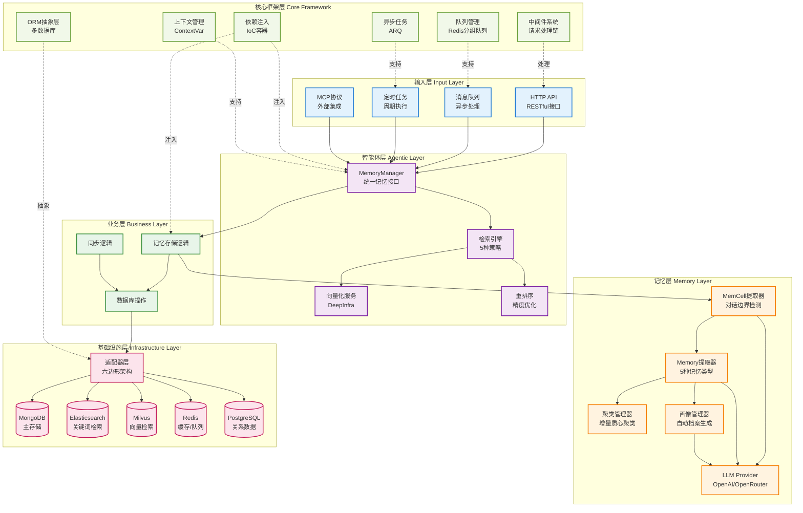
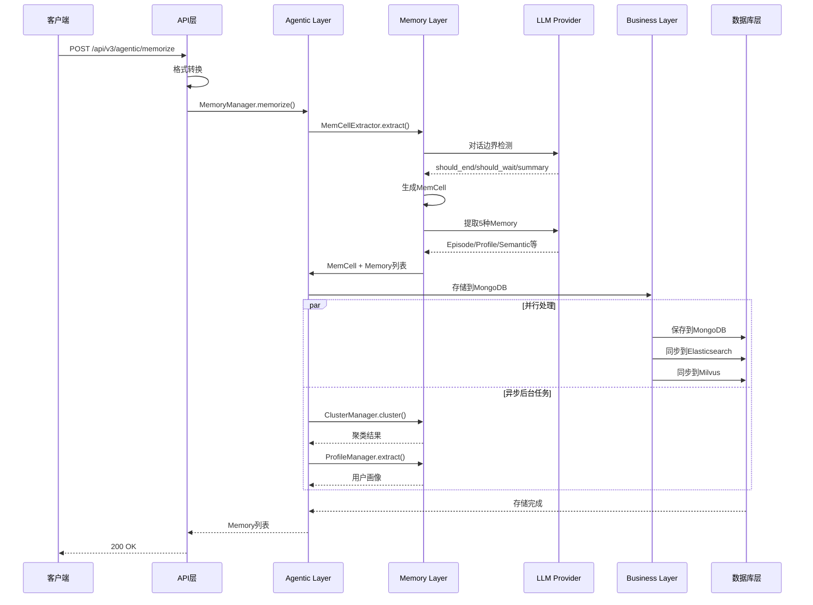
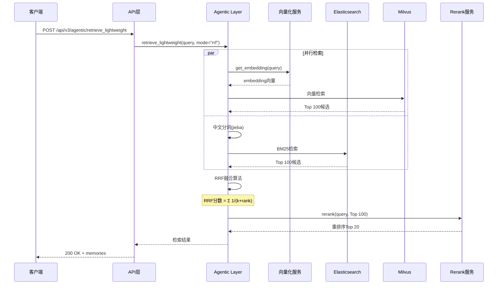
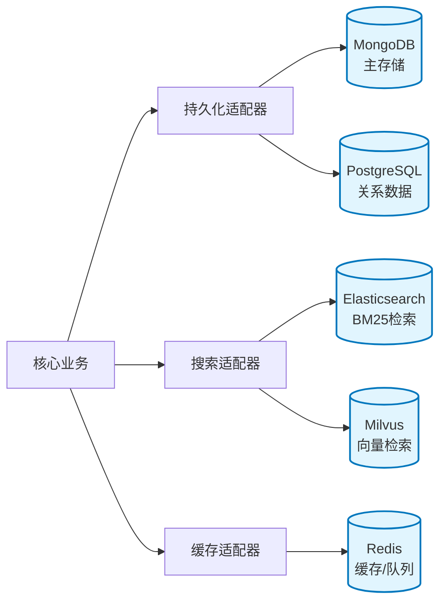
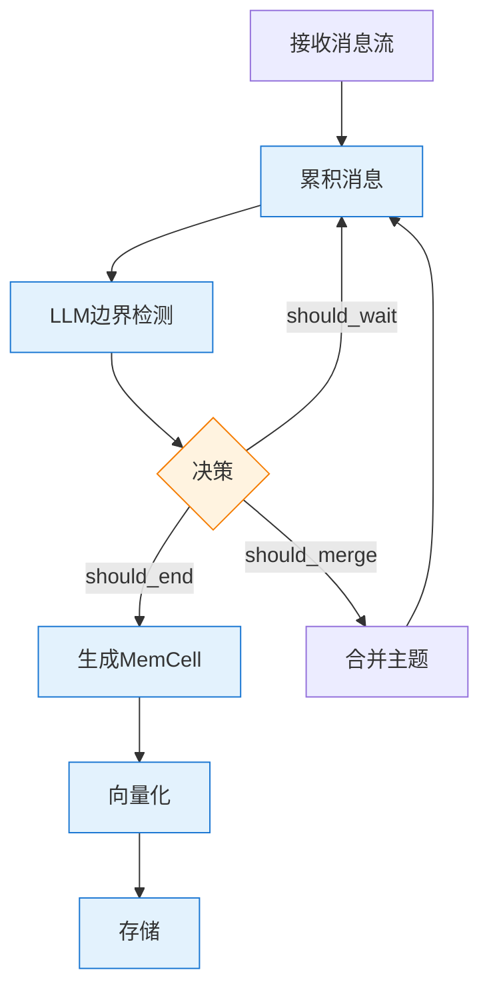

# EverMemOS 系统架构总览

## 项目简介

**EverMemOS** 是一个企业级智能记忆系统，为AI对话代理提供长期记忆能力。它不仅能"记住"历史对话，更能"理解"记忆背后的含义，并将其应用于当前决策和行动中。

**核心能力**：
- **连贯叙事**：自动链接对话片段，构建清晰的主题上下文
- **证据感知**：主动捕捉记忆与任务的深层联系，实现情境感知
- **活跃画像**：实时更新用户档案，每次对话都让AI更懂你

**技术规格**：
- Python 3.12+
- 异步架构（asyncio）
- 多数据库支持（MongoDB/PostgreSQL/Elasticsearch/Milvus/Redis）
- 企业级可扩展性

## 系统架构图

### 整体分层架构



### 数据流图

#### 写入流程（Memorize）



#### 检索流程（Retrieve）



## 技术架构分层详解

### 1. 核心框架层（Core Framework）

为上层提供基础能力的技术底座。

| 模块 | 功能 | 技术栈 | 文档 |
|------|------|--------|------|
| **DI容器** | 依赖注入、Bean管理 | 自研IoC容器 | [01-核心框架.md](./01-核心框架.md) |
| **中间件** | 请求处理链、异常处理 | FastAPI中间件 | [01-核心框架.md](./01-核心框架.md) |
| **上下文管理** | 会话/用户/应用上下文 | ContextVar | [01-核心框架.md](./01-核心框架.md) |
| **ORM抽象** | 多数据库统一接口 | SQLModel/Beanie/ES-DSL | [02-数据存储与ORM.md](./02-数据存储与ORM.md) |
| **队列管理** | Redis分组队列 | Lua脚本 | [01-核心框架.md](./01-核心框架.md) |
| **异步任务** | 后台任务处理 | ARQ | [01-核心框架.md](./01-核心框架.md) |
| **生命周期** | 应用启动/关闭 | Lifespan Provider | [01-核心框架.md](./01-核心框架.md) |
| **分布式锁** | 可重入锁 | Redis+Lua | [01-核心框架.md](./01-核心框架.md) |
| **限流** | 协程级限流 | aiolimiter | [01-核心框架.md](./01-核心框架.md) |

**关键设计**：
- **ContextVar线程安全**：每个请求独立上下文，支持异步并发
- **Lua脚本原子性**：Redis操作的强一致性保证
- **动态代理模式**：中间件链式处理请求/响应
- **工厂模式**：DI容器的Bean创建与管理

### 2. 基础设施层（Infrastructure Layer）

采用**六边形架构**，严格分离输入/输出适配器。

#### 输入适配器（Input Adapters）

| 适配器 | 协议 | 用途 | 关键特性 |
|--------|------|------|----------|
| **API v2** | HTTP/REST | 通用记忆API | 7个细粒度端点 |
| **API v3** | HTTP/REST | 群聊优化API | 轻量级+Agentic检索 |
| **MQ** | Redis Lists | 异步消息处理 | 预留接口 |
| **Jobs** | Cron | 定时任务 | 预留接口 |
| **MCP** | MCP Protocol | 外部集成 | 预留接口 |

**V2 vs V3 对比**：

| 维度 | V2 | V3 |
|------|----|----|
| 目标场景 | 通用记忆系统 | 群聊实时处理 |
| 消息格式 | 复杂GroupChatFormat | 简单单条消息 |
| 缓存支持 | 无 | Redis 24小时缓存 |
| 检索策略 | 6种独立端点 | 3种融合模式 |
| 智能程度 | 基础检索 | LLM多轮迭代 |

#### 输出适配器（Output Adapters）

**异构存储策略**：



**数据库选型原则**：
- **MongoDB**：文档存储，适合半结构化记忆数据（MemCell/Memory）
- **Elasticsearch**：倒排索引，快速关键词检索（<200ms）
- **Milvus**：向量数据库，语义相似度检索（200-500ms）
- **Redis**：缓存和消息队列，临时数据（24小时TTL）
- **PostgreSQL**：关系数据，审计日志（预留）

### 3. 业务层（Business Layer）

封装核心业务逻辑，协调各层协作。

| 模块 | 功能 | 依赖 |
|------|------|------|
| `mem_memorize.py` | 记忆存储完整流程 | memory_layer, agentic_layer |
| `mem_db_operations.py` | 数据库CRUD操作 | infra_layer.repositories |
| `memcell_sync.py` | MemCell同步 | ES/Milvus repositories |
| `personal_memory_sync.py` | 个人记忆同步 | 同上 |

**关键流程**：
1. 接收原始数据 → MemCell提取
2. MemCell → Memory提取（5种类型）
3. 并行：聚类 + 画像提取
4. 存储：MongoDB + ES/Milvus同步

### 4. 智能体层（Agentic Layer）

提供统一的记忆管理接口。

**核心服务**：

| 服务 | 功能 | 技术 |
|------|------|------|
| **MemoryManager** | 统一记忆接口 | 协调器模式 |
| **FetchMemService** | KV查询服务 | MongoDB直连 |
| **VectorizeService** | 文本向量化 | DeepInfra API |
| **RerankService** | 结果重排序 | DeepInfra API |

**5种检索策略**：

| 策略 | 延迟 | 精度 | 适用场景 |
|------|------|------|----------|
| KEYWORD | <200ms | 中 | 精确术语查询 |
| VECTOR | 200-300ms | 高 | 语义模糊查询 |
| HYBRID | 1-2s | 最高 | 混合需求 |
| LIGHTWEIGHT | 500ms | 较高 | 实时场景 |
| AGENTIC | 2-3s | 最高 | 复杂意图 |

**RRF融合算法**：
```
RRF分数 = Σ 1 / (k + rank)，其中 k=60

示例：
Embedding排序: [A(rank1), B(rank2), C(rank3)]
BM25排序:      [B(rank1), D(rank2), A(rank3)]

融合分数：
A: 1/61 + 1/63 = 0.0323
B: 1/62 + 1/61 = 0.0324
C: 1/63 + 0    = 0.0159
D: 0    + 1/62 = 0.0161

最终排序: B > A > D > C
```

### 5. 记忆层（Memory Layer）

记忆提取和管理的核心。

#### 5.1 MemCell提取器

**对话边界检测**：



**核心原则**："默认合并，谨慎切分"

**触发条件**：
- 明确的话题切换
- 时间间隔过大（>1小时）
- 语义完整性达成
- 参与者变化

#### 5.2 Memory提取器

**5种记忆类型**：

| 类型 | 说明 | 提示词 | 示例 |
|------|------|--------|------|
| **Episode** | 叙事性情景记忆 | GROUP_EPISODE_GENERATION_PROMPT | "2024年1月15日团队讨论了新产品UI设计..." |
| **Profile** | 个人档案（Who/What/Values） | PROFILE_EXTRACTION_PROMPT | 技能:Python/经验:5年/价值观:追求卓越 |
| **GroupProfile** | 群组特征 | GROUP_PROFILE_EXTRACTION_PROMPT | 目标:产品创新/文化:扁平化 |
| **Semantic** | 知识推论 | SEMANTIC_MEMORY_EXTRACTION_PROMPT | 业务规则:退款需经理审批 |
| **EventLog** | 原子事实 | EVENT_LOG_EXTRACTION_PROMPT | [用户001, 提交报告, 2024-01-15 10:00] |

#### 5.3 聚类管理器

**增量质心聚类算法**：

```python
# 伪代码
for new_memcell in stream:
    best_cluster = None
    max_similarity = 0

    for cluster in clusters:
        similarity = cosine_similarity(new_memcell.vector, cluster.centroid)
        if similarity > threshold and similarity > max_similarity:
            if abs(new_memcell.time - cluster.latest_time) <= max_time_gap:
                best_cluster = cluster
                max_similarity = similarity

    if best_cluster:
        # 更新质心（递推平均）
        n = best_cluster.size
        best_cluster.centroid = (best_cluster.centroid * n + new_memcell.vector) / (n + 1)
        best_cluster.add(new_memcell)
    else:
        # 创建新簇
        clusters.append(Cluster(centroid=new_memcell.vector, members=[new_memcell]))
```

**配置参数**：
- `similarity_threshold`: 0.65（余弦相似度）
- `max_time_gap`: 7天
- `update_strategy`: 递推平均

#### 5.4 画像管理器

**价值判别器（ValueDiscriminator）**：

识别有价值的信息：
- ✅ 技能提及（"熟练掌握Python"）
- ✅ 项目经验（"负责过电商平台架构"）
- ✅ 角色变化（"晋升为技术主管"）
- ✅ 价值观表述（"注重用户体验"）
- ✅ 决策行为（"倾向于敏捷开发"）

**画像合并策略**：
1. 版本对比：识别新增/更新/删除字段
2. 字段级更新：仅更新变化部分
3. 冲突处理：基于时间戳和价值判别
4. 版本控制：MongoDB存储历史版本

## 关键技术特点

### 1. 异步架构

全栈异步设计，提升并发处理能力：

```python
# 异步数据流
async def memorize_pipeline():
    # 并行MemCell提取
    memcells = await asyncio.gather(*[
        extract_memcell(batch) for batch in batches
    ])

    # 并行Memory提取
    memories = await asyncio.gather(*[
        extract_episode(mc),
        extract_profile(mc),
        extract_semantic(mc)
    ])

    # 并行存储
    await asyncio.gather(
        save_to_mongodb(memories),
        sync_to_es(memories),
        sync_to_milvus(memories)
    )
```

### 2. LLM集成

**Provider抽象**：

```python
class LLMProvider(Protocol):
    async def generate(
        self,
        messages: List[Dict],
        temperature: float,
        max_tokens: int
    ) -> str:
        """生成文本"""

    async def test_connection(self) -> bool:
        """测试连接"""
```

**实现**：
- OpenAI兼容接口（OpenRouter）
- 支持模型：Qwen3-235B、GPT-4o、Claude等
- 5次重试机制
- Token统计和成本追踪

### 3. 向量化

**DeepInfra集成**：

| 服务 | 模型 | 维度 | 用途 |
|------|------|------|------|
| Embedding | BAAI/bge-m3 | 1024 | 文本向量化 |
| Rerank | Qwen3-Reranker-4B | - | 结果重排序 |

**批处理优化**：
```python
# 并发批处理
async def get_embeddings_batch(texts: List[str], batch_size=50):
    batches = [texts[i:i+batch_size] for i in range(0, len(texts), batch_size)]
    results = await asyncio.gather(*[
        vectorize_service.get_embeddings(batch)
        for batch in batches
    ])
    return flatten(results)
```

### 4. 数据一致性

**三层同步策略**：

```
MongoDB (主存储)
    ↓ Converter转换
    ├→ Elasticsearch (异步同步)
    └→ Milvus (异步同步)
```

**事务处理**：
```python
async with mongo_repository.transaction() as session:
    await save_memory(memory, session=session)
    await update_index(memory, session=session)
    # 自动提交或回滚
```

## 性能指标

| 指标 | 数值 | 说明 |
|------|------|------|
| **MemCell提取延迟** | 3-5秒 | 包括LLM调用 |
| **关键词检索** | <200ms | ES BM25 |
| **向量检索** | 200-300ms | Milvus COSINE |
| **混合检索** | 1-2秒 | 含RRF+Rerank |
| **Agentic检索** | 2-3秒 | LLM多轮 |
| **系统吞吐量** | 10-20 MemCells/分钟 | 单进程 |
| **并发请求** | 100+ QPS | 异步架构 |

## 部署架构

### 推荐部署拓扑

```
┌─────────────────────────────────────────────┐
│          负载均衡器 (Nginx/HAProxy)           │
└─────────────────┬───────────────────────────┘
                  │
        ┌─────────┴─────────┐
        ▼                   ▼
┌───────────────┐   ┌───────────────┐
│  API Server 1 │   │  API Server 2 │
│  (FastAPI)    │   │  (FastAPI)    │
└───────┬───────┘   └───────┬───────┘
        │                   │
        └─────────┬─────────┘
                  ▼
        ┌─────────────────┐
        │   Redis Cluster │
        │   (缓存/队列)    │
        └─────────────────┘
                  │
        ┌─────────┼─────────┬─────────────┐
        ▼         ▼         ▼             ▼
┌──────────┐ ┌────────┐ ┌──────────┐ ┌─────────┐
│ MongoDB  │ │   ES   │ │  Milvus  │ │   PG    │
│ Replica  │ │ Cluster│ │ Cluster  │ │ Primary │
│   Set    │ │  3节点 │ │  3节点   │ │+Standby │
└──────────┘ └────────┘ └──────────┘ └─────────┘
```

### 容器化部署

**Docker Compose 配置**（见项目根目录 `docker-compose.yml`）：

```yaml
services:
  mongodb:
    image: mongo:7.0
    ports: ["27017:27017"]

  elasticsearch:
    image: elasticsearch:8.12.0
    ports: ["19200:9200"]
    environment:
      - discovery.type=single-node
      - xpack.security.enabled=false

  milvus-standalone:
    image: milvusdb/milvus:v2.4.0
    ports: ["19530:19530"]

  redis:
    image: redis:7-alpine
    ports: ["6379:6379"]
```

**资源需求**：
- **最小配置**：4核CPU、8GB内存、50GB存储
- **推荐配置**：8核CPU、16GB内存、200GB SSD
- **生产配置**：16核CPU、32GB内存、500GB SSD + 专用向量存储

## 扩展性设计

### 水平扩展

1. **API层**：无状态设计，支持多实例部署
2. **数据库层**：
   - MongoDB副本集（读写分离）
   - Elasticsearch集群（分片+副本）
   - Milvus集群（数据分片）
3. **队列层**：Redis Cluster（50分区动态平衡）

### 垂直扩展

1. **向量维度升级**：1024 → 2048（模型升级）
2. **LLM模型升级**：Qwen3 → GPT-4o/Claude-3.5
3. **索引优化**：倒排索引压缩、向量索引优化

## 安全性

| 层级 | 措施 |
|------|------|
| **网络层** | HTTPS/TLS加密传输 |
| **认证层** | HMAC签名验证 |
| **授权层** | 用户上下文隔离 |
| **数据层** | MongoDB认证、ES访问控制 |
| **审计层** | 操作日志、审计字段 |

## 监控与运维

**推荐监控指标**：
- API延迟（P50/P95/P99）
- 数据库连接池使用率
- Redis缓存命中率
- ES/Milvus查询延迟
- LLM API调用成功率
- 系统资源使用率（CPU/内存/磁盘）

**日志策略**：
- 结构化日志（JSON格式）
- 分级日志（DEBUG/INFO/WARNING/ERROR）
- 集中式日志收集（推荐ELK Stack）

## 技术栈总览

| 类别 | 技术 | 版本 |
|------|------|------|
| **语言** | Python | 3.12+ |
| **Web框架** | FastAPI | 0.104+ |
| **异步运行时** | asyncio + uvicorn | - |
| **数据验证** | Pydantic | 2.7+ |
| **依赖注入** | 自研DI容器 | - |
| **主数据库** | MongoDB | 7.0+ |
| **关系数据库** | PostgreSQL | 14+ |
| **搜索引擎** | Elasticsearch | 8.12+ |
| **向量数据库** | Milvus | 2.4+ |
| **缓存/队列** | Redis | 7+ |
| **ODM** | Beanie | 1.26+ |
| **ORM** | SQLModel | 0.0.19+ |
| **ES客户端** | elasticsearch-dsl | 8.17+ |
| **向量客户端** | pymilvus | 2.5+ |
| **任务队列** | ARQ | 0.26+ |
| **LLM集成** | OpenAI SDK | 1.0+ |
| **向量化** | DeepInfra API | - |
| **中文分词** | jieba | 0.42.1 |
| **向量检索** | faiss-cpu | 1.7+ |

## 参考文档

- [01-核心框架](./01-核心框架.md) - DI、中间件、上下文、队列、异步任务
- [02-数据存储与ORM](./02-数据存储与ORM.md) - MongoDB、ES、Milvus、Redis集成
- [03-记忆管理系统](./03-记忆管理系统.md) - MemCell、Memory、聚类、画像
- [04-API与适配器](./04-API与适配器.md) - V2/V3 API、六边形架构
- [README](../../README.md) - 快速开始指南

## 版本历史

| 版本 | 日期 | 变更 |
|------|------|------|
| 1.0.0 | 2025-01-15 | 初始版本发布 |

---

**文档维护**: EverMemOS团队
**最后更新**: 2025-01-16
