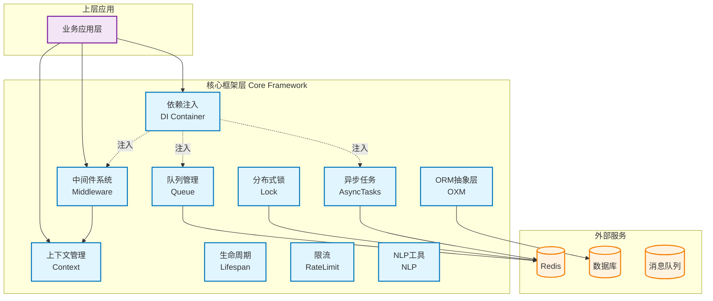
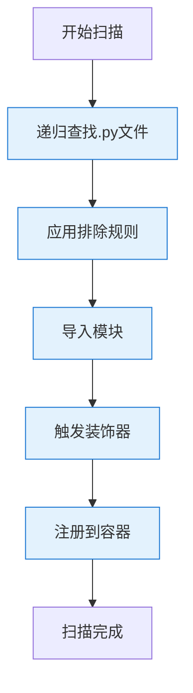
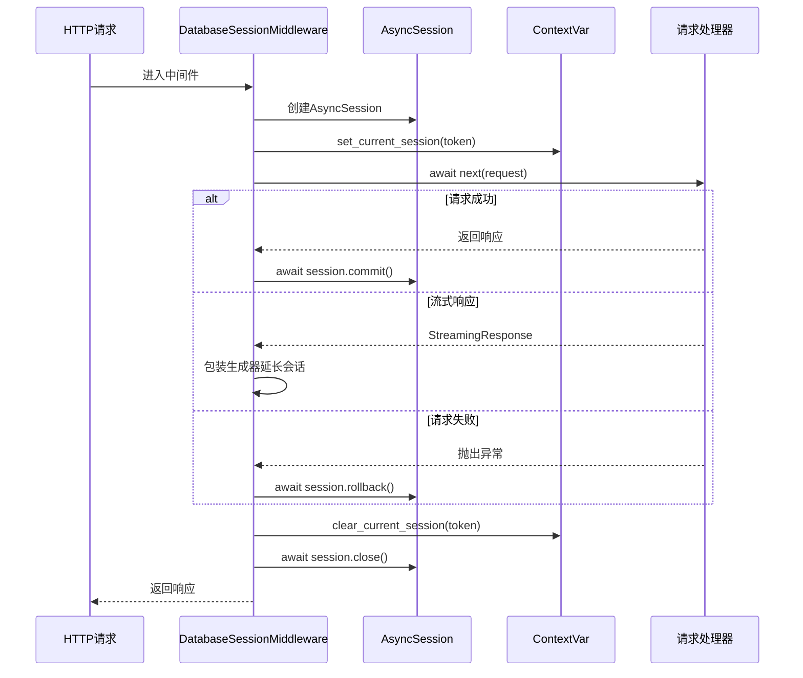
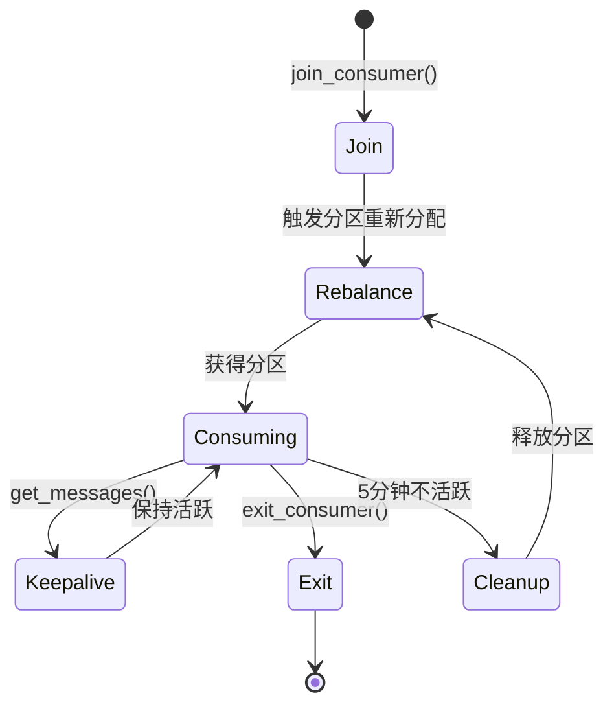

# 核心框架层技术详解

## 概述

核心框架层（Core Framework）为EverMemOS提供技术底座，包含依赖注入、中间件、上下文管理、队列管理、异步任务等基础能力。

**设计原则**：
- 低耦合、高内聚
- 异步优先
- 线程安全
- 可扩展性

## 模块架构图



---

## 1. 依赖注入容器（DI Container）

### 1.1 架构设计

**位置**: `src/core/di/`

**核心组件**：

| 组件 | 文件 | 功能 |
|------|------|------|
| DIContainer | container.py | IoC容器核心实现 |
| Decorators | decorators.py | 装饰器定义 |
| Scanner | scanner.py | 组件扫描器 |
| Utils | utils.py | 工具函数 |
| Exceptions | exceptions.py | 异常类 |

### 1.2 核心特性

#### Bean生命周期

```python
class BeanScope(Enum):
    SINGLETON = "singleton"   # 单例：全局唯一实例
    PROTOTYPE = "prototype"   # 原型：每次获取创建新实例
    FACTORY = "factory"       # 工厂：通过工厂方法创建
```

**生命周期对比**：

| 作用域 | 实例数 | 创建时机 | 适用场景 |
|--------|--------|----------|----------|
| SINGLETON | 1 | 首次获取时 | 无状态服务、管理器 |
| PROTOTYPE | N | 每次获取时 | 有状态对象、临时对象 |
| FACTORY | N | 每次调用工厂 | 复杂创建逻辑 |

#### Bean定义结构

```python
@dataclass
class BeanDefinition:
    """Bean元数据"""
    bean_type: Type              # Bean类型
    bean_name: str              # Bean名称
    scope: BeanScope            # 作用域
    is_primary: bool            # 是否为Primary实现
    is_mock: bool              # 是否为Mock实现
    factory_method: Optional[Callable]  # 工厂方法
    instance: Optional[Any]     # 单例实例缓存
    dependencies: Set[Type]     # 依赖集合
```

#### 依赖注入机制

**自动注入**：基于类型注解

```python
@service()
class UserService:
    def __init__(self, db_repository: UserRepository):
        # db_repository 自动注入
        self.repo = db_repository

# 容器自动解析构造函数参数类型
def _inject_dependencies(self, bean_type: Type) -> Dict[str, Any]:
    sig = inspect.signature(bean_type.__init__)
    kwargs = {}

    for param_name, param in sig.parameters.items():
        if param_name == 'self':
            continue

        param_type = param.annotation

        # 处理泛型 List[T]
        if get_origin(param_type) is list:
            inner_type = get_args(param_type)[0]
            kwargs[param_name] = self.get_beans_by_type(inner_type)
        else:
            kwargs[param_name] = self.get_bean_by_type(param_type)

    return kwargs
```

#### Primary机制

**多实现场景**：

```python
class IStorage(ABC):
    @abstractmethod
    def save(self, data): pass

@service(primary=True)
class RedisStorage(IStorage):
    def save(self, data):
        # Redis实现
        pass

@service()
class MongoStorage(IStorage):
    def save(self, data):
        # Mongo实现
        pass

# 自动注入Primary实现
storage = get_bean_by_type(IStorage)  # 返回 RedisStorage
all_storages = get_beans_by_type(IStorage)  # 返回 [RedisStorage, MongoStorage]
```

**优先级规则**：
1. Primary Bean > 非Primary Bean
2. Mock模式下：Mock Bean > 非Mock Bean
3. 直接类型匹配 > 接口实现匹配

#### Mock支持

```python
@service()
class UserService:
    def get_user(self, user_id: str):
        return f"Real User: {user_id}"

@mock_impl()
class MockUserService(UserService):
    def get_user(self, user_id: str):
        return f"Mock User: {user_id}"

# 启用Mock模式
enable_mock_mode()
service = get_bean_by_type(UserService)  # 返回 MockUserService

# 禁用Mock模式
disable_mock_mode()
service = get_bean_by_type(UserService)  # 返回 UserService
```

### 1.3 装饰器系统

#### 基础装饰器

```python
@component(name="user_controller", scope=BeanScope.SINGLETON, primary=True)
class UserController:
    """通用组件装饰器"""
    pass

@service(name="user_service")
class UserService:
    """服务层装饰器（语义化）"""
    pass

@repository(name="user_repo")
class UserRepository:
    """仓储层装饰器（语义化）"""
    pass

@controller(name="api_controller")
class APIController:
    """控制器装饰器（语义化）"""
    pass
```

#### 工厂装饰器

```python
@factory(bean_type=DatabaseConnection, name="db_connection")
def create_db_connection():
    """工厂方法装饰器"""
    return DatabaseConnection(
        host="localhost",
        port=5432,
        database="evermem"
    )

# 使用
conn = get_bean("db_connection")
```

#### 条件装饰器

```python
def is_production():
    return os.getenv("ENV") == "production"

@conditional(is_production)
@service()
class ProductionService:
    """仅在生产环境注册"""
    pass
```

#### 原型装饰器

```python
@prototype
class RequestContext:
    """每次获取创建新实例"""
    def __init__(self):
        self.request_id = uuid.uuid4()
```

### 1.4 组件扫描

#### 自动扫描

```python
from core.di import auto_scan

# 自动扫描 src/ 目录
auto_scan()

# 等价于
scan_packages(base_path="src/", exclude_paths=["tests", "migrations"])
```

#### 高级扫描

```python
from core.di.scanner import ComponentScanner

scanner = ComponentScanner()
scanner.add_scan_path("src/")
scanner.add_scan_path("plugins/")
scanner.exclude_pattern("test_")
scanner.exclude_pattern(".*_backup\\.py")
scanner.set_parallel(True)  # 并行扫描
scanner.scan()
```

**扫描流程**：



### 1.5 循环依赖检测

```python
class DIContainer:
    def __init__(self):
        self._resolving_stack: List[Type] = []

    def _create_instance(self, bean_type: Type):
        # 检测循环依赖
        if bean_type in self._resolving_stack:
            cycle_path = " -> ".join([t.__name__ for t in self._resolving_stack])
            raise CircularDependencyError(
                f"Circular dependency detected: {cycle_path} -> {bean_type.__name__}"
            )

        self._resolving_stack.append(bean_type)
        try:
            # 注入依赖并创建实例
            kwargs = self._inject_dependencies(bean_type)
            instance = bean_type(**kwargs)
            return instance
        finally:
            self._resolving_stack.pop()
```

### 1.6 性能优化

#### 类型继承缓存

```python
class DIContainer:
    def __init__(self):
        self._inheritance_cache: Dict[Type, Set[Type]] = {}

    def _get_all_parent_classes(self, cls: Type) -> Set[Type]:
        """获取所有父类（含ABC接口）"""
        if cls in self._inheritance_cache:
            return self._inheritance_cache[cls]

        parents = set()
        for base in inspect.getmro(cls)[1:]:  # 排除自身
            if base is not object:
                parents.add(base)

        self._inheritance_cache[cls] = parents
        return parents
```

#### Primary Bean索引

```python
class DIContainer:
    def __init__(self):
        self._primary_beans: Dict[Type, str] = {}  # type -> bean_name

    def get_bean_by_type(self, bean_type: Type):
        # 快速查找Primary Bean
        if bean_type in self._primary_beans:
            return self.get_bean(self._primary_beans[bean_type])

        # 否则遍历查找
        candidates = self._find_beans_by_type(bean_type)
        if len(candidates) == 1:
            return candidates[0]
        elif len(candidates) > 1:
            raise AmbiguousBeansError(f"Multiple beans of type {bean_type}")
        else:
            raise BeanNotFoundError(f"No bean of type {bean_type}")
```

### 1.7 使用示例

#### 完整示例

```python
# 1. 定义接口
class IUserService(ABC):
    @abstractmethod
    def get_user(self, user_id: str): pass

# 2. 定义实现
@service(primary=True)
class UserService(IUserService):
    def __init__(self, user_repo: UserRepository):
        self.repo = user_repo

    def get_user(self, user_id: str):
        return self.repo.find_by_id(user_id)

@repository()
class UserRepository:
    def find_by_id(self, user_id: str):
        return {"id": user_id, "name": "Alice"}

# 3. 定义控制器
@controller()
class UserController:
    def __init__(self, user_service: IUserService):
        self.service = user_service

    def handle_request(self, user_id: str):
        return self.service.get_user(user_id)

# 4. 使用
controller = get_bean_by_type(UserController)
result = controller.handle_request("123")
print(result)  # {"id": "123", "name": "Alice"}
```

---

## 2. 中间件系统

### 2.1 架构设计

**位置**: `src/core/middleware/`

**中间件执行顺序**（从外到内）：

```
HTTP请求
    ↓
GlobalExceptionHandler        # 全局异常处理
    ↓
DatabaseSessionMiddleware     # 数据库会话管理
    ↓
UserContextMiddleware         # 用户上下文
    ↓
AppContextMiddleware          # 应用上下文
    ↓
HMACSignatureMiddleware       # 签名验证
    ↓
SSEExceptionMiddleware        # SSE异常处理
    ↓
请求处理器（Route Handler）
    ↓
响应返回（逆序清理）
```

### 2.2 DatabaseSessionMiddleware

**核心功能**：自动管理数据库会话生命周期

**源码位置**: `src/core/middleware/database_session_middleware.py`

#### 工作流程



#### 关键代码

```python
async def __call__(self, request: Request, call_next):
    session = self.session_factory()
    token = set_current_session(session)

    try:
        response = await call_next(request)

        # 检查是否为流式响应
        if isinstance(response, StreamingResponse):
            # 包装生成器，延长会话生命周期
            original_generator = response.body_iterator

            async def wrapped_generator():
                try:
                    async for chunk in original_generator:
                        yield chunk
                    await session.commit()
                except Exception as e:
                    await session.rollback()
                    raise
                finally:
                    clear_current_session(token)
                    await session.close()

            response.body_iterator = wrapped_generator()
            return response
        else:
            # 普通响应
            await session.commit()
            return response

    except Exception as e:
        await session.rollback()
        raise
    finally:
        if not isinstance(response, StreamingResponse):
            clear_current_session(token)
            await session.close()
```

#### 特性

- **自动事务管理**：成功提交，失败回滚
- **流式响应支持**：包装生成器维持会话
- **异常隔离**：清理失败不掩盖原始错误
- **幂等操作**：session.close()可多次调用

### 2.3 UserContextMiddleware

**功能**：提取用户认证信息并注入上下文

```python
async def __call__(self, request: Request, call_next):
    user_info = self._extract_user_info(request)
    token = set_current_user_info(user_info)

    try:
        response = await call_next(request)
        return response
    finally:
        clear_current_user_context(token)

def _extract_user_info(self, request: Request) -> Dict:
    # 从请求头提取用户信息
    auth_header = request.headers.get("Authorization")
    if auth_header:
        # 解析JWT或其他认证Token
        return self._parse_auth_token(auth_header)
    return None
```

### 2.4 AppContextMiddleware

**功能**：注入应用级元数据（task_id等）

```python
async def __call__(self, request: Request, call_next):
    app_info = {
        "task_id": str(uuid.uuid4()),
        "request_path": request.url.path,
        "request_method": request.method,
        "timestamp": datetime.now(timezone.utc)
    }

    token = set_current_app_info(app_info)

    try:
        response = await call_next(request)
        return response
    finally:
        clear_current_app_info(token)
```

### 2.5 GlobalExceptionHandler

**功能**：统一异常处理和错误响应格式

```python
async def __call__(self, request: Request, call_next):
    try:
        response = await call_next(request)
        return response
    except HTTPException as e:
        # FastAPI原生异常
        return JSONResponse(
            status_code=e.status_code,
            content={
                "error": e.detail,
                "timestamp": datetime.now(timezone.utc).isoformat()
            }
        )
    except Exception as e:
        # 未预期异常
        logger.exception("Unhandled exception in request")
        return JSONResponse(
            status_code=500,
            content={
                "error": "Internal Server Error",
                "message": str(e),
                "timestamp": datetime.now(timezone.utc).isoformat()
            }
        )
```

---

## 3. 上下文管理（Context）

### 3.1 ContextVar架构

**位置**: `src/core/context/context.py`

**三层上下文**：

```python
# 数据库会话上下文
db_session_context: ContextVar[Optional[AsyncSession]] = ContextVar('db_session', default=None)

# 用户信息上下文
user_info_context: ContextVar[Optional[Dict]] = ContextVar('user_info', default=None)

# 应用信息上下文
app_info_context: ContextVar[Optional[Dict]] = ContextVar('app_info', default=None)
```

### 3.2 ContextVar模式

**设置与获取**：

```python
# 设置上下文
def set_current_session(session: AsyncSession) -> Token:
    return db_session_context.set(session)

def set_current_user_info(user_info: Dict) -> Token:
    return user_info_context.set(user_info)

# 获取上下文
def get_current_session() -> AsyncSession:
    session = db_session_context.get()
    if session is None:
        raise RuntimeError("No database session in current context")
    return session

def get_current_user_info() -> Optional[Dict]:
    return user_info_context.get()

# 清理上下文
def clear_current_session(token: Token):
    db_session_context.reset(token)

def clear_current_user_context(token: Token):
    user_info_context.reset(token)
```

### 3.3 线程安全性

**ContextVar特性**：
- 每个asyncio任务有独立的上下文
- 父任务的上下文会复制给子任务
- 任务间上下文隔离，无需锁

**示例**：

```python
async def task1():
    token = set_current_user_info({"user_id": "user1"})
    print(get_current_user_info())  # {"user_id": "user1"}
    await asyncio.sleep(1)
    print(get_current_user_info())  # 仍然是 {"user_id": "user1"}
    clear_current_user_context(token)

async def task2():
    token = set_current_user_info({"user_id": "user2"})
    print(get_current_user_info())  # {"user_id": "user2"}
    clear_current_user_context(token)

# 并发运行，上下文互不干扰
await asyncio.gather(task1(), task2())
```

---

## 4. 队列管理（Queue）

### 4.1 Redis分组队列管理器

**位置**: `src/core/queue/redis_group_queue/`

**核心特性**：
- 50个固定分区（001-050）
- MD5 hash路由
- 动态owner管理
- Lua脚本原子性
- 协程级限流

#### 分区路由算法

```python
def _get_partition_for_group(self, group_key: str) -> str:
    """MD5 hash路由到50个分区之一"""
    hash_value = hashlib.md5(group_key.encode('utf-8')).hexdigest()[:8]
    partition_index = int(hash_value, 16) % 50
    return self.partition_names[partition_index]  # "001"..."050"
```

#### 消费者生命周期



#### Lua脚本优化

**ENQUEUE_SCRIPT**（原子性投递）：

```lua
local partition_key = KEYS[1]
local score = ARGV[1]
local message = ARGV[2]

-- 使用ZADD存储消息（sorted set）
redis.call('ZADD', partition_key, score, message)
return redis.call('ZCARD', partition_key)  -- 返回队列长度
```

**GET_MESSAGES_SCRIPT**（提取+Keepalive）：

```lua
local partition_key = KEYS[1]
local owner_key = KEYS[2]
local owner_id = ARGV[1]
local current_time = ARGV[2]
local limit = ARGV[3]

-- 检查是否已加入
local is_member = redis.call('SISMEMBER', owner_key, owner_id)
if is_member == 0 then
    redis.call('SADD', owner_key, owner_id)
    redis.call('HSET', owner_key .. ':last_active', owner_id, current_time)
end

-- 更新活跃时间（30秒内仅更新一次）
local last_active = redis.call('HGET', owner_key .. ':last_active', owner_id)
if not last_active or (tonumber(current_time) - tonumber(last_active)) > 30 then
    redis.call('HSET', owner_key .. ':last_active', owner_id, current_time)
end

-- 提取消息
local messages = redis.call('ZRANGE', partition_key, 0, limit - 1)
redis.call('ZREMRANGEBYRANK', partition_key, 0, limit - 1)

return messages
```

#### 限流策略

```python
@rate_limit(
    max_rate=200,  # 200次/秒
    time_period=1,
    key_func=lambda owner_id: f"get_messages_{owner_id}"
)
async def get_messages(self, owner_id: str, limit: int = 100):
    """协程级限流的消息获取"""
    pass
```

### 4.2 内存队列管理器

**位置**: `src/core/queue/msg_group_queue/`

**特性**：
- 基于deque实现
- 固定数量队列
- 时间窗口统计（1分钟、1小时）
- 空队列优先投递

**适用场景**：
- 单机部署
- 低延迟要求（<1ms）
- 数据可丢失

---

## 5. 异步任务（AsyncTasks）

### 5.1 TaskManager

**位置**: `src/core/asynctasks/task_manager.py`

**基于ARQ**：异步Redis队列

#### 任务定义

```python
@dataclass
class TaskFunction:
    name: str
    coroutine: Callable          # 包装后的协程
    original_func: Callable      # 原始函数
    timeout: Optional[float]
    retry_config: Optional[RetryConfig]

@dataclass
class RetryConfig:
    max_retries: int = 1
    retry_delay: float = 1.0
    exponential_backoff: bool = True
    max_retry_delay: float = 60.0
```

#### 用户上下文注入

```python
def register_task(
    self,
    func: Callable,
    name: Optional[str] = None,
    timeout: Optional[float] = None,
    retry_config: Optional[RetryConfig] = None
):
    """注册任务并自动注入用户上下文"""

    @wraps(func)
    async def wrapped_task(*args, **kwargs):
        # 在任务执行时注入用户上下文
        current_user_info = get_current_user_info()
        if current_user_info:
            token = set_current_user_info(current_user_info)
            try:
                return await func(*args, **kwargs)
            finally:
                clear_current_user_context(token)
        else:
            return await func(*args, **kwargs)

    task_name = name or func.__name__
    self.tasks[task_name] = TaskFunction(
        name=task_name,
        coroutine=wrapped_task,
        original_func=func,
        timeout=timeout,
        retry_config=retry_config
    )
```

#### 任务执行

```python
async def enqueue_task(
    self,
    task_name: str,
    *args,
    **kwargs
) -> str:
    """入队任务"""
    task_id = str(uuid.uuid4())

    await self.arq_pool.enqueue_job(
        task_name,
        *args,
        _job_id=task_id,
        **kwargs
    )

    return task_id

async def get_task_result(self, task_id: str) -> TaskResult:
    """获取任务结果"""
    job = await self.arq_pool.get_job(task_id)

    if job is None:
        return TaskResult(
            task_id=task_id,
            status=TaskStatus.NOT_FOUND
        )

    return TaskResult(
        task_id=task_id,
        status=job.status,
        result=job.result,
        error=job.error
    )
```

---

## 6. 生命周期管理（Lifespan）

### 6.1 LifespanProvider接口

**位置**: `src/core/lifespan/`

```python
class LifespanProvider(ABC):
    def __init__(self, name: str, order: int = 0):
        self.name = name
        self.order = order  # 执行顺序，数字小的先执行

    @abstractmethod
    async def startup(self, app: FastAPI) -> Any:
        """启动逻辑，可返回初始化数据"""
        pass

    @abstractmethod
    async def shutdown(self, app: FastAPI) -> None:
        """关闭逻辑"""
        pass
```

### 6.2 执行流程

```python
@asynccontextmanager
async def create_auto_lifespan(app: FastAPI):
    """自动创建生命周期管理器"""

    # 获取所有LifespanProvider实例
    providers = get_beans_by_type(LifespanProvider)

    # 按order排序
    providers.sort(key=lambda p: p.order)

    # 启动阶段
    lifespan_data = {}
    for provider in providers:
        logger.info(f"Starting {provider.name} (order={provider.order})")
        result = await provider.startup(app)
        lifespan_data[provider.name] = result

    app.state.lifespan_data = lifespan_data

    yield

    # 关闭阶段（逆序）
    for provider in reversed(providers):
        logger.info(f"Shutting down {provider.name}")
        await provider.shutdown(app)
```

### 6.3 实现示例

```python
@service()
class DatabaseLifespan(LifespanProvider):
    def __init__(self):
        super().__init__(name="database", order=1)

    async def startup(self, app: FastAPI):
        # 初始化数据库连接池
        engine = create_async_engine(DATABASE_URL)
        return engine

    async def shutdown(self, app: FastAPI):
        # 关闭连接池
        engine = app.state.lifespan_data["database"]
        await engine.dispose()
```

---

## 7. 分布式锁（Lock）

### 7.1 RedisDistributedLock

**位置**: `src/core/lock/redis_distributed_lock.py`

**可重入锁实现**（Lua脚本）：

```lua
-- 获取锁
local lock_key = KEYS[1]
local owner_id = ARGV[1]  -- 协程ID
local timeout_ms = ARGV[2]

local current_owner = redis.call('HGET', lock_key, 'owner')
local count = tonumber(redis.call('HGET', lock_key, 'count')) or 0

if not current_owner or current_owner == owner_id then
    -- 锁未被持有或被当前协程持有，增加计数
    local new_count = count + 1
    redis.call('HMSET', lock_key, 'owner', owner_id, 'count', new_count)
    redis.call('PEXPIRE', lock_key, timeout_ms)
    return new_count
else
    -- 锁被其他协程持有
    return 0
end
```

```lua
-- 释放锁
local lock_key = KEYS[1]
local owner_id = ARGV[1]

local current_owner = redis.call('HGET', lock_key, 'owner')
if current_owner ~= owner_id then
    return 0  -- 不是锁持有者，无法释放
end

local count = tonumber(redis.call('HGET', lock_key, 'count'))
if count > 1 then
    -- 递减计数
    redis.call('HINCRBY', lock_key, 'count', -1)
    return count - 1
else
    -- 删除锁
    redis.call('DEL', lock_key)
    return 0
end
```

### 7.2 使用方式

```python
lock_manager = RedisDistributedLockManager()
lock = lock_manager.get_lock("resource_name")

# 上下文管理器
async with lock.acquire(timeout=60, blocking_timeout=80):
    # 临界区代码
    await process_critical_resource()

# 手动管理
acquired = await lock.acquire(timeout=60, blocking=False)
if acquired:
    try:
        await process_critical_resource()
    finally:
        await lock.release()
```

---

## 8. 限流（RateLimit）

### 8.1 限流装饰器

**位置**: `src/core/rate_limit/rate_limiter.py`

**基于aiolimiter**：

```python
@rate_limit(
    max_rate=200,      # 时间窗口内最大请求数
    time_period=1,     # 时间窗口（秒）
    key_func=lambda owner_id: f"api_{owner_id}"  # 动态限流键
)
async def api_endpoint(owner_id: str):
    # 自动限流
    return {"result": "success"}
```

### 8.2 预定义装饰器

```python
@rate_limit_3_per_10s
async def expensive_operation():
    """每10秒最多3次"""
    pass

@rate_limit_5_per_minute
async def moderate_operation():
    """每分钟最多5次"""
    pass

@rate_limit_10_per_hour
async def rare_operation():
    """每小时最多10次"""
    pass
```

---

## 9. NLP工具（NLP）

### 9.1 停用词管理

**位置**: `src/core/nlp/stopwords_utils.py`

```python
class StopwordsManager:
    def __init__(self, stopwords_file_path=None):
        self.stopwords_file_path = stopwords_file_path or \
            f"{CURRENT_DIR}/config/stopwords/hit_stopwords.txt"
        self._stopwords: Optional[Set[str]] = None

    def load_stopwords(self) -> Set[str]:
        """延迟加载停用词表"""
        if self._stopwords is not None:
            return self._stopwords

        if not os.path.exists(self.stopwords_file_path):
            logger.warning(f"Stopwords file not found: {self.stopwords_file_path}")
            self._stopwords = set()
            return self._stopwords

        with open(self.stopwords_file_path, 'r', encoding='utf-8') as f:
            self._stopwords = {line.strip() for line in f if line.strip()}

        return self._stopwords

    def filter_stopwords(self, words: List[str], min_length: int = 1) -> List[str]:
        """过滤停用词"""
        stopwords = self.load_stopwords()
        return [w for w in words if len(w) >= min_length and w not in stopwords]
```

**使用**：

```python
from core.nlp.stopwords_utils import filter_stopwords

words = ["我", "喜欢", "吃", "苹果", "和", "香蕉"]
filtered = filter_stopwords(words, min_length=2)
print(filtered)  # ["喜欢", "苹果", "香蕉"]
```

---

## 总结

核心框架层为EverMemOS提供了坚实的技术底座：

**关键特性**：
- ✅ 自研DI容器：灵活、高性能、支持Mock
- ✅ 中间件链：自动事务管理、上下文注入
- ✅ ContextVar：线程安全、异步友好
- ✅ Redis队列：原子性、动态平衡、限流
- ✅ 异步任务：用户上下文保留、重试机制
- ✅ 分布式锁：可重入、协程安全
- ✅ 限流：协程级、灵活配置

**设计模式**：
- 工厂模式（DI容器）
- 中间件模式（请求处理链）
- 观察者模式（生命周期回调）
- 装饰器模式（功能扩展）

**性能指标**：
- DI容器解析：<1ms
- 中间件开销：<5ms
- Redis队列吞吐：1000+ msg/s
- 分布式锁延迟：<10ms

---

**相关文档**：
- [00-系统架构总览](./00-系统架构总览.md)
- [02-数据存储与ORM](./02-数据存储与ORM.md)
- [03-记忆管理系统](./03-记忆管理系统.md)

**源码索引**：
- DI容器：`src/core/di/`
- 中间件：`src/core/middleware/`
- 上下文：`src/core/context/`
- 队列：`src/core/queue/`
- 异步任务：`src/core/asynctasks/`
- 锁：`src/core/lock/`
- 限流：`src/core/rate_limit/`
- NLP：`src/core/nlp/`
