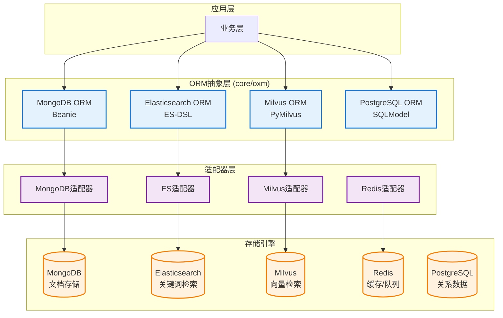
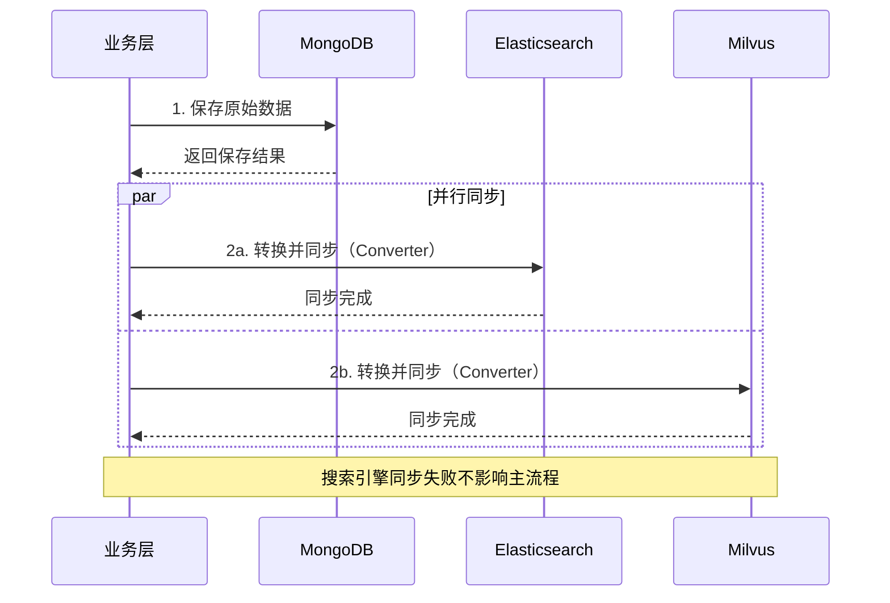

# 数据存储与ORM层

## 概述

EverMemOS采用**异构存储策略**，针对不同类型的数据选择最合适的存储引擎，并通过统一的ORM抽象层进行管理。

**核心设计**：
- MongoDB：主存储（文档型数据）
- Elasticsearch：关键词检索（倒排索引）
- Milvus：向量检索（语义相似度）
- Redis：缓存/队列（临时数据）
- PostgreSQL：关系数据（预留）

## 存储架构图



---

## 1. MongoDB集成

### 1.1 技术栈

- **ODM**: Beanie 1.26+ (基于Pydantic的异步MongoDB ODM)
- **驱动**: Motor 3.3+ (异步MongoDB驱动)
- **版本**: MongoDB 7.0+

### 1.2 ORM基类设计

**位置**: `src/core/oxm/mongo/`

#### DocumentBase - 文档基类

```python
class DocumentBase(Document):
    """
    所有MongoDB文档的基类
    - 自动时区转换（递归处理嵌套字段）
    - 日期字段统一为UTC
    """

    class Settings:
        use_state_management = True
        validate_on_save = True

    @classmethod
    async def _check_and_convert_timezone(cls, data: Any):
        """递归检查并转换datetime字段"""
        if isinstance(data, datetime):
            if data.tzinfo is None:
                return data.replace(tzinfo=timezone.utc)
            return data.astimezone(timezone.utc)

        elif isinstance(data, dict):
            return {k: await cls._check_and_convert_timezone(v) for k, v in data.items()}

        elif isinstance(data, list):
            return [await cls._check_and_convert_timezone(item) for item in data]

        return data

    async def save(self, *args, **kwargs):
        """保存前自动转换时区"""
        data = self.model_dump()
        converted = await self._check_and_convert_timezone(data)
        for key, value in converted.items():
            setattr(self, key, value)

        return await super().save(*args, **kwargs)
```

#### AuditBase - 审计基类

```python
class AuditBase(DocumentBase):
    """
    审计字段基类
    - created_at: 创建时间（自动填充）
    - updated_at: 更新时间（自动更新）
    - created_by: 创建用户
    - updated_by: 更新用户
    """

    created_at: Optional[datetime] = Field(default_factory=lambda: datetime.now(timezone.utc))
    updated_at: Optional[datetime] = Field(default_factory=lambda: datetime.now(timezone.utc))
    created_by: Optional[str] = None
    updated_by: Optional[str] = None

    @before_event(Insert)
    async def before_insert(self):
        """插入前设置创建时间和创建人"""
        self.created_at = datetime.now(timezone.utc)
        try:
            user_info = get_current_user_info()
            if user_info:
                self.created_by = user_info.get("user_id")
        except:
            pass

    @before_event(Update, Replace)
    async def before_update(self):
        """更新前设置更新时间和更新人"""
        self.updated_at = datetime.now(timezone.utc)
        try:
            user_info = get_current_user_info()
            if user_info:
                self.updated_by = user_info.get("user_id")
        except:
            pass
```

#### BaseRepository - 仓储基类

```python
class BaseRepository(ABC, Generic[T]):
    """
    MongoDB仓储基类
    - 事务管理
    - CRUD操作
    - 批量操作
    """

    def __init__(self, model: Type[T]):
        self.model = model

    @asynccontextmanager
    async def transaction(self):
        """事务上下文管理器"""
        client = self.model.get_motor_client()
        async with await client.start_session() as session:
            async with session.start_transaction():
                yield session

    async def save(self, doc: T, session=None) -> T:
        """保存文档"""
        return await doc.save(session=session)

    async def find_one(self, query: Dict, session=None) -> Optional[T]:
        """查找单个文档"""
        return await self.model.find_one(query, session=session)

    async def find_many(
        self,
        query: Dict,
        skip: int = 0,
        limit: int = 100,
        sort: Optional[List[Tuple]] = None,
        session=None
    ) -> List[T]:
        """查找多个文档"""
        q = self.model.find(query, session=session)
        if sort:
            q = q.sort(sort)
        return await q.skip(skip).limit(limit).to_list()

    async def update_one(
        self,
        query: Dict,
        update: Dict,
        session=None
    ) -> int:
        """更新单个文档"""
        result = await self.model.find_one(query, session=session).update(
            {"$set": update}
        )
        return result.modified_count if result else 0

    async def delete_one(self, query: Dict, session=None) -> int:
        """删除单个文档"""
        result = await self.model.find_one(query, session=session).delete()
        return result.deleted_count if result else 0

    async def count(self, query: Dict = None, session=None) -> int:
        """计数"""
        query = query or {}
        return await self.model.find(query, session=session).count()
```

### 1.3 核心文档模型

#### CoreMemory - 核心记忆

**位置**: `src/infra_layer/adapters/out/persistence/document/memory/core_memory.py`

```python
class CoreMemory(DocumentBase, AuditBase):
    """
    统一核心记忆文档
    - BaseMemory: 用户基础信息
    - Profile: 个人档案
    - Preference: 偏好设置
    """

    user_id: Indexed(str, unique=False)  # 用户ID索引
    version: Optional[str] = None        # 版本号
    is_latest: Optional[bool] = True     # 是否最新版本

    # BaseMemory字段
    user_name: Optional[str] = None
    department: Optional[str] = None
    okr: Optional[List[Dict[str, str]]] = None

    # Profile字段（嵌入式evidences格式）
    hard_skills: Optional[List[Dict[str, Any]]] = None
    # [{value: "Python", level: "expert", evidences: [...]}]

    soft_skills: Optional[List[Dict[str, Any]]] = None
    personality: Optional[List[Dict[str, Any]]] = None
    motivation_system: Optional[List[Dict[str, Any]]] = None

    class Settings:
        name = "core_memory"
        indexes = [
            IndexModel(
                [("user_id", ASCENDING), ("version", DESCENDING)],
                name="idx_user_version"
            ),
            IndexModel(
                [("user_id", ASCENDING), ("is_latest", ASCENDING)],
                name="idx_user_latest"
            ),
        ]
```

#### EpisodicMemory - 情景记忆

```python
class EpisodicMemory(DocumentBase, AuditBase):
    """
    情景记忆文档
    - 存储从MemCell提取的情景记忆
    - 支持向量检索
    """

    event_id: str                       # 事件ID
    user_id: str                        # 用户ID
    group_id: Optional[str] = None      # 群组ID
    timestamp: datetime                 # 时间戳

    # 核心内容
    summary: str                        # 摘要
    subject: Optional[str] = None       # 主题
    episode: str                        # 情景描述（核心）
    type: Optional[str] = None          # 情景类型

    # 元数据
    participants: Optional[List[str]] = None
    keywords: Optional[List[str]] = None
    linked_entities: Optional[List[str]] = None

    # 向量相关
    vector: Optional[List[float]] = None
    vector_model: Optional[str] = None

    class Settings:
        name = "episodic_memory"
        indexes = [
            IndexModel(
                [("user_id", ASCENDING), ("timestamp", DESCENDING)],
                name="idx_user_timestamp"
            ),
            IndexModel(
                [("group_id", ASCENDING), ("timestamp", DESCENDING)],
                name="idx_group_timestamp"
            ),
            IndexModel(
                [("event_id", ASCENDING)],
                name="idx_event_id",
                unique=True
            ),
        ]
```

#### SemanticMemory - 语义记忆

```python
class SemanticMemory(DocumentBase, AuditBase):
    """
    语义记忆文档
    - 知识、规则、业务逻辑
    - 支持有效期管理
    """

    user_id: str
    group_id: Optional[str] = None

    # 语义记忆内容（列表）
    semantic_memories: List[SemanticMemoryItem] = []

    # [{
    #     content: "业务规则：退款需经理审批",
    #     start_date: "2024-01-01",
    #     end_date: "2024-12-31",
    #     confidence: 0.95
    # }]

    class Settings:
        name = "semantic_memory"
        indexes = [
            IndexModel(
                [("user_id", ASCENDING)],
                name="idx_user_id"
            ),
        ]
```

### 1.4 仓储实现

**CoreMemoryRawRepository**:

```python
@repository("core_memory_raw_repository", primary=True)
class CoreMemoryRawRepository(BaseRepository[CoreMemory]):

    async def ensure_latest(self, user_id: str):
        """确保最新版本标记正确（幂等操作）"""

        # 查找最新版本
        latest = await self.model.find_one(
            {"user_id": user_id},
            sort=[("version", -1)]
        )

        if not latest:
            return

        # 将所有旧版本设为非最新
        await self.model.find(
            {"user_id": user_id, "_id": {"$ne": latest.id}}
        ).update_many({"$set": {"is_latest": False}})

        # 将最新版本设为最新
        await self.model.find_one({"_id": latest.id}).update(
            {"$set": {"is_latest": True}}
        )

    async def get_by_user_id(
        self,
        user_id: str,
        version_range: Optional[Tuple[str, str]] = None
    ) -> List[CoreMemory]:
        """
        按用户ID查询
        - version_range: (start, end) 左闭右闭区间
        """
        query = {"user_id": user_id}

        if version_range:
            start, end = version_range
            query["version"] = {"$gte": start, "$lte": end}

        return await self.find_many(query, sort=[("version", -1)])

    async def get_latest_by_user_id(self, user_id: str) -> Optional[CoreMemory]:
        """获取最新版本"""
        return await self.find_one(
            {"user_id": user_id, "is_latest": True}
        )
```

---

## 2. Elasticsearch集成

### 2.1 技术栈

- **客户端**: elasticsearch-dsl 8.17+
- **版本**: Elasticsearch 8.12+
- **检索算法**: BM25

### 2.2 文档基类

**位置**: `src/core/oxm/es/`

#### DocBase - 基础文档

```python
class DocBase(Document):
    """
    ES文档基类
    - 时区处理
    - ID映射
    """

    @classmethod
    def _convert_datetime_to_utc(cls, dt: datetime) -> datetime:
        """转换为UTC时间"""
        if dt.tzinfo is None:
            return dt.replace(tzinfo=timezone.utc)
        return dt.astimezone(timezone.utc)

    class Index:
        settings = {
            "number_of_shards": 3,
            "number_of_replicas": 1
        }
```

#### AliasDoc - 别名文档

```python
def AliasDoc(alias_name: str, **index_settings):
    """
    工厂函数：生成带别名的ES文档基类
    - 支持索引版本切换
    - 零停机时间更新
    """

    class AliasSupportDoc(DocBase):
        _alias_name = alias_name

        class Index:
            name = f"{alias_name}-v1"  # 实际索引名
            settings = index_settings

        @classmethod
        def get_alias_name(cls):
            return cls._alias_name

        @classmethod
        async def init_alias(cls):
            """初始化别名（指向实际索引）"""
            client = cls._get_connection()
            index_name = cls._index._name

            # 创建索引
            await cls.init()

            # 创建别名
            if not await client.indices.exists_alias(name=cls._alias_name):
                await client.indices.put_alias(
                    index=index_name,
                    name=cls._alias_name
                )

    return AliasSupportDoc
```

### 2.3 文档定义

#### EpisodicMemoryDoc

**位置**: `src/infra_layer/adapters/out/search/elasticsearch/memory/episodic_memory.py`

```python
class EpisodicMemoryDoc(AliasDoc("episodic-memory", number_of_shards=3)):
    """
    情景记忆ES文档
    - BM25检索优化
    - 中文分词支持
    """

    # 基础字段
    event_id = e_field.Keyword(required=True)
    user_id = e_field.Keyword(required=True)
    timestamp = e_field.Date(required=True)

    # 搜索字段
    title = e_field.Text(
        analyzer=whitespace_lowercase_trim_stop_analyzer,
        search_analyzer=whitespace_lowercase_trim_stop_analyzer,
        fields={"keyword": e_field.Keyword()}
    )

    episode = e_field.Text(
        analyzer=whitespace_lowercase_trim_stop_analyzer,
        fields={"keyword": e_field.Keyword()}
    )

    # 多值搜索内容（关键）
    search_content = e_field.Text(
        multi=True,  # 支持多个搜索词
        analyzer=whitespace_lowercase_trim_stop_analyzer,
        fields={"original": e_field.Keyword()}
    )

    # 元数据
    keywords = e_field.Keyword(multi=True)
    group_id = e_field.Keyword()
    participants = e_field.Keyword(multi=True)
```

### 2.4 分析器配置

**位置**: `src/core/oxm/es/analyzer.py`

```python
# 空格+小写+去停用词
whitespace_lowercase_trim_stop_analyzer = analyzer(
    'whitespace_lowercase_trim_stop_analyzer',
    tokenizer='whitespace',
    filter=['lowercase', 'trim', 'stop']
)

# 中文分词器（需要ik插件）
ik_max_word_analyzer = analyzer(
    'ik_max_word',
    tokenizer='ik_max_word'
)
```

### 2.5 Converter转换器

**位置**: `src/infra_layer/adapters/out/search/elasticsearch/converter/episodic_memory_converter.py`

```python
class EpisodicMemoryConverter(BaseEsConverter[EpisodicMemoryDoc]):

    @classmethod
    def from_mongo(cls, source_doc: MongoEpisodicMemory) -> EpisodicMemoryDoc:
        """
        MongoDB → Elasticsearch 转换
        - 字段映射
        - 搜索内容构建
        - 时区转换
        """

        # 构建搜索内容（预分词）
        search_content = cls._build_search_content(source_doc)

        # 创建ES文档
        es_doc = EpisodicMemoryDoc(
            event_id=str(source_doc.event_id),
            user_id=source_doc.user_id,
            timestamp=source_doc.timestamp,
            title=getattr(source_doc, 'subject', None),
            episode=source_doc.episode,
            search_content=search_content,  # 中文预分词
            keywords=getattr(source_doc, 'keywords', []),
            group_id=getattr(source_doc, 'group_id', None),
            participants=getattr(source_doc, 'participants', [])
        )

        return es_doc

    @classmethod
    def _build_search_content(cls, source_doc) -> List[str]:
        """构建BM25检索内容（中文分词）"""
        content_parts = []

        # 添加主题
        if hasattr(source_doc, 'subject') and source_doc.subject:
            content_parts.append(source_doc.subject)

        # 添加episode（分词）
        if source_doc.episode:
            # 使用jieba分词
            words = jieba.lcut(source_doc.episode)
            content_parts.extend(words)

        # 添加关键词
        if hasattr(source_doc, 'keywords') and source_doc.keywords:
            content_parts.extend(source_doc.keywords)

        return content_parts
```

### 2.6 Repository仓储

```python
@repository("episodic_memory_es_repository", primary=True)
class EpisodicMemoryEsRepository(BaseRepository[EpisodicMemoryDoc]):

    async def search_by_keyword(
        self,
        query: str,
        user_id: Optional[str] = None,
        group_id: Optional[str] = None,
        top_k: int = 20
    ) -> List[Dict]:
        """
        BM25关键词检索
        """

        # 构建查询
        search = EpisodicMemoryDoc.search()

        # 添加BM25查询
        search = search.query(
            "match",
            search_content=query
        )

        # 添加过滤条件
        if user_id:
            search = search.filter("term", user_id=user_id)

        if group_id:
            search = search.filter("term", group_id=group_id)

        # 执行查询
        response = await search[:top_k].execute()

        # 转换结果
        results = []
        for hit in response:
            results.append({
                "event_id": hit.event_id,
                "episode": hit.episode,
                "score": hit.meta.score
            })

        return results
```

---

## 3. Milvus集成

### 3.1 技术栈

- **客户端**: pymilvus 2.5+
- **版本**: Milvus 2.4+
- **向量维度**: 1024（BAAI/bge-m3）
- **距离度量**: COSINE

### 3.2 Collection基类

**位置**: `src/core/oxm/milvus/`

#### MilvusCollectionBase

```python
class MilvusCollectionBase(ABC):
    """
    Milvus Collection基础管理
    - Schema定义
    - 索引创建
    - 别名管理
    """

    _COLLECTION_NAME: str = None
    _SCHEMA: CollectionSchema = None
    _INDEX_PARAMS: List[Dict] = []

    @classmethod
    async def init_collection(cls):
        """初始化Collection"""
        client = get_milvus_client()

        # 检查Collection是否存在
        if not await client.has_collection(cls._COLLECTION_NAME):
            # 创建Collection
            await client.create_collection(
                collection_name=cls._COLLECTION_NAME,
                schema=cls._SCHEMA
            )

            # 创建索引
            for index_param in cls._INDEX_PARAMS:
                await client.create_index(
                    collection_name=cls._COLLECTION_NAME,
                    field_name=index_param["field_name"],
                    index_params=index_param["params"]
                )

    @classmethod
    async def load_collection(cls):
        """加载Collection到内存"""
        client = get_milvus_client()
        await client.load_collection(cls._COLLECTION_NAME)
```

#### MilvusCollectionWithSuffix

```python
class MilvusCollectionWithSuffix(MilvusCollectionBase):
    """
    带suffix的Collection（多租户支持）
    """

    @classmethod
    def get_collection_name(cls, suffix: str = ""):
        """获取实际Collection名称"""
        if suffix:
            return f"{cls._COLLECTION_NAME}_{suffix}"
        return cls._COLLECTION_NAME
```

### 3.3 Schema定义

#### EpisodicMemoryCollection

**位置**: `src/infra_layer/adapters/out/search/milvus/memory/episodic_memory_collection.py`

```python
class EpisodicMemoryCollection(MilvusCollectionWithSuffix):
    """
    情景记忆Milvus Collection
    """

    _COLLECTION_NAME = "episodic_memory"

    _SCHEMA = CollectionSchema(
        fields=[
            # 主键
            FieldSchema(
                name="id",
                dtype=DataType.VARCHAR,
                is_primary=True,
                max_length=100
            ),

            # 向量字段（1024维）
            FieldSchema(
                name="vector",
                dtype=DataType.FLOAT_VECTOR,
                dim=1024
            ),

            # 标量字段（过滤用）
            FieldSchema(
                name="user_id",
                dtype=DataType.VARCHAR,
                max_length=100
            ),
            FieldSchema(
                name="group_id",
                dtype=DataType.VARCHAR,
                max_length=100
            ),
            FieldSchema(
                name="participants",
                dtype=DataType.ARRAY,
                element_type=DataType.VARCHAR,
                max_capacity=100,
                max_length=100
            ),
            FieldSchema(
                name="timestamp",
                dtype=DataType.INT64
            ),

            # 文本字段
            FieldSchema(
                name="episode",
                dtype=DataType.VARCHAR,
                max_length=10000
            ),
        ]
    )

    # 索引配置
    _INDEX_PARAMS = [
        {
            "field_name": "vector",
            "params": {
                "index_type": "HNSW",  # 层次化导航小世界图
                "metric_type": "COSINE",
                "params": {"M": 16, "efConstruction": 256}
            }
        },
        {
            "field_name": "user_id",
            "params": {
                "index_type": "TRIE"  # 字符串索引
            }
        },
    ]
```

### 3.4 Converter转换器

```python
class EpisodicMemoryMilvusConverter(BaseMilvusConverter[EpisodicMemoryCollection]):

    @classmethod
    def from_mongo(cls, source_doc: MongoEpisodicMemory) -> Dict[str, Any]:
        """
        MongoDB → Milvus 转换
        - 时间戳转换
        - 向量提取
        """

        milvus_entity = {
            "id": str(source_doc.event_id),
            "user_id": source_doc.user_id,
            "group_id": getattr(source_doc, 'group_id', ""),
            "participants": getattr(source_doc, 'participants', []),
            "timestamp": int(source_doc.timestamp.timestamp()),
            "vector": source_doc.vector,  # 1024维向量
            "episode": source_doc.episode[:10000],  # 截断
        }

        return milvus_entity
```

### 3.5 Repository仓储

```python
@repository("episodic_memory_milvus_repository", primary=False)
class EpisodicMemoryMilvusRepository(BaseMilvusRepository[EpisodicMemoryCollection]):

    async def vector_search(
        self,
        query_vector: List[float],
        user_id: Optional[str] = None,
        group_id: Optional[str] = None,
        top_k: int = 20,
        radius: float = 0.6  # COSINE相似度阈值
    ) -> List[Dict]:
        """
        向量检索
        - COSINE距离度量
        - 支持过滤条件
        """

        client = get_milvus_client()

        # 构建过滤表达式
        filter_expr = []
        if user_id:
            filter_expr.append(f'user_id == "{user_id}"')
        if group_id:
            filter_expr.append(f'group_id == "{group_id}"')

        filter_str = " && ".join(filter_expr) if filter_expr else None

        # 执行搜索
        results = await client.search(
            collection_name=self.collection_class._COLLECTION_NAME,
            data=[query_vector],
            anns_field="vector",
            limit=top_k,
            expr=filter_str,
            output_fields=["id", "episode", "user_id", "timestamp"],
            search_params={
                "metric_type": "COSINE",
                "params": {"ef": 64}  # HNSW参数
            }
        )

        # 过滤低相似度结果
        filtered_results = []
        for hit in results[0]:
            if hit.distance >= radius:  # COSINE: 1最相似，0不相关
                filtered_results.append({
                    "id": hit.id,
                    "episode": hit.entity.get("episode"),
                    "score": hit.distance
                })

        return filtered_results
```

---

## 4. Redis集成

### 4.1 RedisProvider

**位置**: `src/component/redis_provider.py`

```python
@component(name="redis_provider", primary=True)
class RedisProvider:
    """
    Redis连接提供者
    - 单例模式
    - 连接池管理
    - 命名客户端
    """

    def __init__(self):
        # 配置
        self.redis_host = os.getenv("REDIS_HOST", "localhost")
        self.redis_port = int(os.getenv("REDIS_PORT", "6379"))
        self.redis_db = int(os.getenv("REDIS_DB", "0"))
        self.redis_password = os.getenv("REDIS_PASSWORD")

        # 连接池配置
        self.max_connections = int(os.getenv("REDIS_MAX_CONNECTIONS", "60"))
        self.socket_timeout = int(os.getenv("REDIS_SOCKET_TIMEOUT", "15"))

        self._named_clients = {}
        self._lock = asyncio.Lock()

    async def get_client(self) -> redis.Redis:
        """获取默认客户端"""
        return await self.get_named_client("default")

    async def get_named_client(self, name: str, **overrides) -> redis.Redis:
        """获取命名客户端（DCL模式）"""

        # 第一次检查（无锁）
        if name in self._named_clients:
            return self._named_clients[name]

        # 加锁
        async with self._lock:
            # 第二次检查
            if name in self._named_clients:
                return self._named_clients[name]

            # 创建连接池
            pool = redis.ConnectionPool(
                host=overrides.get("host", self.redis_host),
                port=overrides.get("port", self.redis_port),
                db=overrides.get("db", self.redis_db),
                password=overrides.get("password", self.redis_password),
                max_connections=self.max_connections,
                socket_timeout=self.socket_timeout
            )

            # 创建客户端
            client = redis.Redis(connection_pool=pool, decode_responses=True)

            self._named_clients[name] = client
            return client

    # ===== String操作 =====
    async def set(self, key: str, value, ex: Optional[int] = None):
        client = await self.get_client()
        return await client.set(key, value, ex=ex)

    async def get(self, key: str) -> Optional[str]:
        client = await self.get_client()
        return await client.get(key)

    # ===== List操作 =====
    async def lpush(self, key: str, *values):
        client = await self.get_client()
        return await client.lpush(key, *values)

    async def lrange(self, key: str, start: int, end: int) -> list:
        client = await self.get_client()
        return await client.lrange(key, start, end)

    # ===== 过期管理 =====
    async def expire(self, key: str, seconds: int) -> bool:
        client = await self.get_client()
        return await client.expire(key, seconds)
```

### 4.2 使用场景

#### 聊天历史缓存

```python
# V3 API中的应用
redis_key = f"chat_history:{group_id}"

# 保存消息
await redis_provider.lpush(redis_key, json.dumps(message_data))

# 设置24小时过期
await redis_provider.expire(redis_key, 86400)

# 读取历史
messages = await redis_provider.lrange(redis_key, 0, -1)
```

---

## 5. 数据一致性

### 5.1 三层同步策略



### 5.2 数据转换流程

**关键设计**：
1. MongoDB作为主存储（Single Source of Truth）
2. ES/Milvus作为搜索引擎（衍生数据）
3. Converter负责格式转换
4. 异步同步，失败重试

---

## 6. 性能优化

### 6.1 索引策略

#### MongoDB索引

```python
# 复合索引优化查询
IndexModel(
    [("user_id", ASCENDING), ("timestamp", DESCENDING)],
    name="idx_user_timestamp"
)

# 唯一索引保证数据完整性
IndexModel(
    [("event_id", ASCENDING)],
    name="idx_event_id",
    unique=True
)
```

#### Elasticsearch索引

```python
# 分片配置
{
    "number_of_shards": 3,      # 水平扩展
    "number_of_replicas": 1,    # 高可用
}

# 字段索引
search_content = e_field.Text(
    multi=True,  # 支持多值
    analyzer=whitespace_lowercase_trim_stop_analyzer
)
```

#### Milvus索引

```python
# HNSW索引（向量检索）
{
    "index_type": "HNSW",
    "metric_type": "COSINE",
    "params": {
        "M": 16,              # 连接数
        "efConstruction": 256  # 构建参数
    }
}

# 标量索引（过滤）
{
    "index_type": "TRIE",  # 字符串前缀树
}
```

### 6.2 连接池配置

```python
# MongoDB连接池
motor_client = AsyncIOMotorClient(
    MONGO_URI,
    maxPoolSize=100,
    minPoolSize=10
)

# Redis连接池
redis_pool = redis.ConnectionPool(
    max_connections=60,
    socket_timeout=15,
    socket_connect_timeout=5
)
```

---

## 总结

**存储架构特点**：
- ✅ 异构存储：各数据库发挥所长
- ✅ ORM抽象：统一访问接口
- ✅ 数据一致性：MongoDB作为主存储
- ✅ 高性能：索引优化、连接池
- ✅ 高可用：副本集、分片

**技术选型原则**：
- MongoDB：灵活Schema、事务支持
- Elasticsearch：BM25算法、毫秒级检索
- Milvus：向量检索、高维度支持
- Redis：高速缓存、消息队列

**性能指标**：
- MongoDB查询：<50ms
- ES检索：<200ms
- Milvus检索：200-500ms
- Redis操作：<10ms

---

**相关文档**：
- [00-系统架构总览](./00-系统架构总览.md)
- [01-核心框架](./01-核心框架.md)
- [03-记忆管理系统](./03-记忆管理系统.md)

**源码索引**：
- MongoDB ORM：`src/core/oxm/mongo/`
- ES ORM：`src/core/oxm/es/`
- Milvus ORM：`src/core/oxm/milvus/`
- 文档模型：`src/infra_layer/adapters/out/persistence/document/`
- Converter：`src/infra_layer/adapters/out/search/*/converter/`
