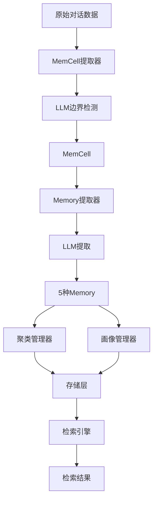
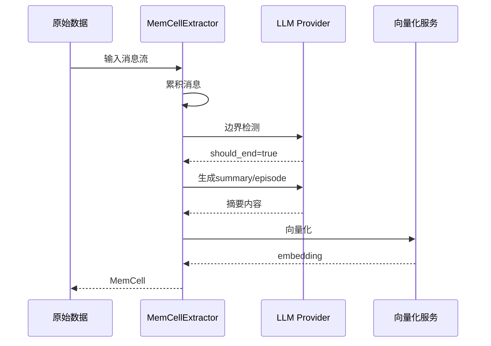

# 记忆管理系统

## 概述

EverMemOS的记忆管理系统（Memory Layer + Agentic Layer）是项目的核心，负责从原始对话中提取、组织和检索记忆。

**核心流程**：
```
原始对话 → MemCell提取 → Memory提取 → 聚类 → 画像生成 → 存储 → 检索
```

## 架构图



---

## 1. MemCell提取器

**位置**: `src/memory_layer/memcell_extractor/`

### 1.1 对话边界检测

**核心原则**: "默认合并，谨慎切分"

**LLM提示词**: `CONV_BOUNDARY_DETECTION_PROMPT`

**决策输出**:
```json
{
  "should_end": true/false,
  "should_wait": true/false,
  "topic_summary": "当前话题总结",
  "reasoning": "决策理由"
}
```

**触发切分条件**:
- ✅ 明确话题切换
- ✅ 时间间隔>1小时
- ✅ 参与者显著变化
- ✅ 语义完整性达成

### 1.2 工作流程



### 1.3 MemCell数据结构

```python
@dataclass
class MemCell:
    event_id: str
    user_id_list: List[str]
    timestamp: datetime
    summary: str                                    # 摘要
    episode: Optional[str] = None                   # 情景描述
    semantic_memories: Optional[List[SemanticMemoryItem]] = None  # 语义记忆
    event_log: Optional[Any] = None                # 事件日志
    vector: Optional[List[float]] = None           # 1024维向量
    original_data: List[Dict[str, Any]] = None     # 原始消息
```

---

## 2. Memory提取器

**位置**: `src/memory_layer/memory_extractor/`

### 2.1 5种记忆类型

| 类型 | 说明 | 提示词 | 示例 |
|------|------|--------|------|
| **Episode** | 叙事性情景记忆 | GROUP_EPISODE_GENERATION_PROMPT | "2024年1月团队讨论产品UI设计，Alice提出扁平化方案..." |
| **Profile** | 个人档案 | PROFILE_EXTRACTION_PROMPT | Who/What/Values三维画像 |
| **GroupProfile** | 群组特征 | GROUP_PROFILE_EXTRACTION_PROMPT | 群组目标、角色、文化 |
| **Semantic** | 知识推论 | SEMANTIC_MEMORY_EXTRACTION_PROMPT | "业务规则：退款需经理审批" |
| **EventLog** | 原子事实 | EVENT_LOG_EXTRACTION_PROMPT | [用户001, 提交报告, 2024-01-15] |

### 2.2 提取流程

```python
async def extract_memory(
    memcell_list: List[MemCell],
    memory_type: MemoryType,
    user_ids: List[str],
    group_id: str
) -> List[Memory]:
    """提取Memory"""
    
    if memory_type == MemoryType.EPISODE_SUMMARY:
        return await EpisodeMemoryExtractor.extract(memcell_list)
    
    elif memory_type == MemoryType.PROFILE:
        return await ProfileMemoryExtractor.extract(memcell_list, user_ids)
    
    # ...其他类型
```

---

## 3. 聚类管理器

**位置**: `src/memory_layer/cluster_manager/`

### 3.1 增量质心聚类算法

**核心思想**: 新MemCell与现有簇质心比较，相似度高且时间接近则加入，否则创建新簇。

**伪代码**:
```python
for new_memcell in stream:
    best_cluster = None
    max_similarity = 0
    
    for cluster in clusters:
        # 计算余弦相似度
        similarity = cosine_similarity(
            new_memcell.vector, 
            cluster.centroid
        )
        
        # 检查时间间隔
        time_gap = abs(new_memcell.time - cluster.latest_time)
        
        if similarity > threshold and time_gap <= max_time_gap:
            if similarity > max_similarity:
                best_cluster = cluster
                max_similarity = similarity
    
    if best_cluster:
        # 递推更新质心
        n = best_cluster.size
        best_cluster.centroid = (
            best_cluster.centroid * n + new_memcell.vector
        ) / (n + 1)
        best_cluster.add(new_memcell)
    else:
        # 创建新簇
        clusters.append(Cluster(
            centroid=new_memcell.vector, 
            members=[new_memcell]
        ))
```

**配置参数**:
```python
similarity_threshold = 0.65  # 余弦相似度阈值
max_time_gap = 7 * 24 * 3600  # 7天
update_strategy = "incremental_mean"  # 递推平均
```

---

## 4. 画像管理器

**位置**: `src/memory_layer/profile_manager/`

### 4.1 价值判别器（ValueDiscriminator）

**识别有价值的信息**:
- ✅ 技能提及（"精通Python"）
- ✅ 项目经验（"负责电商平台架构"）
- ✅ 角色变化（"晋升为技术主管"）
- ✅ 价值观表述（"注重用户体验"）
- ✅ 决策行为（"倾向于敏捷开发"）

### 4.2 画像合并策略

**版本控制**:
```python
class ProfileVersion:
    version: str       # "v1", "v2", ...
    timestamp: datetime
    user_id: str
    
    # Profile三部分
    who: Dict          # 身份、角色、背景
    what: Dict         # 技能、经验、项目
    values: Dict       # 价值观、偏好、动机
```

**合并算法**:
1. 版本对比：识别新增/更新/删除字段
2. 字段级更新：仅更新变化部分
3. 冲突处理：基于时间戳和价值判别
4. 版本存储：MongoDB保留历史

---

## 5. Agentic Layer检索

**位置**: `src/agentic_layer/`

### 5.1 检索策略对比

| 策略 | 实现 | 延迟 | 精度 | 场景 |
|------|------|------|------|------|
| **KEYWORD** | ES BM25 | <200ms | 中 | 精确术语查询 |
| **VECTOR** | Milvus COSINE | 200-300ms | 高 | 语义模糊查询 |
| **HYBRID** | ES+Milvus+RRF+Rerank | 1-2s | 最高 | 混合需求 |
| **LIGHTWEIGHT** | Emb+BM25+RRF | 500ms | 较高 | 实时场景 |
| **AGENTIC** | LLM多轮 | 2-3s | 最高 | 复杂意图 |

### 5.2 RRF融合算法

**公式**:
```
RRF分数 = Σ 1 / (k + rank)，其中 k=60
```

**示例**:
```
Embedding排序: [A(rank1), B(rank2), C(rank3)]
BM25排序:      [B(rank1), D(rank2), A(rank3)]

融合分数：
A: 1/61 + 1/63 = 0.0323
B: 1/62 + 1/61 = 0.0324
C: 1/63 + 0    = 0.0159
D: 0    + 1/62 = 0.0161

最终排序: B > A > D > C
```

**多查询RRF**（Agentic检索）:
```python
# LLM生成多个查询变体
queries = [
    "原始查询",
    "改写查询1",
    "改写查询2"
]

# 并行检索所有查询
results_list = await asyncio.gather(*[
    search(query) for query in queries
])

# RRF融合
final_scores = {}
for results in results_list:
    for rank, doc in enumerate(results, start=1):
        final_scores[doc.id] = final_scores.get(doc.id, 0) + 1/(60 + rank)

# 排序
sorted_docs = sorted(final_scores.items(), key=lambda x: x[1], reverse=True)
```

### 5.3 Agentic检索流程

```
Round 1: RRF检索(Emb+BM25) → Top 20
    ↓
Rerank → Top 5
    ↓
LLM判断充分性
    ↓
  充分？→ 返回Top 20
    ↓ 否
LLM生成多查询(2-3个)
    ↓
Round 2: 并行检索所有查询
    ↓
去重合并(Round1 + Round2 → 40个)
    ↓
Rerank → Top 20
```

---

## 6. 向量化与重排序

### 6.1 DeepInfra Embedding

**模型**: BAAI/bge-m3
**维度**: 1024
**API**: DeepInfra

```python
@service()
class DeepInfraVectorizeService:
    async def get_embedding(self, text: str) -> List[float]:
        """获取文本embedding"""
        response = await aiohttp.post(
            f"{self.base_url}/embeddings",
            json={
                "model": "BAAI/bge-m3",
                "input": text
            },
            headers={"Authorization": f"Bearer {self.api_key}"}
        )
        
        data = await response.json()
        return data["data"][0]["embedding"]  # 1024维向量
```

### 6.2 DeepInfra Rerank

**模型**: Qwen3-Reranker-4B

```python
@service()
class DeepInfraRerankService:
    async def rerank(
        self, 
        query: str, 
        documents: List[str], 
        top_k: int = 20
    ) -> List[Dict]:
        """重排序文档"""
        
        # 批处理（每批10个）
        batches = [documents[i:i+10] for i in range(0, len(documents), 10)]
        
        # 并发请求
        results = await asyncio.gather(*[
            self._rerank_batch(query, batch) for batch in batches
        ])
        
        # 合并排序
        all_results = []
        for batch_result in results:
            all_results.extend(batch_result)
        
        all_results.sort(key=lambda x: x["score"], reverse=True)
        return all_results[:top_k]
```

---

## 7. LLM集成

### 7.1 Provider抽象

```python
class LLMProvider(Protocol):
    async def generate(
        self,
        messages: List[Dict],
        temperature: float = 0.3,
        max_tokens: int = 16384
    ) -> str:
        """生成文本"""
    
    async def test_connection(self) -> bool:
        """测试连接"""
```

### 7.2 OpenAI实现

```python
@service()
class OpenAIProvider:
    def __init__(self):
        self.api_key = os.getenv("LLM_API_KEY")
        self.base_url = os.getenv("LLM_BASE_URL", "https://openrouter.ai/api/v1")
        self.model = os.getenv("LLM_MODEL", "qwen/qwen-2.5-72b-instruct")
    
    async def generate(self, messages, temperature, max_tokens):
        """5次重试机制"""
        for attempt in range(5):
            try:
                async with aiohttp.ClientSession() as session:
                    response = await session.post(
                        f"{self.base_url}/chat/completions",
                        json={
                            "model": self.model,
                            "messages": messages,
                            "temperature": temperature,
                            "max_tokens": max_tokens
                        },
                        headers={"Authorization": f"Bearer {self.api_key}"},
                        timeout=aiohttp.ClientTimeout(total=600)
                    )
                    
                    data = await response.json()
                    return data["choices"][0]["message"]["content"]
            
            except Exception as e:
                if attempt < 4:
                    await asyncio.sleep(2 ** attempt)  # 指数退避
                else:
                    raise
```

---

## 8. 提示词工程

**位置**: `src/memory_layer/prompts/`

**多语言支持**: zh/en/eval

### 8.1 核心提示词

| 提示词 | 用途 | 关键要求 |
|--------|------|----------|
| CONV_BOUNDARY_DETECTION_PROMPT | 对话边界检测 | 默认合并、谨慎切分 |
| GROUP_EPISODE_GENERATION_PROMPT | 情景记忆生成 | 叙事性、连贯性、关键信息 |
| PROFILE_EXTRACTION_PROMPT | 个人画像提取 | Who/What/Values三维 |
| GROUP_PROFILE_EXTRACTION_PROMPT | 群组画像提取 | 目标、角色、文化 |
| SEMANTIC_MEMORY_EXTRACTION_PROMPT | 语义记忆提取 | 知识、规则、业务逻辑 |
| EVENT_LOG_EXTRACTION_PROMPT | 事件日志提取 | 结构化、原子性 |

### 8.2 设计原则

**叙事性原则**:
> "请以讲故事的方式描述这段对话，保持连贯和自然，关键信息自然融入叙述中。"

**客观性原则**:
> "严格忠于原文内容，禁止添加评价、猜测或推断。"

**检索优化原则**:
> "保留实体名称、专业术语、URL等关键信息，便于后续检索。"

---

## 9. 性能指标

| 操作 | 延迟 | 说明 |
|------|------|------|
| MemCell提取 | 3-5秒 | 包括LLM调用 |
| Memory提取 | 5-10秒 | 5种类型并行 |
| 聚类 | <1秒 | 向量计算 |
| Profile提取 | 5-10秒 | LLM调用 |
| 关键词检索 | <200ms | ES BM25 |
| 向量检索 | 200-300ms | Milvus |
| 混合检索 | 1-2秒 | RRF+Rerank |
| Agentic检索 | 2-3秒 | LLM多轮 |

---

## 总结

**记忆管理系统核心**:
- ✅ MemCell提取：LLM驱动的边界检测
- ✅ Memory提取：5种类型全面覆盖
- ✅ 聚类管理：增量质心聚类
- ✅ 画像管理：价值判别+版本控制
- ✅ 检索引擎：5种策略灵活选择
- ✅ RRF融合：多源检索结果合并
- ✅ Agentic检索：LLM引导的多轮智能检索

**设计特色**:
- LLM深度集成
- 向量化+文本检索双引擎
- 提示词工程精心设计
- 增量学习支持
- 多版本管理

---

**相关文档**:
- [00-系统架构总览](./00-系统架构总览.md)
- [01-核心框架](./01-核心框架.md)
- [02-数据存储与ORM](./02-数据存储与ORM.md)

**源码索引**:
- MemCell提取：`src/memory_layer/memcell_extractor/`
- Memory提取：`src/memory_layer/memory_extractor/`
- 聚类管理：`src/memory_layer/cluster_manager/`
- 画像管理：`src/memory_layer/profile_manager/`
- LLM集成：`src/memory_layer/llm/`
- 提示词：`src/memory_layer/prompts/`
- Agentic层：`src/agentic_layer/`
