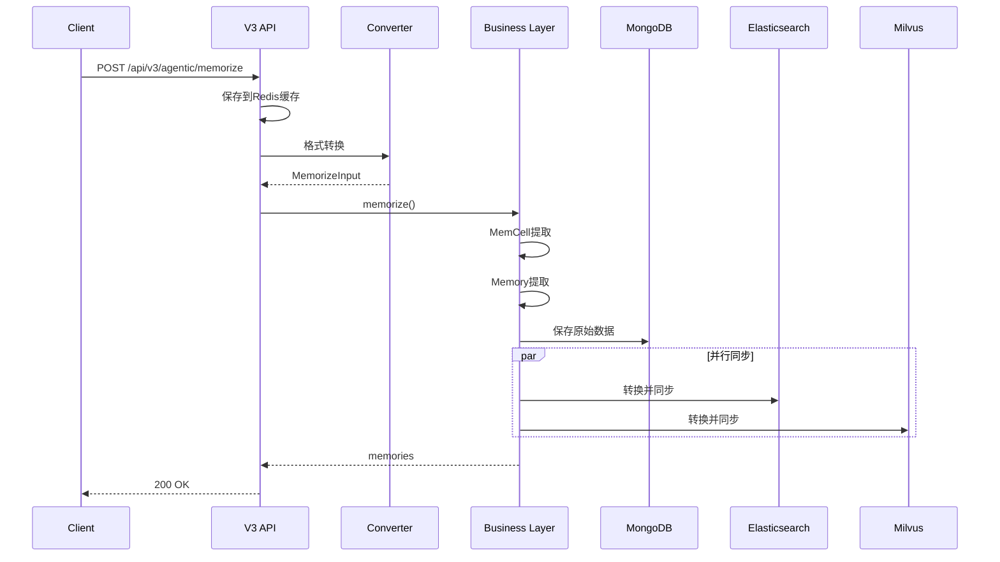
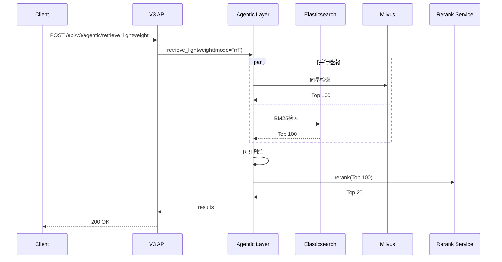

# API与适配器层

## 概述

EverMemOS采用六边形架构，通过输入/输出适配器实现核心业务与外部系统的解耦。

**核心设计**:
- 输入适配器（Input Adapters）：HTTP API、消息队列、定时任务
- 输出适配器（Output Adapters）：持久化、搜索、缓存
- 格式转换器（Converters）：数据格式转换

---

## 1. API层架构

### 1.1 API V2 vs V3对比

| 维度 | V2 | V3 |
|------|----|----|
| **目标场景** | 通用记忆系统 | 群聊实时处理 |
| **端点数量** | 7个（细粒度） | 3个（粗粒度） |
| **消息格式** | 复杂GroupChatFormat | 简单单条消息 |
| **缓存支持** | 无 | Redis 24小时缓存 |
| **检索策略** | 6种独立端点 | 3种融合模式 |
| **智能程度** | 基础检索 | LLM多轮迭代 |
| **性能焦点** | 精确度 | 实时性+准确度 |

### 1.2 API V2端点

**位置**: `src/infra_layer/adapters/input/api/v2/agentic_v2_controller.py`

```python
@controller("agentic_v2_controller", primary=True)
class AgenticV2Controller(BaseController):
    
    POST /api/v2/agentic/memorize              # 存储记忆
    POST /api/v2/agentic/fetch                 # KV获取
    POST /api/v2/agentic/retrieve              # 通用检索
    POST /api/v2/agentic/retrieve_keyword      # BM25检索
    POST /api/v2/agentic/retrieve_vector       # 向量检索
    POST /api/v2/agentic/retrieve_hybrid       # 混合检索
```

**请求示例**:
```json
POST /api/v2/agentic/retrieve_hybrid
{
  "query": "用户的技术栈偏好",
  "user_id": "user_123",
  "group_id": "group_456",
  "retrieve_method": "hybrid",
  "radius": 0.6,
  "time_range_days": 365,
  "top_k": 20
}
```

### 1.3 API V3端点

**位置**: `src/infra_layer/adapters/input/api/v3/agentic_v3_controller.py`

```python
@controller("agentic_v3_controller", primary=True)
class AgenticV3Controller(BaseController):
    
    POST /api/v3/agentic/memorize              # 单条消息存储
    POST /api/v3/agentic/retrieve_lightweight  # 轻量级检索
    POST /api/v3/agentic/retrieve_agentic      # Agentic检索
```

#### /memorize - 单条消息存储

**特性**:
- Redis缓存（24小时）
- 自动消息累积
- 边界检测

```json
POST /api/v3/agentic/memorize
{
  "group_id": "group_123",
  "message_id": "msg_001",
  "create_time": "2025-01-15T10:00:00+08:00",
  "sender": "user_001",
  "sender_name": "Alice",
  "content": "讨论技术方案",
  "scene": "group_chat"
}
```

**内部流程**:
```python
# 1. 保存到Redis
redis_key = f"chat_history:{group_id}"
await redis_provider.lpush(redis_key, json.dumps(message_data))
await redis_provider.expire(redis_key, 86400)  # 24小时

# 2. 转换格式
memorize_input = convert_simple_message_to_memorize_input(message_data)

# 3. 存储到MongoDB + ES/Milvus
memories = await memory_manager.memorize(memorize_request)
```

#### /retrieve_lightweight - 轻量级检索

**数据源**:
- `episode`: MemCell.episode（默认）
- `event_log`: 原子事实
- `semantic_memory`: 语义记忆
- `profile`: 用户档案

**检索模式**:
- `rrf`: RRF融合（Embedding + BM25）
- `embedding`: 纯向量检索
- `bm25`: 纯关键词检索

**内存范围**:
- `all`: personal + group
- `personal`: user_id only
- `group`: group_id only

```json
POST /api/v3/agentic/retrieve_lightweight
{
  "query": "北京旅游美食",
  "user_id": "default",
  "group_id": "assistant",
  "retrieval_mode": "rrf",
  "data_source": "episode",
  "memory_scope": "all",
  "top_k": 20,
  "radius": 0.6
}
```

#### /retrieve_agentic - Agentic检索

**多轮智能检索**:
1. Round 1: RRF混合检索
2. LLM评估充分性
3. LLM生成改进查询
4. Round 2: 并行多查询检索
5. Rerank优化

```json
POST /api/v3/agentic/retrieve_agentic
{
  "query": "用户可能喜欢的食物",
  "user_id": "user_001",
  "group_id": "chat_group_001",
  "top_k": 20,
  "llm_config": {
    "model": "gpt-4o-mini",
    "api_key": "your_api_key"
  }
}
```

---

## 2. 六边形架构

### 2.1 输入适配器（Input Adapters）

**目录**: `src/infra_layer/adapters/input/`

| 适配器 | 协议 | 用途 | 状态 |
|--------|------|------|------|
| **api/v2** | HTTP/REST | 通用API | ✅ 已实现 |
| **api/v3** | HTTP/REST | 群聊API | ✅ 已实现 |
| **mq** | Redis/Kafka | 异步消息 | 🔲 预留 |
| **jobs** | Cron | 定时任务 | 🔲 预留 |
| **mcp** | MCP Protocol | 外部集成 | 🔲 预留 |

**原则**:
- 接收外部格式
- 验证和转换
- 调用核心业务
- 转换业务响应

### 2.2 输出适配器（Output Adapters）

**目录**: `src/infra_layer/adapters/out/`

| 适配器 | 技术栈 | 用途 |
|--------|--------|------|
| **persistence/** | MongoDB | 文档存储 |
| **search/elasticsearch/** | ES | 关键词检索 |
| **search/milvus/** | Milvus | 向量检索 |
| **cache/** | Redis | 缓存/队列 |

**原则**:
- 实现核心业务端口
- 处理外部服务通信
- 错误处理和重试
- 不包含业务逻辑

---

## 3. 格式转换器（Converters）

### 3.1 GroupChatConverter

**位置**: `src/infra_layer/adapters/input/api/mapper/group_chat_converter.py`

**功能**: 将简单消息格式转换为内部MemorizeInput

```python
def convert_simple_message_to_memorize_input(message_data: Dict) -> MemorizeInput:
    """
    简单消息 → MemorizeInput
    
    输入:
    {
        "group_id": "group_123",
        "message_id": "msg_001",
        "sender": "user_001",
        "sender_name": "Alice",
        "content": "讨论技术方案",
        "create_time": "2025-01-15T10:00:00+08:00"
    }
    
    输出:
    MemorizeInput(
        messages=[{
            "_id": "msg_001",
            "fullName": "Alice",
            "roomId": "group_123",
            "content": "讨论技术方案",
            "createTime": "2025-01-15T10:00:00+08:00",
            "createBy": "user_001"
        }],
        raw_data_type="Conversation"
    )
    """
    return MemorizeInput(
        messages=[{
            "_id": message_data["message_id"],
            "fullName": message_data.get("sender_name", message_data["sender"]),
            "roomId": message_data["group_id"],
            "content": message_data["content"],
            "createTime": message_data["create_time"],
            "createBy": message_data["sender"]
        }],
        raw_data_type="Conversation"
    )
```

### 3.2 MongoDB → ES Converter

**位置**: `src/infra_layer/adapters/out/search/elasticsearch/converter/episodic_memory_converter.py`

**功能**: MongoDB文档 → Elasticsearch文档

```python
class EpisodicMemoryConverter(BaseEsConverter[EpisodicMemoryDoc]):
    
    @classmethod
    def from_mongo(cls, source_doc: MongoEpisodicMemory) -> EpisodicMemoryDoc:
        # 构建搜索内容（预分词）
        search_content = cls._build_search_content(source_doc)
        
        return EpisodicMemoryDoc(
            event_id=str(source_doc.event_id),
            user_id=source_doc.user_id,
            timestamp=source_doc.timestamp,
            title=getattr(source_doc, 'subject', None),
            episode=source_doc.episode,
            search_content=search_content,  # 中文预分词
            keywords=getattr(source_doc, 'keywords', [])
        )
    
    @classmethod
    def _build_search_content(cls, source_doc) -> List[str]:
        """中文分词（jieba）"""
        words = jieba.lcut(source_doc.episode)
        return words + getattr(source_doc, 'keywords', [])
```

### 3.3 MongoDB → Milvus Converter

**位置**: `src/infra_layer/adapters/out/search/milvus/converter/episodic_memory_milvus_converter.py`

**功能**: MongoDB文档 → Milvus实体

```python
class EpisodicMemoryMilvusConverter(BaseMilvusConverter):
    
    @classmethod
    def from_mongo(cls, source_doc: MongoEpisodicMemory) -> Dict[str, Any]:
        return {
            "id": str(source_doc.event_id),
            "user_id": source_doc.user_id,
            "group_id": getattr(source_doc, 'group_id', ""),
            "timestamp": int(source_doc.timestamp.timestamp()),
            "vector": source_doc.vector,  # 1024维
            "episode": source_doc.episode[:10000]
        }
```

---

## 4. 数据流示例

### 4.1 写入流程



### 4.2 检索流程



---

## 5. 错误处理

### 5.1 统一错误响应

```python
class GlobalExceptionHandler:
    async def __call__(self, request: Request, call_next):
        try:
            response = await call_next(request)
            return response
        except HTTPException as e:
            return JSONResponse(
                status_code=e.status_code,
                content={
                    "error": e.detail,
                    "timestamp": datetime.now(timezone.utc).isoformat()
                }
            )
        except Exception as e:
            logger.exception("Unhandled exception")
            return JSONResponse(
                status_code=500,
                content={
                    "error": "Internal Server Error",
                    "message": str(e),
                    "timestamp": datetime.now(timezone.utc).isoformat()
                }
            )
```

### 5.2 错误码规范

| 状态码 | 含义 | 场景 |
|--------|------|------|
| 200 | 成功 | 正常响应 |
| 400 | 请求错误 | 参数验证失败 |
| 401 | 未认证 | 缺少认证信息 |
| 403 | 禁止访问 | 权限不足 |
| 404 | 未找到 | 资源不存在 |
| 500 | 服务器错误 | 内部异常 |

---

## 6. 性能优化

### 6.1 缓存策略

**Redis缓存**:
```python
# 聊天历史缓存（24小时）
redis_key = f"chat_history:{group_id}"
await redis_provider.lpush(redis_key, json.dumps(message))
await redis_provider.expire(redis_key, 86400)

# 用户档案缓存（1小时）
profile_key = f"profile:{user_id}"
await redis_provider.set(profile_key, json.dumps(profile), ex=3600)
```

### 6.2 批处理

**Rerank批处理**:
```python
# 每批10个并发
batches = [documents[i:i+10] for i in range(0, len(documents), 10)]
results = await asyncio.gather(*[
    rerank_batch(query, batch) for batch in batches
])
```

---

## 总结

**API与适配器层特点**:
- ✅ 六边形架构：输入/输出适配器分离
- ✅ API版本管理：V2/V3并存
- ✅ 格式转换：Converter统一处理
- ✅ 错误处理：全局异常处理器
- ✅ 性能优化：缓存+批处理

**设计原则**:
- 单一职责：适配器仅负责格式转换
- 依赖倒置：核心业务不依赖适配器
- 接口隔离：每个适配器独立接口
- 开闭原则：易于扩展新适配器

---

**相关文档**:
- [00-系统架构总览](./00-系统架构总览.md)
- [01-核心框架](./01-核心框架.md)
- [02-数据存储与ORM](./02-数据存储与ORM.md)
- [03-记忆管理系统](./03-记忆管理系统.md)

**源码索引**:
- API V2：`src/infra_layer/adapters/input/api/v2/`
- API V3：`src/infra_layer/adapters/input/api/v3/`
- Converters：`src/infra_layer/adapters/input/api/mapper/`
- 持久化适配器：`src/infra_layer/adapters/out/persistence/`
- 搜索适配器：`src/infra_layer/adapters/out/search/`
