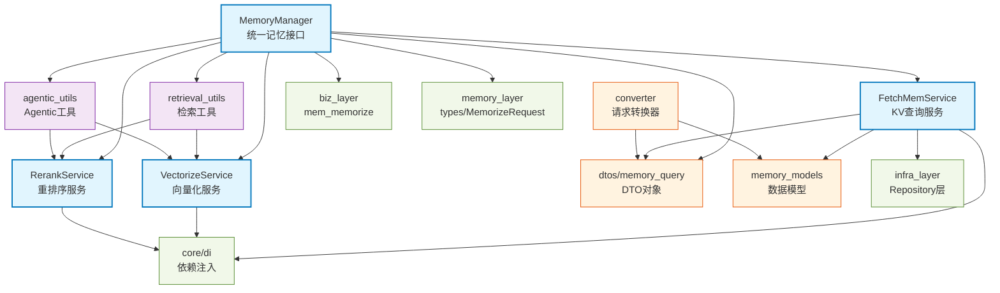

# agentic_layer

智能体层：提供记忆存储、获取、检索的统一接口，支持多种检索策略（关键词、向量、混合、Agentic）。

## 模块位置

**源码路径**: `src/agentic_layer/`
**文档路径**: `specs/ac_mod/agentic_layer.ac.mod.md`
**模块类型**: 包模块

## 目录结构

```
src/agentic_layer/
├── __init__.py                     # 包初始化文件
├── memory_manager.py               # 核心：记忆管理器，提供memorize/fetch_mem/retrieve_mem接口
├── fetch_mem_service.py            # 记忆获取服务，基于ID的KV查询
├── memory_models.py                # 记忆数据模型定义（MemoryType、各种MemoryModel）
├── vectorize_service.py            # DeepInfra向量化服务，文本转embedding
├── rerank_service.py               # DeepInfra重排序服务，提升检索精度
├── agentic_utils.py                # Agentic检索工具（LLM引导的多轮检索）
├── retrieval_utils.py              # 检索工具函数（BM25、RRF融合等）
├── converter.py                    # 请求转换器（dict→Request对象）
├── schemas.py                      # 数据字段常量和请求类型定义
└── dtos/                           # 数据传输对象子包
    ├── __init__.py
    └── memory_query.py             # FetchMemRequest/Response, RetrieveMemRequest/Response
```

## 快速开始

### 基本使用方式

```python
from agentic_layer.memory_manager import MemoryManager
from agentic_layer.dtos.memory_query import FetchMemRequest, RetrieveMemRequest
from agentic_layer.memory_models import MemoryType, RetrieveMethod

# 初始化记忆管理器
memory_mgr = MemoryManager()

# 1. 记忆存储（memorize）
from memory_layer.memory_manager import MemorizeRequest
memorize_req = MemorizeRequest(
    new_raw_data_list=[...],
    raw_data_type="Conversation",
    user_id_list=["user_001"]
)
memories = await memory_mgr.memorize(memorize_req)

# 2. 记忆获取（fetch_mem）- 基于KV的静态记忆读取
fetch_req = FetchMemRequest(
    user_id="user_001",
    memory_type=MemoryType.MULTIPLE,  # 或 PROFILE, EPISODIC_MEMORY 等
    limit=10
)
fetch_resp = await memory_mgr.fetch_mem(fetch_req)

# 3. 记忆检索（retrieve_mem）- 基于查询的动态记忆检索
retrieve_req = RetrieveMemRequest(
    user_id="user_001",
    query="用户最近的工作内容",
    retrieve_method=RetrieveMethod.HYBRID,  # 混合检索
    top_k=20
)
retrieve_resp = await memory_mgr.retrieve_mem(retrieve_req)

# 4. 轻量级检索（retrieve_lightweight）- Embedding + BM25 + RRF
result = await memory_mgr.retrieve_lightweight(
    query="项目进展",
    user_id="user_001",
    top_k=20,
    retrieval_mode="rrf"  # "embedding" | "bm25" | "rrf"
)
```

### 子模块说明

- **dtos**: 数据传输对象，包含FetchMemRequest/Response, RetrieveMemRequest/Response等
- **fetch_mem_service**: 提供基于ID的记忆查询服务（FetchMemoryServiceInterface）
- **vectorize_service**: DeepInfra向量化服务（DeepInfraVectorizeService）
- **rerank_service**: DeepInfra重排序服务（DeepInfraRerankService）

### 配置管理

- **vectorize_service配置**：通过环境变量或DI注入DeepInfraConfig
  - `DEEPINFRA_API_KEY`: API密钥
  - `DEEPINFRA_BASE_URL`: API地址（默认https://api.deepinfra.com/v1/openai）
  - `DEEPINFRA_EMBEDDING_MODEL`: embedding模型（默认Qwen/Qwen3-Embedding-4B）
  - `DEEPINFRA_DIMENSIONS`: 向量维度（默认1024）

- **rerank_service配置**：通过环境变量或DI注入DeepInfraRerankConfig
  - `DEEPINFRA_RERANK_MODEL`: rerank模型（默认Qwen/Qwen3-Reranker-4B）

## 核心组件详解

### 1. MemoryManager 主类

**核心功能：**
- **memorize**: 接受原始数据并持久化存储（调用biz_layer.mem_memorize）
- **fetch_mem**: 通过键检索记忆字段，支持多种记忆类型（MULTIPLE, PROFILE, EPISODIC_MEMORY等）
- **retrieve_mem**: 基于查询的记忆检索（支持KEYWORD/VECTOR/HYBRID三种方法）
- **retrieve_lightweight**: 轻量级检索（Embedding + BM25 + RRF融合）
- **retrieve_agentic**: Agentic检索（LLM引导的多轮智能检索）

**主要方法：**
- `memorize(memorize_request)`: 存储记忆数据
- `fetch_mem(request)`: 获取记忆数据（KV查询）
- `retrieve_mem(request)`: 检索记忆数据（根据retrieve_method分发）
- `retrieve_mem_keyword(request)`: 关键词检索（使用ES）
- `retrieve_mem_vector(request)`: 向量检索（使用Milvus）
- `retrieve_mem_hybrid(request)`: 混合检索（ES + Milvus + rerank）
- `retrieve_lightweight(query, user_id, ...)`: 轻量级检索
- `retrieve_agentic(query, user_id, llm_provider, ...)`: Agentic检索

### 2. FetchMemoryService 服务

**核心功能：**
- 提供基于ID的记忆查询服务
- 对接infra_layer的repository类（SemanticMemoryRawRepository等）
- 支持多种记忆类型查询：MULTIPLE, SEMANTIC_MEMORY, EPISODIC_MEMORY等

**主要方法：**
- `find_by_user_id(user_id, memory_type, version_range, limit)`: 根据用户ID查找记忆
- `find_by_id(memory_id, memory_type)`: 根据记忆ID查找单个记忆
- `find_episodic_by_event_id(event_id, user_id)`: 根据事件ID查找情景记忆
- `find_entity_by_entity_id(entity_id)`: 根据实体ID查找实体
- `find_relationship_by_entity_ids(source, target)`: 根据实体ID查找关系

### 3. VectorizeService 服务

**核心功能：**
- 调用DeepInfra API获取文本embedding向量
- 支持单个/批量文本向量化
- 支持异步并发请求、重试、超时控制

**主要方法：**
- `get_embedding(text)`: 获取单个文本的embedding向量
- `get_embeddings(texts)`: 获取多个文本的embedding向量
- `get_embeddings_batch(text_batches)`: 批量获取embedding向量

### 4. RerankService 服务

**核心功能：**
- 调用DeepInfra API对检索结果进行重排序
- 提升检索精度（从粗排到精排）
- 支持批量处理和异步并发

**主要方法：**
- `rerank_memories(query, retrieve_response)`: 对RetrieveMemResponse重排序
- `_rerank_all_hits(query, all_hits, top_k)`: 对all_hits列表重排序

### 5. 检索工具函数（retrieval_utils.py）

**核心功能：**
- **BM25检索**: `build_bm25_index()`, `search_with_bm25()` - 关键词检索
- **RRF融合**: `reciprocal_rank_fusion()` - 融合两个检索结果
- **多查询RRF**: `multi_rrf_fusion()` - 融合多个查询结果
- **轻量级检索**: `lightweight_retrieval()` - Embedding + BM25 + RRF
- **多查询检索**: `multi_query_retrieval()` - 并行多查询 + RRF融合
- **Agentic检索**: `agentic_retrieval()` - LLM引导的多轮检索

### 6. Agentic工具函数（agentic_utils.py）

**核心功能：**
- **充分性检查**: `check_sufficiency()` - LLM判断检索结果是否充分
- **多查询生成**: `generate_multi_queries()` - LLM生成改进查询
- **文档格式化**: `format_documents_for_llm()` - 格式化供LLM使用

**AgenticConfig配置：**
- `round1_top_n`: Round 1返回数（默认20）
- `round1_rerank_top_n`: Rerank后用于LLM判断（默认5）
- `enable_multi_query`: 是否启用多查询（默认True）
- `num_queries`: 生成查询数量（默认3）
- `combined_total`: 合并后总数（默认40）
- `final_top_n`: 最终返回数（默认20）

## Mermaid 依赖图



## 依赖关系说明

### 对其他模块的依赖

**内部依赖：**
- `agentic_layer.dtos` - DTO对象（FetchMemRequest/Response等）
- `agentic_layer.memory_models` - 数据模型定义
- `agentic_layer.fetch_mem_service` - 记忆获取服务
- `agentic_layer.vectorize_service` - 向量化服务
- `agentic_layer.rerank_service` - 重排序服务

**外部依赖：**
- `biz_layer.mem_memorize` - 记忆存储业务逻辑
- `memory_layer.types` - Memory, RawDataType等类型定义
- `memory_layer.memory_manager` - MemorizeRequest
- `infra_layer.adapters.out.persistence.repository.*` - 各种Repository（SemanticMemoryRawRepository等）
- `infra_layer.adapters.out.search.repository.*` - ES/Milvus检索Repository
- `core.di` - 依赖注入框架
- `core.nlp.stopwords_utils` - 停用词过滤
- `common_utils.datetime_utils` - 时间工具

### 被依赖关系

被以下模块使用：
- `infra_layer.adapters.input.api.v2.agentic_v2_controller` - V2 API控制器
- `infra_layer.adapters.input.api.v3.agentic_v3_controller` - V3 API控制器
- `memory_layer.memory_extractor.semantic_memory_extractor` - 语义记忆提取器
- `memory_layer.memory_extractor.event_log_extractor` - 事件日志提取器
- `memory_layer.memcell_extractor.conv_memcell_extractor` - 对话记忆单元提取器
- `memory_layer.cluster_manager.manager` - 聚类管理器
- `biz_layer.memcell_sync` - 记忆单元同步
- `biz_layer.personal_memory_sync` - 个人记忆同步
- `biz_layer.mem_db_operations` - 记忆数据库操作

## 可以验证模块可运行的测试命令

```bash
# 1. 运行单元测试（如果存在）
pytest src/agentic_layer/tests -v

# 2. 交互式测试 - MemoryManager
python -c "
from agentic_layer.memory_manager import MemoryManager
print(MemoryManager)
"

# 3. 交互式测试 - FetchMemService
python -c "
from agentic_layer.fetch_mem_service import get_fetch_memory_service
print(get_fetch_memory_service)
"

# 4. 交互式测试 - VectorizeService
python -c "
from agentic_layer.vectorize_service import get_vectorize_service
print(get_vectorize_service)
"

# 5. 交互式测试 - RerankService
python -c "
from agentic_layer.rerank_service import get_rerank_service
print(get_rerank_service)
"

# 6. 交互式测试 - DTO对象
python -c "
from agentic_layer.dtos.memory_query import FetchMemRequest, RetrieveMemRequest
from agentic_layer.memory_models import MemoryType, RetrieveMethod
print('FetchMemRequest:', FetchMemRequest)
print('MemoryType:', list(MemoryType))
print('RetrieveMethod:', list(RetrieveMethod))
"

# 7. 检查模块导入
python -c "import agentic_layer; print(dir(agentic_layer))"
```

## 核心检索策略对比

| 策略 | 方法 | 特点 | 适用场景 |
|------|------|------|----------|
| **关键词检索** | `retrieve_mem_keyword` | ES BM25，快速 | 精确关键词匹配 |
| **向量检索** | `retrieve_mem_vector` | Milvus语义相似度 | 语义理解 |
| **混合检索** | `retrieve_mem_hybrid` | ES + Milvus + Rerank | 平衡精度和召回 |
| **轻量级检索** | `retrieve_lightweight` | Embedding + BM25 + RRF | 内存数据快速检索 |
| **Agentic检索** | `retrieve_agentic` | LLM引导多轮检索 | 复杂查询需求 |

## Agentic检索流程

```
Round 1: RRF检索(Emb+BM25) → Top 20
    ↓
Rerank → Top 5
    ↓
LLM判断充分性
    ↓
  充分？→ 返回Top 20
    ↓ 否
LLM生成多查询(2-3个)
    ↓
Round 2: 并行检索所有查询
    ↓
去重合并(Round1 + Round2 → 40个)
    ↓
Rerank → Top 20
```

## 注意事项

1. **环境变量配置**: VectorizeService和RerankService需要配置DEEPINFRA_API_KEY
2. **DI依赖注入**: 服务类使用@service装饰器注册，通过get_bean()获取实例
3. **异步操作**: 所有核心方法都是async，需要在async上下文中使用
4. **记忆类型**: MemoryType.MULTIPLE会同时查询BASE_MEMORY、PROFILE、PREFERENCE
5. **version_range参数**: fetch_mem支持版本范围查询，格式为(start, end)左闭右闭区间
6. **group_by策略**: retrieve_mem结果按group_id分组，支持importance_scores排序
7. **Rerank批次**: RerankService自动将文档分成10批并行处理，避免API限制
