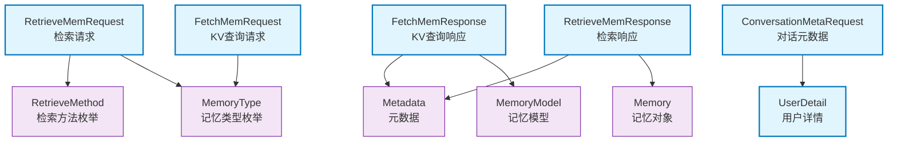

# agentic_layer.dtos

数据传输对象（DTO）子包：定义agentic_layer的请求/响应数据结构，包括记忆获取、检索、对话元数据等。

## 模块位置

**源码路径**: `src/agentic_layer/dtos/`
**文档路径**: `specs/ac_mod/agentic_layer.dtos.ac.mod.md`
**模块类型**: 包模块

## 目录结构

```
src/agentic_layer/dtos/
├── __init__.py                     # 包初始化文件
└── memory_query.py                 # 记忆查询DTO定义
```

## 文件结构

```python
# memory_query.py 内容结构
├── 导入部分                         # 外部依赖导入（dataclasses, enum, typing, datetime等）
├── FetchMemRequest                 # 记忆获取请求（基于KV）
├── FetchMemResponse                # 记忆获取响应
├── RetrieveMemRequest              # 记忆检索请求（基于查询）
├── RetrieveMemResponse             # 记忆检索响应
├── UserDetail                      # 用户详情（对话元数据使用）
└── ConversationMetaRequest         # 对话元数据请求
```

## 快速开始

### 基本使用方式

```python
from agentic_layer.dtos.memory_query import (
    FetchMemRequest,
    FetchMemResponse,
    RetrieveMemRequest,
    RetrieveMemResponse,
    ConversationMetaRequest,
    UserDetail
)
from agentic_layer.memory_models import MemoryType, RetrieveMethod

# 1. 创建FetchMemRequest（KV查询）
fetch_req = FetchMemRequest(
    user_id="user_001",
    memory_type=MemoryType.MULTIPLE,  # 或 PROFILE, EPISODIC_MEMORY等
    limit=10,
    offset=0,
    version_range=("v1.0", "v1.5")  # 可选：版本范围
)

# 2. 创建RetrieveMemRequest（查询检索）
retrieve_req = RetrieveMemRequest(
    user_id="user_001",
    query="用户最近的工作内容",
    retrieve_method=RetrieveMethod.HYBRID,  # KEYWORD, VECTOR, HYBRID
    top_k=20,
    start_time="2024-01-01",
    end_time="2024-12-31",
    memory_sub_type="episode",  # episode/semantic_memory/event_log
    radius=0.6  # COSINE相似度阈值
)

# 3. 处理FetchMemResponse
fetch_resp = FetchMemResponse(
    memories=[...],  # List[MemoryModel]
    total_count=10,
    has_more=False
)

# 4. 处理RetrieveMemResponse
retrieve_resp = RetrieveMemResponse(
    memories=[{group_id: [Memory, Memory, ...]}, ...],  # 按group_id分组
    scores=[{group_id: [0.92, 0.85, ...]}, ...],
    importance_scores=[0.8, 0.6, ...],  # 群组重要性得分
    total_count=15
)

# 5. 创建ConversationMetaRequest（对话元数据）
conv_meta = ConversationMetaRequest(
    version="v1.0",
    scene="meeting",
    scene_desc={"bot_ids": ["bot_001"]},
    name="项目讨论会",
    group_id="group_001",
    created_at="2024-01-01T10:00:00Z",
    user_details={
        "user_001": UserDetail(full_name="张三", role="PM"),
        "user_002": UserDetail(full_name="李四", role="Dev")
    }
)
```

## 核心组件详解

### 1. FetchMemRequest

**功能**: 记忆获取请求（基于KV的静态记忆查询）

**字段说明：**
- `user_id: str` - 用户ID（必需）
- `memory_type: MemoryType` - 记忆类型（默认MULTIPLE）
- `limit: int` - 返回数量（默认40）
- `offset: int` - 偏移量（默认0）
- `filters: Dict[str, Any]` - 过滤条件（可选）
- `sort_by: str` - 排序字段（可选）
- `sort_order: str` - 排序方向（asc/desc，默认desc）
- `version_range: Tuple[str, str]` - 版本范围（可选，左闭右闭）

**方法：**
- `get_memory_types()` - 获取要查询的记忆类型列表
  - 当memory_type为MULTIPLE时，返回[BASE_MEMORY, PROFILE, PREFERENCE]
  - 否则返回[memory_type]

**使用示例：**
```python
req = FetchMemRequest(
    user_id="user_001",
    memory_type=MemoryType.EPISODIC_MEMORY,
    limit=20
)
types = req.get_memory_types()  # [MemoryType.EPISODIC_MEMORY]
```

### 2. FetchMemResponse

**功能**: 记忆获取响应

**字段说明：**
- `memories: List[MemoryModel]` - 记忆列表
- `total_count: int` - 总数量
- `has_more: bool` - 是否有更多数据（默认False）
- `metadata: Metadata` - 元数据（包含source, user_id等）

### 3. RetrieveMemRequest

**功能**: 记忆检索请求（基于查询的动态记忆检索）

**字段说明：**
- `user_id: str` - 用户ID（必需）
- `query: str` - 查询文本（可选）
- `retrieve_method: RetrieveMethod` - 检索方法（默认KEYWORD）
  - KEYWORD: 关键词检索（ES BM25）
  - VECTOR: 向量检索（Milvus语义相似度）
  - HYBRID: 混合检索（ES + Milvus + Rerank）
- `memory_types: List[MemoryType]` - 记忆类型列表（默认空）
- `top_k: int` - 返回数量（默认40）
- `filters: Dict[str, Any]` - 过滤条件（默认空字典）
- `include_metadata: bool` - 是否包含元数据（默认True）
- `start_time: str` - 开始时间（可选，格式：YYYY-MM-DD或ISO）
- `end_time: str` - 结束时间（可选）
- `memory_sub_type: str` - 记忆子类型（可选）
  - "episode": 情景记忆（默认）
  - "semantic_memory": 语义记忆
  - "event_log": 事件日志
- `semantic_start_time: str` - 语义记忆开始时间（仅semantic_memory有效）
- `semantic_end_time: str` - 语义记忆结束时间（仅semantic_memory有效）
- `current_time: str` - 当前时间（用于过滤有效期内的语义记忆）
- `radius: float` - COSINE相似度阈值（默认None，自动使用0.6）

**使用示例：**
```python
# 向量检索语义记忆，过滤有效期
req = RetrieveMemRequest(
    user_id="user_001",
    query="项目目标",
    retrieve_method=RetrieveMethod.VECTOR,
    memory_sub_type="semantic_memory",
    semantic_start_time="2024-01-01",
    current_time="2024-06-01",
    radius=0.7
)
```

### 4. RetrieveMemResponse

**功能**: 记忆检索响应（按group_id分组）

**字段说明：**
- `memories: List[Dict[str, List[Memory]]]` - 分组记忆列表
  - 格式：`[{group_id: [Memory, Memory, ...]}, ...]`
- `scores: List[Dict[str, List[float]]]` - 分组得分列表
  - 格式：`[{group_id: [0.92, 0.85, ...]}, ...]`
- `importance_scores: List[float]` - 群组重要性得分（按group排序）
- `original_data: List[Dict[str, List[Dict]]]` - 原始数据（memcell）
- `total_count: int` - 总数量
- `has_more: bool` - 是否有更多数据
- `query_metadata: Metadata` - 查询元数据
- `metadata: Metadata` - 响应元数据

**数据结构示例：**
```python
response = RetrieveMemResponse(
    memories=[
        {"group_001": [Memory1, Memory2, Memory3]},
        {"group_002": [Memory4, Memory5]}
    ],
    scores=[
        {"group_001": [0.95, 0.92, 0.88]},
        {"group_002": [0.85, 0.80]}
    ],
    importance_scores=[0.8, 0.6],  # group_001更重要
    total_count=5
)
```

### 5. UserDetail

**功能**: 用户详情数据结构（用于ConversationMetaRequest）

**字段说明：**
- `full_name: str` - 用户全名（必需）
- `role: str` - 用户角色（可选）
- `extra: Dict[str, Any]` - 额外信息（可选，schema动态）

### 6. ConversationMetaRequest

**功能**: 对话元数据请求（用于记录对话上下文信息）

**字段说明：**
- `version: str` - 版本号（必需）
- `scene: str` - 场景标识（必需，如"meeting", "chat"）
- `scene_desc: Dict[str, Any]` - 场景描述（必需，通常包含bot_ids等）
- `name: str` - 对话名称（必需）
- `group_id: str` - 群组ID（必需）
- `created_at: str` - 创建时间（必需，ISO格式）
- `description: str` - 对话描述（可选）
- `default_timezone: str` - 默认时区（默认Asia/Shanghai）
- `user_details: Dict[str, UserDetail]` - 用户详情字典
  - Key: 动态（如user_001, robot_001）
  - Value: UserDetail对象
- `tags: List[str]` - 标签列表（默认空）

**使用示例：**
```python
meta = ConversationMetaRequest(
    version="v1.0",
    scene="project_review",
    scene_desc={"bot_ids": ["bot_001"], "meeting_type": "weekly"},
    name="周例会",
    group_id="team_001",
    created_at="2024-06-01T14:00:00Z",
    user_details={
        "user_001": UserDetail(full_name="张三", role="PM", extra={"level": "L6"}),
        "bot_001": UserDetail(full_name="AI助手", role="Assistant")
    },
    tags=["weekly", "project"]
)
```

## Mermaid 依赖图



## 依赖关系说明

### 对其他模块的依赖

**内部依赖（agentic_layer包内）：**
- `agentic_layer.memory_models` - 导入MemoryType, Metadata, MemoryModel, RetrieveMethod

**外部依赖：**
- `memory_layer.types` - 导入Memory对象
- Python标准库：`dataclasses`, `enum`, `typing`, `datetime`

### 被依赖关系

被以下模块使用：
- `agentic_layer.memory_manager` - MemoryManager使用各种Request/Response
- `agentic_layer.fetch_mem_service` - FetchMemoryService使用FetchMemRequest/Response
- `agentic_layer.converter` - converter使用DTO进行请求转换
- `agentic_layer.schemas` - schemas中的Request类引用DTO
- `infra_layer.adapters.input.api.v2.agentic_v2_controller` - API控制器使用DTO
- `infra_layer.adapters.input.api.v3.agentic_v3_controller` - API控制器使用DTO

## 可以验证模块可运行的测试命令

```bash
# 1. 交互式测试 - 导入所有DTO类
python -c "
from agentic_layer.dtos.memory_query import (
    FetchMemRequest,
    FetchMemResponse,
    RetrieveMemRequest,
    RetrieveMemResponse,
    UserDetail,
    ConversationMetaRequest
)
print('FetchMemRequest:', FetchMemRequest)
print('FetchMemResponse:', FetchMemResponse)
print('RetrieveMemRequest:', RetrieveMemRequest)
print('RetrieveMemResponse:', RetrieveMemResponse)
print('UserDetail:', UserDetail)
print('ConversationMetaRequest:', ConversationMetaRequest)
"

# 2. 测试FetchMemRequest
python -c "
from agentic_layer.dtos.memory_query import FetchMemRequest
from agentic_layer.memory_models import MemoryType

req = FetchMemRequest(
    user_id='user_001',
    memory_type=MemoryType.MULTIPLE,
    limit=10
)
print('Request:', req)
print('Memory types:', req.get_memory_types())
"

# 3. 测试RetrieveMemRequest
python -c "
from agentic_layer.dtos.memory_query import RetrieveMemRequest
from agentic_layer.memory_models import RetrieveMethod

req = RetrieveMemRequest(
    user_id='user_001',
    query='项目进展',
    retrieve_method=RetrieveMethod.HYBRID,
    top_k=20
)
print('Request:', req)
print('Retrieve method:', req.retrieve_method)
"

# 4. 测试ConversationMetaRequest
python -c "
from agentic_layer.dtos.memory_query import ConversationMetaRequest, UserDetail

meta = ConversationMetaRequest(
    version='v1.0',
    scene='meeting',
    scene_desc={'bot_ids': ['bot_001']},
    name='周例会',
    group_id='team_001',
    created_at='2024-01-01T10:00:00Z',
    user_details={
        'user_001': UserDetail(full_name='张三', role='PM')
    }
)
print('ConversationMeta:', meta)
print('User details:', meta.user_details)
"

# 5. 检查模块导入
python -c "from agentic_layer.dtos import memory_query; print(dir(memory_query))"
```

## DTO对象对比表

| DTO对象 | 用途 | 关键字段 | 使用场景 |
|---------|------|----------|----------|
| **FetchMemRequest** | KV查询请求 | user_id, memory_type, version_range | 获取用户静态记忆（如Profile） |
| **FetchMemResponse** | KV查询响应 | memories, total_count | 返回静态记忆结果 |
| **RetrieveMemRequest** | 检索请求 | user_id, query, retrieve_method | 基于查询检索动态记忆 |
| **RetrieveMemResponse** | 检索响应 | memories, scores, importance_scores | 返回分组检索结果 |
| **ConversationMetaRequest** | 对话元数据 | scene, group_id, user_details | 记录对话上下文信息 |
| **UserDetail** | 用户详情 | full_name, role, extra | ConversationMeta的用户信息 |

## 注意事项

1. **version_range格式**: 左闭右闭区间[start, end]，如("v1.0", "v1.5")
2. **RetrieveMemResponse分组**: memories按group_id分组，每个group包含多个Memory
3. **importance_scores顺序**: 与memories列表对应，用于群组排序
4. **memory_sub_type选择**: episode/semantic_memory/event_log，对应不同的Repository
5. **radius参数**: COSINE相似度阈值，None时使用默认值0.6
6. **时间格式**: start_time/end_time支持YYYY-MM-DD或ISO格式
7. **ConversationMeta动态字段**: user_details的key是动态的（如user_001, robot_001）
8. **Metadata结构**: 包含source, user_id, memory_type等，可通过to_dict()转换
