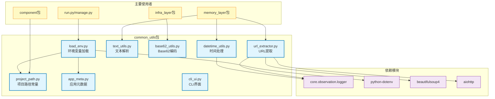

# common_utils

通用工具库，提供项目路径、时间处理、文本解析、URL提取、CLI界面、Base62编码等跨模块复用的基础工具函数

## 模块位置

**源码路径**: `src/common_utils/`
**文档路径**: `specs/ac_mod/common_utils.ac.mod.md`
**模块类型**: 包模块

## 目录结构

```
src/common_utils/
├── __init__.py              # 包初始化
├── project_path.py          # 项目路径常量（CURRENT_DIR, PROJECT_DIR）
├── load_env.py              # 环境变量加载器（.env文件）
├── app_meta.py              # 应用元数据管理（service_name等）
├── datetime_utils.py        # 时间日期处理工具（时区、ISO格式、时间戳）
├── text_utils.py            # 文本处理工具（智能截取、Token解析）
├── base62_utils.py          # Base62编码解码（ID短链接生成）
├── url_extractor.py         # URL元数据提取器（标题、描述、图片）
└── cli_ui.py                # CLI用户界面工具（表格、面板、颜色）
```

## 快速开始

### 基本使用方式

```python
# 1. 项目路径
from common_utils.project_path import CURRENT_DIR, PROJECT_DIR
print(CURRENT_DIR)  # /path/to/project/src
print(PROJECT_DIR)  # /path/to/project

# 2. 加载环境变量
from common_utils.load_env import load_env_file
load_env_file(".env", check_env_var="DATABASE_URL")

# 3. 时间处理
from common_utils.datetime_utils import get_now_with_timezone, to_iso_format, from_timestamp
now = get_now_with_timezone()  # datetime with Asia/Shanghai timezone
iso_str = to_iso_format(now)   # "2025-11-16T14:30:00+08:00"
dt = from_timestamp(1700000000)  # auto-detect seconds/milliseconds

# 4. 文本智能截取
from common_utils.text_utils import SmartTextParser
parser = SmartTextParser()
text = "这是一段包含emoji😊和English的混合文本"
tokens = parser.parse(text)
truncated = parser.smart_truncate_by_score(text, max_score=50.0)

# 5. Base62编码
from common_utils.base62_utils import generate_short_code, extract_id_from_short_code
short_code = generate_short_code(1000000)  # "4C92"
original_id = extract_id_from_short_code("4C92")  # 1000000

# 6. URL元数据提取
from common_utils.url_extractor import URLExtractor
extractor = URLExtractor()
metadata = await extractor.extract_metadata("https://example.com")
# {"title": "...", "description": "...", "image": "..."}

# 7. CLI界面
from common_utils.cli_ui import CLIUI
ui = CLIUI()
ui.banner("🧠 EverMem", subtitle="Memory-Enhanced Chat")
ui.table(headers=["ID", "Name", "Count"], rows=[["1", "Test", "10"]])
```

### 工具函数概览

| 模块 | 核心功能 | 典型使用场景 |
|------|----------|--------------|
| project_path | 项目目录常量 | 配置文件路径、日志路径 |
| load_env | 环境变量加载 | 应用启动时加载.env |
| app_meta | 应用元数据存储 | service_name、全局配置 |
| datetime_utils | 时间处理 | 时区转换、ISO格式化、时间戳 |
| text_utils | 文本解析 | 智能截取、CJK字符处理 |
| base62_utils | Base62编码 | ID短链接、邀请码生成 |
| url_extractor | URL内容提取 | 网页元数据、链接预览 |
| cli_ui | CLI界面 | 终端表格、彩色输出 |

## 核心组件详解

### 1. project_path.py - 项目路径常量

**核心功能：**
- 提供项目根目录和src目录的绝对路径常量
- 无任何外部依赖，可被任何模块安全导入

**常量定义：**
```python
CURRENT_DIR = Path(__file__).parent.parent  # src目录
PROJECT_DIR = CURRENT_DIR.parent            # 项目根目录
```

**使用示例：**
```python
from common_utils.project_path import CURRENT_DIR, PROJECT_DIR
from pathlib import Path

# 构建配置文件路径
config_path = CURRENT_DIR / "config" / "llm.yaml"

# 构建日志文件路径
log_path = PROJECT_DIR / "logs" / "app.log"
```

### 2. load_env.py - 环境变量加载器

**核心功能：**
- 加载.env文件到环境变量
- 支持环境变量存在性校验
- 时区设置（TZ环境变量）

**主要函数：**
```python
def load_env_file(env_file_name=".env", check_env_var=None) -> bool:
    """
    加载.env文件

    Args:
        env_file_name: .env文件名
        check_env_var: 校验的环境变量名

    Returns:
        bool: 是否成功加载
    """

def reset_timezone():
    """重置时区为TZ环境变量或Asia/Shanghai"""
```

**使用示例：**
```python
from common_utils.load_env import load_env_file, reset_timezone

# 加载环境变量并校验DATABASE_URL存在
if load_env_file(".env", check_env_var="DATABASE_URL"):
    print("环境变量加载成功")

# 重置时区
reset_timezone()
```

### 3. app_meta.py - 应用元数据管理

**核心功能：**
- 全局单例字典存储应用元数据
- 提供service_name管理（用于日志、监控）
- 通用键值存储

**主要函数：**
```python
def set_service_name(name: str) -> None
def get_service_name() -> Optional[str]
def set_meta_data(key: str, value: any) -> None
def get_meta_data(key: str) -> Optional[any]
def get_all_meta_data() -> Dict
```

**使用示例：**
```python
from common_utils.app_meta import set_service_name, get_service_name

# 设置服务名称
set_service_name("evermem-api")

# 获取服务名称
service_name = get_service_name()  # "evermem-api"
```

### 4. datetime_utils.py - 时间日期处理

**核心功能：**
- 时区感知的时间处理（默认Asia/Shanghai）
- 自动识别秒级/毫秒级时间戳
- ISO格式转换

**主要函数：**
```python
def get_timezone() -> ZoneInfo
    """获取时区（从TZ环境变量或默认Asia/Shanghai）"""

def get_now_with_timezone() -> datetime
    """获取带时区的当前时间"""

def to_timezone(dt: datetime, tz: ZoneInfo = None) -> datetime
    """转换时区"""

def to_iso_format(dt: datetime) -> str
    """转换为ISO格式字符串（带时区）"""

def from_timestamp(timestamp: int | float) -> datetime
    """从时间戳转换（自动识别秒/毫秒）"""

def to_timestamp(dt: datetime) -> int
    """转换为秒级时间戳"""

def to_timestamp_ms(dt: datetime) -> int
    """转换为毫秒级时间戳"""
```

**使用示例：**
```python
from common_utils.datetime_utils import *

# 获取当前时间
now = get_now_with_timezone()
# datetime(2025, 11, 16, 14, 30, 0, tzinfo=ZoneInfo('Asia/Shanghai'))

# ISO格式化
iso_str = to_iso_format(now)
# "2025-11-16T14:30:00+08:00"

# 时间戳转换（自动识别精度）
dt1 = from_timestamp(1700000000)      # 秒级
dt2 = from_timestamp(1700000000000)   # 毫秒级（自动除以1000）

# 生成时间戳
ts = to_timestamp(now)         # 1700000000
ts_ms = to_timestamp_ms(now)   # 1700000000000
```

### 5. text_utils.py - 文本处理工具

**核心功能：**
- 智能文本解析（区分CJK字符、英文单词、数字等）
- 基于权重的智能截取
- Emoji对齐的宽度计算

**核心类：**

**SmartTextParser（智能文本解析器）：**
```python
class SmartTextParser:
    def __init__(self, config: TokenConfig = None)

    def parse(self, text: str) -> List[Token]
        """解析文本为Token列表"""

    def smart_truncate_by_score(self, text: str, max_score: float) -> str
        """基于分数智能截取文本"""
```

**TokenType枚举：**
```python
class TokenType(Enum):
    CJK_CHAR = "cjk_char"              # 中日韩字符
    ENGLISH_WORD = "english_word"       # 英文单词
    CONTINUOUS_NUMBER = "continuous_number"  # 连续数字
    PUNCTUATION = "punctuation"         # 标点符号
    WHITESPACE = "whitespace"           # 空白字符
    OTHER = "other"                     # 其他字符
```

**使用示例：**
```python
from common_utils.text_utils import SmartTextParser, TokenConfig

# 自定义权重配置
config = TokenConfig(
    cjk_char_score=1.0,
    english_word_score=1.5,
    continuous_number_score=0.8
)

parser = SmartTextParser(config)

# 解析文本
text = "这是测试123 Hello World!"
tokens = parser.parse(text)
for token in tokens:
    print(f"{token.type}: {token.content} (score={token.score})")

# 智能截取（基于权重）
truncated = parser.smart_truncate_by_score(text, max_score=20.0)
```

### 6. base62_utils.py - Base62编码

**核心功能：**
- 数字ID转Base62短字符串（0-9a-zA-Z共62字符）
- 支持最小长度补零
- 短链接代码生成和验证

**主要函数：**
```python
def encode_base62(num: int) -> str
    """编码为Base62"""

def decode_base62(encoded: str) -> int
    """解码Base62为数字"""

def generate_short_code(id_value: int, min_length: int = 4) -> str
    """生成短链接代码（不足补零）"""

def is_valid_short_code(short_code: str) -> bool
    """验证短链接代码有效性"""

def extract_id_from_short_code(short_code: str) -> int
    """从短链接提取原始ID"""
```

**使用示例：**
```python
from common_utils.base62_utils import *

# 基础编解码
code = encode_base62(1000000)  # "4C92"
num = decode_base62("4C92")    # 1000000

# 生成短链接（最小4位）
short_code = generate_short_code(1)      # "0001"
short_code = generate_short_code(62)     # "0010"
short_code = generate_short_code(1000000) # "4C92"

# 验证和提取
if is_valid_short_code("4C92"):
    original_id = extract_id_from_short_code("4C92")  # 1000000
```

### 7. url_extractor.py - URL元数据提取器

**核心功能：**
- 异步HTTP请求获取网页内容
- 解析HTML提取title、description、image
- 支持重定向和最终URL获取

**核心类：**
```python
class URLExtractor:
    def __init__(
        self,
        timeout: int = 10,
        max_content_length: int = 5 * 1024 * 1024,
        user_agent: str = "Mozilla/5.0..."
    )

    async def extract_metadata(self, url: str, need_redirect: bool = True) -> Dict[str, Any]
        """提取URL元数据"""
```

**返回结构：**
```python
{
    "title": "网页标题",
    "description": "网页描述",
    "image": "预览图URL",
    "original_url": "原始URL",
    "final_url": "重定向后的最终URL",
    "success": True
}
```

**使用示例：**
```python
from common_utils.url_extractor import URLExtractor

extractor = URLExtractor(timeout=10)
metadata = await extractor.extract_metadata("https://example.com")

print(f"标题: {metadata['title']}")
print(f"描述: {metadata['description']}")
print(f"图片: {metadata['image']}")
```

### 8. cli_ui.py - CLI用户界面工具

**核心功能：**
- 终端宽度自适应
- Emoji对齐的文本渲染
- 表格、面板、标题等组件
- ANSI颜色支持（可禁用）

**核心类：**
```python
class CLIUI:
    def __init__(self, width: int = None, enable_color: bool = None)

    def banner(self, title: str, subtitle: str = None)
        """横幅标题"""

    def section_heading(self, heading: str)
        """章节标题"""

    def table(self, headers: List[str], rows: List[List[str]])
        """表格输出"""

    def panel(self, content: str, title: str = None)
        """面板框"""

    def print(self, text: str, style: str = None)
        """彩色文本输出"""
```

**使用示例：**
```python
from common_utils.cli_ui import CLIUI

ui = CLIUI()

# 横幅标题
ui.banner("🧠 EverMem 记忆对话助手", subtitle="Memory-Enhanced Chat")

# 章节标题
ui.section_heading("📊 可用的群组对话")

# 表格
headers = ["#", "Group ID", "Name", "Messages"]
rows = [
    ["1", "g001", "Team Chat", "128"],
    ["2", "g002", "Project Discussion", "256"]
]
ui.table(headers=headers, rows=rows)

# 面板
ui.panel("这是一段重要信息", title="提示")

# 彩色文本
ui.print("成功完成操作", style="success")  # 绿色
ui.print("警告信息", style="warning")      # 黄色
ui.print("错误信息", style="error")        # 红色
```

## Mermaid 依赖图



## 依赖关系说明

### 对其他模块的依赖

**核心依赖：**
- `core.observation.logger` - 日志系统（datetime_utils、url_extractor）

**第三方库：**
- `python-dotenv` - .env文件解析
- `beautifulsoup4` - HTML解析（url_extractor）
- `aiohttp` - 异步HTTP客户端（url_extractor）
- `zoneinfo` - 时区支持（Python 3.9+标准库）

**Python标准库：**
- `pathlib` - 路径处理
- `datetime` - 时间处理
- `os/sys` - 系统操作
- `typing` - 类型注解
- `enum/dataclasses` - 数据结构

### 被依赖关系

**广泛使用：**
- `src/component/config_provider.py` - 使用project_path
- `src/memory_layer/` - 使用datetime_utils、text_utils、url_extractor
- `src/infra_layer/` - 使用base62_utils
- `src/run.py、src/manage.py、src/task.py` - 使用load_env

**验证命令：**
```bash
# 查找使用 common_utils 的模块
grep -r "from common_utils" src/ --include="*.py" | wc -l
# 输出：约15+个文件

# 具体使用分布
grep -r "from common_utils.project_path" src/ --include="*.py"
grep -r "from common_utils.datetime_utils" src/ --include="*.py"
grep -r "from common_utils.load_env" src/ --include="*.py"
```

**主要使用场景：**
1. **项目启动** - load_env加载环境变量
2. **配置管理** - project_path构建配置路径
3. **时间处理** - datetime_utils处理时区和时间戳
4. **文本解析** - text_utils智能截取记忆内容
5. **URL预览** - url_extractor提取链接元数据
6. **ID编码** - base62_utils生成短链接

## 可以验证模块可运行的测试命令

```bash
# 1. 检查基础导入
python -c "from common_utils.project_path import CURRENT_DIR, PROJECT_DIR; print('✅ 项目路径')"
python -c "from common_utils.app_meta import set_service_name, get_service_name; print('✅ 应用元数据')"

# 2. 测试环境变量加载
python -c "
from common_utils.load_env import load_env_file
result = load_env_file('.env')
print(f'✅ 环境变量加载: {result}')
"

# 3. 测试时间处理
python -c "
from common_utils.datetime_utils import get_now_with_timezone, to_iso_format, from_timestamp
now = get_now_with_timezone()
iso = to_iso_format(now)
dt = from_timestamp(1700000000)
print(f'✅ 时间处理: {iso}')
"

# 4. 测试Base62编码
python -c "
from common_utils.base62_utils import generate_short_code, extract_id_from_short_code
code = generate_short_code(1000000)
assert code == '4C92'
id_val = extract_id_from_short_code(code)
assert id_val == 1000000
print('✅ Base62编码测试通过')
"

# 5. 测试文本解析
python -c "
from common_utils.text_utils import SmartTextParser
parser = SmartTextParser()
text = '这是测试123 Hello'
tokens = parser.parse(text)
print(f'✅ 文本解析: {len(tokens)} tokens')
"

# 6. 测试URL提取（需要网络）
python -c "
import asyncio
from common_utils.url_extractor import URLExtractor

async def test():
    extractor = URLExtractor()
    # 测试无效URL，验证错误处理
    result = await extractor.extract_metadata('invalid-url')
    print('✅ URL提取器初始化成功')

asyncio.run(test())
"

# 7. 测试CLI界面
python -c "
from common_utils.cli_ui import CLIUI
ui = CLIUI()
ui.banner('测试', subtitle='Test')
ui.table(headers=['A', 'B'], rows=[['1', '2']])
print('✅ CLI界面测试通过')
"

# 8. 测试项目路径
python -c "
from common_utils.project_path import CURRENT_DIR, PROJECT_DIR
from pathlib import Path
assert isinstance(CURRENT_DIR, Path)
assert isinstance(PROJECT_DIR, Path)
assert CURRENT_DIR.name == 'src'
print(f'✅ 项目路径: {PROJECT_DIR}')
"

# 9. 运行单元测试（如果存在）
pytest src/common_utils/ -v
```
