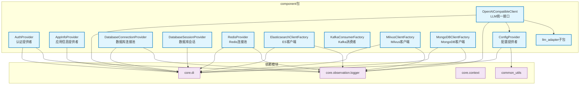

# component

基础设施组件层，提供认证、配置、数据库连接、缓存、消息队列、向量数据库等核心技术组件

## 模块位置

**源码路径**: `src/component/`
**文档路径**: `specs/ac_mod/component.ac.mod.md`
**模块类型**: 包模块

## 目录结构

```
src/component/
├── __init__.py                             # 包初始化
├── auth_provider.py                        # 认证提供者接口和实现
├── app_info_provider.py                    # 应用信息提供者（trace_id等）
├── config_provider.py                      # 配置文件加载器（YAML/JSON）
├── database_connection_provider.py         # PostgreSQL连接池+LangGraph检查点
├── database_session_provider.py            # SQLModel异步会话提供者
├── redis_provider.py                       # Redis连接池管理器
├── elasticsearch_client_factory.py         # Elasticsearch客户端工厂
├── kafka_consumer_factory.py               # Kafka消费者工厂
├── milvus_client_factory.py                # Milvus向量数据库客户端工厂
├── mongodb_client_factory.py               # MongoDB客户端工厂
├── openai_compatible_client.py             # OpenAI兼容客户端（统一LLM接口）
└── llm_adapter/                            # LLM适配器子包（详见 component.llm_adapter.ac.mod.md）
```

## 快速开始

### 基本使用方式

```python
from core.di import get_bean_by_name, get_bean_by_type
from component.auth_provider import AuthProvider
from component.config_provider import ConfigProvider
from component.redis_provider import RedisProvider
from component.database_session_provider import DatabaseSessionProvider

# 1. 获取配置提供者
config_provider = get_bean_by_name("config_provider")
llm_config = config_provider.get_config("llm")

# 2. 使用认证提供者
auth_provider = get_bean_by_name("auth_provider")
user_data = await auth_provider.get_optional_user_data_from_request(request)

# 3. 使用Redis客户端
redis_provider = get_bean_by_name("redis_provider")
redis_client = await redis_provider.get_client()
await redis_client.set("key", "value", ex=3600)

# 4. 使用数据库会话
db_session_provider = get_bean_by_type(DatabaseSessionProvider)
async with db_session_provider.get_async_session() as session:
    result = await session.execute("SELECT 1")
```

### 核心组件概览

| 组件 | 功能 | DI名称 |
|------|------|--------|
| AuthProvider | HTTP请求认证，提取user_id/role | `auth_provider` |
| AppInfoProvider | 提取trace_id等应用上下文 | `app_info_provider` |
| ConfigProvider | 加载YAML/JSON配置 | `config_provider` |
| DatabaseConnectionProvider | PostgreSQL连接池+检查点 | `database_connection_provider` |
| DatabaseSessionProvider | SQLModel异步会话 | `database_session_provider` |
| RedisProvider | Redis连接池 | `redis_provider` |
| ElasticsearchClientFactory | ES客户端管理 | `elasticsearch_client_factory` |
| KafkaConsumerFactory | Kafka消费者管理 | - |
| MilvusClientFactory | Milvus客户端管理 | `milvus_client_factory` |
| MongoDBClientFactory | MongoDB客户端管理 | `mongodb_client_factory` |
| OpenAICompatibleClient | 统一LLM调用接口 | `openai_compatible_client` |

## 核心组件详解

### 1. AuthProvider - 认证提供者

**核心功能：**
- 从HTTP请求header中提取用户认证信息
- 支持可选认证（get_optional_user_data_from_request）
- 返回user_id和role信息

**主要方法：**
- `get_optional_user_data_from_request(request)`: 提取用户数据，失败返回None

**实现说明：**
```python
# 默认实现：TestAuthProviderImpl
# 从Authorization header中提取user_id（格式: "Bearer {user_id}"）
# 角色固定为USER，可扩展为JWT解析
```

### 2. AppInfoProvider - 应用信息提供者

**核心功能：**
- 从HTTP请求中提取应用级别上下文
- 自动生成或传递trace_id用于链路追踪

**主要方法：**
- `get_context_data_from_request(request)`: 返回包含trace_id的字典

### 3. ConfigProvider - 配置提供者

**核心功能：**
- 加载config目录下的YAML/JSON配置文件
- 内置缓存机制，避免重复读取
- 支持获取原始文本内容

**主要方法：**
- `get_config(config_name)`: 加载配置文件（无需扩展名）
- `get_raw_config(config_name)`: 获取原始文本内容（需扩展名）
- `get_available_configs()`: 列出所有配置文件

**使用示例：**
```python
config_provider = get_bean_by_name("config_provider")
# 加载 config/llm.yaml
llm_config = config_provider.get_config("llm")
# 获取原始Prompt文本
prompt_text = config_provider.get_raw_config("prompts/system.txt")
```

### 4. DatabaseConnectionProvider - 数据库连接提供者

**核心功能：**
- 管理PostgreSQL异步连接池（psycopg3）
- 提供LangGraph的AsyncPostgresSaver检查点保存器
- 自动时区配置（默认Asia/Shanghai）

**主要方法：**
- `get_connection_pool()`: 获取psycopg连接池
- `get_checkpointer()`: 获取LangGraph检查点保存器
- `get_connection_and_checkpointer()`: 同时获取两者
- `close()`: 关闭连接池

**配置参数（环境变量）：**
- `DATABASE_URL`: PostgreSQL连接字符串
- `CHECKPOINTER_DB_POOL_SIZE`: 连接池大小（默认20）
- `TZ`: 时区（默认Asia/Shanghai）

### 5. DatabaseSessionProvider - 数据库会话提供者

**核心功能：**
- 提供SQLModel异步会话（基于asyncpg驱动）
- 连接池管理和自动回收
- 时区配置

**主要方法：**
- `create_session()`: 创建新会话
- `get_async_session()`: 获取会话上下文管理器（推荐）

**配置参数（环境变量）：**
- `DATABASE_URL`: PostgreSQL连接字符串
- `DB_POOL_SIZE`: 连接池大小（默认40）
- `DB_MAX_OVERFLOW`: 最大溢出连接（默认25）
- `DB_POOL_RECYCLE`: 连接回收时间/秒（默认300）

**使用示例：**
```python
db_provider = get_bean_by_type(DatabaseSessionProvider)
async with db_provider.get_async_session() as session:
    result = await session.execute(select(User).where(User.id == 1))
    user = result.scalar_one_or_none()
```

### 6. RedisProvider - Redis连接提供者

**核心功能：**
- 管理Redis异步连接池
- 支持命名客户端（多实例场景）
- 支持SSL连接

**主要方法：**
- `get_client(name=None)`: 获取Redis客户端（默认或命名）
- `close_client(name=None)`: 关闭指定客户端
- `close_all()`: 关闭所有客户端

**配置参数（环境变量）：**
- `REDIS_HOST`: Redis主机（默认localhost）
- `REDIS_PORT`: 端口（默认6379）
- `REDIS_DB`: 数据库编号（默认0）
- `REDIS_PASSWORD`: 密码
- `REDIS_SSL`: 是否启用SSL（默认false）
- `REDIS_MAX_CONNECTIONS`: 最大连接数（默认60）

### 7. ElasticsearchClientFactory - ES客户端工厂

**核心功能：**
- 管理Elasticsearch异步客户端
- 支持索引自动初始化和重建
- 基于elasticsearch-dsl封装

**主要方法：**
- `get_client(alias)`: 获取指定别名的ES客户端
- `initialize_index(doc_class)`: 初始化文档索引
- `rebuild_index(doc_class)`: 重建索引

### 8. MilvusClientFactory - Milvus客户端工厂

**核心功能：**
- 管理Milvus向量数据库连接
- 支持集合自动初始化

**主要方法：**
- `get_client()`: 获取Milvus客户端
- `initialize_collection(...)`: 创建或加载集合

**配置参数（环境变量）：**
- `MILVUS_URI`: Milvus服务地址

### 9. MongoDBClientFactory - MongoDB客户端工厂

**核心功能：**
- 管理MongoDB异步客户端
- 支持数据库和集合快速访问
- 索引自动创建

**主要方法：**
- `get_client()`: 获取MongoDB客户端
- `get_database(db_name=None)`: 获取数据库
- `get_collection(collection_name, db_name=None)`: 获取集合

**配置参数（环境变量）：**
- `MONGODB_URI`: MongoDB连接字符串
- `MONGODB_DATABASE`: 默认数据库名

### 10. OpenAICompatibleClient - OpenAI兼容客户端

**核心功能：**
- 统一LLM调用接口（支持OpenAI、Anthropic、Gemini）
- 自动适配器选择（基于配置）
- 流式和非流式响应支持

**主要方法：**
- `chat_completion(request)`: 执行聊天补全
- `get_available_models()`: 获取可用模型列表

**使用示例：**
```python
from component.openai_compatible_client import OpenAICompatibleClient
from component.llm_adapter.llm.message import ChatMessage, MessageRole
from component.llm_adapter.llm.completion import ChatCompletionRequest

client = get_bean_by_name("openai_compatible_client")
request = ChatCompletionRequest(
    messages=[ChatMessage(role=MessageRole.USER, content="你好")],
    model="gpt-4",
    temperature=0.7
)
response = await client.chat_completion(request)
print(response.choices[0]["message"]["content"])
```

## Mermaid 依赖图



## 依赖关系说明

### 对其他模块的依赖

**核心依赖：**
- `core.di` - 依赖注入框架（@component装饰器）
- `core.observation.logger` - 日志系统
- `specs/ac_mod/common_utils.ac.mod.md` - 通用工具（project_path等）

**业务依赖：**
- `core.authorize.enums` - Role枚举（AuthProvider）
- `core.context` - 用户上下文管理

**子模块依赖：**
- `specs/ac_mod/component.llm_adapter.ac.mod.md` - LLM适配器框架

**第三方库：**
- `fastapi` - HTTP请求处理
- `redis` - Redis异步客户端
- `psycopg/psycopg_pool` - PostgreSQL异步驱动
- `sqlmodel/sqlalchemy` - ORM框架
- `elasticsearch/elasticsearch-dsl` - ES客户端
- `pymilvus` - Milvus SDK
- `motor` - MongoDB异步驱动
- `kafka-python-ng` - Kafka客户端
- `openai/anthropic/google-generativeai` - LLM SDK

### 被依赖关系

**广泛使用：**
- `src/core/middleware/*_middleware.py` - 中间件层（注入认证、数据库会话等）
- `src/core/lifespan/*_lifespan.py` - 生命周期管理（初始化各类客户端）
- `src/core/queue/` - 消息队列管理器
- `src/memory_layer/` - 记忆层存储（MongoDB、Milvus等）
- `src/infra_layer/adapters/input/api/` - API控制器（认证、配置等）
- `src/agentic_layer/` - Agent层（LLM调用）

**验证命令：**
```bash
# 查找使用 component 包的模块
grep -r "from component" src/ --include="*.py" | head -20
```

## 可以验证模块可运行的测试命令

```bash
# 检查模块导入
python -c "from component.auth_provider import AuthProvider; print('✅ AuthProvider')"
python -c "from component.config_provider import ConfigProvider; print('✅ ConfigProvider')"
python -c "from component.redis_provider import RedisProvider; print('✅ RedisProvider')"
python -c "from component.database_session_provider import DatabaseSessionProvider; print('✅ DatabaseSessionProvider')"

# 测试配置提供者
python -c "
from component.config_provider import ConfigProvider
from common_utils.project_path import CURRENT_DIR
provider = ConfigProvider()
configs = provider.get_available_configs()
print(f'✅ 找到 {len(configs)} 个配置文件')
"

# 测试Redis连接（需要环境变量）
python -c "
import asyncio
from component.redis_provider import RedisProvider
async def test():
    provider = RedisProvider()
    client = await provider.get_client()
    await client.ping()
    print('✅ Redis连接成功')
asyncio.run(test())
"

# 测试数据库会话（需要环境变量）
python -c "
import asyncio
from component.database_session_provider import DatabaseSessionProvider
async def test():
    provider = DatabaseSessionProvider()
    async with provider.get_async_session() as session:
        result = await session.execute('SELECT 1')
        print('✅ 数据库连接成功')
asyncio.run(test())
"

# 运行整体测试（如果存在）
pytest src/component/ -v -k "not integration"
```
