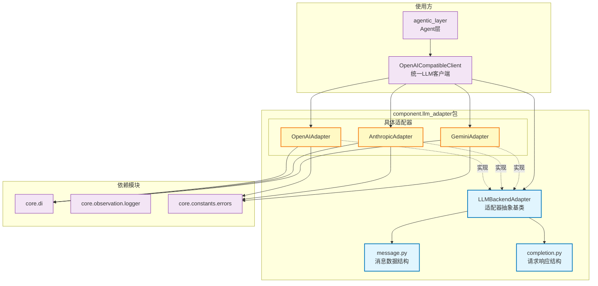

# component.llm_adapter

LLM适配器框架，提供统一的大语言模型调用接口，支持OpenAI、Anthropic、Gemini等多种LLM后端

## 模块位置

**源码路径**: `src/component/llm_adapter/`
**文档路径**: `specs/ac_mod/component.llm_adapter.ac.mod.md`
**模块类型**: 包模块

## 目录结构

```
src/component/llm_adapter/
├── __init__.py          # 包初始化
└── llm/                 # LLM适配器具体实现（详见 component.llm_adapter.llm.ac.mod.md）
    ├── __init__.py
    ├── llm_backend_adapter.py      # LLM后端适配器抽象基类
    ├── message.py                  # 聊天消息数据结构
    ├── completion.py               # 聊天完成请求/响应数据结构
    ├── openai_adapter.py           # OpenAI适配器实现
    ├── anthropic_adapter.py        # Anthropic Claude适配器实现
    ├── gemini_adapter.py           # Google Gemini适配器实现
    ├── gemini_client.py            # Gemini客户端封装
    └── ...                         # 其他适配器实现
```

## 快速开始

### 基本使用方式

```python
from component.llm_adapter.llm.llm_backend_adapter import LLMBackendAdapter
from component.llm_adapter.llm.openai_adapter import OpenAIAdapter
from component.llm_adapter.llm.anthropic_adapter import AnthropicAdapter
from component.llm_adapter.llm.gemini_adapter import GeminiAdapter
from component.llm_adapter.llm.message import ChatMessage, MessageRole
from component.llm_adapter.llm.completion import ChatCompletionRequest

# 1. 创建适配器实例（通常由OpenAICompatibleClient自动选择）
config = {
    "api_key": "your-api-key",
    "base_url": "https://api.openai.com/v1",
    "models": ["gpt-4", "gpt-3.5-turbo"]
}
adapter = OpenAIAdapter(config)

# 2. 构建聊天请求
messages = [
    ChatMessage(role=MessageRole.SYSTEM, content="你是一个有用的助手"),
    ChatMessage(role=MessageRole.USER, content="你好，介绍一下自己")
]
request = ChatCompletionRequest(
    messages=messages,
    model="gpt-4",
    temperature=0.7,
    max_tokens=1000,
    stream=False
)

# 3. 执行聊天补全
response = await adapter.chat_completion(request)
print(response.choices[0]["message"]["content"])

# 4. 流式响应
request.stream = True
stream_gen = await adapter.chat_completion(request)
async for chunk in stream_gen:
    print(chunk, end="", flush=True)
```

### 推荐使用方式（通过OpenAICompatibleClient）

```python
from core.di import get_bean_by_name
from component.llm_adapter.llm.message import ChatMessage, MessageRole
from component.llm_adapter.llm.completion import ChatCompletionRequest

# 使用统一客户端（自动选择适配器）
client = get_bean_by_name("openai_compatible_client")

request = ChatCompletionRequest(
    messages=[ChatMessage(role=MessageRole.USER, content="你好")],
    model="gpt-4",  # 根据配置自动路由到对应适配器
    temperature=0.7
)

response = await client.chat_completion(request)
```

## 核心组件详解

### 1. LLMBackendAdapter - 适配器抽象基类

**核心功能：**
- 定义统一的LLM调用接口
- 所有具体适配器必须实现的抽象方法

**主要方法：**
- `chat_completion(request)`: 执行聊天补全（返回响应或流式生成器）
- `get_available_models()`: 获取可用模型列表

**设计模式：**
- 抽象基类（ABC）
- 策略模式（不同LLM后端使用不同策略）

### 2. 数据结构类

**ChatMessage（聊天消息）：**
```python
@dataclass
class ChatMessage:
    role: MessageRole  # SYSTEM, USER, ASSISTANT
    content: str

    def to_dict() -> Dict[str, str]
```

**ChatCompletionRequest（请求）：**
```python
@dataclass
class ChatCompletionRequest:
    messages: List[ChatMessage]
    model: Optional[str]
    temperature: Optional[float]
    max_tokens: Optional[int]
    top_p: Optional[float]
    frequency_penalty: Optional[float]
    presence_penalty: Optional[float]
    thinking_budget: Optional[int]  # 深度思考预算（Claude/Gemini）
    stream: bool = False
```

**ChatCompletionResponse（响应）：**
```python
class ChatCompletionResponse(BaseModel):
    id: str
    object: str
    created: int
    model: str
    choices: List[Dict[str, Any]]
    usage: Optional[Dict[str, Any]]
```

### 3. 支持的LLM后端

| 适配器 | 厂商 | 支持模型示例 | 特殊功能 |
|--------|------|--------------|---------|
| OpenAIAdapter | OpenAI | gpt-4, gpt-3.5-turbo | 标准OpenAI API |
| AnthropicAdapter | Anthropic | claude-3.5-sonnet, claude-sonnet-4 | Extended Thinking模式 |
| GeminiAdapter | Google | gemini-2.5-flash, gemini-2.0-flash | ThinkingConfig支持 |

### 4. llm子包架构

**包含组件：**
- `llm_backend_adapter.py`: 抽象基类
- `message.py`: 消息数据结构（MessageRole枚举、ChatMessage）
- `completion.py`: 请求/响应数据结构
- `*_adapter.py`: 各厂商具体实现
- `gemini_client.py`: Gemini专用客户端封装

**详细文档：**
- 参见 `specs/ac_mod/component.llm_adapter.llm.ac.mod.md`

## Mermaid 依赖图



## 依赖关系说明

### 对其他模块的依赖

**核心依赖：**
- `core.di.decorators` - @service装饰器（适配器注册）
- `core.observation.logger` - 日志系统
- `core.constants.errors` - 错误消息枚举

**第三方库：**
- `openai` - OpenAI官方SDK
- `httpx` - Anthropic HTTP客户端
- `google.genai` - Google Generative AI SDK
- `pydantic` - 数据验证（ChatCompletionResponse）

### 被依赖关系

**直接使用：**
- `src/component/openai_compatible_client.py` - 统一LLM客户端（导入所有适配器）

**验证命令：**
```bash
# 查找使用 llm_adapter 的模块
grep -r "from component.llm_adapter" src/ --include="*.py"
# 输出：src/component/openai_compatible_client.py
```

**间接使用：**
- `src/agentic_layer/` - Agent层通过OpenAICompatibleClient调用
- `src/infra_layer/adapters/input/api/` - API层调用LLM服务

## 可以验证模块可运行的测试命令

```bash
# 检查模块导入
python -c "from component.llm_adapter.llm.llm_backend_adapter import LLMBackendAdapter; print('✅ LLMBackendAdapter')"
python -c "from component.llm_adapter.llm.message import ChatMessage, MessageRole; print('✅ Message')"
python -c "from component.llm_adapter.llm.completion import ChatCompletionRequest, ChatCompletionResponse; print('✅ Completion')"

# 检查适配器导入
python -c "from component.llm_adapter.llm.openai_adapter import OpenAIAdapter; print('✅ OpenAIAdapter')"
python -c "from component.llm_adapter.llm.anthropic_adapter import AnthropicAdapter; print('✅ AnthropicAdapter')"
python -c "from component.llm_adapter.llm.gemini_adapter import GeminiAdapter; print('✅ GeminiAdapter')"

# 测试消息数据结构
python -c "
from component.llm_adapter.llm.message import ChatMessage, MessageRole
msg = ChatMessage(role=MessageRole.USER, content='Hello')
print(f'✅ Message: {msg.to_dict()}')
"

# 测试请求数据结构
python -c "
from component.llm_adapter.llm.message import ChatMessage, MessageRole
from component.llm_adapter.llm.completion import ChatCompletionRequest
request = ChatCompletionRequest(
    messages=[ChatMessage(role=MessageRole.USER, content='Hi')],
    model='gpt-4',
    temperature=0.7
)
print(f'✅ Request dict keys: {list(request.to_dict().keys())}')
"

# 测试OpenAI适配器（需要API_KEY）
python -c "
import asyncio
from component.llm_adapter.llm.openai_adapter import OpenAIAdapter
from component.llm_adapter.llm.message import ChatMessage, MessageRole
from component.llm_adapter.llm.completion import ChatCompletionRequest

async def test():
    config = {'api_key': 'test-key', 'models': ['gpt-4']}
    adapter = OpenAIAdapter(config)
    print('✅ OpenAI适配器创建成功')
    models = adapter.get_available_models()
    print(f'✅ 可用模型: {models}')

asyncio.run(test())
"

# 运行单元测试（如果存在）
pytest src/component/llm_adapter/ -v
```
