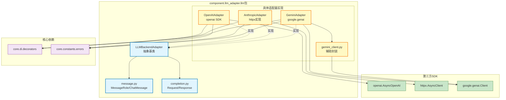

# component.llm_adapter.llm

LLM适配器具体实现层，包含OpenAI、Anthropic、Gemini等多种大语言模型的适配器实现

## 模块位置

**源码路径**: `src/component/llm_adapter/llm/`
**文档路径**: `specs/ac_mod/component.llm_adapter.llm.ac.mod.md`
**模块类型**: 包模块

## 目录结构

```
src/component/llm_adapter/llm/
├── __init__.py                     # 包初始化
├── llm_backend_adapter.py          # LLM后端适配器抽象基类（ABC）
├── message.py                      # 聊天消息数据结构（MessageRole, ChatMessage）
├── completion.py                   # 请求/响应数据结构（ChatCompletionRequest/Response）
├── openai_adapter.py               # OpenAI API适配器（基于openai官方包）
├── anthropic_adapter.py            # Anthropic Claude API适配器（httpx实现）
├── gemini_adapter.py               # Google Gemini API适配器（google.genai SDK）
└── gemini_client.py                # Gemini客户端辅助封装
```

## 快速开始

### 基本使用方式

```python
from component.llm_adapter.llm.message import ChatMessage, MessageRole
from component.llm_adapter.llm.completion import ChatCompletionRequest, ChatCompletionResponse
from component.llm_adapter.llm.openai_adapter import OpenAIAdapter
from component.llm_adapter.llm.anthropic_adapter import AnthropicAdapter
from component.llm_adapter.llm.gemini_adapter import GeminiAdapter

# 1. 创建消息
messages = [
    ChatMessage(role=MessageRole.SYSTEM, content="你是一个有用的助手"),
    ChatMessage(role=MessageRole.USER, content="解释量子纠缠")
]

# 2. 构建请求
request = ChatCompletionRequest(
    messages=messages,
    model="gpt-4",
    temperature=0.7,
    max_tokens=1000,
    stream=False
)

# 3. 使用OpenAI适配器
openai_config = {
    "api_key": "sk-...",
    "base_url": "https://api.openai.com/v1",
    "timeout": 600,
    "models": ["gpt-4", "gpt-3.5-turbo"]
}
openai_adapter = OpenAIAdapter(openai_config)
response = await openai_adapter.chat_completion(request)
print(response.choices[0]["message"]["content"])

# 4. 使用Anthropic适配器（Extended Thinking）
anthropic_config = {
    "api_key": "sk-ant-...",
    "base_url": "https://api.anthropic.com",
    "default_model": "claude-sonnet-4-20250514"
}
anthropic_adapter = AnthropicAdapter(anthropic_config)
request.model = "claude-sonnet-4-20250514"
request.thinking_budget = 10000  # 启用深度思考模式
response = await anthropic_adapter.chat_completion(request)

# 5. 使用Gemini适配器
gemini_config = {
    "api_key": "AIza...",
    "default_model": "gemini-2.5-flash"
}
gemini_adapter = GeminiAdapter(gemini_config)
request.model = "gemini-2.5-flash"
response = await gemini_adapter.chat_completion(request)

# 6. 流式响应
request.stream = True
stream_gen = await openai_adapter.chat_completion(request)
async for chunk in stream_gen:
    print(chunk, end="", flush=True)
```

## 核心组件详解

### 1. LLMBackendAdapter - 抽象基类

**源码：** `llm_backend_adapter.py`

**核心功能：**
- 定义统一的LLM调用接口规范
- 使用ABC（抽象基类）强制子类实现

**抽象方法：**
```python
@abstractmethod
async def chat_completion(
    self, request: ChatCompletionRequest
) -> Union[ChatCompletionResponse, AsyncGenerator[str, None]]:
    """执行聊天完成，返回响应或流式生成器"""
    pass

@abstractmethod
def get_available_models(self) -> List[str]:
    """获取可用模型列表"""
    pass
```

**设计模式：**
- 策略模式：不同LLM后端实现不同策略
- 模板方法：定义统一接口，子类实现具体逻辑

### 2. message.py - 消息数据结构

**核心组件：**

**MessageRole枚举：**
```python
class MessageRole(Enum):
    SYSTEM = "system"      # 系统指令
    USER = "user"          # 用户消息
    ASSISTANT = "assistant"  # 助手回复
```

**ChatMessage数据类：**
```python
@dataclass
class ChatMessage:
    role: MessageRole
    content: str

    def to_dict() -> Dict[str, str]:
        """转换为OpenAI标准格式"""
        return {"role": self.role.value, "content": self.content}
```

**使用示例：**
```python
system_msg = ChatMessage(role=MessageRole.SYSTEM, content="You are helpful")
user_msg = ChatMessage(role=MessageRole.USER, content="Hello")
# 转换为字典
msg_dict = user_msg.to_dict()  # {"role": "user", "content": "Hello"}
```

### 3. completion.py - 请求响应结构

**ChatCompletionRequest（请求）：**
```python
@dataclass
class ChatCompletionRequest:
    messages: List[ChatMessage]               # 对话消息列表
    model: Optional[str] = None               # 模型名称
    temperature: Optional[float] = None       # 温度（0-2）
    max_tokens: Optional[int] = None          # 最大token数
    top_p: Optional[float] = None             # 核采样参数
    frequency_penalty: Optional[float] = None # 频率惩罚
    presence_penalty: Optional[float] = None  # 存在惩罚
    thinking_budget: Optional[int] = None     # 深度思考预算（Claude/Gemini特性）
    stream: bool = False                      # 是否流式输出
```

**ChatCompletionResponse（响应）：**
```python
class ChatCompletionResponse(BaseModel, extra="allow"):
    id: str                              # 响应ID
    object: str                          # 对象类型
    created: int                         # 创建时间戳
    model: str                           # 使用的模型
    choices: List[Dict[str, Any]]        # 选择列表
    usage: Optional[Dict[str, Any]]      # Token使用统计
```

**响应结构示例：**
```python
{
    "id": "chatcmpl-xxx",
    "object": "chat.completion",
    "created": 1234567890,
    "model": "gpt-4",
    "choices": [{
        "index": 0,
        "message": {"role": "assistant", "content": "回复内容"},
        "finish_reason": "stop"
    }],
    "usage": {"prompt_tokens": 10, "completion_tokens": 20, "total_tokens": 30}
}
```

### 4. OpenAIAdapter - OpenAI适配器

**源码：** `openai_adapter.py`

**核心特性：**
- 基于openai官方SDK实现
- 支持自定义base_url（兼容OpenAI格式的API）
- 支持流式和非流式响应

**配置参数：**
```python
config = {
    "api_key": "sk-...",              # API密钥（或环境变量OPENAI_API_KEY）
    "base_url": "https://...",        # API地址（或环境变量OPENAI_BASE_URL）
    "timeout": 600,                   # 超时时间/秒
    "models": ["gpt-4", "gpt-3.5"]    # 可用模型列表
}
```

**实现细节：**
- 使用`openai.AsyncOpenAI`异步客户端
- 自动过滤None参数
- 流式响应返回AsyncGenerator[str, None]
- 非流式响应返回ChatCompletionResponse

### 5. AnthropicAdapter - Anthropic适配器

**源码：** `anthropic_adapter.py`

**核心特性：**
- 基于httpx实现（直接HTTP调用）
- 支持Extended Thinking模式（thinking_budget参数）
- 自动分离system消息

**配置参数：**
```python
config = {
    "api_key": "sk-ant-...",          # API密钥（或环境变量ANTHROPIC_API_KEY）
    "base_url": "https://api.anthropic.com",  # API地址
    "timeout": 60,                    # 超时时间/秒
    "max_retries": 3,                 # 最大重试次数
    "default_model": "claude-sonnet-4-20250514"
}
```

**Extended Thinking支持：**
```python
# 仅支持以下模型：
thinking_supported_models = [
    "claude-3-5-sonnet-20241022",
    "claude-3-7-sonnet-20241022",
    "claude-sonnet-4-20250514"
]

# 使用方式
request.thinking_budget = 10000  # 分配10000 token思考预算
request.thinking_budget = -1     # 无限制思考（不推荐）
```

**实现细节：**
- system消息单独提取到`data["system"]`字段
- 必须指定max_tokens（Anthropic要求）
- 支持流式响应（SSE格式解析）

### 6. GeminiAdapter - Gemini适配器

**源码：** `gemini_adapter.py`

**核心特性：**
- 基于google.genai SDK实现
- 支持ThinkingConfig配置
- 自动重试机制（max_retries）

**配置参数：**
```python
config = {
    "api_key": "AIza...",             # API密钥（或环境变量GEMINI_API_KEY）
    "max_retries": 3,                 # 最大重试次数
    "default_model": "gemini-2.5-flash"
}
```

**ThinkingConfig支持：**
```python
# 使用thinking_budget参数
request.thinking_budget = 5000  # 分配5000 token思考预算

# 内部转换为ThinkingConfig
thinking_config = ThinkingConfig(thinking_budget=5000)
generation_config = GenerateContentConfig(thinking_config=thinking_config)
```

**消息格式转换：**
```python
# 将ChatMessage转换为Gemini ContentDict格式
def _convert_messages_to_gemini_format(messages):
    # SYSTEM -> system_instruction
    # USER -> user role
    # ASSISTANT -> model role
```

### 7. gemini_client.py - Gemini客户端封装

**源码：** `gemini_client.py`

**核心功能：**
- 封装Gemini API调用细节
- 提供更友好的Python接口
- 处理Gemini特有的响应格式

## Mermaid 依赖图



## 依赖关系说明

### 对其他模块的依赖

**核心依赖：**
- `core.di.decorators` - @service装饰器
- `core.constants.errors` - ErrorMessage枚举

**第三方SDK：**
- `openai` - OpenAI官方Python SDK
- `httpx` - HTTP异步客户端（Anthropic）
- `google.genai` - Google Generative AI SDK
- `pydantic` - 数据验证框架

**Python标准库：**
- `abc` - 抽象基类
- `dataclasses` - 数据类装饰器
- `enum` - 枚举类型
- `typing` - 类型注解

### 被依赖关系

**直接使用：**
- `src/component/openai_compatible_client.py` - 统一LLM客户端

**验证命令：**
```bash
# 查找导入llm子包的代码
grep -r "from component.llm_adapter.llm" src/ --include="*.py"
# 输出：src/component/openai_compatible_client.py
```

**间接使用：**
- `src/agentic_layer/` - Agent层
- `src/infra_layer/adapters/input/api/` - API层

## 使用场景和最佳实践

### 场景1：标准LLM调用（OpenAI）

```python
from component.llm_adapter.llm.openai_adapter import OpenAIAdapter
from component.llm_adapter.llm.message import ChatMessage, MessageRole
from component.llm_adapter.llm.completion import ChatCompletionRequest

config = {"api_key": "sk-...", "models": ["gpt-4"]}
adapter = OpenAIAdapter(config)

request = ChatCompletionRequest(
    messages=[ChatMessage(role=MessageRole.USER, content="你好")],
    model="gpt-4",
    temperature=0.7
)

response = await adapter.chat_completion(request)
```

### 场景2：深度思考模式（Claude Extended Thinking）

```python
from component.llm_adapter.llm.anthropic_adapter import AnthropicAdapter

config = {"api_key": "sk-ant-...", "base_url": "https://api.anthropic.com"}
adapter = AnthropicAdapter(config)

request = ChatCompletionRequest(
    messages=[ChatMessage(role=MessageRole.USER, content="解决复杂数学问题")],
    model="claude-sonnet-4-20250514",
    thinking_budget=10000,  # 分配10000 token思考
    max_tokens=4096
)

response = await adapter.chat_completion(request)
# 响应中包含thinking过程和最终答案
```

### 场景3：流式输出

```python
request = ChatCompletionRequest(
    messages=[ChatMessage(role=MessageRole.USER, content="写一首诗")],
    model="gpt-4",
    stream=True  # 启用流式输出
)

stream_gen = await adapter.chat_completion(request)
async for chunk in stream_gen:
    print(chunk, end="", flush=True)
```

### 场景4：多适配器切换

```python
# 推荐使用OpenAICompatibleClient自动切换
from core.di import get_bean_by_name

client = get_bean_by_name("openai_compatible_client")

# 根据model参数自动路由到对应适配器
request.model = "gpt-4"  # -> OpenAIAdapter
request.model = "claude-sonnet-4-20250514"  # -> AnthropicAdapter
request.model = "gemini-2.5-flash"  # -> GeminiAdapter

response = await client.chat_completion(request)
```

## 可以验证模块可运行的测试命令

```bash
# 1. 检查基础导入
python -c "from component.llm_adapter.llm.llm_backend_adapter import LLMBackendAdapter; print('✅ 抽象基类')"
python -c "from component.llm_adapter.llm.message import ChatMessage, MessageRole; print('✅ 消息结构')"
python -c "from component.llm_adapter.llm.completion import ChatCompletionRequest, ChatCompletionResponse; print('✅ 请求响应结构')"

# 2. 检查适配器导入
python -c "from component.llm_adapter.llm.openai_adapter import OpenAIAdapter; print('✅ OpenAI适配器')"
python -c "from component.llm_adapter.llm.anthropic_adapter import AnthropicAdapter; print('✅ Anthropic适配器')"
python -c "from component.llm_adapter.llm.gemini_adapter import GeminiAdapter; print('✅ Gemini适配器')"

# 3. 测试消息数据结构
python -c "
from component.llm_adapter.llm.message import ChatMessage, MessageRole
msg = ChatMessage(role=MessageRole.USER, content='Hello')
assert msg.to_dict() == {'role': 'user', 'content': 'Hello'}
print('✅ 消息转换测试通过')
"

# 4. 测试请求数据结构
python -c "
from component.llm_adapter.llm.message import ChatMessage, MessageRole
from component.llm_adapter.llm.completion import ChatCompletionRequest
request = ChatCompletionRequest(
    messages=[ChatMessage(role=MessageRole.USER, content='Hi')],
    model='gpt-4',
    temperature=0.7,
    stream=False
)
data = request.to_dict()
assert 'messages' in data
assert 'model' in data
assert data['stream'] == False
print('✅ 请求转换测试通过')
"

# 5. 测试适配器初始化（不实际调用API）
python -c "
from component.llm_adapter.llm.openai_adapter import OpenAIAdapter
config = {'api_key': 'test-key', 'models': ['gpt-4']}
adapter = OpenAIAdapter(config)
models = adapter.get_available_models()
assert models == ['gpt-4']
print('✅ OpenAI适配器初始化成功')
"

# 6. 测试Anthropic适配器初始化
python -c "
from component.llm_adapter.llm.anthropic_adapter import AnthropicAdapter
config = {
    'api_key': 'test-key',
    'base_url': 'https://api.anthropic.com',
    'default_model': 'claude-sonnet-4-20250514'
}
adapter = AnthropicAdapter(config)
print('✅ Anthropic适配器初始化成功')
"

# 7. 测试Gemini适配器初始化
python -c "
from component.llm_adapter.llm.gemini_adapter import GeminiAdapter
config = {'api_key': 'test-key', 'default_model': 'gemini-2.5-flash'}
adapter = GeminiAdapter(config)
print('✅ Gemini适配器初始化成功')
"

# 8. 运行单元测试（如果存在）
pytest src/component/llm_adapter/llm/ -v
```
