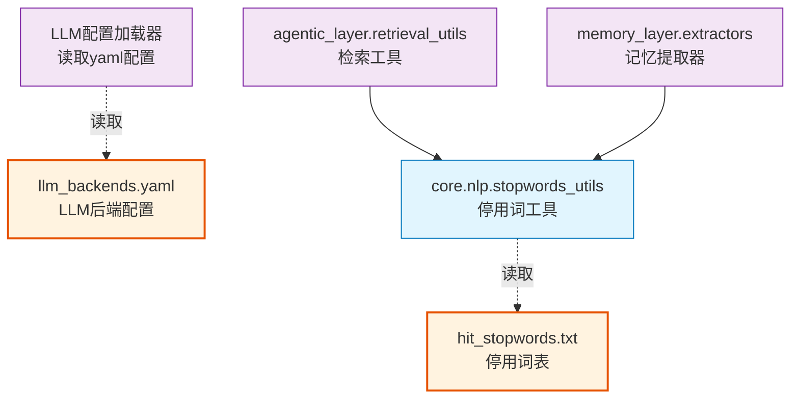

# config

配置包：提供LLM后端配置（多供应商）和停用词资源，支持OpenAI、Azure、Anthropic、Gemini等。

## 模块位置

**源码路径**: `src/config/`
**文档路径**: `specs/ac_mod/config.ac.mod.md`
**模块类型**: 包模块

## 目录结构

```
src/config/
├── __init__.py                     # 包初始化文件
├── llm_backends.yaml               # LLM后端配置文件（多供应商）
└── stopwords/                      # 停用词资源目录
    └── hit_stopwords.txt           # 哈工大停用词表（746个中文停用词）
```

## 快速开始

### 基本使用方式

#### 1. 读取LLM后端配置

```python
import yaml
from pathlib import Path

# 读取配置文件
config_path = Path("src/config/llm_backends.yaml")
with open(config_path, 'r', encoding='utf-8') as f:
    config = yaml.safe_load(f)

# 获取默认后端
default_backend = config['default_backend']  # "gemini"
print(f"Default backend: {default_backend}")

# 获取OpenAI配置
openai_config = config['llm_backends']['openai']
print(f"OpenAI base_url: {openai_config['base_url']}")
print(f"OpenAI model: {openai_config['model']}")  # "gpt-4o"

# 获取所有可用模型
for backend_name, backend_config in config['llm_backends'].items():
    models = backend_config.get('models', [])
    print(f"{backend_name}: {', '.join(models)}")
```

#### 2. 使用停用词过滤

```python
from pathlib import Path

# 读取停用词
stopwords_path = Path("src/config/stopwords/hit_stopwords.txt")
with open(stopwords_path, 'r', encoding='utf-8') as f:
    stopwords = set(line.strip() for line in f if line.strip())

print(f"Loaded {len(stopwords)} stopwords")  # 746个

# 过滤停用词
def filter_stopwords(words, stopwords_set):
    """过滤停用词"""
    return [w for w in words if w not in stopwords_set]

# 示例
words = ["这是", "一个", "测试", "的", "例子"]
filtered = filter_stopwords(words, stopwords)
print(f"Filtered: {filtered}")  # ['测试', '例子']
```

#### 3. 通过core.nlp使用停用词

```python
from core.nlp.stopwords_utils import filter_stopwords

# 使用内置的停用词过滤
words = ["这是", "一个", "测试", "的", "例子"]
filtered = filter_stopwords(words, min_length=1)
print(f"Filtered: {filtered}")
```

## 核心组件详解

### 1. llm_backends.yaml 配置文件

**功能**: 统一管理多个LLM供应商的配置，支持OpenAI、Azure、Anthropic、Gemini、Ollama等。

**配置结构：**
```yaml
llm_backends:
  <backend_name>:
    name: "显示名称"
    provider: "供应商类型"
    base_url: "API地址"
    api_key: "API密钥"
    models: ["模型列表"]
    model: "默认模型"
    timeout: 超时时间
    max_retries: 最大重试次数
    # Azure特有字段
    api_version: "API版本"

default_backend: "默认后端"

default_settings:
  temperature: 默认温度
  max_tokens: 最大token
  ...
```

**支持的后端：**

| 后端名称 | Provider | 默认模型 | 备注 |
|---------|---------|----------|------|
| **openai** | openai | gpt-4o | OpenAI官方API |
| **azure_openai** | azure | gpt-4 | Azure OpenAI服务 |
| **anthropic** | anthropic | claude-3-5-sonnet-20241022 | Claude系列 |
| **gemini** | gemini | gemini-2.5-flash | Google Gemini（默认后端） |
| **ollama** | ollama | llama2 | 本地Ollama服务 |
| **custom** | custom | custom-model-1 | 自定义OpenAI兼容API |
| **qwen_test** | custom | Qwen/Qwen3-14B-AWQ | Qwen测试环境 |

**默认配置：**
- `default_backend`: "gemini" - 主要用于论文解析
- `default_settings`:
  - `temperature`: 0.7
  - `max_tokens`: 50000
  - `top_p`: 1.0
  - `frequency_penalty`: 0
  - `presence_penalty`: 0
  - `thinking_budget`: -1

**OpenAI配置示例：**
```yaml
openai:
  name: "OpenAI"
  provider: "openai"
  base_url: "https://api.openai.com/v1"
  api_key: ""  # 需要配置
  models:
    - "gpt-4"
    - "gpt-4-turbo"
    - "gpt-3.5-turbo"
    - "gpt-4o"
    - "gpt-4o-mini"
  model: "gpt-4o"
  timeout: 600  # 10分钟，适合论文信息提取等耗时任务
  max_retries: 3
```

**Azure OpenAI配置示例：**
```yaml
azure_openai:
  name: "Azure OpenAI"
  provider: "azure"
  base_url: ""  # 需要配置Azure endpoint
  api_key: ""  # 需要配置
  api_version: "2024-02-15-preview"
  models:
    - "gpt-4"
    - "gpt-35-turbo"
  model: "gpt-4"
  timeout: 600
  max_retries: 3
```

**Gemini配置示例（默认后端）：**
```yaml
gemini:
  name: "Google Gemini"
  provider: "gemini"
  base_url: "https://generativelanguage.googleapis.com/v1beta"
  api_key: ""  # 需要配置
  models:
    - "gemini-2.0-flash"
    - "gemini-2.0-pro"
    - "gemini-2.5-flash"
    - "gemini-2.5-pro"
  model: "gemini-2.5-flash"
  timeout: 600
  max_retries: 3
```

**Qwen测试环境配置示例：**
```yaml
qwen_test:
  name: "Qwen Test Environment"
  provider: "custom"
  base_url: "http://10.241.132.72:9090/v1"
  api_key: "<empty>"  # 测试环境无需API密钥
  models:
    - "Qwen/Qwen3-14B-AWQ"
  model: "Qwen/Qwen3-14B-AWQ"
  timeout: 600
  max_retries: 3
  connect_timeout: 3
  temperature: 0.7
  max_tokens: 2000
```

### 2. 停用词资源（stopwords/）

**功能**: 提供中文停用词表，用于文本处理和检索。

**hit_stopwords.txt 说明：**
- **来源**: 哈工大停用词表（HIT Stopwords）
- **数量**: 746个中文停用词
- **编码**: UTF-8
- **格式**: 每行一个停用词
- **内容类别**:
  - 标点符号：、。《》等
  - 数字和特殊字符：0-9, $, _, ?等
  - 虚词：的、了、在、是、有等
  - 副词：都、也、就、还、又等
  - 连词：和、与、及、或者、以及等
  - 介词：从、自、以、为、对等
  - 代词：这、那、它、他、她等
  - 助词：着、了、过、的、地、得等

**停用词示例：**
```
$
0-9
、
。
一些
一切
不
不仅
不但
...
```

**使用场景：**
- **BM25检索**: agentic_layer/retrieval_utils.py中使用，过滤无意义词汇
- **关键词提取**: memory_layer中使用jieba分词后过滤停用词
- **文本预处理**: 通过core.nlp.stopwords_utils统一调用

## Mermaid 依赖图



## 依赖关系说明

### 对其他模块的依赖

**无直接代码依赖**：config包是纯配置和资源包，不导入其他模块。

**依赖的外部库：**
- YAML解析器（用于读取llm_backends.yaml）

### 被依赖关系

被以下模块使用：

**停用词资源使用者：**
- `core.nlp.stopwords_utils` - 封装停用词过滤工具
- `agentic_layer.retrieval_utils` - BM25检索中使用（通过filter_chinese_stopwords）
- `memory_layer.memory_extractor.*` - 各类记忆提取器使用停用词过滤

**LLM配置使用者：**
- 各类LLM Provider实现（读取配置文件获取backend配置）
- 论文解析、记忆提取等需要调用LLM的模块

## 可以验证模块可运行的测试命令

```bash
# 1. 检查配置文件格式
python -c "
import yaml
with open('src/config/llm_backends.yaml', 'r') as f:
    config = yaml.safe_load(f)
    print('✅ YAML格式正确')
    print(f'默认后端: {config[\"default_backend\"]}')
    print(f'支持的后端: {list(config[\"llm_backends\"].keys())}')
"

# 2. 读取并解析LLM配置
python -c "
import yaml
from pathlib import Path

config_path = Path('src/config/llm_backends.yaml')
with open(config_path, 'r') as f:
    config = yaml.safe_load(f)

# 打印所有后端
for name, backend in config['llm_backends'].items():
    print(f'{name}: {backend[\"model\"]} ({backend[\"provider\"]})')
"

# 3. 读取停用词
python -c "
from pathlib import Path

stopwords_path = Path('src/config/stopwords/hit_stopwords.txt')
with open(stopwords_path, 'r', encoding='utf-8') as f:
    stopwords = set(line.strip() for line in f if line.strip())

print(f'✅ 加载了 {len(stopwords)} 个停用词')
print(f'示例停用词: {list(stopwords)[:10]}')
"

# 4. 测试停用词过滤（通过core.nlp）
python -c "
from core.nlp.stopwords_utils import filter_stopwords

words = ['这是', '一个', '测试', '的', '例子', '包含', '停用词']
filtered = filter_stopwords(words, min_length=1)
print(f'原始词: {words}')
print(f'过滤后: {filtered}')
"

# 5. 检查配置目录结构
ls -la src/config/
ls -la src/config/stopwords/

# 6. 检查YAML文件行数和大小
wc -l src/config/llm_backends.yaml
du -h src/config/llm_backends.yaml

# 7. 检查停用词文件行数
wc -l src/config/stopwords/hit_stopwords.txt  # 应该是746行
```

## LLM后端配置对比表

| 后端 | Provider | 用途 | 默认模型 | 超时 | 备注 |
|------|----------|------|----------|------|------|
| **openai** | openai | 通用任务 | gpt-4o | 600s | OpenAI官方 |
| **azure_openai** | azure | 企业场景 | gpt-4 | 600s | 需要Azure订阅 |
| **anthropic** | anthropic | 长文本任务 | claude-3-5-sonnet | 600s | Claude系列 |
| **gemini** | gemini | 论文解析（默认） | gemini-2.5-flash | 600s | Google |
| **ollama** | ollama | 本地部署 | llama2 | 600s | 本地服务 |
| **qwen_test** | custom | 测试环境 | Qwen3-14B-AWQ | 600s | 内网测试 |

## 停用词过滤示例

```python
# 示例：使用停用词过滤中文文本
import jieba
from core.nlp.stopwords_utils import filter_stopwords

text = "这是一个关于机器学习的测试例子，包含了一些停用词。"

# 分词
words = list(jieba.cut(text))
print(f"分词结果: {words}")
# ['这是', '一个', '关于', '机器', '学习', '的', '测试', '例子', '，', '包含', '了', '一些', '停用词', '。']

# 过滤停用词
filtered = filter_stopwords(words, min_length=2)
print(f"过滤后: {filtered}")
# ['机器', '学习', '测试', '例子', '包含', '停用词']
```

## 注意事项

1. **API密钥安全**: llm_backends.yaml中的api_key默认为空字符串，需要通过环境变量或配置文件注入
2. **编码格式**: 停用词文件使用UTF-8编码，读取时需指定encoding='utf-8'
3. **配置覆盖**: 实际使用时，LLM配置通常通过环境变量覆盖yaml中的默认值
4. **停用词更新**: 如需更新停用词表，确保保持UTF-8编码和每行一个词的格式
5. **默认后端**: 当前默认后端为gemini（gemini-2.5-flash），主要用于论文解析等任务
6. **超时设置**: 所有后端timeout设置为600s（10分钟），适合论文信息提取等耗时任务
7. **停用词集合**: 使用时建议将停用词加载为set，提升过滤效率：`stopwords_set = set(stopwords)`
8. **版本管理**: Azure OpenAI的api_version为"2024-02-15-preview"，升级时需要更新
