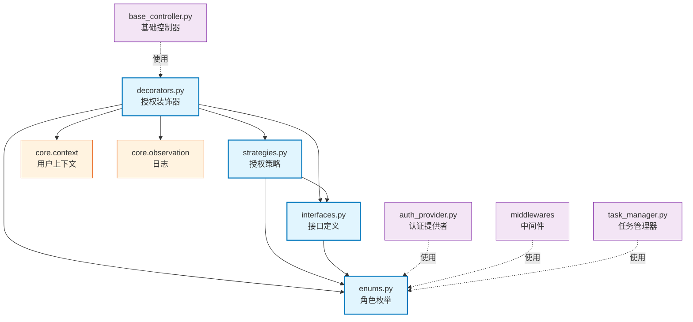

# core.authorize

基于角色的授权系统，支持匿名、用户、管理员、签名验证角色及自定义策略。

## 模块位置

**源码路径**: `src/core/authorize/`
**文档路径**: `specs/ac_mod/core.authorize.ac.mod.md`
**模块类型**: 包模块

## 目录结构

```
src/core/authorize/
├── __init__.py          # 包初始化，导出所有公共API
├── enums.py             # Role枚举定义
├── interfaces.py        # AuthorizationStrategy接口、AuthorizationContext
├── decorators.py        # 授权装饰器实现
└── strategies.py        # 授权策略实现
```

## 快速开始

### 基本使用

```python
from core.authorize import require_user, require_admin, Role
from core.authorize.decorators import authorize

# 1. 使用便捷装饰器
@require_user
async def user_endpoint():
    return {"msg": "需要登录"}

@require_admin
async def admin_endpoint():
    return {"msg": "需要管理员"}

# 2. 使用基础装饰器指定角色
@authorize(required_role=Role.USER)
async def protected_endpoint():
    return {"msg": "受保护"}

# 3. 自定义授权策略
from core.authorize import CustomAuthorizationStrategy, custom_authorize

def my_check(user_info, required_role, **kwargs):
    return user_info.get("department") == "engineering"

@custom_authorize(strategy=CustomAuthorizationStrategy(my_check))
async def custom_endpoint():
    return {"msg": "自定义检查"}
```

### 角色说明

| 角色 | 值 | 说明 |
|-----|-----|------|
| ANONYMOUS | "anonymous" | 匿名用户，无需登录 |
| USER | "user" | 普通用户 |
| ADMIN | "admin" | 超级管理员 |
| SIGNATURE | "signature" | HMAC签名验证用户 |

## 核心组件详解

### 1. Role 枚举

**位置**: `enums.py`
**功能**: 定义系统中所有用户角色

### 2. AuthorizationStrategy 接口

**位置**: `interfaces.py`
**核心方法**:
- `check_permission(user_info, required_role, **kwargs)`: 异步检查权限

### 3. AuthorizationContext

**位置**: `interfaces.py`
**功能**: 授权上下文，存储授权检查所需信息
- `user_info`: 用户信息
- `required_role`: 需要的角色
- `strategy`: 授权策略
- `need_auth()`: 检查是否需要授权

### 4. 授权装饰器

**位置**: `decorators.py`

| 装饰器 | 角色要求 | 说明 |
|--------|---------|------|
| `@authorize()` | 可配置 | 基础装饰器，支持自定义策略 |
| `@require_anonymous` | ANONYMOUS | 匿名访问 |
| `@require_user` | USER | 需要登录 |
| `@require_admin` | ADMIN | 需要管理员 |
| `@require_signature` | SIGNATURE | 需要签名验证 |
| `@custom_authorize()` | 自定义 | 使用自定义策略 |
| `@check_and_apply_default_auth` | USER | 无授权时自动应用USER |

**特性**:
- 支持同步和异步函数
- 自动获取当前用户信息（通过 `get_current_user_info()`）
- 授权失败抛出 HTTPException(403)

### 5. 授权策略

**位置**: `strategies.py`

**DefaultAuthorizationStrategy**
- 默认策略，严格角色匹配
- USER可访问USER资源，ADMIN可访问USER和ADMIN资源

**RoleBasedAuthorizationStrategy**
- 基于角色层级：ANONYMOUS(0) < USER(1) = SIGNATURE(1) < ADMIN(2)
- 高层级角色可访问低层级资源

**CustomAuthorizationStrategy**
- 接受自定义检查函数
- 支持同步和异步检查函数

## Mermaid 依赖图



## 依赖关系说明

### 对其他模块的依赖

**直接依赖**:
- `specs/ac_mod/core.context.ac.mod.md` - 获取当前用户信息
  - 使用: `decorators.py` 中 `get_current_user_info()` 获取用户信息进行授权检查
- `core.observation.logger` - 日志记录（暂无文档）
  - 使用: `decorators.py` 中记录授权成功/失败日志

**外部依赖**:
- `fastapi.HTTPException` - 授权失败时抛出403错误

### 被依赖关系

**使用授权装饰器**:
- `src/core/interface/controller/base_controller.py`
  - 使用 `require_user`, `require_anonymous`, `require_admin`, `require_signature`
  - 场景: 为API端点自动应用角色授权

**使用Role枚举**:
- `src/component/auth_provider.py` - 认证提供者设置用户角色
- `src/core/middleware/user_context_middleware.py` - 用户上下文中间件
- `src/core/middleware/hmac_signature_middleware.py` - HMAC签名中间件
- `src/core/asynctasks/task_manager.py` - 任务管理器检查任务权限

## 可以验证模块可运行的测试命令

```bash
# 测试导入
python -c "from core.authorize import Role, authorize, require_user; print('✅ 导入成功')"

# 测试Role枚举
python -c "from core.authorize import Role; print([r.value for r in Role])"

# 测试装饰器应用
python -c "
from core.authorize import require_user, authorize, Role
@require_user
async def test(): pass
print('✅ 装饰器应用成功')
print('has auth:', hasattr(test, '__authorization_context__'))
"

# 测试策略实例化
python -c "
from core.authorize.strategies import DefaultAuthorizationStrategy, RoleBasedAuthorizationStrategy
s1 = DefaultAuthorizationStrategy()
s2 = RoleBasedAuthorizationStrategy()
print('✅ 策略实例化成功')
"

# 直接运行模块测试
python -m pytest src/core/authorize/ -v 2>/dev/null || echo "⚠️ 无测试文件"
```
