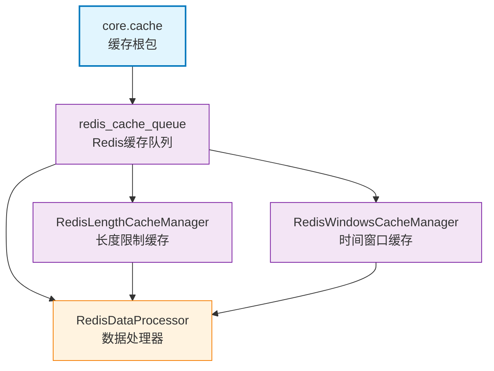

# core.cache

Core 缓存模块根包，提供各种缓存功能的公共组件。

## 模块位置

**源码路径**: `src/core/cache/`
**文档路径**: `specs/ac_mod/core.cache.ac.mod.md`
**模块类型**: 包模块

## 目录结构

```
src/core/cache/
├── __init__.py                          # 包初始化文件
└── redis_cache_queue/                   # Redis缓存队列子包
    ├── __init__.py                      # 子包初始化
    ├── redis_data_processor.py          # Redis数据序列化/反序列化处理器
    ├── redis_length_cache_manager.py    # 长度限制缓存管理器
    └── redis_windows_cache_manager.py   # 时间窗口缓存管理器
```

**注意**: 本文档保存在 `specs/ac_mod/` 目录下，不在包源码目录中。

## 快速开始

### 基本使用方式

```python
# 导入子模块
from core.cache.redis_cache_queue.redis_length_cache_manager import RedisLengthCacheFactory
from core.cache.redis_cache_queue.redis_windows_cache_manager import RedisWindowsCacheFactory
from component.redis_provider import RedisProvider

# 初始化 Redis 提供者
redis_provider = RedisProvider()

# 创建长度限制缓存管理器
length_cache_factory = RedisLengthCacheFactory(redis_provider)
length_cache_manager = await length_cache_factory.create_cache_manager(
    max_length=100,
    expire_minutes=60
)

# 追加数据
await length_cache_manager.append("user_actions", {"action": "login"})

# 创建时间窗口缓存管理器
windows_cache_factory = RedisWindowsCacheFactory(redis_provider)
windows_cache_manager = await windows_cache_factory.create_cache_manager(
    expire_minutes=10
)

# 追加数据
await windows_cache_manager.append("api_calls", {"method": "GET"})
```

### 子模块说明

- **redis_cache_queue**: Redis 缓存队列实现，包含数据处理器、长度限制缓存管理器、时间窗口缓存管理器

## 核心组件详解

### 1. redis_cache_queue 子包

**核心功能：**
- Redis 数据序列化/反序列化处理
- 基于长度限制的缓存队列管理
- 基于时间窗口的缓存队列管理
- 使用 Lua 脚本保证原子性操作

**主要组件：**
- `RedisDataProcessor`: 统一的数据序列化/反序列化处理器
- `RedisLengthCacheManager`: 长度限制缓存管理器，支持按长度清理
- `RedisWindowsCacheManager`: 时间窗口缓存管理器，支持按时间清理

详细文档参考: `specs/ac_mod/core.cache.redis_cache_queue.ac.mod.md`

## Mermaid 依赖图



## 依赖关系说明

### 对其他模块的依赖

通过 Grep 验证:
```bash
grep -r "from component.redis_provider" src/core/cache/
# src/core/cache/redis_cache_queue/redis_length_cache_manager.py
# src/core/cache/redis_cache_queue/redis_windows_cache_manager.py
```

- `component.redis_provider`: Redis 连接提供者，用于获取 Redis 客户端

### 被依赖关系

通过 Grep 验证:
```bash
grep -r "from core.cache" src/
```

目前无其他模块直接依赖此包（独立使用）。

## 可以验证模块可运行的测试命令

```bash
# 验证模块导入
python -c "from core.cache.redis_cache_queue import redis_data_processor; print(redis_data_processor)"

# 验证数据处理器
python -c "
from core.cache.redis_cache_queue.redis_data_processor import RedisDataProcessor
data = {'test': 'data'}
serialized = RedisDataProcessor.serialize_data(data)
deserialized = RedisDataProcessor.deserialize_data(serialized)
print(f'序列化测试: {deserialized}')
"

# 运行相关测试（如果存在）
pytest src/core/cache/ -v

# 检查 Lua 脚本注册
python -c "
from core.cache.redis_cache_queue.redis_length_cache_manager import LENGTH_CLEANUP_LUA_SCRIPT
print('长度清理脚本长度:', len(LENGTH_CLEANUP_LUA_SCRIPT))
"
```
