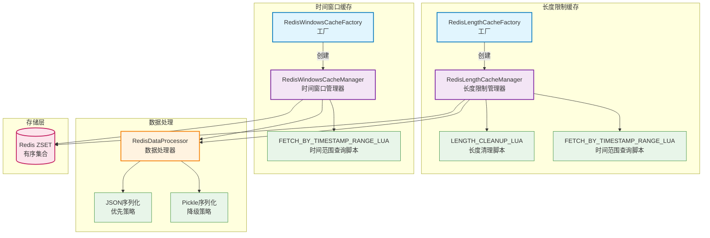

# core.cache.redis_cache_queue

基于 Redis Sorted Set 实现的缓存队列，支持长度限制和时间窗口管理。

## 模块位置

**源码路径**: `src/core/cache/redis_cache_queue/`
**文档路径**: `specs/ac_mod/core.cache.redis_cache_queue.ac.mod.md`
**模块类型**: 包模块

## 目录结构

```
src/core/cache/redis_cache_queue/
├── __init__.py                          # 包初始化（空文件）
├── redis_data_processor.py              # Redis数据序列化/反序列化处理器
├── redis_length_cache_manager.py        # 长度限制缓存管理器
└── redis_windows_cache_manager.py       # 时间窗口缓存管理器
```

## 快速开始

### 基本使用方式

```python
from core.cache.redis_cache_queue.redis_length_cache_manager import RedisLengthCacheFactory
from core.cache.redis_cache_queue.redis_windows_cache_manager import RedisWindowsCacheFactory
from component.redis_provider import RedisProvider
from datetime import datetime

# 初始化 Redis 提供者
redis_provider = RedisProvider()

# === 使用长度限制缓存管理器 ===
length_factory = RedisLengthCacheFactory(redis_provider)
length_cache = await length_factory.create_cache_manager(
    max_length=100,
    expire_minutes=60,
    cleanup_probability=0.1
)

# 追加数据（使用当前时间）
await length_cache.append("user_actions", {"action": "login", "user": "alice"})

# 追加数据（指定时间戳）
timestamp = int(datetime.now().timestamp() * 1000)
await length_cache.append("user_actions", {"action": "logout"}, timestamp=timestamp)

# 按时间范围查询
start_time = datetime.now().timestamp() * 1000 - 3600000  # 1小时前
results = await length_cache.get_by_timestamp_range("user_actions", start_timestamp=start_time)
for item in results:
    print(f"ID: {item['id']}, Data: {item['data']}, Time: {item['datetime']}")

# 获取队列统计
stats = await length_cache.get_queue_stats("user_actions")
print(f"队列大小: {stats['total_count']}, 是否满: {stats['is_full']}")

# === 使用时间窗口缓存管理器 ===
windows_factory = RedisWindowsCacheFactory(redis_provider)
windows_cache = await windows_factory.create_cache_manager(
    expire_minutes=10,
    cleanup_probability=0.1
)

# 追加数据
await windows_cache.append("api_calls", {"method": "GET", "path": "/api/users"})

# 按时间范围查询
results = await windows_cache.get_by_timestamp_range("api_calls", limit=10)
```

### 数据处理器独立使用

```python
from core.cache.redis_cache_queue.redis_data_processor import RedisDataProcessor

# JSON 序列化
data = {"name": "test", "value": 123}
serialized = RedisDataProcessor.serialize_data(data)
print(f"序列化结果: {serialized}")

# 反序列化
deserialized = RedisDataProcessor.deserialize_data(serialized)
print(f"反序列化结果: {deserialized}")

# 创建唯一成员
unique_member = RedisDataProcessor.create_unique_member(serialized)
print(f"唯一成员: {unique_member}")

# 解析成员数据
unique_id, raw_data = RedisDataProcessor.parse_member_data(unique_member)
print(f"唯一ID: {unique_id}, 原始数据: {raw_data}")
```

## 核心组件详解

### 1. RedisDataProcessor - 数据处理器

**源码**: `redis_data_processor.py`

**核心功能：**
- JSON 序列化（优先）：字符串格式，易读
- Pickle 序列化（降级）：二进制格式，支持复杂对象
- 自动检测反序列化类型
- 创建唯一成员标识符（UUID:数据）

**主要方法：**
- `serialize_data(data)`: 序列化数据，返回 str 或 bytes
- `deserialize_data(data)`: 反序列化数据，自动检测格式
- `create_unique_member(data)`: 创建唯一成员（uuid:data）
- `parse_member_data(member)`: 解析成员数据
- `process_data_for_storage(data)`: 处理数据以供存储（序列化+唯一ID）
- `process_data_from_storage(member)`: 处理从存储读取的数据（解析+反序列化）

**常量：**
- `UUID_LENGTH = 8`: UUID 截取长度
- `PICKLE_MARKER = b"__PICKLE__"`: Pickle 数据标识符

**序列化策略：**
1. 字符串直接返回
2. 优先尝试 JSON 序列化（返回字符串）
3. JSON 失败时使用 Pickle 序列化（返回带标识符的二进制数据）
4. 反序列化时自动检测格式

### 2. RedisLengthCacheManager - 长度限制缓存管理器

**源码**: `redis_length_cache_manager.py`

**核心功能：**
- 基于 Redis Sorted Set (ZSET) 实现
- Score: 时间戳（毫秒）
- Member: 唯一标识符:数据内容
- 按长度清理：从最早数据开始删除
- 队列过期时间：每次 append 续期

**配置常量：**
- `DEFAULT_MAX_LENGTH = 100`: 默认最大长度
- `DEFAULT_EXPIRE_MINUTES = 60`: 默认过期时间
- `DEFAULT_CLEANUP_PROBABILITY = 0.1`: 10% 概率执行清理

**主要方法：**
- `append(key, data, timestamp=None)`: 追加数据
- `get_queue_size(key)`: 获取队列大小
- `clear_queue(key)`: 清空队列
- `cleanup_excess(key)`: 手动清理超长数据
- `get_by_timestamp_range(key, start, end, limit)`: 按时间范围查询
- `get_queue_stats(key)`: 获取队列统计信息

**Lua 脚本：**
- `LENGTH_CLEANUP_LUA_SCRIPT`: 按长度清理数据（原子操作）
- `FETCH_BY_DATE_TIMESTAMP_RANGE_LUA_SCRIPT`: 按时间范围获取数据

**统计信息：**
```python
stats = {
    "key": "user_actions",
    "total_count": 45,
    "max_length": 100,
    "oldest_timestamp": 1700000000000,
    "newest_timestamp": 1700003600000,
    "oldest_datetime": "2023-11-15 10:00:00",
    "newest_datetime": "2023-11-15 11:00:00",
    "ttl_seconds": 3540,
    "is_full": False
}
```

### 3. RedisWindowsCacheManager - 时间窗口缓存管理器

**源码**: `redis_windows_cache_manager.py`

**核心功能：**
- 基于 Redis Sorted Set (ZSET) 实现
- Score: 当前时间戳（毫秒）
- Member: 唯一标识符:数据内容
- 按时间清理：清理过期数据
- 随机清理机制：避免内存无限增长

**配置常量：**
- `DEFAULT_EXPIRE_MINUTES = 10`: 默认过期时间
- `DEFAULT_CLEANUP_PROBABILITY = 0.1`: 10% 概率执行清理
- `DEFAULT_CLEANUP_MULTIPLIER = 2`: 清理阈值倍数

**主要方法：**
- `append(key, data, expire_minutes=None)`: 追加数据
- `get_queue_size(key)`: 获取队列大小
- `clear_queue(key)`: 清空队列
- `cleanup_expired(key)`: 手动清理过期数据
- `get_by_timestamp_range(key, start, end, limit)`: 按时间范围查询
- `get_queue_stats(key)`: 获取队列统计信息

**清理策略：**
- 清理阈值 = 当前时间 - (过期时间 × 倍数)
- 默认清理超过 20 分钟的数据（10分钟 × 2）

### 4. 工厂模式

**RedisLengthCacheFactory**:
```python
factory = RedisLengthCacheFactory(redis_provider)
manager = await factory.create_cache_manager(
    max_length=100,
    expire_minutes=60,
    cleanup_probability=0.1
)
```

**RedisWindowsCacheFactory**:
```python
factory = RedisWindowsCacheFactory(redis_provider)
manager = await factory.create_cache_manager(
    expire_minutes=10,
    cleanup_probability=0.1
)
```

## Mermaid 架构图



## 依赖关系说明

### 对其他模块的依赖

通过 Grep 验证:
```bash
grep -r "from component.redis_provider" src/core/cache/redis_cache_queue/
# redis_length_cache_manager.py:from component.redis_provider import RedisProvider
# redis_windows_cache_manager.py:from component.redis_provider import RedisProvider

grep -r "from core.observation.logger" src/core/cache/redis_cache_queue/
# redis_data_processor.py:from core.observation.logger import get_logger
# redis_length_cache_manager.py:from core.observation.logger import get_logger
# redis_windows_cache_manager.py:from core.observation.logger import get_logger
```

- `component.redis_provider.RedisProvider`: Redis 连接提供者
- `core.observation.logger.get_logger`: 日志记录器

### 被依赖关系

通过 Grep 验证:
```bash
grep -r "redis_data_processor\|redis_length_cache\|redis_windows_cache" src/
```

目前无其他模块直接依赖（独立使用）。

## 可以验证模块可运行的测试命令

```bash
# 1. 验证数据处理器
python -c "
from core.cache.redis_cache_queue.redis_data_processor import RedisDataProcessor

# 测试 JSON 序列化
data = {'test': 'value', 'number': 123}
serialized = RedisDataProcessor.serialize_data(data)
print(f'JSON序列化: {serialized}')
deserialized = RedisDataProcessor.deserialize_data(serialized)
print(f'反序列化: {deserialized}')

# 测试唯一成员
unique_member = RedisDataProcessor.create_unique_member(serialized)
print(f'唯一成员: {unique_member[:50]}...')

# 测试解析
uid, raw = RedisDataProcessor.parse_member_data(unique_member)
print(f'解析结果 - ID: {uid}, 数据长度: {len(raw)}')
"

# 2. 验证 Lua 脚本
python -c "
from core.cache.redis_cache_queue.redis_length_cache_manager import (
    LENGTH_CLEANUP_LUA_SCRIPT,
    FETCH_BY_DATE_TIMESTAMP_RANGE_LUA_SCRIPT
)
print(f'长度清理脚本行数: {len(LENGTH_CLEANUP_LUA_SCRIPT.splitlines())}')
print(f'时间范围查询脚本行数: {len(FETCH_BY_DATE_TIMESTAMP_RANGE_LUA_SCRIPT.splitlines())}')
"

# 3. 验证工厂模式
python -c "
from core.cache.redis_cache_queue.redis_length_cache_manager import RedisLengthCacheFactory
from core.cache.redis_cache_queue.redis_windows_cache_manager import RedisWindowsCacheFactory
print('工厂类导入成功')
print(f'长度缓存工厂: {RedisLengthCacheFactory}')
print(f'窗口缓存工厂: {RedisWindowsCacheFactory}')
"

# 4. 完整功能测试（需要 Redis）
python -c "
import asyncio
from core.cache.redis_cache_queue.redis_length_cache_manager import RedisLengthCacheFactory
from component.redis_provider import RedisProvider

async def test():
    redis_provider = RedisProvider()
    factory = RedisLengthCacheFactory(redis_provider)
    manager = await factory.create_cache_manager(max_length=10, expire_minutes=1)

    # 追加数据
    success = await manager.append('test_key', {'action': 'test'})
    print(f'追加成功: {success}')

    # 获取大小
    size = await manager.get_queue_size('test_key')
    print(f'队列大小: {size}')

    # 清空
    await manager.clear_queue('test_key')
    print('清空完成')

asyncio.run(test())
"

# 5. 运行测试套件（如果存在）
pytest src/core/cache/redis_cache_queue/ -v
```
