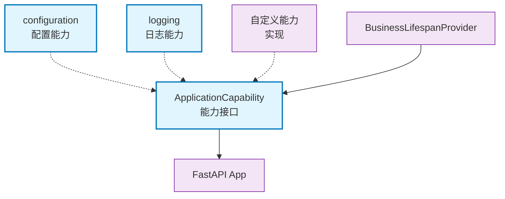

# core.capability

应用能力接口，定义可插拔的应用功能模块

## 模块位置

**源码路径**: `src/core/capability/`
**文档路径**: `specs/ac_mod/core.capability.ac.mod.md`
**模块类型**: 包模块

## 目录结构

```
src/core/capability/
├── __init__.py
├── app_capability.py               # 应用能力接口
├── configuration/                  # 配置能力子模块
│   └── __init__.py
└── logging/                        # 日志能力子模块
    └── __init__.py
```

## 快速开始

### 定义能力

```python
from core.capability.app_capability import ApplicationCapability
from core.di.decorators import component
from fastapi import FastAPI

@component(name="my_capability")
class MyCapability(ApplicationCapability):
    def enable(self, app: FastAPI):
        # 在应用上启用此能力
        print("启用自定义能力")
        app.state.my_feature = "enabled"
```

### 自动注册

```python
# 能力在BusinessLifespanProvider中自动注册
# 所有ApplicationCapability子类会被DI容器发现并启用

from core.di import get_beans_by_type
from core.capability.app_capability import ApplicationCapability

capabilities = get_beans_by_type(ApplicationCapability)
for capability in capabilities:
    capability.enable(app)
```

## 核心组件详解

### 1. ApplicationCapability

**功能**: 应用能力抽象基类

**必需方法**:
- `enable(app: FastAPI)`: 在应用上启用此能力

**设计模式**: 策略模式

**使用场景**:
- 中间件注册
- 异常处理器注册
- 静态文件服务
- CORS配置
- 认证配置
- 日志配置

### 2. 能力示例

**CORS能力**:
```python
@component(name="cors_capability")
class CORSCapability(ApplicationCapability):
    def enable(self, app: FastAPI):
        from fastapi.middleware.cors import CORSMiddleware
        app.add_middleware(
            CORSMiddleware,
            allow_origins=["*"],
            allow_methods=["*"],
            allow_headers=["*"]
        )
```

**静态文件能力**:
```python
@component(name="static_files_capability")
class StaticFilesCapability(ApplicationCapability):
    def enable(self, app: FastAPI):
        from fastapi.staticfiles import StaticFiles
        app.mount("/static", StaticFiles(directory="static"), name="static")
```

### 3. 生命周期集成

**自动启用**:
1. `BusinessLifespanProvider.startup()` 调用
2. `_register_capabilities(app)` 方法
3. 从DI容器获取所有 `ApplicationCapability`
4. 依次调用 `enable(app)`

**顺序**:
- 在控制器注册之后
- 在业务图创建之后

## Mermaid 依赖图



## 依赖关系说明

### 对其他模块的依赖

- `fastapi` - FastAPI应用实例
- `abc` - 抽象基类

### 被依赖关系

- `specs/ac_mod/core.lifespan.ac.mod.md` - BusinessLifespanProvider
- `specs/ac_mod/core.capability.configuration.ac.mod.md` - 配置能力
- `specs/ac_mod/core.capability.logging.ac.mod.md` - 日志能力
- 自定义能力实现

## 可以验证模块可运行的测试命令

```bash
# 检查模块导入
python -c "from core.capability.app_capability import ApplicationCapability; print('OK')"

# 查找所有能力实现
grep -r "class.*ApplicationCapability" src/

# 测试能力注册
python -c "
from fastapi import FastAPI
from core.capability.app_capability import ApplicationCapability
from core.di.decorators import component

@component(name='test_capability')
class TestCapability(ApplicationCapability):
    def enable(self, app):
        print('Capability enabled')

app = FastAPI()
capability = TestCapability()
capability.enable(app)
"

# 运行测试
pytest src/ -v -k capability
```
