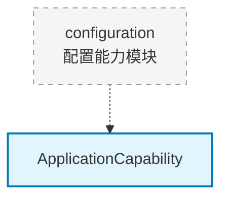

# core.capability.configuration

配置能力模块（预留），用于应用配置管理

## 模块位置

**源码路径**: `src/core/capability/configuration/`
**文档路径**: `specs/ac_mod/core.capability.configuration.ac.mod.md`
**模块类型**: 包模块

## 目录结构

```
src/core/capability/configuration/
└── __init__.py                     # 空初始化文件
```

## 快速开始

此模块当前为空模块，预留用于未来的配置管理功能。

### 预期用途

```python
# 未来可能的实现
from core.capability.configuration import ConfigurationCapability

@component(name="config_capability")
class ConfigurationCapability(ApplicationCapability):
    def enable(self, app: FastAPI):
        # 加载配置文件
        # 注册配置提供者
        # 设置环境变量
        pass
```

## 核心组件详解

### 当前状态

- 模块为空
- 仅包含 `__init__.py`
- 预留用于未来扩展

### 预期功能

**可能包含**:
- 配置文件加载（YAML/JSON/ENV）
- 配置验证
- 配置热加载
- 环境变量管理
- 配置覆盖策略

## Mermaid 依赖图



## 依赖关系说明

### 对其他模块的依赖

- `specs/ac_mod/core.capability.ac.mod.md` - 能力接口（预期）

### 被依赖关系

- 当前无

## 可以验证模块可运行的测试命令

```bash
# 检查模块导入
python -c "import core.capability.configuration; print('OK')"

# 查看模块内容
ls -la src/core/capability/configuration/
```
