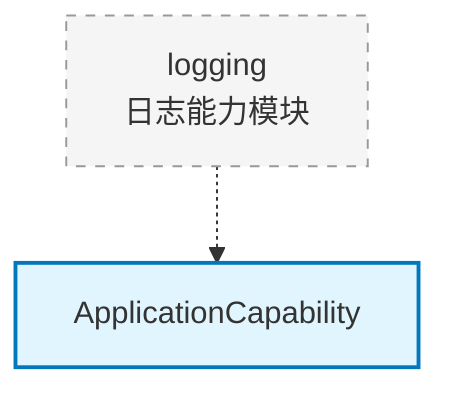

# core.capability.logging

日志能力模块（预留），用于应用日志配置

## 模块位置

**源码路径**: `src/core/capability/logging/`
**文档路径**: `specs/ac_mod/core.capability.logging.ac.mod.md`
**模块类型**: 包模块

## 目录结构

```
src/core/capability/logging/
└── __init__.py                     # 空初始化文件
```

## 快速开始

此模块当前为空模块，预留用于未来的日志配置功能。

### 预期用途

```python
# 未来可能的实现
from core.capability.logging import LoggingCapability

@component(name="logging_capability")
class LoggingCapability(ApplicationCapability):
    def enable(self, app: FastAPI):
        # 配置日志格式
        # 设置日志级别
        # 注册日志处理器
        # 配置日志轮转
        pass
```

## 核心组件详解

### 当前状态

- 模块为空
- 仅包含 `__init__.py`
- 预留用于未来扩展

### 预期功能

**可能包含**:
- 日志格式配置
- 日志级别管理
- 日志处理器注册
- 日志轮转策略
- 结构化日志支持
- 日志上下文管理

## Mermaid 依赖图



## 依赖关系说明

### 对其他模块的依赖

- `specs/ac_mod/core.capability.ac.mod.md` - 能力接口（预期）
- `core.observation.logger` - 日志工具（预期）

### 被依赖关系

- 当前无

## 可以验证模块可运行的测试命令

```bash
# 检查模块导入
python -c "import core.capability.logging; print('OK')"

# 查看模块内容
ls -la src/core/capability/logging/
```
