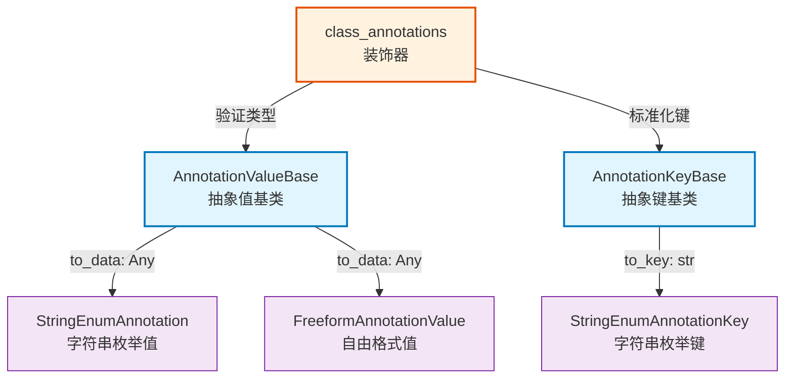
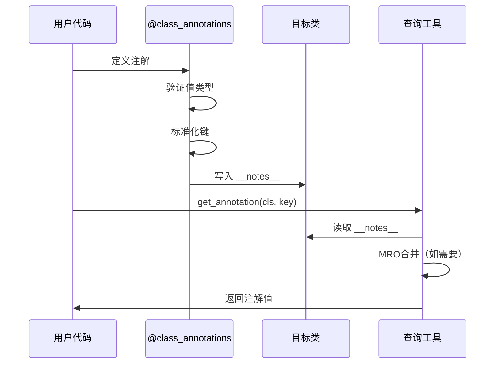

# core.class_annotations

类级注解系统，为Python类提供元数据附加、继承和查询能力。

## 模块位置

**源码路径**: `src/core/class_annotations/`
**文档路径**: `specs/ac_mod/core.class_annotations.ac.mod.md`
**模块类型**: 包模块

## 目录结构

```
src/core/class_annotations/
├── __init__.py          # 包标记文件
├── decorator.py         # @class_annotations 装饰器实现
├── types.py             # 注解类型基类和内置实现
└── utils.py             # 注解查询和访问工具函数
```

## 快速开始

### 基本使用

```python
from src.core.class_annotations.decorator import class_annotations
from src.core.class_annotations.types import FreeformAnnotationValue, StringEnumAnnotation
from src.core.class_annotations.utils import get_annotation, get_annotations, has_annotation

# 定义枚举注解
class Role(StringEnumAnnotation):
    ADMIN = "admin"
    USER = "user"

# 1. 使用装饰器附加注解
@class_annotations(owner=FreeformAnnotationValue("team-a"))
@class_annotations(role=Role.ADMIN)
class MyService:
    pass

# 2. 查询注解
role = get_annotation(MyService, "role")
print(role)  # Role.ADMIN

all_notes = get_annotations(MyService)
print(all_notes)  # {"owner": FreeformAnnotationValue(...), "role": Role.ADMIN}

# 3. 检查注解存在性
if has_annotation(MyService, "role"):
    print("Has role annotation")
```

### 继承场景

```python
@class_annotations(env=FreeformAnnotationValue("prod"))
class BaseService:
    pass

@class_annotations(region=FreeformAnnotationValue("us-west"))
class DerivedService(BaseService):
    pass

# 继承模式：子类继承父类注解，可覆盖
notes = get_annotations(DerivedService, include_inherited=True)
# {"env": FreeformAnnotationValue("prod"), "region": FreeformAnnotationValue("us-west")}

# 仅获取直接定义的注解
own_notes = get_annotations(DerivedService, include_inherited=False)
# {"region": FreeformAnnotationValue("us-west")}
```

### 自定义注解类型

```python
from src.core.class_annotations.types import (
    AnnotationKeyBase,
    AnnotationValueBase,
    StringEnumAnnotationKey
)

# 定义注解键枚举
class MyAnnotationKey(StringEnumAnnotationKey):
    READONLY = "odm.readonly"
    CACHED = "cache.enabled"

# 定义注解值枚举
class Toggle(StringEnumAnnotation):
    ENABLED = "enabled"
    DISABLED = "disabled"

# 使用自定义类型
@class_annotations({MyAnnotationKey.READONLY: Toggle.ENABLED})
class ReadOnlyModel:
    pass

readonly_flag = get_annotation(ReadOnlyModel, MyAnnotationKey.READONLY)
print(readonly_flag == Toggle.ENABLED)  # True
```

## 核心组件详解

### 1. decorator.py - 装饰器

**class_annotations(annotations=None, /, **kwargs)**

- **功能**: 类装饰器，将注解值附加到类的 `__notes__` 属性
- **参数**:
  - `annotations`: 字典映射，键为 `str` 或 `AnnotationKeyBase`，值为 `AnnotationValueBase` 实例
  - `**kwargs`: 键值对形式的注解，键为字符串
- **规则**:
  - 所有值必须是 `AnnotationValueBase` 子类实例
  - 支持多个装饰器堆叠，后者覆盖前者
  - 键可为字符串或实现 `AnnotationKeyBase` 的枚举

**内部函数**:
- `_ensure_notes_dict(cls)`: 确保类有 `__notes__` 字典属性
- `_normalize_key(key)`: 标准化键为字符串

### 2. types.py - 类型系统

**抽象基类**:
- `AnnotationValueBase`: 注解值基类
  - 抽象方法 `to_data()` → JSON可序列化数据
- `AnnotationKeyBase`: 注解键基类
  - 抽象方法 `to_key()` → 字符串键

**内置实现**:
- `FreeformAnnotationValue`: 灵活注解值，包装任意数据
  - `data` 属性: 访问原始数据
  - `to_data()` → `{"type": "freeform", "data": ...}`
- `StringEnumAnnotation`: 字符串枚举注解值（继承自 `str` 和 `Enum`）
  - `to_data()` → `{"type": "enum", "enum": 类名, "name": 枚举名, "value": 枚举值}`
- `StringEnumAnnotationKey`: 字符串枚举键
  - `to_key()` → 枚举的值字符串

### 3. utils.py - 查询工具

**get_annotations(target, *, include_inherited=True)**
- **功能**: 获取类或实例的所有注解
- **参数**:
  - `target`: 类或实例
  - `include_inherited`: 是否包含继承的注解（MRO顺序合并）
- **返回**: `Mapping[str, AnnotationValueBase]`

**get_annotation(target, key, *, include_inherited=True)**
- **功能**: 获取单个注解值
- **参数**:
  - `target`: 类或实例
  - `key`: 字符串或 `AnnotationKeyBase`
  - `include_inherited`: 是否包含继承的注解
- **返回**: `Optional[AnnotationValueBase]`

**has_annotation(target, key, *, include_inherited=True)**
- **功能**: 检查注解是否存在
- **返回**: `bool`

**内部函数**:
- `_collect_mro_notes(cls)`: 收集MRO链上的所有 `__notes__` 字典
- `_merged_notes(cls)`: 合并MRO链上的注解（子类覆盖父类）

## 架构设计

### 存储机制

注解存储在类的 `__notes__` 属性（`Dict[str, AnnotationValueBase]`），利用Python类属性机制：
- 装饰器阶段：`setattr(cls, "__notes__", {...})`
- 查询阶段：`getattr(cls, "__notes__", {})`
- MRO继承：通过 `cls.mro()` 遍历基类链合并注解

### 类型安全



### 工作流程



## 依赖关系说明

### 对其他模块的依赖

无项目内依赖，仅依赖Python标准库：
- `typing`: 类型注解
- `abc`: 抽象基类
- `enum`: 枚举类型

### 被依赖关系

通过Grep搜索验证：

**src/core/oxm/mongo/constant/annotations.py**
```python
from core.class_annotations.types import StringEnumAnnotationKey, StringEnumAnnotation

class ClassAnnotationKey(StringEnumAnnotationKey):
    READONLY = "odm.readonly"

class Toggle(StringEnumAnnotation):
    ENABLED = "enabled"
    DISABLED = "disabled"
```
- **用途**: 定义ODM层的注解键和值

**src/component/mongodb_client_factory.py**
```python
from core.class_annotations.utils import get_annotation
from core.oxm.mongo.constant.annotations import ClassAnnotationKey, Toggle

# 用于判断模型是否只读
readonly_flag = get_annotation(model, ClassAnnotationKey.READONLY)
if readonly_flag == Toggle.ENABLED:
    readonly_models.append(model)
```
- **用途**: 在Beanie初始化时区分只读/可写模型，决定是否跳过索引创建

## 测试命令

```bash
# 交互式验证
python -c "
from src.core.class_annotations.decorator import class_annotations
from src.core.class_annotations.types import FreeformAnnotationValue
from src.core.class_annotations.utils import get_annotation

@class_annotations(test=FreeformAnnotationValue('ok'))
class Demo:
    pass

assert get_annotation(Demo, 'test').data == 'ok'
print('✅ 基础功能验证通过')
"

# 继承验证
python -c "
from src.core.class_annotations.decorator import class_annotations
from src.core.class_annotations.types import FreeformAnnotationValue
from src.core.class_annotations.utils import get_annotations

@class_annotations(a=FreeformAnnotationValue('base'))
class Base:
    pass

@class_annotations(b=FreeformAnnotationValue('derived'))
class Derived(Base):
    pass

notes = get_annotations(Derived, include_inherited=True)
assert 'a' in notes and 'b' in notes
print('✅ 继承机制验证通过')
"

# 枚举验证
python -c "
from src.core.class_annotations.decorator import class_annotations
from src.core.class_annotations.types import StringEnumAnnotation
from src.core.class_annotations.utils import has_annotation

class Status(StringEnumAnnotation):
    ACTIVE = 'active'

@class_annotations(status=Status.ACTIVE)
class Model:
    pass

assert has_annotation(Model, 'status')
print('✅ 枚举类型验证通过')
"

# 直接运行模块（预期无输出，验证无语法错误）
python -m src.core.class_annotations.decorator
python -m src.core.class_annotations.types
python -m src.core.class_annotations.utils
```
