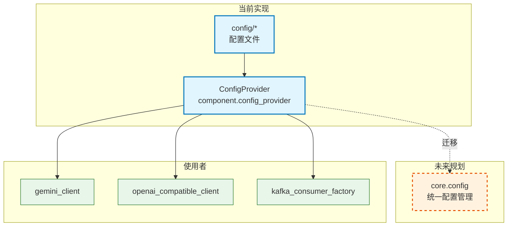

# core.config

配置管理包（占位），实际由 `component.config_provider.ConfigProvider` 实现。

## 模块位置

| 项目 | 路径 |
|------|------|
| 源码 | `src/core/config/` |
| 文档 | `specs/ac_mod/core.config.ac.mod.md` |
| 类型 | 包模块 |

## 目录结构

```
src/core/config/
└── __init__.py                 # todo 重构项目config
```

## 快速开始

### 使用 ConfigProvider（当前实现）

```python
from core.di import get_bean_by_type
from component.config_provider import ConfigProvider

config_provider = get_bean_by_type(ConfigProvider)

# YAML/JSON配置
config_data = config_provider.get_config("app_config")
db_host = config_data['database']['host']

# 原始文本
raw_text = config_provider.get_raw_config("prompt.txt")

# 可用配置列表
files = config_provider.get_available_configs()
```

## 核心组件

### ConfigProvider (`src/component/config_provider.py`)

| 方法 | 参数 | 返回 | 说明 |
|------|------|------|------|
| `get_config` | `config_name: str` | `Dict[str, Any]` | 加载YAML/JSON配置（无扩展名） |
| `get_raw_config` | `config_name: str` | `str` | 加载原始文本（含扩展名） |
| `get_available_configs` | - | `list` | 列出config目录所有文件 |

**特性**:
- 配置目录: `{PROJECT_ROOT}/config/`
- 支持格式: `.yaml`, `.yml`, `.json`
- 自动缓存
- DI注册: `@component(name="config_provider")`

**依赖**:
```python
from core.di.decorators import component
from common_utils.project_path import CURRENT_DIR
```

## Mermaid 依赖图



## 依赖关系说明

### 对其他模块的依赖

**core.config**: 无（空包）

**ConfigProvider**:
| 模块 | 用途 | 引用 |
|------|------|------|
| `specs/ac_mod/core.di.ac.mod.md` | DI注册 | `@component` |
| `common_utils.project_path` | 项目路径 | `CURRENT_DIR` |

### 被依赖关系

**core.config**: 无（空包）

**ConfigProvider**:
| 使用者 | 路径 | 用途 |
|--------|------|------|
| GeminiClient | `src/component/llm_adapter/llm/gemini_client.py` | Gemini API配置 |
| OpenAICompatibleClient | `src/component/openai_compatible_client.py` | OpenAI客户端配置 |
| KafkaConsumerFactory | `src/component/kafka_consumer_factory.py` | Kafka消费者配置 |

**验证代码**:
```bash
# 搜索ConfigProvider使用
grep -r "ConfigProvider" src/ --include="*.py"

# 搜索core.config使用
grep -r "from core.config" src/ --include="*.py"
```

## 可以验证模块可运行的测试命令

```bash
# 设置PYTHONPATH
export PYTHONPATH=/home/user/EverMemOS/src

# 导入core.config（空包）
python -c "from core.config import *; print('✅ 导入成功')"

# 测试ConfigProvider
python -c "
from core.di import get_bean_by_type
from component.config_provider import ConfigProvider
cp = get_bean_by_type(ConfigProvider)
print(f'✅ ConfigProvider: {type(cp).__name__}')
print(f'✅ 配置目录: {cp.config_dir}')
"

# 列出配置文件
python -c "
from component.config_provider import ConfigProvider
from common_utils.project_path import CURRENT_DIR
config_dir = CURRENT_DIR / 'config'
if config_dir.exists():
    files = list(config_dir.glob('*'))
    print(f'✅ 配置文件: {[f.name for f in files]}')
else:
    print('⚠️  config目录不存在')
"

# 验证依赖关系
grep -r "ConfigProvider" src/ --include="*.py"
grep -r "from core.config" src/ --include="*.py"
```

## 未来规划

**core.config 预期功能**:
- 环境变量管理
- 多环境支持 (dev/staging/prod)
- 配置验证/类型转换
- 热加载
- 敏感信息加密
- 优先级: env > file > default

**API设计示例**:
```python
from core.config import Config, get_config

config = get_config()
db_url = config.get_str("DATABASE_URL", default="sqlite:///app.db")
debug = config.get_bool("DEBUG", default=False)
port = config.get_int("PORT", default=8000)

# 类型安全
@dataclass
class DBConfig:
    host: str
    port: int
    database: str

db_config = config.get_typed("database", DBConfig)
```

**迁移步骤**:
1. 实现core.config基础功能
2. 兼容ConfigProvider接口
3. 增量迁移使用者
4. 集成环境变量/多环境
5. 添加验证/类型转换
6. 废弃ConfigProvider
