# core.constants

统一的错误处理常量包，提供错误代码枚举、错误消息国际化、自定义异常类，支持规范的异常处理和错误追踪。

## 模块位置

**源码路径**: `src/core/constants/`
**文档路径**: `specs/ac_mod/core.constants.ac.mod.md`
**模块类型**: 包模块

## 目录结构

```
src/core/constants/
├── __init__.py                 # 包初始化（空）
├── errors.py                   # 错误代码、错误消息枚举及中英文翻译
└── exceptions.py               # 自定义异常类定义
```

## 快速开始

### 使用错误代码

```python
from core.constants.errors import ErrorCode, ErrorStatus

# 检查错误状态
status = ErrorStatus.OK  # 或 ErrorStatus.FAILED

# 使用错误代码
error_code = ErrorCode.VALIDATION_ERROR
print(error_code.value)  # 输出: "VALIDATION_ERROR"
```

### 获取错误消息翻译

```python
from core.constants.errors import get_error_message_by_key, ErrorMessage

# 中文错误消息
msg_zh = get_error_message_by_key(ErrorMessage.FILE_NOT_FOUND.value, "zh")
# 输出: "文件未找到"

# 英文错误消息
msg_en = get_error_message_by_key(ErrorMessage.FILE_NOT_FOUND.value, "en")
# 输出: "File not found"
```

### 抛出自定义异常

```python
from core.constants.exceptions import (
    ValidationException,
    ResourceNotFoundException,
    ConfigurationException,
)

# 数据验证异常
raise ValidationException("用户名长度必须在3-20之间", field="username")

# 资源未找到异常
raise ResourceNotFoundException("User", "12345")

# 配置异常
raise ConfigurationException("数据库连接配置无效", config_key="database.url")
```

### 完整异常处理示例

```python
from core.constants.exceptions import (
    BaseException,
    DatabaseException,
    create_exception_from_error_code,
)
from core.constants.errors import ErrorCode

# 方式1：使用专用异常类
try:
    # 数据库操作
    pass
except Exception as e:
    raise DatabaseException(
        message="查询用户失败",
        operation="query",
        details={"table": "users", "user_id": 123},
        original_exception=e,
    )

# 方式2：根据错误代码创建异常
exc = create_exception_from_error_code(
    error_code=ErrorCode.AGENT_TIMEOUT,
    message="Agent执行超时",
    details={"timeout": 30, "agent_id": "agent_001"},
)

# 异常转字典（用于API响应）
error_dict = exc.to_dict()
# 输出: {"code": "AGENT_TIMEOUT", "message": "Agent执行超时", ...}
```

### 使用长任务系统异常

```python
from core.constants.exceptions import (
    FatalError,
    BusinessLogicError,
    JobNotFoundError,
)

# 致命错误（不应重试）
raise FatalError("内存不足，无法继续执行")

# 业务逻辑错误（可以重试）
raise BusinessLogicError("第三方API暂时不可用")

# 任务未找到
raise JobNotFoundError("Job ID 'job_123' not found")
```

## 核心组件详解

### 1. 错误状态枚举（ErrorStatus）

**定义**: `errors.py:11-20`

**枚举值**:
- `OK = "ok"` - 操作成功
- `FAILED = "failed"` - 操作失败

**使用场景**: API响应状态标识

### 2. 错误代码枚举（ErrorCode）

**定义**: `errors.py:22-154`

**分类**: 11个类别，100+错误代码

| 类别 | 示例代码 | 说明 |
|------|---------|------|
| 通用错误 | `UNKNOWN_ERROR`, `VALIDATION_ERROR`, `RESOURCE_NOT_FOUND` | 基础错误类型 |
| 认证相关 | `AUTHENTICATION_ERROR`, `TOKEN_EXPIRED`, `PERMISSION_DENIED` | 用户认证授权 |
| Agent相关 | `AGENT_EXECUTION_ERROR`, `AGENT_TIMEOUT`, `AGENT_CANCELLED` | Agent执行错误 |
| 数据库相关 | `DATABASE_ERROR`, `DATABASE_CONNECTION_ERROR`, `DATABASE_TIMEOUT` | 数据库操作 |
| 文件相关 | `FILE_NOT_FOUND`, `FILE_READ_ERROR`, `FILE_WRITE_ERROR` | 文件操作 |
| 网络相关 | `NETWORK_ERROR`, `HTTP_TIMEOUT`, `URL_INVALID` | 网络请求 |
| 外部服务 | `EXTERNAL_SERVICE_ERROR`, `API_RATE_LIMIT_EXCEEDED` | 第三方服务 |
| 配置相关 | `CONFIGURATION_ERROR`, `ENVIRONMENT_VARIABLE_MISSING` | 系统配置 |
| 生成相关 | `GENERATION_ERROR`, `GENERATION_TIMEOUT` | 内容生成 |
| 对话相关 | `CONVERSATION_NOT_FOUND`, `MESSAGE_TOO_LONG` | 对话管理 |
| LLM相关 | `LLM_OUTPUT_PARSING_ERROR`, `LLM_CALL_FAILED` | LLM调用 |

**完整性验证**: 模块导入时自动检查所有ErrorCode是否有中英文翻译（`errors.py:1029`）

### 3. 错误消息枚举（ErrorMessage）

**定义**: `errors.py:156-344`

**功能**: 为前端国际化提供消息键

**翻译字典**:
- `ERROR_MESSAGES_ZH` - 中文翻译（`errors.py:569-731`）
- `ERROR_MESSAGES_EN` - 英文翻译（`errors.py:733-895`）

**辅助函数**:
- `get_error_message_by_key(key, language)` - 获取指定语言错误消息
- `get_all_error_messages(language)` - 获取所有错误消息
- `get_error_code_translation(code, language)` - 获取错误代码翻译
- `get_all_error_code_translations(language)` - 获取所有错误代码翻译

### 4. 基础异常类（BaseException）

**定义**: `exceptions.py:13-62`

**构造参数**:
- `code: str` - 错误代码
- `message: str` - 错误消息
- `details: Optional[Dict[str, Any]]` - 详细信息（可选）
- `original_exception: Optional[Exception]` - 原始异常（可选）

**主要方法**:
- `__str__()` - 返回 `[code] message` 格式
- `__repr__()` - 返回详细表示
- `to_dict()` - 转换为字典，便于序列化

**设计特点**:
- 统一异常接口
- 支持异常链追踪
- 便于API响应序列化

### 5. 专用异常类

**AgentException** (`exceptions.py:64-78`)
- Agent相关异常基类

**ValidationException** (`exceptions.py:80-98`)
- 数据验证失败
- 自动构造字段错误消息
- 绑定 `ErrorCode.VALIDATION_ERROR`

**ResourceNotFoundException** (`exceptions.py:100-116`)
- 资源未找到
- 自动构造 `{resource_type} with id '{resource_id}' not found` 消息

**ConfigurationException** (`exceptions.py:118-136`)
- 配置错误或缺失
- 支持config_key参数

**DatabaseException** (`exceptions.py:138-160`)
- 数据库操作失败
- 支持operation参数标识操作类型

**ExternalServiceException** (`exceptions.py:162-187`)
- 外部服务调用失败
- 支持HTTP状态码

**AuthenticationException** (`exceptions.py:189-207`)
- 用户认证失败

**LLMOutputParsingException** (`exceptions.py:209-241`)
- LLM输出解析失败
- 限制llm_output长度避免过长（500字符）
- 支持expected_format和attempt_count

### 6. 长任务系统异常

**来源**: `core.longjob.longjob_error`

**异常类**:
- `FatalError` - 致命错误，不应重试（内存不足、配置错误等）
- `BusinessLogicError` - 业务逻辑错误，可以重试（网络错误、资源锁定等）
- `LongJobError` - 长任务基础错误
- `JobNotFoundError` - 任务未找到
- `JobAlreadyExistsError` - 任务已存在
- `JobStateError` - 任务状态错误
- `ManagerShutdownError` - 管理器已关闭
- `MaxConcurrentJobsError` - 超过最大并发任务数

### 7. 异常工厂函数

**create_exception_from_error_code** (`exceptions.py:243-266`)

```python
def create_exception_from_error_code(
    error_code: ErrorCode,
    message: str,
    details: Optional[Dict[str, Any]] = None,
    original_exception: Optional[Exception] = None,
) -> BaseException
```

**功能**: 根据ErrorCode枚举创建BaseException实例

## Mermaid 依赖图

```mermaid
graph TB
    subgraph 错误定义
        ES[ErrorStatus<br/>OK/FAILED]
        EC[ErrorCode<br/>100+错误代码]
        EM[ErrorMessage<br/>消息键枚举]
        TRANS[翻译字典<br/>中英文映射]
    end

    subgraph 异常类层次
        BE[BaseException<br/>基础异常]
        AE[AgentException<br/>Agent异常]
        VE[ValidationException<br/>验证异常]
        RNE[ResourceNotFoundException<br/>资源未找到]
        CE[ConfigurationException<br/>配置异常]
        DBE[DatabaseException<br/>数据库异常]
        ESE[ExternalServiceException<br/>外部服务异常]
        ATE[AuthenticationException<br/>认证异常]
        LPE[LLMOutputParsingException<br/>LLM解析异常]
    end

    subgraph 长任务异常
        FE[FatalError<br/>致命错误]
        BLE[BusinessLogicError<br/>业务错误]
        LJE[LongJobError<br/>长任务错误]
        JNE[JobNotFoundError<br/>任务未找到]
    end

    subgraph 使用层
        MW[Middleware<br/>全局异常处理]
        CTRL[Controller<br/>API响应]
        LLMA[LLM Adapter<br/>错误消息]
        SVC[Service<br/>业务逻辑]
    end

    EC --> TRANS
    EM --> TRANS
    EC --> BE
    BE --> VE
    BE --> RNE
    BE --> CE
    BE --> DBE
    BE --> ESE
    BE --> ATE
    BE --> AE
    AE --> LPE
    LJE --> JNE

    BE --> MW
    ES --> MW
    EC --> MW
    EC --> CTRL
    ES --> CTRL
    EM --> CTRL
    EM --> LLMA
    VE --> SVC
    RNE --> SVC
    DBE --> SVC
    FE --> SVC
    BLE --> SVC

    classDef enumClass fill:#fff3e0,stroke:#e65100,stroke-width:2px
    classDef baseClass fill:#e1f5fe,stroke:#0277bd,stroke-width:2px
    classDef specClass fill:#f3e5f5,stroke:#7b1fa2,stroke-width:1px
    classDef longjobClass fill:#fce4ec,stroke:#c2185b,stroke-width:1px
    classDef useClass fill:#e8f5e9,stroke:#2e7d32,stroke-width:1px

    class ES,EC,EM,TRANS enumClass
    class BE,AE baseClass
    class VE,RNE,CE,DBE,ESE,ATE,LPE specClass
    class FE,BLE,LJE,JNE longjobClass
    class MW,CTRL,LLMA,SVC useClass
```



## 依赖关系说明

### 对其他模块的依赖

**内部依赖**:
- `exceptions.py` → `errors.py` - 导入 `ErrorCode` 枚举
- `exceptions.py` → `core.longjob.longjob_error` - 导入长任务系统异常类

**标准库依赖**:
- `enum.Enum` - 枚举基类
- `typing` - 类型注解

### 被依赖关系

**中间件层**:
- `src/core/middleware/global_exception_handler.py` - 导入 `ErrorCode`, `ErrorStatus`，用于全局异常处理和API响应构造

**控制器层**:
- `src/infra_layer/adapters/input/api/v2/agentic_v2_controller.py` - 导入 `ErrorCode`, `ErrorStatus`
- `src/infra_layer/adapters/input/api/v3/agentic_v3_controller.py` - 导入 `ErrorCode`, `ErrorStatus`
- `src/core/interface/controller/debug/debug_controller.py` - 导入 `ErrorMessage`

**组件层**:
- `src/component/llm_adapter/llm/anthropic_adapter.py` - 导入 `ErrorMessage`，用于LLM调用错误消息
- `src/component/llm_adapter/llm/openai_adapter.py` - 导入 `ErrorMessage`
- `src/component/llm_adapter/llm/gemini_adapter.py` - 导入 `ErrorMessage`
- `src/component/llm_adapter/llm/gemini_client.py` - 导入 `ErrorMessage`

**使用场景**:
1. **API响应标准化**: Controller使用ErrorCode和ErrorStatus构造统一格式的错误响应
2. **全局异常捕获**: Middleware捕获所有异常，根据异常类型返回对应错误代码
3. **国际化错误消息**: 前端根据ErrorMessage键和用户语言偏好显示本地化错误
4. **LLM错误处理**: LLM Adapter使用ErrorMessage提供标准化的错误描述
5. **异常链追踪**: BaseException的original_exception支持完整的异常栈追踪

## 可以验证模块可运行的测试命令

```bash
# 检查错误定义模块导入
python -c "from core.constants.errors import ErrorCode, ErrorStatus, ErrorMessage; print('✅ errors.py')"

# 检查异常类导入
python -c "from core.constants.exceptions import BaseException, ValidationException; print('✅ exceptions.py')"

# 验证错误代码枚举
python -c "
from core.constants.errors import ErrorCode
assert ErrorCode.VALIDATION_ERROR.value == 'VALIDATION_ERROR'
assert ErrorCode.FILE_NOT_FOUND.value == 'FILE_NOT_FOUND'
print('✅ ErrorCode 枚举正常')
"

# 验证错误消息翻译
python -c "
from core.constants.errors import get_error_message_by_key, ErrorMessage
msg_zh = get_error_message_by_key(ErrorMessage.FILE_NOT_FOUND.value, 'zh')
msg_en = get_error_message_by_key(ErrorMessage.FILE_NOT_FOUND.value, 'en')
assert '文件' in msg_zh
assert 'File' in msg_en
print('✅ 错误消息翻译正常')
"

# 验证异常类功能
python -c "
from core.constants.exceptions import ValidationException, ResourceNotFoundException
from core.constants.errors import ErrorCode

try:
    raise ValidationException('测试验证', field='username')
except ValidationException as e:
    assert e.code == ErrorCode.VALIDATION_ERROR.value
    assert 'username' in e.message
    error_dict = e.to_dict()
    assert 'code' in error_dict
    assert 'message' in error_dict
    print('✅ 异常类功能正常')
"

# 验证翻译完整性检查（模块导入时自动执行）
python -c "
import core.constants.errors
print('✅ 翻译完整性验证通过')
"

# 交互式测试
python
>>> from core.constants.exceptions import DatabaseException
>>> exc = DatabaseException("查询失败", operation="SELECT", details={"table": "users"})
>>> print(exc)
>>> print(exc.to_dict())
```
