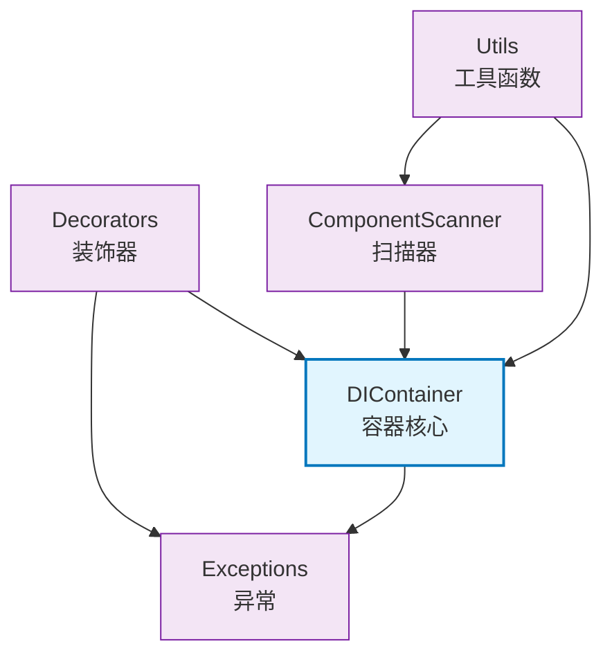

# core.di

依赖注入(DI)框架，提供完整的IoC容器实现、装饰器、自动扫描和Mock支持。

## 模块位置

**源码路径**: `src/core/di/`
**文档路径**: `specs/ac_mod/core.di.ac.mod.md`
**模块类型**: 包模块

## 目录结构

```
src/core/di/
├── __init__.py                 # 包初始化，导出所有公共API
├── container.py                # DIContainer核心实现、BeanScope、BeanDefinition
├── decorators.py               # @component/@service/@repository/@factory等装饰器
├── exceptions.py               # DI异常类定义
├── utils.py                    # get_bean/register_bean等工具函数
├── scanner.py                  # ComponentScanner组件扫描器
└── examples.py                 # 使用示例（示例文件）
```

## 快速开始

### 基本使用方式

```python
from core.di import component, service, get_bean_by_type, get_container

# 1. 使用装饰器注册组件
@service(primary=True)
class UserService:
    def get_user(self, user_id: str):
        return f"User:{user_id}"

# 2. 依赖注入
@component()
class UserController:
    def __init__(self, user_service: UserService):
        self.user_service = user_service

# 3. 获取Bean
controller = get_bean_by_type(UserController)
user = controller.user_service.get_user("123")

# 4. 手动注册
from core.di import register_bean
class CustomService:
    pass

register_bean(CustomService, instance=CustomService())
```

### 接口多实现

```python
from abc import ABC, abstractmethod

# 定义接口
class IStorage(ABC):
    @abstractmethod
    def save(self, data): pass

# Primary实现
@service(primary=True)
class RedisStorage(IStorage):
    def save(self, data):
        print(f"Save to Redis: {data}")

# 备用实现
@service()
class MongoStorage(IStorage):
    def save(self, data):
        print(f"Save to Mongo: {data}")

# 自动注入Primary实现
storage = get_bean_by_type(IStorage)  # 返回RedisStorage
all_storages = get_beans_by_type(IStorage)  # [RedisStorage, MongoStorage]
```

### Mock模式

```python
from core.di import mock_impl, enable_mock_mode

# Mock实现
@mock_impl()
class MockUserService(UserService):
    def get_user(self, user_id: str):
        return f"MockUser:{user_id}"

# 启用Mock模式
enable_mock_mode()
service = get_bean_by_type(UserService)  # 返回MockUserService
```

## 核心组件详解

### 1. DIContainer 容器

**核心功能**:
- Bean生命周期管理（SINGLETON/PROTOTYPE/FACTORY）
- 构造函数依赖自动注入
- Primary Bean机制
- Mock模式切换
- 循环依赖检测
- 类型继承关系缓存
- 线程安全（RLock）

**主要方法**:
- `register_bean(bean_type, bean_name, scope, is_primary, is_mock, instance)`: 注册Bean
- `register_factory(bean_type, factory_method, bean_name, is_primary, is_mock)`: 注册Factory
- `get_bean(bean_name)`: 按名称获取Bean
- `get_bean_by_type(bean_type)`: 按类型获取Bean（Primary或唯一实现）
- `get_beans_by_type(bean_type)`: 获取所有实现
- `enable_mock_mode()`/`disable_mock_mode()`: Mock模式控制
- `clear()`: 清空容器

**Bean作用域**:
- `SINGLETON`: 单例，容器中唯一实例
- `PROTOTYPE`: 原型，每次获取创建新实例
- `FACTORY`: 工厂，通过factory_method创建

### 2. 装饰器

**@component(name, scope, lazy, primary)**:
- 通用组件装饰器
- `name`: Bean名称（默认类名小写）
- `scope`: 作用域（默认SINGLETON）
- `lazy`: 延迟注册（默认False）
- `primary`: Primary实现（默认False）

**@service/@repository/@controller**:
- 语义化装饰器，参数同@component
- 用于区分不同层次的组件

**@factory(bean_type, name, lazy)**:
- 工厂方法装饰器
- 装饰函数，返回Bean实例
- `bean_type`: 创建的Bean类型（可从返回类型推断）

**@mock_impl(name, scope, primary)**:
- Mock实现装饰器
- 自动注册为Mock Bean
- Mock模式下优先级最高

**@prototype**:
- 原型作用域装饰器
- 每次获取创建新实例

**@conditional(condition)**:
- 条件注册装饰器
- `condition`: 返回bool的函数
- 条件为False时跳过注册

### 3. ComponentScanner 扫描器

**功能**:
- 自动扫描项目文件
- 触发装饰器注册
- 支持并行/顺序扫描
- 排除路径/模式过滤

**使用**:
```python
from core.di import scan_packages, auto_scan

# 自动扫描（推荐）
auto_scan()

# 指定路径扫描
scan_packages(base_path="src/", exclude_paths=["tests"])

# 高级扫描
from core.di.scanner import ComponentScanner
scanner = ComponentScanner()
scanner.add_scan_path("src/")
scanner.exclude_pattern("test_")
scanner.set_parallel(True)
scanner.scan()
```

### 4. 工具函数

**获取Bean**:
- `get_bean(name)`: 按名称
- `get_bean_by_type(Type)`: 按类型（Primary）
- `get_beans_by_type(Type)`: 所有实现
- `get_beans()`: 所有Bean字典

**注册Bean**:
- `register_bean(bean_type, instance, name, scope, is_primary, is_mock)`
- `register_factory(bean_type, factory_method, name, is_primary, is_mock)`
- `register_singleton/register_prototype/register_primary/register_mock`

**容器操作**:
- `enable_mock_mode()`/`disable_mock_mode()`: Mock模式
- `clear_container()`: 清空
- `get_container()`: 获取全局容器
- `print_container_info()`: 打印容器信息

**其他**:
- `inject(func)`: 函数依赖注入装饰器
- `lazy_inject(Type)`: 延迟注入lambda
- `get_or_create(Type, factory)`: 获取或创建
- `conditional_register(condition, Type, instance, name)`: 条件注册
- `batch_register({Type: instance})`: 批量注册

### 5. 异常类

| 异常类 | 说明 |
|-------|------|
| `DIException` | 基础异常 |
| `CircularDependencyError` | 循环依赖 |
| `BeanNotFoundError` | Bean未找到 |
| `DuplicateBeanError` | 重复注册 |
| `FactoryError` | Factory创建失败 |
| `DependencyResolutionError` | 依赖解析失败 |
| `MockNotEnabledError` | Mock模式未启用 |
| `PrimaryBeanConflictError` | Primary冲突 |

## Mermaid 依赖图



## 依赖关系说明

### 对其他模块的依赖
- `specs/ac_mod/core.observation.tracing.ac.mod.md` - scanner.py使用logger

### 被依赖关系
- `specs/ac_mod/infra_layer.adapters.out.persistence.repository.ac.mod.md` - 仓储使用@repository
- `specs/ac_mod/infra_layer.adapters.out.search.repository.ac.mod.md` - 搜索仓储使用@repository
- `specs/ac_mod/component.ac.mod.md` - 组件使用@service/@component
- `specs/ac_mod/core.middleware.ac.mod.md` - 中间件可能使用DI
- `specs/ac_mod/core.interface.controller.ac.mod.md` - 控制器使用@controller和DI
- `specs/ac_mod/memory_layer.cluster_manager.ac.mod.md` - 使用@service
- `specs/ac_mod/memory_layer.profile_manager.ac.mod.md` - 使用@service

## 可以验证模块可运行的测试命令

```bash
# Python模块测试
python -c "from core.di import DIContainer, component, get_bean_by_type; print(DIContainer())"

# 测试装饰器
python -c "
from core.di import service, get_bean_by_type

@service()
class TestService:
    pass

svc = get_bean_by_type(TestService)
print(f'Got service: {svc}')
"

# 打印容器信息
python -c "from core.di import print_container_info; print_container_info()"
```

## 设计特点

**优先级机制**:
1. Primary Bean > 非Primary Bean
2. Mock模式下：Mock Bean > 非Mock Bean
3. Factory > 普通Bean
4. 直接匹配 > 接口实现匹配

**性能优化**:
- 类型继承关系缓存
- Primary Bean快速索引
- 候选Bean缓存
- 缓存失效机制

**线程安全**:
- 全局容器双重检查锁
- Bean操作RLock保护
- 循环依赖检测栈管理

**自动注入**:
- 构造函数参数类型注解自动注入
- 支持`List[Type]`泛型注入（注入所有实现）
- 可选参数支持默认值
