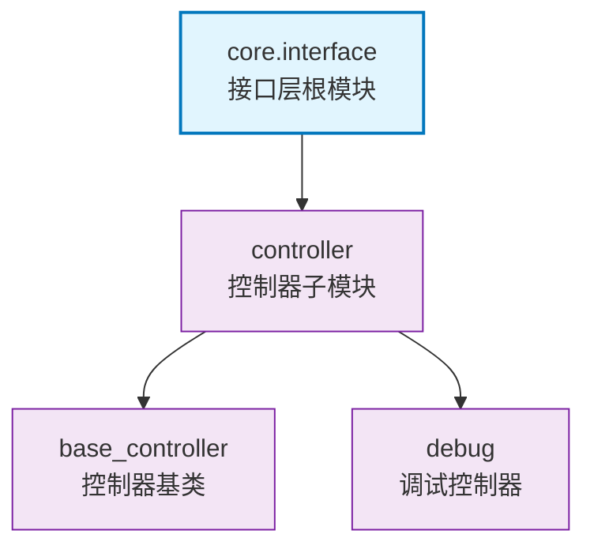

# core.interface

FastAPI接口层组织结构，包含控制器基类和调试工具

## 模块位置

**源码路径**: `src/core/interface/`
**文档路径**: `specs/ac_mod/core.interface.ac.mod.md`
**模块类型**: 包模块

## 目录结构

```
src/core/interface/
├── __init__.py
└── controller/                  # 控制器子模块
    ├── __init__.py
    ├── base_controller.py      # 控制器基类
    └── debug/                  # 调试控制器
        ├── __init__.py
        └── debug_controller.py
```

## 快速开始

### 基本使用

```python
from core.interface.controller.base_controller import BaseController

class MyController(BaseController):
    def __init__(self):
        super().__init__()

    async def my_endpoint(self):
        # 使用继承的功能
        pass
```

## 核心组件详解

### 1. controller子模块

**功能**: 提供FastAPI控制器基类和调试工具

**子模块**:
- `base_controller` - 控制器基类，提供通用功能
- `debug` - 调试控制器，提供开发调试接口

### 2. 架构

此模块作为接口层的组织结构：
- 职责单一：仅包含HTTP接口相关代码
- 层次清晰：controller包含具体实现
- 扩展性强：便于添加新的接口类型

## Mermaid 依赖图



## 依赖关系说明

### 对其他模块的依赖

- 本模块仅作为组织结构，实际依赖在子模块中

### 被依赖关系

- `src/infra_layer/adapters/input/api/v2/agentic_v2_controller.py`
- `src/infra_layer/adapters/input/api/v3/agentic_v3_controller.py`
- `src/infra_layer/adapters/input/api/health/health_controller.py`
- `src/core/lifespan/business_lifespan.py`
- `src/app.py`

## 可以验证模块可运行的测试命令

```bash
# 检查模块导入
python -c "import core.interface; print('OK')"

# 检查子模块
python -c "from core.interface.controller.base_controller import BaseController; print(BaseController)"

# 查找使用示例
grep -r "from core.interface" src/
```
