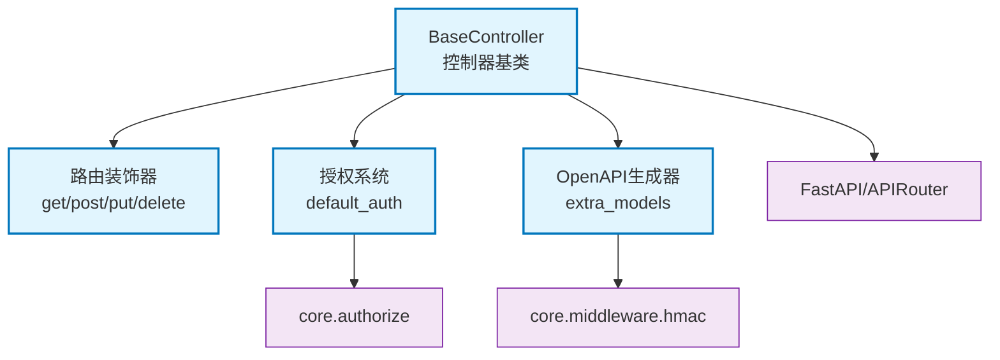

# core.interface.controller

FastAPI控制器基类，提供路由装饰器、自动注册、授权管理和OpenAPI文档生成

## 模块位置

**源码路径**: `src/core/interface/controller/`
**文档路径**: `specs/ac_mod/core.interface.controller.ac.mod.md`
**模块类型**: 包模块

## 目录结构

```
src/core/interface/controller/
├── __init__.py
├── base_controller.py          # 控制器基类
└── debug/                      # 调试控制器子模块
    ├── __init__.py
    └── debug_controller.py
```

## 快速开始

### 基本使用

```python
from core.interface.controller.base_controller import BaseController, get, post

class UserController(BaseController):
    def __init__(self):
        super().__init__(
            prefix="/users",
            tags=["Users"],
            default_auth="require_user"
        )

    @get("/")
    async def list_users(self):
        return [{"id": 1, "name": "Alice"}]

    @post("/")
    async def create_user(self, name: str):
        return {"id": 2, "name": name}

# 注册到FastAPI应用
from fastapi import FastAPI
app = FastAPI()
controller = UserController()
controller.register_to_app(app)
```

### 路由装饰器

```python
from core.interface.controller.base_controller import get, post, put, delete, patch

class MyController(BaseController):
    @get("/items/{item_id}")
    async def get_item(self, item_id: int):
        return {"item_id": item_id}

    @post("/items", response_model=ItemResponse)
    async def create_item(self, item: ItemCreate):
        return item

    @put("/items/{item_id}")
    async def update_item(self, item_id: int, item: ItemUpdate):
        return item

    @delete("/items/{item_id}")
    async def delete_item(self, item_id: int):
        return {"deleted": item_id}

    @patch("/items/{item_id}")
    async def patch_item(self, item_id: int, updates: dict):
        return updates
```

### 授权策略

```python
class SecureController(BaseController):
    def __init__(self):
        super().__init__(
            prefix="/secure",
            default_auth="require_admin"  # 默认需要管理员权限
        )

    @get("/admin-only")
    async def admin_endpoint(self):
        return {"message": "Admin only"}

    @get("/public")
    @require_anonymous  # 覆盖默认策略，允许匿名访问
    async def public_endpoint(self):
        return {"message": "Public access"}
```

### OpenAPI额外模型

```python
from typing import Union
from pydantic import BaseModel

class SuccessResponse(BaseModel):
    status: str = "success"
    data: dict

class ErrorResponse(BaseModel):
    status: str = "error"
    message: str

ResponseUnion = Union[SuccessResponse, ErrorResponse]

class APIController(BaseController):
    @get("/action", extra_models=[ResponseUnion])
    async def action(self) -> ResponseUnion:
        return SuccessResponse(data={"result": "OK"})
```

## 核心组件详解

### 1. BaseController

**功能**: 控制器抽象基类，提供自动路由收集和注册

**初始化参数**:
- `prefix`: 路由前缀(如"/api/v1")
- `tags`: OpenAPI标签列表
- `default_auth`: 默认授权策略
  - `"require_user"`: 需要用户认证(默认)
  - `"require_anonymous"`: 允许匿名访问
  - `"require_admin"`: 需要管理员权限
  - `"require_signature"`: 需要HMAC签名
  - `"none"`: 不应用默认授权

**主要方法**:
- `register_to_app(app)`: 注册路由到FastAPI应用
- `_collect_routes()`: 自动收集装饰器标记的路由
- `_apply_default_auth(func)`: 应用默认授权策略
- `_custom_openapi_generator(app)`: 自定义OpenAPI生成

**特性**:
- 自动路由收集：扫描类方法上的`__route_info__`属性
- 授权集成：自动应用授权装饰器
- OpenAPI增强：支持extra_models、Union类型、discriminator
- 安全配置：自动添加security schemes到OpenAPI

### 2. 路由装饰器

**装饰器函数**:
- `get(path, **kwargs)`: GET请求
- `post(path, **kwargs)`: POST请求
- `put(path, **kwargs)`: PUT请求
- `delete(path, **kwargs)`: DELETE请求
- `patch(path, **kwargs)`: PATCH请求
- `head(path, **kwargs)`: HEAD请求
- `options(path, **kwargs)`: OPTIONS请求

**工作原理**:
1. 装饰器在函数上添加`__route_info__`属性
2. `_collect_routes()`扫描并注册到APIRouter
3. 支持所有FastAPI路由参数(response_model, status_code等)

### 3. 授权管理

**默认授权应用**:
- 检查方法是否已有`__authorization_context__`
- 未授权方法自动应用`default_auth`策略
- 支持绑定方法和未绑定函数

**认证路由追踪**:
- `_auth_routes`: 记录需要认证的路由路径
- 自动清理路径参数类型(如`{id:int}` → `{id}`)
- 在OpenAPI中添加security配置

### 4. OpenAPI生成

**extra_models处理**:
- 支持Pydantic模型
- 支持Union类型，生成oneOf schema
- 自动提取discriminator映射
- 递归处理$defs引用

**安全配置**:
- 自动收集控制器的security schemes
- 支持自定义`_security_config_provider`
- 为认证路由添加security字段

**schema增强**:
- Union类型生成oneOf结构
- discriminator自动映射
- 嵌套模型展开

## Mermaid 依赖图



## 依赖关系说明

### 对其他模块的依赖

- `core.authorize.decorators` - 授权装饰器(require_user, require_admin等)
- `core.authorize.enums` - 角色枚举
- `core.middleware.hmac_signature_middleware` - HMAC安全配置
- `fastapi` - FastAPI框架和APIRouter
- `pydantic` - 模型定义和验证

### 被依赖关系

- `src/infra_layer/adapters/input/api/v2/agentic_v2_controller.py` - V2 API控制器
- `src/infra_layer/adapters/input/api/v3/agentic_v3_controller.py` - V3 API控制器
- `src/infra_layer/adapters/input/api/health/health_controller.py` - 健康检查控制器
- `specs/ac_mod/core.interface.controller.debug.ac.mod.md` - 调试控制器

## 可以验证模块可运行的测试命令

```bash
# 检查模块导入
python -c "from core.interface.controller.base_controller import BaseController, get, post; print('OK')"

# 检查装饰器
python -c "from core.interface.controller.base_controller import get, post, put, delete; print([get, post, put, delete])"

# 查找控制器使用示例
grep -r "class.*Controller(BaseController)" src/

# 运行测试
pytest src/ -v -k controller
```
