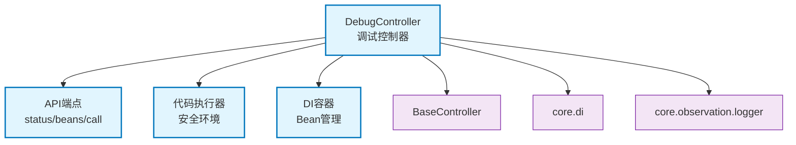

# core.interface.controller.debug

DI容器调试API控制器，提供Bean查询、方法调用和代码执行功能

## 模块位置

**源码路径**: `src/core/interface/controller/debug/debug_controller.py`
**文档路径**: `specs/ac_mod/core.interface.controller.debug.ac.mod.md`
**模块类型**: 单文件模块

## 文件结构

```python
# debug_controller.py 内容结构
├── 导入部分                      # FastAPI、DI、日志等
├── BeanCallRequest              # Bean调用请求模型
├── BeanCallWithCodeRequest      # 代码执行请求模型
├── BeanCallResponse             # 调用响应模型
├── BeanInfoResponse             # Bean信息响应模型
├── DebugController              # 调试控制器主类
│   ├── get_debug_status()      # 获取调试状态
│   ├── list_all_beans()        # 列出所有Bean
│   ├── get_bean_info()         # 获取单个Bean信息
│   ├── call_bean_method()      # 调用Bean方法
│   └── call_bean_method_with_code()  # 代码执行调用
```

## 快速开始

### 基本使用

```python
from core.interface.controller.debug.debug_controller import DebugController

# 控制器自动注册到/asdf/debug/di路径
# 仅在ENV=DEV时可用

# 1. 查询调试状态
# GET /asdf/debug/di/status

# 2. 列出所有Bean
# GET /asdf/debug/di/beans

# 3. 获取Bean信息
# GET /asdf/debug/di/beans/{bean_name}

# 4. 调用Bean方法（传统方式）
# POST /asdf/debug/di/call
{
  "bean_name": "user_service",
  "method": "get_user",
  "args": [123],
  "kwargs": {}
}

# 5. 调用Bean方法（代码执行）
# POST /asdf/debug/di/call
{
  "bean_name": "resource_repository",
  "method": "get_by_type",
  "code": "from domain.models.enums import ResourceType\nargs = []\nkwargs = {'resource_type': ResourceType.LITERATURE}"
}
```

### 环境要求

```bash
# 必须设置ENV=DEV才能使用调试接口
export ENV=DEV

# 生产环境自动禁用
export ENV=PROD  # 所有调试接口返回404
```

## 核心组件详解

### 1. DebugController

**功能**: DI容器调试API控制器

**初始化参数**:
- `prefix="/asdf/debug/di"`: 调试接口路径前缀
- `tags=["Debug"]`: OpenAPI标签
- `default_auth="none"`: 不需要认证（但受ENV控制）

**主要方法**:
- `get_debug_status()`: 获取调试功能状态和容器信息
- `list_all_beans()`: 列出所有已注册Bean及其方法
- `get_bean_info(bean_name)`: 获取单个Bean详细信息
- `call_bean_method(request)`: 调用Bean方法（支持传统参数和代码执行）
- `call_bean_method_with_code(request)`: 通过代码生成参数调用Bean方法

**安全机制**:
- 仅在`ENV=DEV`时启用
- 生产环境自动返回404
- 代码执行环境受限

### 2. Bean查询

**GET /asdf/debug/di/beans**
- 返回所有Bean的名称、类型、作用域、方法列表
- 包含is_primary和is_mock标识
- 方法列表排序并过滤私有方法

**GET /asdf/debug/di/beans/{bean_name}**
- 查询单个Bean详细信息
- 返回完整的方法列表
- 提供元数据（scope, is_primary等）

### 3. Bean方法调用

**传统参数方式**:
```json
{
  "bean_name": "user_service",
  "method": "create_user",
  "args": [],
  "kwargs": {"name": "Alice", "email": "alice@example.com"}
}
```

**代码执行方式**:
```json
{
  "bean_name": "resource_repository",
  "method": "get_uuids_by_ids_and_type",
  "code": "from domain.models.enums import ResourceType\n\nargs = []\nkwargs = {\n    'resource_ids': [274, 281, 282],\n    'resource_type': ResourceType.LITERATURE,\n    'user_id': 1\n}"
}
```

**代码执行特性**:
- 安全执行环境（限制内置函数）
- 支持自由导入项目模块
- 自动检测异步/同步方法
- 返回代码生成的参数信息

### 4. 响应格式

**成功响应**:
```json
{
  "success": true,
  "result": ["data1", "data2"],
  "bean_info": {
    "name": "user_service",
    "type_name": "UserService",
    "lookup_method": "by_name"
  },
  "code_execution": {
    "generated_args": [],
    "generated_kwargs": {"key": "value"}
  }
}
```

**失败响应**:
```json
{
  "success": false,
  "error": "Method not found",
  "traceback": "Traceback...",
  "bean_info": null
}
```

### 5. 代码执行安全

**允许的内置函数**:
- 基础类型: str, int, float, bool, list, dict, tuple, set
- 常用函数: len, range, enumerate, zip, print
- 类型检查: isinstance, hasattr, type
- 数学函数: abs, min, max, sum
- 迭代函数: map, filter, sorted, reversed

**预导入模块**:
- datetime, json, uuid, typing
- 支持自由导入项目模块（通过`__import__`）

**安全限制**:
- 无文件操作、网络访问
- 无系统命令执行
- 限制内置函数集合

## Mermaid 依赖图



## 依赖关系说明

### 对其他模块的依赖

- `specs/ac_mod/core.interface.controller.ac.mod.md` - 控制器基类
- `core.di` - 依赖注入容器（get_container, get_bean, get_bean_by_type）
- `core.di.decorators` - @controller装饰器
- `specs/ac_mod/core.observation.logging.ac.mod.md` - 日志记录
- `core.constants.errors` - 错误消息常量
- `fastapi` - HTTP框架
- `pydantic` - 数据验证

### 被依赖关系

- `src/app.py` - 应用初始化（可选注册）

## 可以验证模块可运行的测试命令

```bash
# 启用调试模式
export ENV=DEV

# 检查模块导入
python -c "from core.interface.controller.debug.debug_controller import DebugController; print('OK')"

# 启动应用并测试调试接口
# curl http://localhost:8000/asdf/debug/di/status
# curl http://localhost:8000/asdf/debug/di/beans

# 测试Bean调用
curl -X POST http://localhost:8000/asdf/debug/di/call \
  -H "Content-Type: application/json" \
  -d '{"bean_name":"user_service","method":"list_users","args":[],"kwargs":{}}'

# 运行测试
pytest src/ -v -k debug_controller
```
