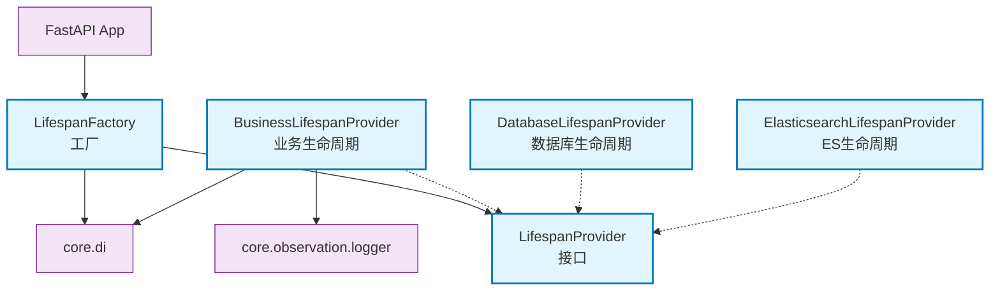

# core.lifespan

FastAPI应用生命周期管理，支持数据库、业务逻辑等组件的启动和关闭

## 模块位置

**源码路径**: `src/core/lifespan/`
**文档路径**: `specs/ac_mod/core.lifespan.ac.mod.md`
**模块类型**: 包模块

## 目录结构

```
src/core/lifespan/
├── __init__.py
├── lifespan_interface.py           # 生命周期接口
├── lifespan_factory.py             # 生命周期工厂
├── business_lifespan.py            # 业务生命周期
├── database_lifespan.py            # 数据库生命周期
├── elasticsearch_lifespan.py       # ES生命周期
├── milvus_lifespan.py              # Milvus生命周期
└── mongodb_lifespan.py             # MongoDB生命周期
```

## 快速开始

### 基本使用

```python
from fastapi import FastAPI
from core.lifespan.lifespan_factory import LifespanFactory
from core.di import get_bean_by_type

app = FastAPI()

# 自动创建包含所有注册Provider的生命周期
factory = get_bean_by_type(LifespanFactory)
lifespan = factory.create_auto_lifespan()

app = FastAPI(lifespan=lifespan)
```

### 自定义生命周期Provider

```python
from core.lifespan.lifespan_interface import LifespanProvider
from core.di.decorators import component
from fastapi import FastAPI

@component(name="my_lifespan")
class MyLifespanProvider(LifespanProvider):
    def __init__(self):
        super().__init__(name="my_service", order=15)

    async def startup(self, app: FastAPI):
        # 初始化逻辑
        print("启动自定义服务")
        return {"status": "running"}

    async def shutdown(self, app: FastAPI):
        # 清理逻辑
        print("关闭自定义服务")
```

### 手动组合Providers

```python
from core.lifespan.lifespan_factory import create_lifespan_with_providers
from core.lifespan.database_lifespan import DatabaseLifespanProvider
from core.lifespan.business_lifespan import BusinessLifespanProvider

providers = [
    DatabaseLifespanProvider(),
    BusinessLifespanProvider()
]

lifespan = create_lifespan_with_providers(providers)
app = FastAPI(lifespan=lifespan)
```

## 核心组件详解

### 1. LifespanProvider（接口）

**功能**: 生命周期提供者抽象基类

**初始化参数**:
- `name`: 提供者名称
- `order`: 执行顺序（数字越小越先启动，越后关闭）

**必需方法**:
- `startup(app)`: 启动逻辑，返回初始化数据
- `shutdown(app)`: 关闭逻辑

### 2. LifespanFactory

**功能**: 生命周期工厂，自动发现和组合Provider

**主要方法**:
- `create_auto_lifespan()`: 自动创建包含所有已注册Provider的生命周期

**工作原理**:
1. 从DI容器获取所有LifespanProvider
2. 按order排序
3. 创建asynccontextmanager
4. 启动时顺序执行，关闭时逆序执行

### 3. BusinessLifespanProvider

**功能**: 业务逻辑生命周期管理

**启动流程**:
1. 注册控制器（BaseController）
2. 注册应用能力（ApplicationCapability）
3. 创建业务图结构

**order**: 20（在数据库之后）

### 4. DatabaseLifespanProvider

**功能**: 数据库连接生命周期管理

**order**: 10（较早启动）

### 5. 其他Provider

- **ElasticsearchLifespanProvider**: ES连接管理
- **MilvusLifespanProvider**: Milvus向量数据库管理
- **MongoDBLifespanProvider**: MongoDB连接管理

## 执行顺序

```
启动顺序（按order升序）:
1. order=10: DatabaseLifespanProvider
2. order=15: ElasticsearchLifespanProvider
3. order=20: BusinessLifespanProvider
...

关闭顺序（逆序）:
1. BusinessLifespanProvider
2. ElasticsearchLifespanProvider
3. DatabaseLifespanProvider
```

## Mermaid 依赖图



## 依赖关系说明

### 对其他模块的依赖

- `core.di` - 依赖注入（get_beans_by_type, get_bean）
- `core.di.decorators` - @component装饰器
- `specs/ac_mod/core.observation.logging.ac.mod.md` - 日志记录
- `core.interface.controller.base_controller` - 控制器基类
- `core.capability.app_capability` - 应用能力
- `fastapi` - FastAPI框架

### 被依赖关系

- `src/app.py` - 主应用初始化
- `src/base_app.py` - 基础应用配置

## 可以验证模块可运行的测试命令

```bash
# 检查模块导入
python -c "from core.lifespan.lifespan_interface import LifespanProvider; print('OK')"
python -c "from core.lifespan.lifespan_factory import LifespanFactory; print('OK')"
python -c "from core.lifespan.business_lifespan import BusinessLifespanProvider; print('OK')"

# 查找所有Provider
grep -r "LifespanProvider" src/core/lifespan/

# 运行测试
pytest src/ -v -k lifespan
```
