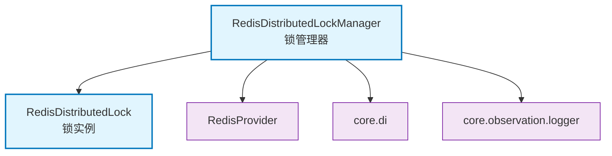

# core.lock

基于Redis的分布式可重入锁实现，支持协程级别锁管理

## 模块位置

**源码路径**: `src/core/lock/`
**文档路径**: `specs/ac_mod/core.lock.ac.mod.md`
**模块类型**: 包模块

## 目录结构

```
src/core/lock/
├── __init__.py
└── redis_distributed_lock.py       # Redis分布式锁实现
```

## 快速开始

### 基本使用

```python
from core.lock.redis_distributed_lock import RedisDistributedLockManager
from core.di import get_bean_by_type

# 获取锁管理器
lock_manager = get_bean_by_type(RedisDistributedLockManager)

# 使用锁
async def critical_section():
    lock = lock_manager.get_lock("my_resource")

    async with lock.acquire(timeout=60.0, blocking_timeout=80.0) as acquired:
        if acquired:
            # 执行临界区代码
            print("获取锁成功，执行操作")
        else:
            print("获取锁失败")
```

### 可重入锁

```python
async def nested_lock_example():
    lock = lock_manager.get_lock("resource")

    async with lock.acquire():
        # 第一次获取锁
        print("外层锁")

        async with lock.acquire():
            # 可重入，同一协程可再次获取
            print("内层锁")
```

## 核心组件详解

### 1. RedisDistributedLockManager

**功能**: 分布式锁管理器

**主要方法**:
- `get_lock(resource)`: 获取指定资源的锁实例
- `_acquire_lock(resource, timeout, blocking_timeout)`: 内部获取锁方法
- `_release_lock(resource)`: 内部释放锁方法

**特性**:
- 协程安全
- 支持可重入
- 使用contextvar管理上下文

### 2. RedisDistributedLock

**功能**: 单个锁实例

**参数**:
- `timeout`: 锁超时时间（秒），默认60秒
- `blocking_timeout`: 阻塞获取锁的超时时间（秒），默认80秒

**使用方法**:
- `acquire(timeout, blocking_timeout)`: 异步上下文管理器

**返回**:
- `bool`: 是否成功获取锁

### 3. 锁机制

**特性**:
- **分布式**: 基于Redis实现跨进程锁
- **可重入**: 同一协程可多次获取同一锁
- **超时控制**: 防止死锁
- **阻塞获取**: 支持等待锁释放

**默认配置**:
```python
DEFAULT_LOCK_TIMEOUT = 60.0          # 锁持有超时
DEFAULT_BLOCKING_TIMEOUT = 80.0      # 获取锁超时
DEFAULT_RETRY_INTERVAL = 3           # 重试间隔
```

### 4. DistributedLockError

**异常类**: 分布式锁相关异常

## Mermaid 依赖图



## 依赖关系说明

### 对其他模块的依赖

- `component.redis_provider` - Redis连接提供者
- `core.di` - 依赖注入（@component, get_bean_by_type）
- `specs/ac_mod/core.observation.logging.ac.mod.md` - 日志

### 被依赖关系

- 需要分布式锁的业务逻辑模块
- 并发控制模块

## 可以验证模块可运行的测试命令

```bash
# 检查模块导入
python -c "from core.lock.redis_distributed_lock import RedisDistributedLockManager; print('OK')"

# 测试锁功能（需要Redis）
python -c "
import asyncio
from core.lock.redis_distributed_lock import RedisDistributedLockManager
from core.di import get_bean_by_type

async def test():
    manager = get_bean_by_type(RedisDistributedLockManager)
    lock = manager.get_lock('test_resource')
    async with lock.acquire():
        print('Lock acquired')

asyncio.run(test())
"

# 运行测试
pytest src/ -v -k lock
```
