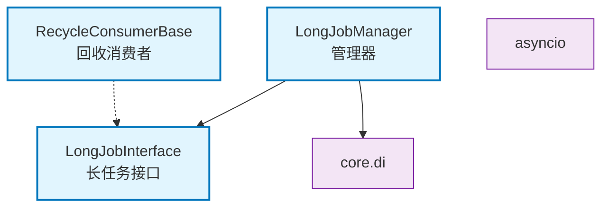

# core.longjob

长任务管理器，支持后台长期运行的任务启动、停止和监控

## 模块位置

**源码路径**: `src/core/longjob/`
**文档路径**: `specs/ac_mod/core.longjob.ac.mod.md`
**模块类型**: 包模块

## 目录结构

```
src/core/longjob/
├── __init__.py
├── interfaces.py                   # 长任务接口
├── manager.py                      # 长任务管理器
├── recycle_consumer_base.py        # 回收消费者基类
└── longjob_error.py                # 异常定义
```

## 快速开始

### 定义长任务

```python
from core.longjob.interfaces import LongJobInterface, LongJobStatus
from core.di.decorators import component

@component(name="my_long_job")
class MyLongJob(LongJobInterface):
    def __init__(self):
        super().__init__(job_name="my_service")

    async def start(self):
        self._status = LongJobStatus.RUNNING
        while self._status == LongJobStatus.RUNNING:
            # 执行长期任务逻辑
            await asyncio.sleep(10)

    async def stop(self):
        self._status = LongJobStatus.STOPPED
```

### 使用管理器

```python
from core.longjob.manager import LongJobManager
from core.di import get_bean_by_type

# 获取管理器
manager = get_bean_by_type(LongJobManager)

# 启动所有任务
await manager.start_all_jobs()

# 停止特定任务
await manager.stop_job("my_service")

# 查看状态
status = manager.get_job_status("my_service")
```

## 核心组件详解

### 1. LongJobInterface

**功能**: 长任务接口

**必需方法**:
- `start()`: 启动任务
- `stop()`: 停止任务
- `get_status()`: 获取状态

**属性**:
- `job_name`: 任务名称
- `_status`: 任务状态

### 2. LongJobManager

**功能**: 长任务管理器

**环境变量配置**:
- `LONGJOB_MAX_CONCURRENT_JOBS`: 最大并发任务数（默认10）
- `LONGJOB_AUTO_DISCOVER`: 自动发现任务（默认true）
- `LONGJOB_AUTO_START_MODE`: 自动启动模式（all/whitelist/blacklist）
- `LONGJOB_JOB_WHITELIST`: 任务白名单
- `LONGJOB_JOB_BLACKLIST`: 任务黑名单
- `LONGJOB_STARTUP_TIMEOUT`: 启动超时（默认60秒）
- `LONGJOB_SHUTDOWN_TIMEOUT`: 关闭超时（默认30秒）

**主要方法**:
- `start_all_jobs()`: 启动所有任务
- `stop_all_jobs()`: 停止所有任务
- `start_job(job_name)`: 启动特定任务
- `stop_job(job_name)`: 停止特定任务
- `get_job_status(job_name)`: 查询任务状态
- `list_jobs()`: 列出所有任务

### 3. LongJobStatus枚举

```python
class LongJobStatus(Enum):
    IDLE = "idle"           # 空闲
    RUNNING = "running"     # 运行中
    STOPPED = "stopped"     # 已停止
    ERROR = "error"         # 错误
```

### 4. RecycleConsumerBase

**功能**: 回收消费者基类，提供定期执行的任务模板

**特性**:
- 定期轮询执行
- 异常处理
- 优雅关闭

## Mermaid 依赖图



## 依赖关系说明

### 对其他模块的依赖

- `core.di` - 依赖注入（get_beans_by_type, @service）
- `asyncio` - 异步任务管理

### 被依赖关系

- 后台服务实现模块
- 定时任务模块

## 可以验证模块可运行的测试命令

```bash
# 检查模块导入
python -c "from core.longjob.manager import LongJobManager; print('OK')"
python -c "from core.longjob.interfaces import LongJobInterface; print('OK')"

# 配置环境变量
export LONGJOB_AUTO_DISCOVER=true
export LONGJOB_AUTO_START_MODE=all

# 运行测试
pytest src/ -v -k longjob
```
