# core.middleware

FastAPI中间件集合，提供请求/响应拦截、上下文管理、异常处理等功能

## 模块位置

**源码路径**: `src/core/middleware/`
**文档路径**: `specs/ac_mod/core.middleware.ac.mod.md`
**模块类型**: 包模块

## 目录结构

```
src/core/middleware/
├── __init__.py
├── app_context_middleware.py          # 应用上下文中间件
├── database_session_middleware.py     # 数据库会话中间件
├── global_exception_handler.py        # 全局异常处理器
├── hmac_signature_middleware.py       # HMAC签名验证中间件
├── sse_exception_middleware.py        # SSE异常处理装饰器
└── user_context_middleware.py         # 用户上下文中间件
```

## 快速开始

### 基本使用

```python
from fastapi import FastAPI
from core.middleware.app_context_middleware import AppContextMiddleware
from core.middleware.database_session_middleware import DatabaseSessionMiddleware
from core.middleware.user_context_middleware import UserContextMiddleware
from core.middleware.global_exception_handler import global_exception_handler

app = FastAPI()

# 添加中间件（顺序重要：先添加的后执行）
app.add_middleware(DatabaseSessionMiddleware)
app.add_middleware(UserContextMiddleware)
app.add_middleware(AppContextMiddleware)

# 添加全局异常处理器
app.add_exception_handler(Exception, global_exception_handler)
```

### SSE流异常处理

```python
from core.middleware.sse_exception_middleware import sse_exception_handler, yield_sse_data
from typing import AsyncGenerator

@sse_exception_handler
async def my_sse_stream() -> AsyncGenerator[str, None]:
    yield yield_sse_data({"type": "message", "content": "hello"})
```

### HMAC签名验证

```python
from core.middleware.hmac_signature_middleware import HMACSignatureMiddleware

app.add_middleware(
    HMACSignatureMiddleware,
    secret_key="your-secret-key",
    time_window_minutes=5
)
```

## 核心组件详解

### 1. AppContextMiddleware

**功能**: 提取HTTP请求中的应用级上下文信息(task_id等)

**主要方法**:
- `dispatch()`: 拦截请求，设置/清理应用上下文
- `_set_app_context()`: 使用AppInfoProvider提取上下文数据

**依赖**: `core.context.context`, `component.app_info_provider`

### 2. DatabaseSessionMiddleware

**功能**: 为每个请求提供数据库会话，自动处理事务提交/回滚

**核心特性**:
- 成功请求自动提交
- 失败请求自动回滚
- 流式响应延长会话生命周期
- 安全的会话清理机制

**主要方法**:
- `dispatch()`: 创建会话、处理请求、管理事务
- `_handle_successful_request()`: 提交事务
- `_handle_failed_request()`: 回滚事务
- `_wrap_streaming_generator()`: 包装流式响应

### 3. UserContextMiddleware

**功能**: 提取用户认证信息，设置用户上下文

**主要方法**:
- `dispatch()`: 从AuthProvider获取用户数据，设置上下文

**特性**:
- 支持匿名用户
- 认证失败抛出401异常
- 自动清理用户上下文

### 4. global_exception_handler

**功能**: 统一异常响应格式

**处理类型**:
- HTTPException → 返回对应状态码+标准错误格式
- 其他异常 → 返回500+标准错误格式

**返回格式**:
```json
{
  "status": "failed",
  "code": "ERROR_CODE",
  "message": "错误信息",
  "timestamp": "2025-11-16T10:00:00Z",
  "path": "/api/endpoint"
}
```

### 5. HMACSignatureMiddleware

**功能**: HMAC签名验证，防重放攻击

**验证机制**:
- 时间窗口检查(默认5分钟)
- HMAC签名校验
- Redis防重放(可选)

**请求头要求**:
- `X-Signature`: HMAC签名
- `X-Timestamp`: Unix时间戳

### 6. sse_exception_middleware

**功能**: 装饰器，将异常转换为SSE事件格式

**使用场景**: 流式响应中的异常处理

**异常转换**:
- HTTPException → `{"type":"error","data":{"code":401,"message":"..."}}`
- Exception → `{"type":"error","data":{"code":500,"message":"..."}}`

## Mermaid 依赖图

```mermaid
graph TB
    AppContextMiddleware[AppContextMiddleware<br/>应用上下文]
    DatabaseSessionMiddleware[DatabaseSessionMiddleware<br/>数据库会话]
    UserContextMiddleware[UserContextMiddleware<br/>用户上下文]
    GlobalExceptionHandler[global_exception_handler<br/>全局异常处理]
    HMACMiddleware[HMACSignatureMiddleware<br/>HMAC验证]
    SSEMiddleware[sse_exception_handler<br/>SSE异常装饰器]

    Context[core.context]
    DI[core.di]
    Logger[core.observation.logger]
    Component[component.*]

    AppContextMiddleware --> Context
    AppContextMiddleware --> Component
    AppContextMiddleware --> Logger
    AppContextMiddleware --> DI

    DatabaseSessionMiddleware --> Context
    DatabaseSessionMiddleware --> Component
    DatabaseSessionMiddleware --> Logger
    DatabaseSessionMiddleware --> DI

    UserContextMiddleware --> Context
    UserContextMiddleware --> Component
    UserContextMiddleware --> Logger
    UserContextMiddleware --> DI

    HMACMiddleware --> Context
    HMACMiddleware --> Component
    HMACMiddleware --> Logger
    HMACMiddleware --> DI

    GlobalExceptionHandler --> Logger

    classDef coreClass fill:#e1f5fe,stroke:#0277bd,stroke-width:2px
    classDef depClass fill:#f3e5f5,stroke:#7b1fa2,stroke-width:1px

    class AppContextMiddleware,DatabaseSessionMiddleware,UserContextMiddleware,GlobalExceptionHandler,HMACMiddleware,SSEMiddleware coreClass
    class Context,DI,Logger,Component depClass
```



## 依赖关系说明

### 对其他模块的依赖

- `specs/ac_mod/core.context.ac.mod.md` - 上下文变量管理
- `specs/ac_mod/core.di.ac.mod.md` - 依赖注入
- `specs/ac_mod/core.observation.logging.ac.mod.md` - 日志记录
- `core.authorize.enums` - 角色枚举
- `core.constants.errors` - 错误码常量
- `component.app_info_provider` - 应用信息提供者
- `component.database_session_provider` - 数据库会话提供者
- `component.auth_provider` - 认证提供者
- `component.redis_provider` - Redis提供者

### 被依赖关系

- `src/app.py` - 主应用初始化
- `src/base_app.py` - 基础应用配置
- `src/core/interface/controller/base_controller.py` - 控制器基类

## 可以验证模块可运行的测试命令

```bash
# 检查模块导入
python -c "from core.middleware.app_context_middleware import AppContextMiddleware; print(AppContextMiddleware)"
python -c "from core.middleware.database_session_middleware import DatabaseSessionMiddleware; print(DatabaseSessionMiddleware)"
python -c "from core.middleware.global_exception_handler import global_exception_handler; print(global_exception_handler)"

# 查找中间件使用示例
grep -r "add_middleware.*Middleware" src/

# 运行项目测试
pytest src/ -v -k middleware
```
