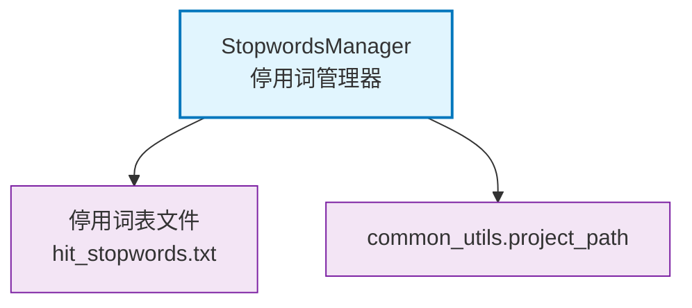

# core.nlp

NLP工具模块，提供停用词表加载和管理功能

## 模块位置

**源码路径**: `src/core/nlp/`
**文档路径**: `specs/ac_mod/core.nlp.ac.mod.md`
**模块类型**: 包模块

## 目录结构

```
src/core/nlp/
├── __init__.py
└── stopwords_utils.py              # 停用词表工具
```

## 快速开始

### 基本使用

```python
from core.nlp.stopwords_utils import StopwordsManager

# 使用默认停用词表（哈工大停用词表）
manager = StopwordsManager()

# 检查是否为停用词
is_stop = manager.is_stopword("的")  # True
is_stop = manager.is_stopword("机器学习")  # False

# 过滤停用词
words = ["机器", "学习", "是", "一门", "技术"]
filtered = manager.filter_stopwords(words)
print(filtered)  # ["机器", "学习", "技术"]

# 获取停用词集合
stopwords = manager.get_stopwords()
print(len(stopwords))  # 停用词数量
```

### 自定义停用词表

```python
# 使用自定义停用词表文件
manager = StopwordsManager(stopwords_file_path="/path/to/custom_stopwords.txt")

# 停用词表格式：每行一个词
# 示例文件内容：
# 的
# 了
# 是
# 在
```

## 核心组件详解

### 1. StopwordsManager

**功能**: 停用词表管理器

**初始化参数**:
- `stopwords_file_path`: 停用词表文件路径（可选），默认使用哈工大停用词表

**主要方法**:
- `load_stopwords()`: 加载停用词表
- `get_stopwords()`: 获取停用词集合
- `is_stopword(word)`: 检查是否为停用词
- `filter_stopwords(words)`: 过滤停用词列表

**默认停用词表**:
- 位置: `config/stopwords/hit_stopwords.txt`
- 来源: 哈工大停用词表

### 2. 停用词表格式

```
的
了
是
在
...
```

**要求**:
- UTF-8编码
- 每行一个词
- 自动跳过空行
- 自动去除首尾空格

## Mermaid 依赖图



## 依赖关系说明

### 对其他模块的依赖

- `common_utils.project_path` - 项目路径工具
- `logging` - 日志记录

### 被依赖关系

- NLP文本处理模块
- 搜索分词模块

## 可以验证模块可运行的测试命令

```bash
# 检查模块导入
python -c "from core.nlp.stopwords_utils import StopwordsManager; print('OK')"

# 测试停用词功能
python -c "
from core.nlp.stopwords_utils import StopwordsManager
manager = StopwordsManager()
print('停用词数量:', len(manager.get_stopwords()))
print('\"的\"是停用词:', manager.is_stopword('的'))
print('\"机器学习\"是停用词:', manager.is_stopword('机器学习'))
"

# 检查停用词表文件
ls -lh config/stopwords/hit_stopwords.txt

# 运行测试
pytest src/ -v -k nlp
```
