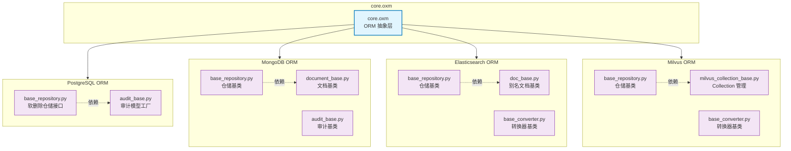

# core.oxm

多数据库 ORM 抽象层，统一管理 PostgreSQL/MongoDB/Elasticsearch/Milvus 的数据访问模式

## 模块位置

**源码路径**: `src/core/oxm/`
**文档路径**: `specs/ac_mod/core.oxm.ac.mod.md`
**模块类型**: 包模块

## 目录结构

```
src/core/oxm/
├── __init__.py                 # 包初始化
├── pg/                         # PostgreSQL ORM
│   ├── __init__.py
│   ├── audit_base.py          # 审计基类（时间戳/用户追踪）
│   └── base_repository.py     # 仓储基类（软删除）
├── mongo/                      # MongoDB ORM
│   ├── __init__.py
│   ├── document_base.py       # 文档基类（时区处理）
│   ├── audit_base.py          # 审计基类（Beanie 事件）
│   ├── base_repository.py     # 仓储基类（事务管理）
│   ├── constant/
│   │   └── annotations.py     # 注解常量
│   └── migration/             # 数据迁移（不含本文档）
├── es/                         # Elasticsearch ORM
│   ├── __init__.py
│   ├── doc_base.py            # 文档基类（别名模式）
│   ├── base_repository.py     # 仓储基类（索引管理）
│   ├── base_converter.py      # 转换器基类
│   ├── analyzer.py            # 分析器配置
│   └── migration/             # 数据迁移（不含本文档）
└── milvus/                     # Milvus 向量数据库 ORM
    ├── __init__.py
    ├── milvus_collection_base.py  # Collection 管理
    ├── base_repository.py         # 仓储基类
    ├── base_converter.py          # 转换器基类
    ├── async_collection.py        # 异步集合封装
    └── migration/                 # 数据迁移（不含本文档）
```

## 快速开始

### 架构概览

```python
# 各子模块独立使用，无需从主包导入
from core.oxm.pg.audit_base import get_auditable_model
from core.oxm.mongo.document_base import DocumentBase
from core.oxm.es.doc_base import AliasDoc
from core.oxm.milvus.milvus_collection_base import MilvusCollectionBase
```

### 设计模式

| 模块 | 模型基类 | 仓储基类 | 转换器 | 特性 |
|------|---------|---------|--------|------|
| **pg** | AuditableModel | BaseSoftDeleteRepository | ❌ | 软删除/审计字段自动填充 |
| **mongo** | DocumentBase + AuditBase | BaseRepository | ❌ | 时区处理/事务管理 |
| **es** | DocBase | BaseRepository | BaseEsConverter | 别名索引/时区处理 |
| **milvus** | MilvusCollectionBase | BaseMilvusRepository | BaseMilvusConverter | 向量搜索/别名切换 |

## 核心组件详解

### 1. PostgreSQL ORM (pg)

**核心功能**:
- 审计字段自动填充（created_at/updated_at/created_by/updated_by）
- 软删除支持（deleted_at/deleted_by）
- SQLAlchemy 事件监听器
- 与上下文用户信息集成

**关键类**:
- `get_auditable_model()`: 工厂函数，返回带审计字段的 SQLModel 基类
- `BaseSoftDeleteRepository`: 软删除仓储接口（纯业务接口）

### 2. MongoDB ORM (mongo)

**核心功能**:
- Beanie ODM 文档基类
- 自动时区转换（递归处理嵌套字段）
- 事务上下文管理器
- 批量操作支持

**关键类**:
- `DocumentBase`: 文档基类（时区递归检查）
- `AuditBase`: 审计基类（Beanie 事件钩子）
- `BaseRepository`: 仓储基类（事务/CRUD）

### 3. Elasticsearch ORM (es)

**核心功能**:
- 别名索引模式（支持版本切换）
- 日期字段时区处理
- ID 源字段映射（如 MongoDB _id → ES meta.id）
- 异步搜索 API

**关键类**:
- `DocBase`: 基础文档类
- `AliasSupportDoc`: 别名支持文档
- `AliasDoc()`: 工厂函数（生成带别名的文档类）
- `BaseRepository`: 仓储基类（索引管理/搜索）
- `BaseEsConverter`: 转换器基类

### 4. Milvus ORM (milvus)

**核心功能**:
- Collection 别名机制（类似 ES）
- 索引自动创建（向量索引/标量索引）
- 异步集合操作
- 多租户支持（suffix 后缀）

**关键类**:
- `MilvusCollectionBase`: Collection 基础管理
- `MilvusCollectionWithSuffix`: 带 suffix 的 Collection（多租户）
- `BaseMilvusRepository`: 仓储基类
- `BaseMilvusConverter`: 转换器基类
- `AsyncCollection`: 异步集合封装

## Mermaid 依赖图



## 依赖关系说明

### 对其他模块的依赖

**core 模块**:
- `core.context.context` - 获取当前用户信息（pg.audit_base）
- `core.observation.logger` - 统一日志（所有仓储类）
- `core.di.utils` - 依赖注入（es/milvus 获取客户端工厂）
- `core.di.decorators` - 仓储装饰器（pg.base_repository）

**common 模块**:
- `common_utils.datetime_utils` - 时区处理（所有模块）

**外部依赖**:
- `sqlmodel` / `sqlalchemy` - PostgreSQL
- `beanie` / `motor` - MongoDB
- `elasticsearch-dsl` - Elasticsearch
- `pymilvus` - Milvus

### 被依赖关系

通过 Grep 搜索验证，被以下模块使用：

**Repository 层**:
- `src/infra_layer/adapters/out/persistence/repository/*_raw_repository.py` - 使用 mongo.BaseRepository
- `src/infra_layer/adapters/out/search/repository/*_repository.py` - 使用 es/milvus 仓储

**Converter 层**:
- `src/infra_layer/adapters/out/search/elasticsearch/converter/*_converter.py` - 继承 BaseEsConverter
- `src/infra_layer/adapters/out/search/milvus/converter/*_converter.py` - 继承 BaseMilvusConverter

**Collection 层**:
- `src/infra_layer/adapters/out/search/milvus/memory/*_collection.py` - 继承 MilvusCollectionBase

## 验证测试命令

```bash
# 验证模块导入
python -c "from core.oxm.pg.audit_base import get_auditable_model; print('✅ pg')"
python -c "from core.oxm.mongo.document_base import DocumentBase; print('✅ mongo')"
python -c "from core.oxm.es.doc_base import AliasDoc; print('✅ es')"
python -c "from core.oxm.milvus.milvus_collection_base import MilvusCollectionBase; print('✅ milvus')"

# Grep 验证使用场景
cd /home/user/EverMemOS
grep -r "from core.oxm" src/infra_layer --include="*.py" | head -10

# 验证依赖
grep -r "get_auditable_model" src --include="*.py"
grep -r "DocumentBase" src --include="*.py"
grep -r "BaseEsConverter" src --include="*.py"
grep -r "MilvusCollectionBase" src --include="*.py"
```
