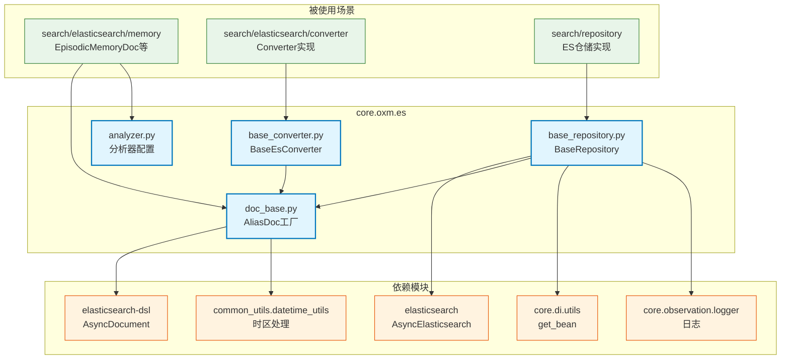

# core.oxm.es

Elasticsearch ORM 模块，基于 elasticsearch-dsl 提供别名索引、时区处理和转换器基类

## 模块位置

**源码路径**: `src/core/oxm/es/`
**文档路径**: `specs/ac_mod/core.oxm.es.ac.mod.md`
**模块类型**: 包模块

## 目录结构

```
src/core/oxm/es/
├── __init__.py               # 包初始化
├── doc_base.py              # 文档基类（别名模式/时区处理）
├── base_repository.py       # 仓储基类（索引管理/搜索）
├── base_converter.py        # 转换器基类（数据源转ES）
├── analyzer.py              # 分析器配置（中英文/自动补全）
└── migration/               # 数据迁移（不含本文档）
```

## 快速开始

### 基本使用

```python
from elasticsearch.dsl import Text, Keyword, Date
from core.oxm.es.doc_base import AliasDoc
from core.oxm.es.base_repository import BaseRepository
from core.oxm.es.analyzer import edge_analyzer, snow_en_analyzer

# 1. 定义文档模型（使用别名模式）
class Article(AliasDoc("article", number_of_shards=2)):
    # ID源字段：自动映射 MongoDB _id 到 ES meta.id
    ID_SOURCE_FIELD = "mongo_id"

    mongo_id: str
    title: Text = Text(analyzer=snow_en_analyzer)
    content: Text = Text(analyzer="standard")
    author: Keyword = Keyword()
    created_at: Date = Date()
    tags: Keyword = Keyword(multi=True)

# 2. 定义仓储
class ArticleRepository(BaseRepository[Article]):
    def __init__(self):
        super().__init__(Article)

# 3. 使用
repo = ArticleRepository()

# 创建索引（带时间戳）
await repo.create_index()
# 创建: article-20231116123456789000
# 别名: article (is_write_index=True)

# 创建文档
article = Article(
    mongo_id="507f1f77bcf86cd799439011",
    title="Machine Learning",
    content="Introduction to ML",
    author="Alice",
    created_at=datetime.now(),  # 自动转换为带时区时间
    tags=["AI", "ML"]
)
await repo.create(article)
# ✅ meta.id 自动设置为 mongo_id 的值

# 搜索
results = await repo.search(query={"match": {"title": "machine"}}, size=10)

# 刷新索引（使数据立即可搜索）
await repo.refresh_index()
```

### 别名索引模式

```python
# 生成带时间戳的索引名，通过别名访问
class MyDoc(AliasDoc("my-doc", number_of_shards=3)):
    field1: Text = Text()

# 索引结构：
# - 别名: my-doc
# - 真实索引: my-doc-20231116123456789000
# - 优势：可以创建新索引后切换别名，实现零停机升级

# 切换索引示例
# 1. 创建新索引：my-doc-20231116234500000000
# 2. 数据迁移到新索引
# 3. 切换别名指向新索引
# 4. 删除旧索引
```

### ID源字段映射

```python
# MongoDB 文档转 ES 文档时，自动映射 _id
class UserDoc(AliasDoc("user")):
    ID_SOURCE_FIELD = "user_id"  # 指定源字段

    user_id: str
    name: str
    email: str

# 创建文档
user = UserDoc(
    user_id="507f1f77bcf86cd799439011",
    name="Bob",
    email="bob@example.com"
)
# ✅ meta.id 自动设置为 "507f1f77bcf86cd799439011"
# ✅ 确保 ES 文档 ID 与 MongoDB _id 一致
```

## 核心组件详解

### 1. doc_base.py - 文档基类

**核心类**:
- `DocBase`: Elasticsearch 文档基础类（继承 AsyncDocument）
- `AliasSupportDoc`: 支持别名模式的文档类
- `AliasDoc()`: 工厂函数，生成带别名的文档类

**别名模式**:
| 组件 | 说明 | 示例 |
|------|------|------|
| PATTERN | 索引模式匹配 | `article-*` |
| Index.name | 别名名称 | `article` |
| dest() | 生成真实索引名 | `article-20231116123456789000` |

**时区处理**:
```python
def _process_date_field(self, field_name: str, field_value: Any) -> Any:
    if isinstance(field_obj, e_field.Date) and isinstance(field_value, datetime):
        return to_timezone(field_value)  # 转换为上海时区
    return field_value
```

**ID源字段机制**:
```python
class MyDoc(AliasSupportDoc):
    ID_SOURCE_FIELD = "mongo_id"  # 指定源字段

    def __init__(self, meta=None, **kwargs):
        # 自动从 kwargs["mongo_id"] 提取值设置到 meta.id
        # 确保 ES 文档 ID 与源数据 ID 一致
```

**工厂函数**:
```python
def AliasDoc(doc_name: str, number_of_shards: int = 2) -> Type[AsyncDocument]:
    # 自动添加环境变量后缀（多租户）
    if get_index_ns():
        doc_name = f"{doc_name}-{get_index_ns()}"

    class GeneratedAliasSupportDoc(AliasSupportDoc):
        PATTERN = f"{doc_name}-*"

        class Index:
            name = doc_name
            settings = {
                "number_of_shards": number_of_shards,
                "number_of_replicas": 1,
                "refresh_interval": "60s",
                "max_ngram_diff": 50,
                "max_shingle_diff": 10,
            }

        class Meta:
            dynamic = MetaField("strict")  # 严格模式，禁止动态字段

    return GeneratedAliasSupportDoc
```

### 2. base_repository.py - 仓储基类

**核心类**: `BaseRepository[T]`

**客户端管理**:
```python
async def get_client(self) -> AsyncElasticsearch:
    if self._client is None:
        es_factory = get_bean("elasticsearch_client_factory")
        client_wrapper = await es_factory.get_default_client()
        self._client = client_wrapper.async_client
    return self._client
```

**CRUD 方法**:
| 方法 | 参数 | 返回值 | 说明 |
|------|------|--------|------|
| create | document, refresh | T | 创建文档 |
| get_by_id | doc_id | Optional[T] | 根据 ID 获取 |
| update | document, refresh | T | 更新文档 |
| delete_by_id | doc_id, refresh | bool | 删除文档 |
| delete | document, refresh | bool | 删除文档实例 |
| create_batch | documents, refresh | List[T] | 批量创建 |

**搜索方法**:
| 方法 | 参数 | 返回值 | 说明 |
|------|------|--------|------|
| search | query, size, from_ | Dict | 执行搜索查询 |
| match_all | size, from_ | List[T] | 获取所有文档 |

**索引管理**:
| 方法 | 返回值 | 说明 |
|------|--------|------|
| create_index | bool | 创建带时间戳的索引并设置别名 |
| delete_index | bool | 删除索引 |
| index_exists | bool | 检查索引是否存在 |
| refresh_index | bool | 手动刷新索引（使数据立即可搜索） |

**索引创建流程**:
```python
async def create_index(self) -> bool:
    # 1. 生成带时间戳的索引名
    if hasattr(self.model, 'dest'):
        index_name = self.model.dest()  # article-20231116123456789000
    else:
        now = get_now_with_timezone()
        alias = self.get_index_name()
        index_name = f"{alias}-{now.strftime('%Y%m%d%H%M%S%f')}"

    # 2. 创建索引
    await self.model.init(index=index_name, using=client)

    # 3. 创建别名（设置为写索引）
    alias = self.get_index_name()
    await client.indices.update_aliases(
        body={
            "actions": [
                {
                    "add": {
                        "index": index_name,
                        "alias": alias,
                        "is_write_index": True,
                    }
                }
            ]
        }
    )
```

### 3. base_converter.py - 转换器基类

**核心类**: `BaseEsConverter[EsDocType]`

**功能**:
- 统一的转换接口（类方法）
- 类型安全的泛型支持
- 自动从泛型获取 ES 文档类型

**接口定义**:
```python
class BaseEsConverter(ABC, Generic[EsDocType]):
    @classmethod
    def get_es_model(cls) -> Type[EsDocType]:
        # 从泛型信息中获取 ES 文档类型
        if hasattr(cls, '__orig_bases__'):
            for base in cls.__orig_bases__:
                if get_origin(base) is BaseEsConverter:
                    args = get_args(base)
                    if args:
                        return args[0]
        raise ValueError(f"无法获取ES文档类型")

    @classmethod
    @abstractmethod
    def from_mongo(cls, source_doc: Any) -> EsDocType:
        # 子类必须实现具体转换逻辑
        raise NotImplementedError()
```

**使用示例**:
```python
from core.oxm.es.base_converter import BaseEsConverter

class ArticleConverter(BaseEsConverter[ArticleDoc]):
    @classmethod
    def from_mongo(cls, mongo_doc: MongoArticle) -> ArticleDoc:
        return ArticleDoc(
            mongo_id=str(mongo_doc.id),
            title=mongo_doc.title,
            content=mongo_doc.content,
            author=mongo_doc.author,
            created_at=mongo_doc.created_at,
            tags=mongo_doc.tags
        )

# 使用
es_doc = ArticleConverter.from_mongo(mongo_article)
await repo.create(es_doc)
```

### 4. analyzer.py - 分析器配置

**分析器列表**:
| 分析器 | 用途 | 示例 |
|--------|------|------|
| completion_analyzer | 自动补全 | "Machine" → ["machine learning"] |
| edge_analyzer | 前缀匹配 | "elastic" → ["e","el","ela",...] |
| lower_keyword_analyzer | 精确匹配（小写） | "Hello" → ["hello"] |
| snow_en_analyzer | 英文词干 | "running" → ["run"] |
| shingle_space_analyzer | 短语搜索 | "hello world" → ["hello world"] |
| shingle_nospace_analyzer | 中文/复合词 | "helloworld" → ["helloworld"] |
| whitespace_lowercase_trim_stop_analyzer | 预分词BM25 | "我 去 北京" → ["我","去","北京"] |

**使用示例**:
```python
from core.oxm.es.analyzer import snow_en_analyzer, edge_analyzer

class ArticleDoc(AliasDoc("article")):
    title: Text = Text(
        analyzer=snow_en_analyzer,  # 索引时使用词干分析
        search_analyzer="standard"   # 搜索时使用标准分析
    )
    tags: Keyword = Keyword(
        normalizer="lower_normalizer"  # 聚合/排序时小写标准化
    )
```

## Mermaid 依赖图



## 依赖关系说明

### 对其他模块的依赖

**core 模块**:
- `core.observation.logger` - 日志记录（base_repository.py:12）
- `core.di.utils.get_bean()` - 获取 Elasticsearch 客户端工厂（base_repository.py:56）

**common 模块**:
- `common_utils.datetime_utils.get_now_with_timezone()` - 获取当前时间（doc_base.py:113, base_repository.py:349）
- `common_utils.datetime_utils.to_timezone()` - 时区转换（doc_base.py:45）

**外部库**:
- `elasticsearch-dsl` - DSL 查询（AsyncDocument, MetaField, field）
- `elasticsearch` - 客户端（AsyncElasticsearch）

### 被依赖关系

通过 Grep 验证（共 13 处使用）：

**仓储层** (`src/infra_layer/adapters/out/search/repository/`):
- `episodic_memory_es_repository.py:12` - 继承 BaseRepository
- `semantic_memory_es_repository.py:12` - 继承 BaseRepository
- `event_log_es_repository.py:12` - 继承 BaseRepository

**文档模型层** (`src/infra_layer/adapters/out/search/elasticsearch/memory/`):
- `episodic_memory.py:3,4,12` - 使用 AliasDoc + analyzer

**转换器层** (`src/infra_layer/adapters/out/search/elasticsearch/converter/`):
- `episodic_memory_converter.py:9,25,31` - 继承 BaseEsConverter
- `semantic_memory_converter.py:12,26` - 继承 BaseEsConverter
- `event_log_converter.py:12,25` - 继承 BaseEsConverter

## 验证测试命令

```bash
# 验证模块导入
python -c "
from core.oxm.es.doc_base import AliasDoc, DocBase, AliasSupportDoc
from core.oxm.es.base_repository import BaseRepository
from core.oxm.es.base_converter import BaseEsConverter
from core.oxm.es.analyzer import snow_en_analyzer, edge_analyzer

print('✅ 模块导入成功')

# 测试 AliasDoc 工厂
ArticleDoc = AliasDoc('test-article', number_of_shards=2)
print('✅ AliasDoc 工厂函数正常')
print(f'  - PATTERN: {ArticleDoc.PATTERN}')
print(f'  - Index name: {ArticleDoc._index._name}')
"

# 验证依赖
cd /home/user/EverMemOS
grep -n "get_bean" src/core/oxm/es/base_repository.py
grep -n "to_timezone" src/core/oxm/es/doc_base.py

# 验证使用场景
grep -r "from core.oxm.es" src/infra_layer --include="*.py" | wc -l
grep -r "BaseEsConverter" src/infra_layer --include="*.py"
grep -r "AliasDoc" src/infra_layer --include="*.py"
```

## 最佳实践

### 1. 文档定义
```python
# ✅ 推荐：使用 AliasDoc 工厂 + ID源字段
class MyDoc(AliasDoc("my-doc", number_of_shards=3)):
    ID_SOURCE_FIELD = "mongo_id"

    mongo_id: str
    title: Text = Text(analyzer=snow_en_analyzer)
    content: Text = Text()

# ❌ 避免：直接继承 AsyncDocument
class BadDoc(AsyncDocument):
    # 缺少别名机制、时区处理、ID映射
    pass
```

### 2. 时区处理
```python
# ✅ 推荐：直接使用 datetime，让基类处理
doc.timestamp = datetime.now()  # 自动转换为上海时区

# ❌ 避免：手动处理时区
doc.timestamp = datetime.now(timezone.utc)  # 可能不一致
```

### 3. 索引创建
```python
# ✅ 推荐：使用仓储的 create_index 方法
await repo.create_index()
# 自动创建带时间戳索引 + 别名

# ❌ 避免：手动创建索引
await client.indices.create(index="article")  # 缺少别名机制
```

### 4. 刷新策略
```python
# ✅ 推荐：写入后手动刷新（测试/重要数据）
await repo.create(doc, refresh=True)  # 立即刷新
# 或
await repo.create(doc)
await repo.refresh_index()  # 手动刷新

# ⚠️ 注意：频繁刷新影响性能
# 生产环境依赖 refresh_interval 配置（默认 60s）
```

### 5. 转换器使用
```python
# ✅ 推荐：继承 BaseEsConverter
class MyConverter(BaseEsConverter[MyDoc]):
    @classmethod
    def from_mongo(cls, mongo_doc: MongoDoc) -> MyDoc:
        return MyDoc(
            mongo_id=str(mongo_doc.id),
            # ... 其他字段
        )

# ❌ 避免：手动转换
es_doc = MyDoc(mongo_id=str(mongo_doc.id), ...)  # 缺少统一接口
```
