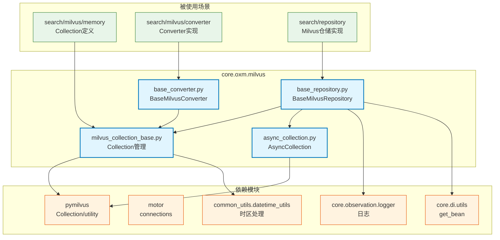

# core.oxm.milvus

Milvus 向量数据库 ORM 模块，提供 Collection 管理、向量搜索和多租户支持

## 模块位置

**源码路径**: `src/core/oxm/milvus/`
**文档路径**: `specs/ac_mod/core.oxm.milvus.ac.mod.md`
**模块类型**: 包模块

## 目录结构

```
src/core/oxm/milvus/
├── __init__.py                     # 包初始化
├── milvus_collection_base.py      # Collection 管理基类
├── base_repository.py             # 仓储基类（CRUD/搜索）
├── base_converter.py              # 转换器基类（数据源转Milvus）
├── async_collection.py            # 异步集合封装
└── migration/                     # 数据迁移（不含本文档）
```

## 快速开始

### 基本使用（只读场景）

```python
from pymilvus import CollectionSchema, FieldSchema, DataType
from core.oxm.milvus.milvus_collection_base import MilvusCollectionBase
from core.oxm.milvus.base_repository import BaseMilvusRepository

# 1. 定义 Collection（只读场景）
class MovieCollection(MilvusCollectionBase):
    _COLLECTION_NAME = "external_movies"  # 固定名称
    _DB_USING = "external_db"  # 外部数据库

# 2. 使用
movie_mgr = MovieCollection()
movie_mgr.ensure_loaded()  # 加载到内存
results = movie_mgr.collection().search(...)
```

### 多租户场景（带 Suffix）

```python
from core.oxm.milvus.milvus_collection_base import (
    MilvusCollectionWithSuffix,
    IndexConfig
)

# 1. 定义 Collection（多租户）
class UserVectorCollection(MilvusCollectionWithSuffix):
    _COLLECTION_NAME = "user_vector"  # 基础名称
    _SCHEMA = CollectionSchema(
        fields=[
            FieldSchema(name="id", dtype=DataType.INT64, is_primary=True),
            FieldSchema(name="embedding", dtype=DataType.FLOAT_VECTOR, dim=768),
            FieldSchema(name="user_id", dtype=DataType.VARCHAR, max_length=255),
            FieldSchema(name="created_at", dtype=DataType.INT64),
        ]
    )
    _INDEX_CONFIGS = [
        IndexConfig(
            field_name="embedding",
            index_type="HNSW",
            metric_type="COSINE",
            params={"M": 16, "efConstruction": 200}
        )
    ]
    _DB_USING = "default"

# 2. 初始化（带租户后缀）
user_vec_mgr = UserVectorCollection(suffix="tenant_a")
user_vec_mgr.ensure_all()
# Collection 名称: user_vector_tenant_a
# 真实名称: user_vector_tenant_a-20231116123456789000

# 3. 使用
user_vec_mgr.collection().insert([...])
user_vec_mgr.collection().search(...)
```

### 仓储使用

```python
from core.oxm.milvus.base_repository import BaseMilvusRepository

# 1. 定义仓储
class UserVectorRepository(BaseMilvusRepository[UserVectorCollection]):
    def __init__(self):
        super().__init__(UserVectorCollection)

# 2. 使用
repo = UserVectorRepository()

# 插入
entity_id = await repo.insert({"id": 1, "embedding": [...], "user_id": "user_1"})

# 查询
entity = await repo.get_by_id("1")

# 向量搜索
results = await repo.collection.search(
    data=[[0.1, 0.2, ...]],
    anns_field="embedding",
    param={"metric_type": "COSINE", "params": {"ef": 64}},
    limit=10,
    output_fields=["user_id", "created_at"]
)
```

## 核心组件详解

### 1. milvus_collection_base.py - Collection 管理

**核心类**:
- `MilvusCollectionBase`: 基础 Collection 管理（只读场景）
- `MilvusCollectionWithSuffix`: 带 Suffix 的 Collection 管理（多租户场景）
- `IndexConfig`: 索引配置数据类

#### MilvusCollectionBase

**适用场景**:
- 只读数据源（由其他团队管理）
- 简单的 Collection 管理
- 不需要 suffix/alias 机制

**类属性**:
| 属性 | 类型 | 必需 | 说明 |
|------|------|------|------|
| _COLLECTION_NAME | str | ✅ | Collection 名称 |
| _SCHEMA | CollectionSchema | ❌ | Schema 定义（只读场景可选） |
| _INDEX_CONFIGS | List[IndexConfig] | ❌ | 索引配置列表 |
| _DB_USING | str | ❌ | 连接别名（默认 "default"） |

**核心方法**:
| 方法 | 返回值 | 说明 |
|------|--------|------|
| collection() | Collection | 获取 Collection 实例（类级缓存） |
| async_collection() | AsyncCollection | 获取异步 Collection 实例 |
| ensure_loaded() | None | 加载 Collection 到内存 |
| ensure_indexes() | None | 创建所有配置的索引（diff 方式） |

**使用示例**:
```python
class ReadOnlyMovieCollection(MilvusCollectionBase):
    _COLLECTION_NAME = "external_movies"
    _DB_USING = "external_db"

mgr = ReadOnlyMovieCollection()
mgr.ensure_loaded()
results = mgr.collection().search(...)
```

#### MilvusCollectionWithSuffix

**适用场景**:
- 多租户场景（不同客户独立 Collection）
- 需要版本管理（保留历史 Collection）
- 需要灰度切换（通过 alias 切换版本）

**类属性**:
| 属性 | 类型 | 必需 | 说明 |
|------|------|------|------|
| _COLLECTION_NAME | str | ✅ | Collection 基础名称 |
| _SCHEMA | CollectionSchema | ✅ | Schema 定义（创建必需） |
| _INDEX_CONFIGS | List[IndexConfig] | ❌ | 索引配置列表 |
| _DB_USING | str | ❌ | 连接别名（默认 "default"） |

**核心方法**:
| 方法 | 返回值 | 说明 |
|------|--------|------|
| ensure_create() | None | 创建 Collection 和 alias |
| ensure_all() | None | 一键初始化（创建+索引+加载） |
| create_new_collection() | Collection | 创建新 Collection（不切换 alias） |
| switch_alias() | None | 切换 alias 到新 Collection |
| exists() | bool | 检查 Collection 是否存在 |
| drop() | None | 删除 Collection |

**Alias 机制**:
| 组件 | 说明 | 示例 |
|------|------|------|
| 基础名称 | _COLLECTION_NAME | `user_vector` |
| Suffix | 租户标识 | `tenant_a` |
| Alias | 访问入口 | `user_vector_tenant_a` |
| 真实名称 | 带时间戳 | `user_vector_tenant_a-20231116123456789000` |

**使用示例**:
```python
class UserVectorCollection(MilvusCollectionWithSuffix):
    _COLLECTION_NAME = "user_vector"
    _SCHEMA = CollectionSchema(fields=[...])
    _INDEX_CONFIGS = [...]

# 初始化
mgr = UserVectorCollection(suffix="tenant_a")
mgr.ensure_all()

# 版本切换
new_coll = mgr.create_new_collection()  # 创建新版本
# ... 数据迁移 ...
mgr.switch_alias(new_coll, drop_old=True)  # 切换并删除旧版本
```

#### IndexConfig

**索引配置数据类**:
```python
@dataclass
class IndexConfig:
    field_name: str              # 字段名
    index_type: str              # 索引类型（IVF_FLAT/HNSW/AUTOINDEX）
    metric_type: Optional[str]   # 度量类型（L2/COSINE/IP）
    params: Optional[Dict]       # 索引参数
    index_name: Optional[str]    # 索引名称

    def to_index_params(self) -> Dict[str, Any]:
        # 转换为 pymilvus 参数格式
        pass
```

**常用索引类型**:
| 类型 | 场景 | 参数示例 |
|------|------|---------|
| HNSW | 高精度向量搜索 | `{"M": 16, "efConstruction": 200}` |
| IVF_FLAT | 平衡精度/性能 | `{"nlist": 128}` |
| AUTOINDEX | 标量索引（自动优化） | 无 |

**使用示例**:
```python
_INDEX_CONFIGS = [
    # 向量索引
    IndexConfig(
        field_name="embedding",
        index_type="HNSW",
        metric_type="COSINE",
        params={"M": 16, "efConstruction": 200}
    ),
    # 标量索引
    IndexConfig(
        field_name="user_id",
        index_type="AUTOINDEX"
    )
]
```

### 2. base_repository.py - 仓储基类

**核心类**: `BaseMilvusRepository[T]`

**CRUD 方法**:
| 方法 | 参数 | 返回值 | 说明 |
|------|------|--------|------|
| insert | entity, flush | str | 插入实体 |
| get_by_id | entity_id | Optional[T] | 根据 ID 获取 |
| upsert | entity, flush | str | 更新/插入实体 |
| delete_by_id | entity_id, flush | bool | 根据 ID 删除 |
| insert_batch | entities, flush | List[str] | 批量插入 |

**集合操作**:
| 方法 | 返回值 | 说明 |
|------|--------|------|
| flush | bool | 刷新集合 |
| load | bool | 加载集合到内存 |

**使用示例**:
```python
class UserVectorRepository(BaseMilvusRepository[UserVectorCollection]):
    def __init__(self):
        super().__init__(UserVectorCollection)

    async def search_by_vector(self, vector, limit=10):
        results = await self.collection.search(
            data=[vector],
            anns_field="embedding",
            param={"metric_type": "COSINE", "params": {"ef": 64}},
            limit=limit,
            output_fields=self.all_output_fields
        )
        return results
```

### 3. base_converter.py - 转换器基类

**核心类**: `BaseMilvusConverter[MilvusCollectionType]`

**功能**:
- 统一的转换接口（类方法）
- 类型安全的泛型支持
- 自动从泛型获取 Milvus Collection 类型

**接口定义**:
```python
class BaseMilvusConverter(ABC, Generic[MilvusCollectionType]):
    @classmethod
    def get_milvus_model(cls) -> Type[MilvusCollectionType]:
        # 从泛型信息中获取 Milvus Collection 类型
        pass

    @classmethod
    @abstractmethod
    def from_mongo(cls, source_doc: Any) -> MilvusCollectionType:
        # 子类必须实现具体转换逻辑
        raise NotImplementedError()
```

**使用示例**:
```python
class UserVectorConverter(BaseMilvusConverter[UserVectorCollection]):
    @classmethod
    def from_mongo(cls, mongo_doc: MongoUser) -> Dict[str, Any]:
        return {
            "id": hash(str(mongo_doc.id)),
            "embedding": mongo_doc.embedding,
            "user_id": str(mongo_doc.id),
            "created_at": int(mongo_doc.created_at.timestamp())
        }

# 使用
milvus_entity = UserVectorConverter.from_mongo(mongo_user)
await repo.insert(milvus_entity)
```

### 4. async_collection.py - 异步集合封装

**功能**:
- 封装同步 Collection 为异步接口
- 使用 asyncio.to_thread 转换同步调用
- 提供统一的异步 API

**关键方法**:
- `insert()` / `insert_batch()`
- `upsert()` / `upsert_batch()`
- `delete()`
- `query()`
- `search()`
- `flush()` / `load()`

## Mermaid 依赖图



## 依赖关系说明

### 对其他模块的依赖

**core 模块**:
- `core.observation.logger` - 日志记录（base_repository.py:11, milvus_collection_base.py:12）
- `core.di.utils.get_bean()` - 获取依赖（base_repository.py:12）

**common 模块**:
- `common_utils.datetime_utils.get_now_with_timezone()` - 获取当前时间（milvus_collection_base.py:113）

**外部库**:
- `pymilvus` - Milvus SDK（Collection, CollectionSchema, utility, connections）
- `asyncio` - 异步支持（async_collection.py）

### 被依赖关系

通过 Grep 验证（共 13 处使用）：

**仓储层** (`src/infra_layer/adapters/out/search/repository/`):
- `event_log_milvus_repository.py:12` - 继承 BaseMilvusRepository
- `episodic_memory_milvus_repository.py:11` - 继承 BaseMilvusRepository
- `semantic_memory_milvus_repository.py:12` - 继承 BaseMilvusRepository

**Collection 层** (`src/infra_layer/adapters/out/search/milvus/memory/`):
- `semantic_memory_collection.py:10` - 继承 MilvusCollectionBase
- `event_log_collection.py:10` - 继承 MilvusCollectionBase
- `episodic_memory_collection.py:9` - 继承 MilvusCollectionBase

**转换器层** (`src/infra_layer/adapters/out/search/milvus/converter/`):
- `semantic_memory_milvus_converter.py:12,24` - 继承 BaseMilvusConverter
- `episodic_memory_milvus_converter.py:11,23,29` - 继承 BaseMilvusConverter
- `event_log_milvus_converter.py:11,23` - 继承 BaseMilvusConverter

## 验证测试命令

```bash
# 验证模块导入
python -c "
from core.oxm.milvus.milvus_collection_base import (
    MilvusCollectionBase,
    MilvusCollectionWithSuffix,
    IndexConfig
)
from core.oxm.milvus.base_repository import BaseMilvusRepository
from core.oxm.milvus.base_converter import BaseMilvusConverter
from core.oxm.milvus.async_collection import AsyncCollection

print('✅ 模块导入成功')
"

# 验证依赖
cd /home/user/EverMemOS
grep -n "get_now_with_timezone" src/core/oxm/milvus/milvus_collection_base.py
grep -n "get_logger" src/core/oxm/milvus/base_repository.py

# 验证使用场景
grep -r "from core.oxm.milvus" src/infra_layer --include="*.py" | wc -l
grep -r "MilvusCollectionBase" src/infra_layer --include="*.py"
grep -r "BaseMilvusConverter" src/infra_layer --include="*.py"
```

## 最佳实践

### 1. Collection 定义选择
```python
# ✅ 只读场景：使用 MilvusCollectionBase
class ReadOnlyCollection(MilvusCollectionBase):
    _COLLECTION_NAME = "external_data"
    _DB_USING = "external_db"

# ✅ 多租户场景：使用 MilvusCollectionWithSuffix
class TenantCollection(MilvusCollectionWithSuffix):
    _COLLECTION_NAME = "user_data"
    _SCHEMA = CollectionSchema(fields=[...])
    _INDEX_CONFIGS = [...]

# ❌ 避免：混淆使用场景
class BadCollection(MilvusCollectionBase):
    _SCHEMA = ...  # 只读场景不需要 Schema
```

### 2. 索引配置
```python
# ✅ 推荐：向量索引 + 标量索引
_INDEX_CONFIGS = [
    # 向量索引（必需 metric_type）
    IndexConfig(
        field_name="embedding",
        index_type="HNSW",
        metric_type="COSINE",
        params={"M": 16, "efConstruction": 200}
    ),
    # 标量索引（用于过滤）
    IndexConfig(
        field_name="user_id",
        index_type="AUTOINDEX"
    )
]

# ❌ 避免：缺少 metric_type
IndexConfig(field_name="embedding", index_type="HNSW")  # 向量索引必需
```

### 3. Suffix 使用
```python
# ✅ 推荐：从环境变量读取
mgr = UserVectorCollection()  # 自动从 SELF_MILVUS_COLLECTION_NS 读取

# ✅ 或显式传入
mgr = UserVectorCollection(suffix="tenant_a")

# ❌ 避免：硬编码 suffix
class BadCollection(MilvusCollectionWithSuffix):
    _COLLECTION_NAME = "user_data_tenant_a"  # 应使用 suffix 机制
```

### 4. 版本切换
```python
# ✅ 推荐：创建新版本 → 迁移数据 → 切换 alias
mgr = UserVectorCollection(suffix="tenant_a")
mgr.ensure_all()

# 创建新版本
new_coll = mgr.create_new_collection()

# 数据迁移（省略具体逻辑）
# ...

# 切换并删除旧版本
mgr.switch_alias(new_coll, drop_old=True)

# ❌ 避免：直接删除旧 Collection
utility.drop_collection(old_name)  # 可能导致服务中断
```

### 5. 异步操作
```python
# ✅ 推荐：使用 async_collection
async_coll = UserVectorCollection.async_collection()
await async_coll.insert([...])
results = await async_coll.search(...)

# ⚠️ 注意：同步 API 在异步环境中会阻塞
coll = UserVectorCollection.collection()
coll.insert([...])  # 阻塞事件循环
```
