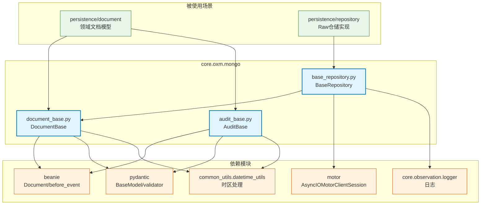

# core.oxm.mongo

MongoDB ORM 模块，基于 Beanie ODM 提供文档基类、审计功能和事务管理

## 模块位置

**源码路径**: `src/core/oxm/mongo/`
**文档路径**: `specs/ac_mod/core.oxm.mongo.ac.mod.md`
**模块类型**: 包模块

## 目录结构

```
src/core/oxm/mongo/
├── __init__.py               # 包初始化
├── document_base.py         # 文档基类（时区处理/数据库绑定）
├── audit_base.py            # 审计基类（Beanie 事件钩子）
├── base_repository.py       # 仓储基类（事务管理/CRUD）
├── constant/
│   └── annotations.py       # 注解常量
└── migration/               # 数据迁移（不含本文档）
```

## 快速开始

### 基本使用

```python
from beanie import PydanticObjectId
from core.oxm.mongo.document_base import DocumentBase
from core.oxm.mongo.audit_base import AuditBase
from core.oxm.mongo.base_repository import BaseRepository

# 1. 定义文档模型
class User(DocumentBase, AuditBase):
    name: str
    email: str
    age: int

    class Settings:
        name = "users"  # Collection 名称
        bind_database = "my_db"  # 绑定数据库

# 2. 定义仓储
class UserRepository(BaseRepository[User]):
    def __init__(self):
        super().__init__(User)

# 3. 使用
repo = UserRepository()

# 创建
user = User(name="Alice", email="alice@example.com", age=25)
await repo.create(user)
# ✅ created_at/updated_at 自动填充（Beanie @before_event 钩子）

# 查询
user = await repo.get_by_id("507f1f77bcf86cd799439011")

# 更新
user.age = 26
await repo.update(user)
# ✅ updated_at 自动更新

# 事务
async with repo.transaction() as session:
    user1 = await repo.create(User(name="Bob", email="bob@example.com", age=30), session=session)
    user2 = await repo.create(User(name="Charlie", email="charlie@example.com", age=35), session=session)
    # 自动提交或回滚
```

### 时区处理示例

```python
from datetime import datetime

# DocumentBase 自动处理时区
user = User(
    name="Dave",
    email="dave@example.com",
    age=40,
    created_at=datetime.now()  # 无时区信息
)

# ✅ 模型验证器自动转换为上海时区
assert user.created_at.tzinfo is not None
print(user.created_at)  # 输出带时区信息

# 递归处理嵌套字段
user.metadata = {
    "registered_at": datetime.now(),  # 自动转换
    "profile": {
        "last_login": datetime.now()  # 递归处理（最多 4 层）
    }
}
```

## 核心组件详解

### 1. document_base.py - 文档基类

**核心类**: `DocumentBase`

**功能**:
- 继承自 `beanie.Document`
- 自动时区转换（递归处理 4 层嵌套）
- 数据库绑定机制
- 字符串表示方法

**关键方法**:
| 方法/属性 | 说明 |
|----------|------|
| `get_bind_database()` | 获取绑定的数据库名称（从 Settings.bind_database 读取） |
| `_recursive_datetime_check()` | 递归检查并转换 datetime 对象为带时区时间 |
| `check_datetimes_are_aware()` | Pydantic 验证器，确保所有 datetime 都有时区信息 |

**时区处理机制**:
```python
@model_validator(mode='after')
def check_datetimes_are_aware(self) -> Self:
    for field_name, value in self:
        new_value = self._recursive_datetime_check(value, field_name, depth=0)
        if new_value is not value:
            self.__dict__[field_name] = new_value
    return self
```

**数据库绑定**:
```python
class MyDoc(DocumentBase):
    class Settings:
        bind_database = "custom_db"  # 绑定到指定数据库
        # 默认为 "default"
```

**限制**:
- 最大递归深度：4 层（防止无限递归）
- 时区：统一使用上海时区（通过 `common_utils.datetime_utils.to_timezone()`）

### 2. audit_base.py - 审计基类

**核心类**: `AuditBase`

**功能**:
- 继承自 `pydantic.BaseModel`
- 提供时间戳字段
- Beanie 事件钩子自动填充

**审计字段**:
| 字段 | 类型 | 说明 | 填充时机 |
|------|------|------|---------|
| created_at | datetime | 创建时间 | @before_event(Insert) |
| updated_at | datetime | 更新时间 | @before_event(Insert/Update) |

**事件钩子**:
```python
@before_event(Insert)
async def set_created_at(self):
    now = get_now_with_timezone()
    self.created_at = now
    self.updated_at = now

@before_event(Update)
async def set_updated_at(self):
    self.updated_at = get_now_with_timezone()
```

**使用示例**:
```python
class Article(DocumentBase, AuditBase):
    title: str
    content: str

    class Settings:
        name = "articles"

# 插入时自动设置 created_at/updated_at
article = Article(title="Hello", content="World")
await article.insert()

# 更新时自动设置 updated_at
article.content = "Updated"
await article.save()
```

### 3. base_repository.py - 仓储基类

**核心类**: `BaseRepository[T]`

**功能**:
- 泛型仓储基类（`T` 必须继承 DocumentBase）
- 事务上下文管理器
- 统一的 CRUD 操作
- 日志记录

**事务管理**:
```python
@asynccontextmanager
async def transaction(self):
    client = self.model.get_motor_client()
    async with await client.start_session() as session:
        async with session.start_transaction():
            try:
                yield session
                logger.info("✅ MongoDB 事务提交成功")
            except Exception as e:
                logger.error("❌ MongoDB 事务回滚: %s", e)
                raise
```

**CRUD 方法**:
| 方法 | 参数 | 返回值 | 说明 |
|------|------|--------|------|
| create | document, session | T | 创建文档 |
| get_by_id | object_id | Optional[T] | 根据 ID 获取 |
| update | document, session | T | 更新文档 |
| delete_by_id | object_id, session | bool | 删除文档 |
| delete | document, session | bool | 删除文档实例 |
| create_batch | documents, session | List[T] | 批量创建 |
| count_all | - | int | 统计数量 |
| exists_by_id | object_id | bool | 检查是否存在 |

**辅助方法**:
| 方法 | 返回值 | 说明 |
|------|--------|------|
| get_model_name | str | 获取模型类名 |
| get_collection_name | str | 获取集合名称 |
| start_session | AsyncIOMotorClientSession | 开始新会话 |

**使用示例**:
```python
from core.di.decorators import repository

@repository
class UserRepository(BaseRepository[User]):
    def __init__(self):
        super().__init__(User)

    async def find_by_email(self, email: str) -> Optional[User]:
        return await User.find_one(User.email == email)

    async def create_with_validation(self, user: User) -> User:
        # 业务验证
        existing = await self.find_by_email(user.email)
        if existing:
            raise ValueError("Email already exists")

        # 创建
        return await self.create(user)
```

## Mermaid 依赖图



## 依赖关系说明

### 对其他模块的依赖

**core 模块**:
- `core.observation.logger` - 日志记录（base_repository.py:14）

**common 模块**:
- `common_utils.datetime_utils.to_timezone()` - 时区转换（document_base.py:68）
- `common_utils.datetime_utils.get_now_with_timezone()` - 获取当前时间（audit_base.py:35）

**外部库**:
- `beanie` - ODM 框架（Document, before_event, Insert, Update）
- `pydantic` - 数据验证（Field, BaseModel, model_validator）
- `motor` - 异步 MongoDB 驱动（AsyncIOMotorClientSession）
- `pymilvus` - ObjectId 类型（PydanticObjectId）

### 被依赖关系

通过 Grep 验证（共 30+ 处使用）：

**文档模型层** (`src/infra_layer/adapters/out/persistence/document/memory/`):
- `group_user_profile_memory.py:4,7,10` - 继承 DocumentBase + AuditBase
- `personal_semantic_memory.py:10,13,17` - 继承 DocumentBase + AuditBase
- `group_profile.py:4,7,67` - 继承 DocumentBase + AuditBase
- `entity.py:3,7,10` - 继承 DocumentBase + AuditBase
- `semantic_memory.py:10,13,16` - 继承 DocumentBase + AuditBase
- `behavior_history.py:4,7` - 继承 DocumentBase + AuditBase

**仓储层** (`src/infra_layer/adapters/out/persistence/repository/`):
- `group_profile_raw_repository.py:5` - 继承 BaseRepository
- `episodic_memory_raw_repository.py:7` - 继承 BaseRepository
- `memcell_raw_repository.py:15` - 继承 BaseRepository
- `entity_raw_repository.py:5` - 继承 BaseRepository
- `conversation_status_raw_repository.py:3` - 继承 BaseRepository
- `semantic_memory_raw_repository.py:13` - 继承 BaseRepository
- `relationship_raw_repository.py:5` - 继承 BaseRepository
- `personal_semantic_memory_raw_repository.py:13` - 继承 BaseRepository
- `conversation_meta_raw_repository.py:11` - 继承 BaseRepository
- `core_memory_raw_repository.py:5` - 继承 BaseRepository
- `group_user_profile_memory_raw_repository.py:13` - 继承 BaseRepository
- `personal_event_log_raw_repository.py:13` - 继承 BaseRepository
- `behavior_history_raw_repository.py:5` - 继承 BaseRepository

## 验证测试命令

```bash
# 验证模块导入
python -c "
from core.oxm.mongo.document_base import DocumentBase, BEANIE_AVAILABLE
from core.oxm.mongo.audit_base import AuditBase
from core.oxm.mongo.base_repository import BaseRepository

print('✅ Beanie 可用:', BEANIE_AVAILABLE)
print('✅ 模块导入成功')
"

# 验证依赖
cd /home/user/EverMemOS
grep -n "get_now_with_timezone" src/core/oxm/mongo/audit_base.py
grep -n "to_timezone" src/core/oxm/mongo/document_base.py

# 验证使用场景（前 10 个）
grep -r "from core.oxm.mongo" src/infra_layer --include="*.py" | head -10

# 统计使用次数
echo "DocumentBase 使用次数:"
grep -r "DocumentBase" src/infra_layer --include="*.py" | grep "from core.oxm.mongo" | wc -l

echo "BaseRepository 使用次数:"
grep -r "BaseRepository" src/infra_layer --include="*.py" | grep "from core.oxm.mongo" | wc -l
```

## 最佳实践

### 1. 文档模型定义
```python
# ✅ 推荐：同时继承 DocumentBase 和 AuditBase
class MyDoc(DocumentBase, AuditBase):
    field1: str
    field2: int

    class Settings:
        name = "my_collection"
        bind_database = "my_db"

# ❌ 避免：只继承 DocumentBase（缺少审计字段）
class BadDoc(DocumentBase):
    field1: str
```

### 2. 时区处理
```python
# ✅ 推荐：直接使用 datetime.now()，让基类处理时区
from datetime import datetime
doc.timestamp = datetime.now()  # 自动转换为上海时区

# ❌ 避免：手动处理时区
from datetime import timezone
doc.timestamp = datetime.now(timezone.utc)  # 可能导致不一致
```

### 3. 事务使用
```python
# ✅ 推荐：使用事务上下文管理器
async with repo.transaction() as session:
    await repo.create(doc1, session=session)
    await repo.create(doc2, session=session)
    # 自动提交

# ❌ 避免：手动管理 session
session = await repo.start_session()
try:
    await repo.create(doc1, session=session)
    await repo.create(doc2, session=session)
finally:
    await session.end_session()  # 容易忘记
```

### 4. 仓储扩展
```python
# ✅ 推荐：继承 BaseRepository 并添加业务方法
class UserRepository(BaseRepository[User]):
    async def find_by_email(self, email: str) -> Optional[User]:
        return await User.find_one(User.email == email)

# ❌ 避免：直接使用 Beanie API
user = await User.find_one(User.email == "test@example.com")  # 缺少日志/错误处理
```
