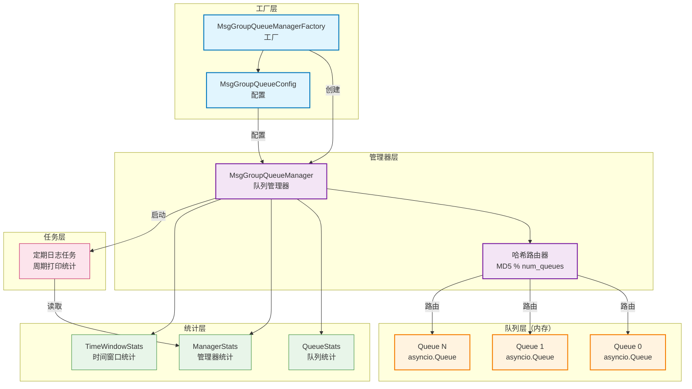

# core.queue.msg_group_queue

基于内存的消息分组队列管理，解决 Kafka 消息处理的阻塞问题。

## 模块位置

**源码路径**: `src/core/queue/msg_group_queue/`
**文档路径**: `specs/ac_mod/core.queue.msg_group_queue.ac.mod.md`
**模块类型**: 包模块

## 目录结构

```
src/core/queue/msg_group_queue/
├── __init__.py                          # 包初始化（空文件）
├── msg_group_queue_manager.py           # 消息分组队列管理器
└── msg_group_queue_manager_factory.py   # 管理器工厂
```

## 快速开始

### 基本使用方式

```python
from core.queue.msg_group_queue.msg_group_queue_manager_factory import MsgGroupQueueManagerFactory
import asyncio

# === 1. 使用工厂创建管理器 ===
factory = MsgGroupQueueManagerFactory()

# 获取默认管理器（从环境变量配置）
manager = await factory.get_default_manager(auto_start=True)

# 或使用自定义配置创建
manager = await factory.create_manager_with_config(
    name="my_queue",
    num_queues=10,
    max_total_messages=100,
    auto_start=True
)

# === 2. 投递消息 ===
# 基于 group_key 哈希路由到固定队列
success = await manager.deliver_message(
    group_key="user_123",
    message_data={"action": "login", "timestamp": 1700000000}
)
print(f"投递成功: {success}")

# === 3. 消费消息 ===
# 从指定队列获取消息（阻塞等待）
message = await manager.get_by_queue(queue_id=5, wait=True, timeout=1.0)
if message:
    group_key, data = message
    print(f"Group: {group_key}, Data: {data}")

# 非阻塞获取
message = await manager.get_by_queue(queue_id=5, wait=False)
if message is None:
    print("队列为空")

# === 4. 获取统计信息 ===
# 获取管理器整体统计
manager_stats = await manager.get_manager_stats()
print(f"总队列: {manager_stats['total_queues']}")
print(f"总消息: {manager_stats['total_current_messages']}")
print(f"总投递: {manager_stats['total_delivered_messages']}")
print(f"总消费: {manager_stats['total_consumed_messages']}")
print(f"1分钟内投递: {manager_stats['delivered_1min']}")
print(f"1分钟内消费: {manager_stats['consumed_1min']}")

# 获取特定队列统计
queue_info = await manager.get_queue_info(queue_id=5)
print(f"队列5大小: {queue_info['current_size']}")
print(f"队列5总投递: {queue_info['total_delivered']}")

# 获取所有队列统计
all_queues = await manager.get_queue_info()
for q in all_queues:
    print(f"队列{q['queue_id']}: {q['current_size']}条消息")

# 获取完整汇总
summary = await manager.get_summary()
print(f"管理器: {summary['manager']}")
print(f"队列详情: {summary['queues']}")

# === 5. 关闭管理器 ===
# 软性关闭（检查是否有剩余消息）
success = await manager.shutdown(mode=ShutdownMode.SOFT, max_delay_seconds=30)
if not success:
    print("还有消息未处理")

# 硬性关闭（直接关闭，记录未处理消息）
await manager.shutdown(mode=ShutdownMode.HARD)
```

### 使用环境变量配置

```bash
# 设置环境变量
export MSG_QUEUE_NAME="default"
export MSG_QUEUE_NUM_QUEUES="10"
export MSG_QUEUE_MAX_TOTAL_MESSAGES="100"
export MSG_QUEUE_ENABLE_METRICS="true"
export MSG_QUEUE_LOG_INTERVAL_SECONDS="30"

# 使用命名管理器（读取 CLIENT_ 前缀的环境变量）
export CLIENT_MSG_QUEUE_NUM_QUEUES="20"
export CLIENT_MSG_QUEUE_MAX_TOTAL_MESSAGES="200"
```

```python
# 使用默认配置
manager = await factory.get_default_manager()

# 使用命名配置（CLIENT_ 前缀）
client_manager = await factory.get_named_manager("CLIENT")
```

## 核心组件详解

### 1. MsgGroupQueueManager - 消息分组队列管理器

**源码**: `msg_group_queue_manager.py`

**核心特性：**
1. 固定数量的队列（默认10个，可配置）
2. 基于 group_key 哈希路由到固定分组
3. 支持最大消息数量限制（默认100个）
4. 空队列优先投递策略
5. 支持 wait/no-wait 模式的消息获取
6. 提供详细的 metrics 和日志

**初始化参数：**
```python
MsgGroupQueueManager(
    name="default",              # 管理器名称
    num_queues=10,               # 队列数量
    max_total_messages=100,      # 最大总消息数
    enable_metrics=True,         # 是否启用统计
    log_interval_seconds=30      # 日志打印间隔
)
```

**主要方法：**

**投递消息：**
```python
async def deliver_message(group_key: str, message_data: Any) -> bool
```
- 基于 group_key 计算目标队列（MD5 哈希）
- 检查投递条件：总数未超限 或 有空队列
- 更新统计信息和时间窗口事件
- 返回投递是否成功

**获取消息：**
```python
async def get_by_queue(queue_id: int, wait: bool = True, timeout: Optional[float] = None) -> Optional[Tuple[str, Any]]
```
- `wait=True`: 阻塞等待消息
- `wait=False`: 立即返回（无消息返回 None）
- `timeout`: 等待超时时间（秒）
- 返回 (group_key, message_data) 元组

**获取统计：**
```python
async def get_queue_info(queue_id: Optional[int] = None) -> Union[Dict, List[Dict]]
async def get_manager_stats() -> Dict[str, Any]
async def get_summary() -> Dict[str, Any]
```

**周期任务：**
```python
async def start_periodic_logging()  # 启动定期日志
async def stop_periodic_logging()   # 停止定期日志
```

**关闭管理器：**
```python
async def shutdown(mode: ShutdownMode = ShutdownMode.HARD, max_delay_seconds: Optional[float] = None) -> bool
```

### 2. 数据结构

**ShutdownMode - 关闭模式：**
```python
class ShutdownMode(Enum):
    SOFT = "soft"  # 软性关闭：检查是否有消息
    HARD = "hard"  # 硬性关闭：直接关闭
```

**QueueStats - 队列统计：**
```python
@dataclass
class QueueStats:
    queue_id: int                    # 队列ID
    current_size: int                # 当前大小
    total_delivered: int             # 总投递数
    total_consumed: int              # 总消费数
    last_deliver_time: Optional[str] # 最后投递时间
    last_consume_time: Optional[str] # 最后消费时间
    delivered_1min: int              # 1分钟内投递数
    consumed_1min: int               # 1分钟内消费数
    delivered_1hour: int             # 1小时内投递数
    consumed_1hour: int              # 1小时内消费数
```

**ManagerStats - 管理器统计：**
```python
@dataclass
class ManagerStats:
    total_queues: int                # 总队列数
    total_current_messages: int      # 当前总消息数
    total_delivered_messages: int    # 总投递消息数
    total_consumed_messages: int     # 总消费消息数
    total_rejected_messages: int     # 总拒绝消息数
    start_time: str                  # 启动时间
    uptime_seconds: float            # 运行时长
    delivered_1min: int              # 1分钟内投递数
    consumed_1min: int               # 1分钟内消费数
    delivered_1hour: int             # 1小时内投递数
    consumed_1hour: int              # 1小时内消费数
```

### 3. MsgGroupQueueManagerFactory - 管理器工厂

**源码**: `msg_group_queue_manager_factory.py`

**核心功能：**
- 配置管理：支持环境变量和代码配置
- 实例缓存：相同配置复用同一实例
- 命名管理器：支持多套配置

**配置类：**
```python
class MsgGroupQueueConfig:
    name: str                    # 管理器名称
    num_queues: int              # 队列数量
    max_total_messages: int      # 最大总消息数
    enable_metrics: bool         # 是否启用统计
    log_interval_seconds: int    # 日志间隔

    @classmethod
    def from_env(cls, prefix: str = "") -> 'MsgGroupQueueConfig'
```

**主要方法：**
```python
# 获取管理器（使用配置对象）
async def get_manager(config: Optional[MsgGroupQueueConfig] = None, auto_start: bool = True) -> MsgGroupQueueManager

# 获取默认管理器
async def get_default_manager(auto_start: bool = True) -> MsgGroupQueueManager

# 获取命名管理器（读取 {name}_ 前缀的环境变量）
async def get_named_manager(name: str, auto_start: bool = True) -> MsgGroupQueueManager

# 使用参数创建管理器
async def create_manager_with_config(name: str = "default", num_queues: int = 10, ...) -> MsgGroupQueueManager

# 停止管理器
async def stop_manager(config: Optional[MsgGroupQueueConfig] = None)
async def stop_all_managers()
```

### 4. 核心算法

**哈希路由算法：**
```python
def _hash_route(self, group_key: str) -> int:
    """基于 group_key 计算哈希路由到队列编号"""
    hash_obj = hashlib.md5(group_key.encode('utf-8'))
    hash_int = int(hash_obj.hexdigest(), 16)
    return hash_int % self.num_queues
```

**投递条件检查：**
```python
def _can_deliver_message(self) -> Tuple[bool, str]:
    """检查是否可以投递消息"""
    current_total = self._get_total_current_messages()
    has_empty_queue = any(q.qsize() == 0 for q in self._queues)

    # 投递条件：总数未超限 或者 有空队列
    if current_total >= self.max_total_messages and not has_empty_queue:
        return False, "总数超限且无空队列"
    return True, ""
```

**时间窗口统计：**
```python
def _count_events_in_window(self, events: deque, window_seconds: float) -> int:
    """统计指定时间窗口内的事件数量"""
    current_time = time.time()
    # 清理旧事件
    while events and current_time - events[0] > window_seconds:
        events.popleft()
    return len(events)
```

## Mermaid 架构图



## 依赖关系说明

### 对其他模块的依赖

通过 Grep 验证:
```bash
grep -r "^from\|^import" src/core/queue/msg_group_queue/*.py | grep -v "^#"
```

**msg_group_queue_manager.py**:
- `asyncio`: 异步队列和锁
- `hashlib`: MD5 哈希
- `time`: 时间戳
- `random`: 随机数
- `typing`: 类型注解
- `dataclasses`: 数据类
- `enum`: 枚举类
- `collections.deque`: 双端队列（时间窗口事件）
- `core.observation.logger.get_logger`: 日志记录器
- `common_utils.datetime_utils`: 时间工具

**msg_group_queue_manager_factory.py**:
- `os`: 环境变量
- `asyncio`: 异步锁
- `typing`: 类型注解
- `core.di.decorators.component`: DI 装饰器
- `core.observation.logger.get_logger`: 日志记录器

### 被依赖关系

通过 Grep 验证:
```bash
grep -r "from core.queue.msg_group_queue\|import.*MsgGroupQueue" src/ --include="*.py" | grep -v "src/core/queue/msg_group_queue/"
```

目前无其他模块直接依赖（独立使用）。

## 使用场景

### 1. Kafka 消息缓冲

```python
# Kafka 消费者将消息投递到队列
async def kafka_consumer():
    manager = await factory.get_default_manager()

    async for msg in kafka_consumer:
        # 基于 partition_key 路由
        await manager.deliver_message(
            group_key=msg.partition_key,
            message_data=msg.value
        )

# 多个工作协程从各自队列消费
async def worker(queue_id: int):
    manager = await factory.get_default_manager()

    while True:
        message = await manager.get_by_queue(queue_id, wait=True)
        if message:
            group_key, data = message
            await process_message(data)
```

### 2. 任务分发

```python
# 任务生产者
async def task_producer():
    manager = await factory.get_default_manager()

    for task in tasks:
        await manager.deliver_message(
            group_key=task.group_id,
            message_data=task
        )

# 任务消费者（多个）
async def task_consumer(queue_id: int):
    manager = await factory.get_default_manager()

    while True:
        message = await manager.get_by_queue(queue_id, wait=True, timeout=5.0)
        if message:
            _, task = message
            await execute_task(task)
```

## 可以验证模块可运行的测试命令

```bash
# 1. 验证模块导入
python -c "
from core.queue.msg_group_queue.msg_group_queue_manager import MsgGroupQueueManager
from core.queue.msg_group_queue.msg_group_queue_manager_factory import MsgGroupQueueManagerFactory
print('模块导入成功')
print(f'管理器类: {MsgGroupQueueManager}')
print(f'工厂类: {MsgGroupQueueManagerFactory}')
"

# 2. 测试哈希路由
python -c "
import hashlib

def hash_route(group_key, num_queues):
    hash_obj = hashlib.md5(group_key.encode('utf-8'))
    hash_int = int(hash_obj.hexdigest(), 16)
    return hash_int % num_queues

# 测试路由一致性
for i in range(5):
    result = hash_route('user_123', 10)
    print(f'第{i+1}次路由: queue_{result}')

# 测试路由分布
distribution = {}
for i in range(1000):
    queue_id = hash_route(f'user_{i}', 10)
    distribution[queue_id] = distribution.get(queue_id, 0) + 1
print(f'路由分布: {distribution}')
"

# 3. 测试基本功能
python -c "
import asyncio
from core.queue.msg_group_queue.msg_group_queue_manager import MsgGroupQueueManager

async def test():
    # 创建管理器
    manager = MsgGroupQueueManager(
        name='test',
        num_queues=5,
        max_total_messages=20
    )

    # 投递消息
    for i in range(10):
        success = await manager.deliver_message(f'group_{i}', {'id': i})
        print(f'投递消息{i}: {success}')

    # 获取统计
    stats = await manager.get_manager_stats()
    print(f'总消息: {stats[\"total_current_messages\"]}')
    print(f'总投递: {stats[\"total_delivered_messages\"]}')

    # 获取所有队列信息
    queues = await manager.get_queue_info()
    for q in queues:
        if q['current_size'] > 0:
            print(f'队列{q[\"queue_id\"]}: {q[\"current_size\"]}条消息')

    # 消费消息
    for i in range(5):
        msg = await manager.get_by_queue(i, wait=False)
        if msg:
            group_key, data = msg
            print(f'从队列{i}获取: {group_key} -> {data}')

    # 关闭
    await manager.shutdown()

asyncio.run(test())
"

# 4. 测试工厂模式
python -c "
import asyncio
from core.queue.msg_group_queue.msg_group_queue_manager_factory import MsgGroupQueueManagerFactory

async def test():
    factory = MsgGroupQueueManagerFactory()

    # 创建管理器
    manager = await factory.create_manager_with_config(
        name='test',
        num_queues=3,
        max_total_messages=10,
        auto_start=False
    )

    # 投递和消费
    await manager.deliver_message('key1', {'data': 'test'})
    stats = await manager.get_manager_stats()
    print(f'统计: {stats}')

    # 关闭
    await factory.stop_all_managers()

asyncio.run(test())
"

# 5. 测试环境变量配置
MSG_QUEUE_NUM_QUEUES=8 MSG_QUEUE_MAX_TOTAL_MESSAGES=50 python -c "
import asyncio
from core.queue.msg_group_queue.msg_group_queue_manager_factory import MsgGroupQueueManagerFactory

async def test():
    factory = MsgGroupQueueManagerFactory()
    manager = await factory.get_default_manager(auto_start=False)
    print(f'队列数: {manager.num_queues}')
    print(f'最大消息数: {manager.max_total_messages}')

asyncio.run(test())
"

# 6. 运行测试套件（如果存在）
pytest src/core/queue/msg_group_queue/ -v
```
