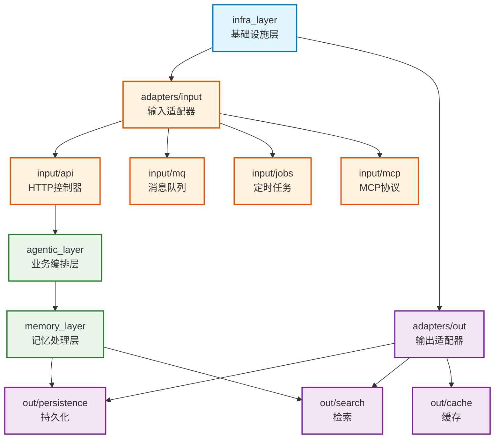

# infra_layer

六边形架构基础设施层，提供适配器实现，连接外部接口与核心业务逻辑

## 模块位置

**源码路径**: `src/infra_layer/`
**文档路径**: `specs/ac_mod/infra_layer.ac.mod.md`
**模块类型**: 包模块

## 目录结构

```
src/infra_layer/
├── __init__.py
├── adapters/              # 适配器层
│   ├── input/            # 输入适配器（API/MQ/Jobs/MCP）
│   └── out/              # 输出适配器（DB/Search/Cache）
├── log/                  # 日志配置
└── scripts/              # 工具脚本
```

## 快速开始

### 六边形架构概览

```python
# 输入适配器：外部请求 → 核心业务
from infra_layer.adapters.input.api.v2.agentic_v2_controller import AgenticV2Controller
from infra_layer.adapters.input.format_transfer import convert_single_message_to_raw_data

# 输出适配器：核心业务 → 外部服务
from infra_layer.adapters.out.persistence.repository import *
from infra_layer.adapters.out.search.repository import *
```

### 输入适配器

```python
# API 控制器（HTTP 输入端口）
controller = AgenticV2Controller()
controller.register_to_app(app)

# 消息格式转换（MQ 输入端口）
raw_data = await convert_single_message_to_raw_data(
    input_data={"_id": "msg_1", "content": "hello", "createTime": "2024-01-15T10:00:00Z"},
    group_name="test_group"
)
```

## 核心组件详解

### 1. 适配器层架构

**输入适配器（Input Adapters）**:
- `api/`: FastAPI 控制器，提供 RESTful API
  - `v2/`: V2 API（多端点）
  - `v3/`: V3 API（简化格式）
  - `health/`: 健康检查
- `mq/`: 消息队列消费者
- `jobs/`: 定时任务触发器
- `mcp/`: MCP 协议适配

**输出适配器（Output Adapters）**:
- `out/persistence/`: 数据持久化（MongoDB/PostgreSQL）
- `out/search/`: 检索服务（Elasticsearch/Milvus）
- `out/cache/`: 缓存服务（Redis）

### 2. 六边形架构模式

```
外部世界                    输入适配器                  核心层                 输出适配器               外部服务
┌─────────┐              ┌──────────────┐           ┌─────────┐          ┌──────────────┐        ┌─────────┐
│ HTTP API│─────────────>│API Controller│──────────>│ Agentic │─────────>│ Repository   │───────>│Database │
└─────────┘              └──────────────┘           │  Layer  │          └──────────────┘        └─────────┘
┌─────────┐              ┌──────────────┐           │         │          ┌──────────────┐        ┌─────────┐
│   MQ    │─────────────>│MQ Consumer   │──────────>│ Memory  │─────────>│ Search Repo  │───────>│  ES/    │
└─────────┘              └──────────────┘           │  Layer  │          └──────────────┘        │ Milvus  │
└─────────┘          └──────────────┘        └─────────┘
```

**设计原则**:
- 核心业务逻辑不依赖外部实现
- 适配器实现端口接口
- 依赖注入管理组件生命周期
- 单向依赖：外层依赖内层

## Mermaid 依赖图



## 依赖关系说明

### 对其他模块的依赖

输入适配器依赖:
- `specs/ac_mod/core.interface.controller.ac.mod.md` - BaseController 控制器基类
- `specs/ac_mod/core.di.ac.mod.md` - 依赖注入装饰器

业务层依赖（被适配）:
- `agentic_layer.memory_manager` - 记忆管理器
- `memory_layer.memcell_extractor` - 记忆提取器

### 被依赖关系

- FastAPI 应用入口（`src/main.py`）- 注册所有输入适配器控制器
- 消息队列消费者 - 使用 MQ 适配器
- 定时任务调度器 - 使用 Jobs 适配器

## 可以验证模块可运行的测试命令

```bash
# 检查输入适配器导入
python -c "from infra_layer.adapters.input.api.v2.agentic_v2_controller import AgenticV2Controller; print('OK')"

# 检查格式转换器
python -c "from infra_layer.adapters.input.format_transfer import convert_single_message_to_raw_data; print('OK')"

# 查找所有控制器
grep -r "class.*Controller(BaseController)" src/infra_layer/adapters/input/

# 查找所有适配器使用
grep -r "from infra_layer" src/ | head -20
```
