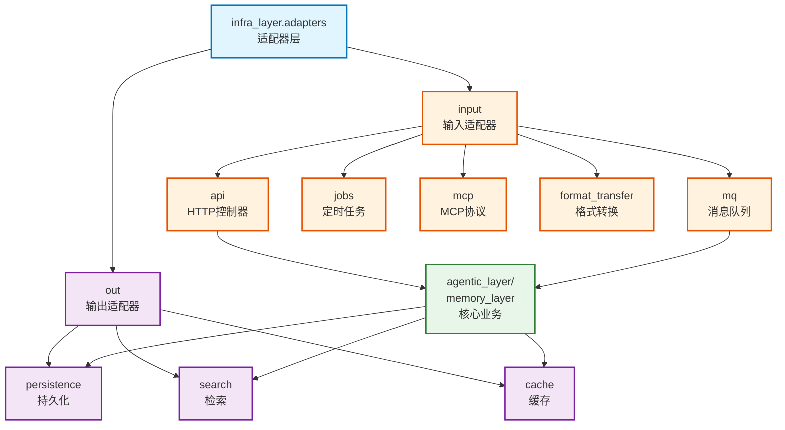

# infra_layer.adapters

六边形架构适配器层，包含输入适配器（Input）和输出适配器（Output）

## 模块位置

**源码路径**: `src/infra_layer/adapters/`
**文档路径**: `specs/ac_mod/infra_layer.adapters.ac.mod.md`
**模块类型**: 包模块

## 目录结构

```
src/infra_layer/adapters/
├── __init__.py
├── input/                     # 输入适配器（驱动端）
│   ├── api/                  # HTTP API 控制器
│   ├── mq/                   # 消息队列消费者
│   ├── jobs/                 # 定时任务
│   ├── mcp/                  # MCP 协议
│   └── format_transfer.py    # 格式转换工具
└── out/                      # 输出适配器（被动端）
    ├── persistence/          # 持久化（MongoDB/PostgreSQL）
    ├── search/              # 检索（Elasticsearch/Milvus）
    └── cache/               # 缓存（Redis）
```

## 快速开始

### 输入适配器使用

```python
# 1. HTTP API 适配器
from infra_layer.adapters.input.api.v2.agentic_v2_controller import AgenticV2Controller

controller = AgenticV2Controller()
app = FastAPI()
controller.register_to_app(app)

# 2. 格式转换适配器
from infra_layer.adapters.input.format_transfer import convert_single_message_to_raw_data

raw_data = await convert_single_message_to_raw_data(
    input_data={
        "_id": "msg_123",
        "fullName": "张三",
        "content": "讨论项目进展",
        "createTime": "2024-01-15T10:00:00Z",
        "roomId": "group_456"
    },
    group_name="项目组"
)
```

### 输出适配器使用

```python
# 持久化适配器
from infra_layer.adapters.out.persistence.repository import EpisodicMemoryMongoRepository

repo = EpisodicMemoryMongoRepository()
await repo.save_memory(memory_data)

# 检索适配器
from infra_layer.adapters.out.search.repository import EpisodicMemoryESRepository

search_repo = EpisodicMemoryESRepository()
results = await search_repo.search_by_keyword(query="项目讨论", user_id="user_123")
```

## 核心组件详解

### 1. 输入适配器（Input Adapters）

**作用**: 将外部请求转换为核心业务层可处理的格式

**类型**:
| 适配器 | 协议 | 用途 | 关键组件 |
|--------|------|------|----------|
| `api/` | HTTP/REST | RESTful API 端点 | AgenticV2Controller, AgenticV3Controller |
| `mq/` | AMQP/Kafka | 异步消息处理 | MQ Consumer, Mapper |
| `jobs/` | Cron/APScheduler | 定时任务触发 | Job Scheduler |
| `mcp/` | MCP Protocol | MCP 协议集成 | MCP Server |

### 2. 输出适配器（Output Adapters）

**作用**: 将核心业务逻辑的输出持久化到外部服务

**类型**:
| 适配器 | 技术栈 | 用途 |
|--------|--------|------|
| `persistence/` | MongoDB/PostgreSQL | 文档存储、关系数据 |
| `search/` | Elasticsearch/Milvus | 全文检索、向量检索 |
| `cache/` | Redis | 缓存、会话管理 |

### 3. 六边形架构原则

```
输入适配器原则:
- 接收外部格式（HTTP JSON, MQ Message）
- 验证和转换为领域对象
- 调用核心业务端口
- 转换业务响应为外部格式

输出适配器原则:
- 实现核心业务定义的端口接口
- 处理外部服务通信细节
- 错误处理和重试逻辑
- 不包含业务逻辑
```

## Mermaid 依赖图



## 依赖关系说明

### 对其他模块的依赖

输入适配器:
- `specs/ac_mod/core.interface.controller.ac.mod.md` - BaseController
- `specs/ac_mod/core.di.ac.mod.md` - 依赖注入
- `agentic_layer.memory_manager` - 业务编排

输出适配器:
- `specs/ac_mod/core.oxm.ac.mod.md` - ORM/ODM 映射
- `specs/ac_mod/core.cache.ac.mod.md` - 缓存抽象

### 被依赖关系

- `specs/ac_mod/infra_layer.ac.mod.md` - 父模块
- FastAPI 应用（`src/main.py`）

## 可以验证模块可运行的测试命令

```bash
# 检查输入适配器
python -c "from infra_layer.adapters.input.api.v2.agentic_v2_controller import AgenticV2Controller; print('Input OK')"

# 检查输出适配器
python -c "from infra_layer.adapters.out.persistence.repository import *; print('Output OK')"

# 查找所有适配器
find src/infra_layer/adapters -name "*.py" -type f | grep -v __pycache__ | wc -l

# 验证格式转换
python -c "from infra_layer.adapters.input.format_transfer import convert_single_message_to_raw_data; print('Format OK')"
```
