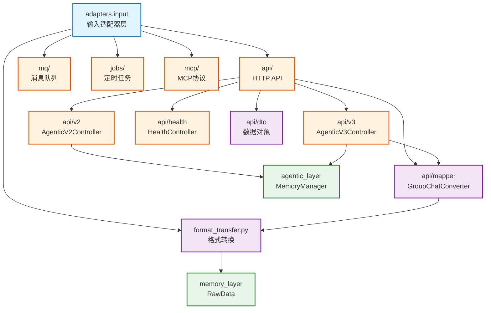

# infra_layer.adapters.input

六边形架构输入适配器，将外部请求转换为核心业务调用

## 模块位置

**源码路径**: `src/infra_layer/adapters/input/`
**文档路径**: `specs/ac_mod/infra_layer.adapters.input.ac.mod.md`
**模块类型**: 包模块

## 目录结构

```
src/infra_layer/adapters/input/
├── __init__.py
├── format_transfer.py         # 数据格式转换工具
├── api/                       # HTTP API 控制器
│   ├── dto/                  # 数据传输对象
│   ├── mapper/               # 格式映射器
│   ├── v2/                   # V2 API（多端点）
│   ├── v3/                   # V3 API（简化格式）
│   └── health/               # 健康检查
├── mq/                       # 消息队列消费者
│   └── mapper/               # MQ 消息映射
├── jobs/                     # 定时任务触发器
└── mcp/                      # MCP 协议适配器
```

## 快速开始

### API 控制器

```python
from infra_layer.adapters.input.api.v2.agentic_v2_controller import AgenticV2Controller
from fastapi import FastAPI

app = FastAPI()
controller = AgenticV2Controller()
controller.register_to_app(app)

# 提供的端点:
# POST /api/v2/agentic/memorize - 存储记忆
# POST /api/v2/agentic/fetch - 获取记忆
# POST /api/v2/agentic/retrieve - 检索记忆
```

### 格式转换

```python
from infra_layer.adapters.input.format_transfer import (
    convert_single_message_to_raw_data,
    convert_conversation_to_raw_data_list
)

# 单条消息转换
raw_data = await convert_single_message_to_raw_data(
    input_data={
        "_id": "msg_123",
        "fullName": "张三",
        "roomId": "group_456",
        "content": "讨论新功能",
        "createTime": "2024-01-15T10:00:00Z",
        "createBy": "user_001"
    },
    group_name="项目组"
)

# 批量转换
raw_data_list = await convert_conversation_to_raw_data_list(
    input_data_list=[msg1, msg2, msg3],
    group_name="项目组"
)
```

### 格式映射器

```python
from infra_layer.adapters.input.api.mapper.group_chat_converter import (
    convert_group_chat_format_to_memorize_input,
    validate_group_chat_format_input
)

# 验证 GroupChatFormat
if validate_group_chat_format_input(data):
    # 转换为 memorize 输入格式
    memorize_input = convert_group_chat_format_to_memorize_input(data)
```

## 核心组件详解

### 1. format_transfer 模块

**功能**: 将外部消息格式转换为 RawData 格式

**核心函数**:
- `convert_single_message_to_raw_data()`: 单条消息转换
  - 输入: 包含 `_id, fullName, content, createTime` 等字段的字典
  - 输出: `RawData` 对象（包含 content, data_id, metadata）
  - 时区处理: 使用 UTC 时区转换时间

- `convert_conversation_to_raw_data_list()`: 批量消息转换
  - 输入: 消息列表
  - 输出: `RawData` 对象列表

**字段映射**:
```python
content = {
    "speaker_name": input_data.get("fullName"),
    "speaker_id": input_data.get("createBy"),
    "roomId": input_data.get("roomId"),
    "groupName": group_name,  # 外部传入
    "content": input_data.get("content"),
    "timestamp": from_iso_format(input_data.get("createTime"), ZoneInfo("UTC")),
    "data_id": data_id
}
```

### 2. API 适配器架构

**控制器层次**:
| 控制器 | 路由前缀 | 特点 | 使用场景 |
|--------|----------|------|----------|
| `v2/AgenticV2Controller` | `/api/v2/agentic` | 多端点，功能分离 | 灵活的 API 调用 |
| `v3/AgenticV3Controller` | `/api/v3/agentic` | 简化格式，单条消息 | 实时消息流处理 |
| `health/HealthController` | `/api/health` | 健康检查 | 服务监控 |

**V2 vs V3 对比**:
```python
# V2: 接收内部格式（需预转换）
{
  "messages": [{
    "_id": "msg_1",
    "fullName": "张三",
    "content": "hello"
  }],
  "raw_data_type": "Conversation"
}

# V3: 简化直接格式（自动转换）
{
  "message_id": "msg_1",
  "sender": "user_1",
  "sender_name": "张三",
  "content": "hello",
  "create_time": "2024-01-15T10:00:00Z"
}
```

### 3. Mapper 映射器

**GroupChatFormat 映射器**:
- `validate_group_chat_format_input()`: 验证开源群聊格式
- `convert_group_chat_format_to_memorize_input()`: 转换为 memorize 格式
- `convert_simple_message_to_memorize_input()`: 简单消息格式转换

**映射流程**:
```
GroupChatFormat → validate → convert → MemorizeRequest
                                     ↓
                              MemoryManager.memorize()
```

## Mermaid 依赖图



## 依赖关系说明

### 对其他模块的依赖

- `specs/ac_mod/core.interface.controller.ac.mod.md` - BaseController 基类
- `specs/ac_mod/core.di.ac.mod.md` - @controller 装饰器
- `memory_layer.memcell_extractor.base_memcell_extractor` - RawData 定义
- `agentic_layer.memory_manager` - MemoryManager 业务编排
- `agentic_layer.converter` - DTO 转换器

### 被依赖关系

- `specs/ac_mod/infra_layer.adapters.ac.mod.md` - 父模块
- FastAPI 应用入口（`src/main.py`）

## 可以验证模块可运行的测试命令

```bash
# 检查格式转换
python -c "from infra_layer.adapters.input.format_transfer import convert_single_message_to_raw_data; print('OK')"

# 检查 V2 控制器
python -c "from infra_layer.adapters.input.api.v2.agentic_v2_controller import AgenticV2Controller; print('OK')"

# 检查 V3 控制器
python -c "from infra_layer.adapters.input.api.v3.agentic_v3_controller import AgenticV3Controller; print('OK')"

# 检查 Mapper
python -c "from infra_layer.adapters.input.api.mapper.group_chat_converter import validate_group_chat_format_input; print('OK')"

# 查找所有输入适配器
find src/infra_layer/adapters/input -name "*.py" -type f | grep -v __pycache__
```
