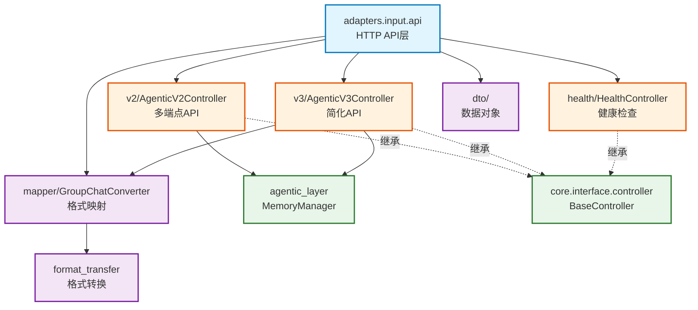

# infra_layer.adapters.input.api

HTTP API 输入适配器，提供 RESTful API 端点

## 模块位置

**源码路径**: `src/infra_layer/adapters/input/api/`
**文档路径**: `specs/ac_mod/infra_layer.adapters.input.api.ac.mod.md`
**模块类型**: 包模块

## 目录结构

```
src/infra_layer/adapters/input/api/
├── __init__.py
├── dto/                       # 数据传输对象（Data Transfer Objects）
├── mapper/                    # 格式映射器
│   └── group_chat_converter.py
├── v2/                       # V2 API 控制器
│   └── agentic_v2_controller.py
├── v3/                       # V3 API 控制器（简化版）
│   └── agentic_v3_controller.py
└── health/                   # 健康检查
    └── health_controller.py
```

## 快速开始

### V2 API 使用

```python
from infra_layer.adapters.input.api.v2.agentic_v2_controller import AgenticV2Controller

controller = AgenticV2Controller()

# 存储记忆
response = await controller.memorize_data(request)
# POST /api/v2/agentic/memorize

# 获取记忆
response = await controller.fetch_memories(request)
# POST /api/v2/agentic/fetch

# 检索记忆（支持关键词/向量/混合）
response = await controller.retrieve_memories(request)
# POST /api/v2/agentic/retrieve
```

### V3 API 使用

```python
from infra_layer.adapters.input.api.v3.agentic_v3_controller import AgenticV3Controller

controller = AgenticV3Controller(conversation_meta_repository)

# 存储单条消息
response = await controller.memorize_single_message(request)
# POST /api/v3/agentic/memorize

# 轻量级检索（Embedding + BM25 + RRF）
response = await controller.retrieve_lightweight(request)
# POST /api/v3/agentic/retrieve_lightweight

# Agentic 检索（LLM 引导多轮）
response = await controller.retrieve_agentic(request)
# POST /api/v3/agentic/retrieve_agentic
```

### 健康检查

```python
from infra_layer.adapters.input.api.health.health_controller import HealthController

controller = HealthController()
# GET /api/health
```

## 核心组件详解

### 1. API 版本对比

| 特性 | V2 API | V3 API |
|------|--------|--------|
| 端点数量 | 6个（memorize, fetch, retrieve, retrieve_keyword, retrieve_vector, retrieve_hybrid）| 3个（memorize, retrieve_lightweight, retrieve_agentic）|
| 输入格式 | 内部格式（需预转换）| 简化格式（自动转换）|
| 检索策略 | 独立端点 | 统一端点+参数控制 |
| 使用场景 | 灵活控制 | 快速集成 |

### 2. V2 控制器端点

**AgenticV2Controller**:
- `POST /api/v2/agentic/memorize` - 存储记忆
  - 接收: `{"messages": [...], "raw_data_type": "Conversation"}`
  - 返回: `{"saved_memories": [...], "count": N}`

- `POST /api/v2/agentic/fetch` - 获取记忆（KV方式）
  - 接收: `{"user_id": "...", "memory_type": "base_memory"}`
  - 返回: `{"memories": [...], "total_count": N}`

- `POST /api/v2/agentic/retrieve` - 检索记忆（默认关键词）
  - 接收: `{"query": "...", "retrieve_method": "keyword"}`
  - 返回: `{"groups": [...], "importance_scores": [...]}`

- `POST /api/v2/agentic/retrieve_keyword` - 关键词检索（BM25）
- `POST /api/v2/agentic/retrieve_vector` - 向量检索（COSINE）
- `POST /api/v2/agentic/retrieve_hybrid` - 混合检索（Keyword+Vector）

### 3. V3 控制器端点

**AgenticV3Controller**:
- `POST /api/v3/agentic/memorize` - 存储单条消息
  - 简化格式: `{"message_id": "...", "sender": "...", "content": "..."}`
  - 自动转换 + Redis 累积

- `POST /api/v3/agentic/retrieve_lightweight` - 轻量级检索
  - 参数: `retrieval_mode: "rrf"|"embedding"|"bm25"`
  - 参数: `data_source: "episode"|"event_log"|"semantic_memory"|"profile"`
  - 并行检索 + RRF 融合

- `POST /api/v3/agentic/retrieve_agentic` - Agentic 检索
  - LLM 判断检索充分性
  - 多轮查询优化
  - Rerank 提升质量

### 4. Mapper 映射器

**GroupChatConverter**:
```python
from infra_layer.adapters.input.api.mapper.group_chat_converter import (
    validate_group_chat_format_input,
    convert_group_chat_format_to_memorize_input,
    convert_simple_message_to_memorize_input
)

# 验证开源格式
if validate_group_chat_format_input(data):
    # 转换 GroupChatFormat → Memorize Input
    memorize_input = convert_group_chat_format_to_memorize_input(data)

# 简单消息转换（V3 使用）
memorize_input = convert_simple_message_to_memorize_input(message_data)
```

**映射功能**:
- 格式验证（必需字段检查）
- 消息转换（GroupChatFormat → 内部格式）
- 时间处理（时区转换）
- 引用列表转换（MessageReference → message_id）

## Mermaid 依赖图



## 依赖关系说明

### 对其他模块的依赖

- `specs/ac_mod/core.interface.controller.ac.mod.md` - BaseController, @get, @post
- `specs/ac_mod/core.di.ac.mod.md` - @controller, get_bean_by_type
- `agentic_layer.memory_manager` - MemoryManager
- `agentic_layer.converter` - DTO 转换器
- `specs/ac_mod/infra_layer.adapters.input.ac.mod.md` - format_transfer

### 被依赖关系

- FastAPI 应用（`src/main.py`）- 注册所有控制器
- `specs/ac_mod/infra_layer.adapters.input.ac.mod.md` - 父模块

## 可以验证模块可运行的测试命令

```bash
# 检查 V2 控制器
python -c "from infra_layer.adapters.input.api.v2.agentic_v2_controller import AgenticV2Controller; print('V2 OK')"

# 检查 V3 控制器
python -c "from infra_layer.adapters.input.api.v3.agentic_v3_controller import AgenticV3Controller; print('V3 OK')"

# 检查健康检查
python -c "from infra_layer.adapters.input.api.health.health_controller import HealthController; print('Health OK')"

# 检查 Mapper
python -c "from infra_layer.adapters.input.api.mapper.group_chat_converter import validate_group_chat_format_input; print('Mapper OK')"

# 查找所有控制器
grep -r "class.*Controller(BaseController)" src/infra_layer/adapters/input/api/
```
