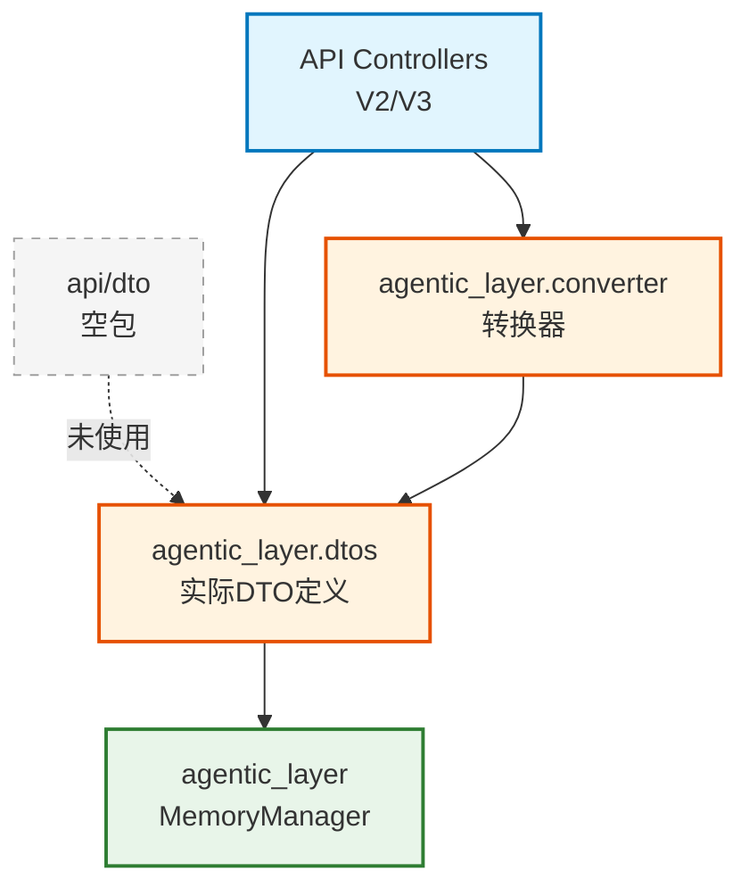

# infra_layer.adapters.input.api.dto

API 数据传输对象（Data Transfer Objects）模块

## 模块位置

**源码路径**: `src/infra_layer/adapters/input/api/dto/`
**文档路径**: `specs/ac_mod/infra_layer.adapters.input.api.dto.ac.mod.md`
**模块类型**: 包模块

## 目录结构

```
src/infra_layer/adapters/input/api/dto/
└── __init__.py                # 空包（DTO 定义在 agentic_layer 中）
```

## 快速开始

### DTO 使用

```python
# DTO 实际定义在 agentic_layer.dtos 中
from agentic_layer.dtos.memory_query import (
    FetchMemRequest,
    RetrieveMemRequest,
    MemorizeRequest
)

# Fetch 请求
fetch_req = FetchMemRequest(
    user_id="user_123",
    memory_type="base_memory",
    top_k=20
)

# Retrieve 请求
retrieve_req = RetrieveMemRequest(
    query="北京美食",
    user_id="user_123",
    retrieve_method=RetrieveMethod.KEYWORD,
    top_k=20
)
```

### Converter 转换

```python
from agentic_layer.converter import (
    convert_dict_to_fetch_mem_request,
    convert_dict_to_retrieve_mem_request
)

# 字典 → FetchMemRequest
fetch_req = convert_dict_to_fetch_mem_request({
    "user_id": "user_123",
    "memory_type": "multiple"
})

# 字典 → RetrieveMemRequest
retrieve_req = convert_dict_to_retrieve_mem_request(
    {"user_id": "user_123", "top_k": 20},
    query="北京旅游"
)
```

## 核心组件详解

### 1. DTO 设计原则

**作用**: 定义 API 层与业务层之间的数据契约

**原则**:
- 不包含业务逻辑
- 仅用于数据传输
- 使用 Pydantic 进行验证
- 与核心业务对象分离

### 2. DTO 类型

**当前架构**:
- DTO 定义在 `agentic_layer.dtos` 中
- `infra_layer.adapters.input.api.dto/` 为空包
- 控制器直接使用 `agentic_layer.dtos`

**主要 DTO**:
| DTO 类 | 用途 | 关键字段 |
|--------|------|----------|
| `FetchMemRequest` | 获取记忆请求 | user_id, memory_type, top_k |
| `RetrieveMemRequest` | 检索记忆请求 | query, user_id, retrieve_method, top_k |
| `MemorizeRequest` | 存储记忆请求 | raw_data_list, raw_data_type |

### 3. 转换器模式

```python
# HTTP JSON → DTO → 业务方法
async def memorize_data(self, fastapi_request):
    body = await fastapi_request.json()              # JSON
    memorize_request = await _handle_conversation_format(body)  # DTO
    memories = await self.memory_manager.memorize(memorize_request)  # 业务
```

## Mermaid 依赖图



## 依赖关系说明

### 对其他模块的依赖

实际 DTO 依赖（在 `agentic_layer.dtos` 中）:
- `pydantic` - BaseModel 验证
- `agentic_layer.schemas` - RetrieveMethod 枚举

### 被依赖关系

- `specs/ac_mod/infra_layer.adapters.input.api.v2.ac.mod.md` - V2 控制器
- `specs/ac_mod/infra_layer.adapters.input.api.v3.ac.mod.md` - V3 控制器（间接通过 converter）

## 可以验证模块可运行的测试命令

```bash
# 检查 DTO 包（空）
python -c "import infra_layer.adapters.input.api.dto; print('Empty package OK')"

# 检查实际 DTO 定义
python -c "from agentic_layer.dtos.memory_query import FetchMemRequest, RetrieveMemRequest; print('DTOs OK')"

# 检查 Converter
python -c "from agentic_layer.converter import convert_dict_to_fetch_mem_request; print('Converter OK')"

# 验证 DTO 使用
grep -r "FetchMemRequest\|RetrieveMemRequest" src/infra_layer/adapters/input/api/
```
