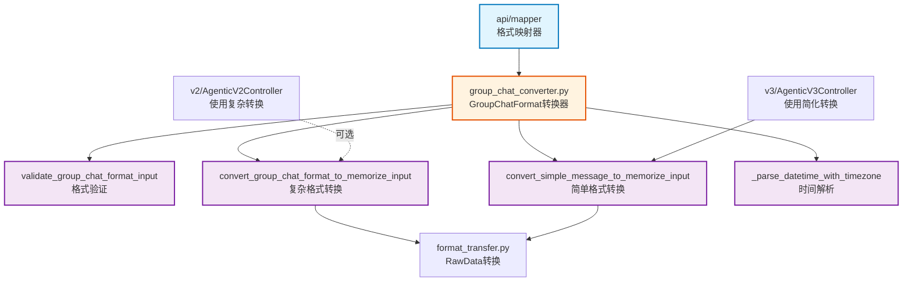

# infra_layer.adapters.input.api.mapper

格式映射器，将外部数据格式转换为内部记忆存储格式

## 模块位置

**源码路径**: `src/infra_layer/adapters/input/api/mapper/`
**文档路径**: `specs/ac_mod/infra_layer.adapters.input.api.mapper.ac.mod.md`
**模块类型**: 包模块

## 目录结构

```
src/infra_layer/adapters/input/api/mapper/
├── __init__.py
└── group_chat_converter.py    # GroupChatFormat → Memorize 格式转换
```

## 快速开始

### GroupChatFormat 转换

```python
from infra_layer.adapters.input.api.mapper.group_chat_converter import (
    validate_group_chat_format_input,
    convert_group_chat_format_to_memorize_input,
    convert_simple_message_to_memorize_input
)

# 1. 验证开源群聊格式
group_chat_data = {
    "version": "1.0",
    "conversation_meta": {
        "name": "项目组",
        "group_id": "group_123",
        "user_details": {
            "user_001": {"full_name": "张三"},
            "user_002": {"full_name": "李四"}
        }
    },
    "conversation_list": [
        {
            "message_id": "msg_001",
            "create_time": "2024-01-15T10:00:00+08:00",
            "sender": "user_001",
            "type": "text",
            "content": "大家好"
        }
    ]
}

if validate_group_chat_format_input(group_chat_data):
    # 2. 转换为 memorize 输入格式
    memorize_input = convert_group_chat_format_to_memorize_input(group_chat_data)
```

### 简单消息转换（V3 使用）

```python
# V3 API 使用简化格式
message_data = {
    "group_id": "group_123",
    "group_name": "项目组",
    "message_id": "msg_001",
    "create_time": "2024-01-15T10:00:00+08:00",
    "sender": "user_001",
    "sender_name": "张三",
    "content": "讨论新功能",
    "refer_list": []
}

memorize_input = convert_simple_message_to_memorize_input(message_data)
```

## 核心组件详解

### 1. group_chat_converter 模块

**作用**: 开源 GroupChatFormat 到内部格式的唯一适配层

**设计原则**:
- 所有格式转换逻辑集中在此模块
- 禁止在 controller/service 中添加转换逻辑
- 保持适配层单一职责

### 2. 核心函数

**validate_group_chat_format_input()**:
```python
def validate_group_chat_format_input(data: Dict[str, Any]) -> bool
```
- 检查 `conversation_meta` 和 `conversation_list` 必需字段
- 验证 `user_details` 包含所有发送者
- 检查消息必需字段: `message_id, create_time, sender, type, content`
- 验证 `refer_list` 格式（支持字符串或 MessageReference 对象）

**convert_group_chat_format_to_memorize_input()**:
```python
def convert_group_chat_format_to_memorize_input(
    group_chat_data: Dict[str, Any]
) -> Dict[str, Any]
```
**输入**:
```json
{
  "conversation_meta": {
    "name": "项目组",
    "group_id": "group_123",
    "user_details": {...},
    "default_timezone": "Asia/Shanghai"
  },
  "conversation_list": [...]
}
```

**输出**:
```json
{
  "messages": [
    {
      "_id": "msg_001",
      "fullName": "张三",
      "roomId": "group_123",
      "content": "讨论新功能",
      "createTime": "2024-01-15T02:00:00Z",
      "createBy": "user_001"
    }
  ],
  "raw_data_type": "Conversation",
  "group_id": "group_123",
  "group_name": "项目组"
}
```

**convert_simple_message_to_memorize_input()**:
```python
def convert_simple_message_to_memorize_input(
    message_data: Dict[str, Any]
) -> Dict[str, Any]
```
- V3 API 使用的简化格式
- 直接接收单条消息数据
- 无需复杂的 GroupChatFormat 结构

### 3. 字段映射规则

**GroupChatFormat → 内部格式**:
| GroupChatFormat | 内部格式 | 说明 |
|-----------------|---------|------|
| `message_id` | `_id` | 消息唯一ID |
| `sender` | `createBy` | 发送者用户ID |
| `sender_name` | `fullName` | 发送者名称（从 user_details 提取）|
| `create_time` | `createTime` | 创建时间（转 UTC）|
| `content` | `content` | 消息内容 |
| `refer_list` | `referList` | 引用消息列表 |
| `group_id` | `roomId` | 群组ID |

**时间处理**:
```python
# 使用 default_timezone 或 UTC
parsed_time = _parse_datetime_with_timezone(
    datetime_str="2024-01-15T10:00:00+08:00",
    default_timezone="Asia/Shanghai"
)
# 输出: 2024-01-15T02:00:00Z (UTC)
```

## Mermaid 依赖图



## 依赖关系说明

### 对其他模块的依赖

- `specs/ac_mod/infra_layer.adapters.input.ac.mod.md` - format_transfer.py
- `common_utils.datetime_utils` - from_iso_format 时间转换
- `zoneinfo` - 时区处理

### 被依赖关系

- `specs/ac_mod/infra_layer.adapters.input.api.v3.ac.mod.md` - V3 控制器（必需）
- `specs/ac_mod/infra_layer.adapters.input.api.v2.ac.mod.md` - V2 控制器（可选）

## 可以验证模块可运行的测试命令

```bash
# 检查 Mapper 导入
python -c "from infra_layer.adapters.input.api.mapper.group_chat_converter import validate_group_chat_format_input; print('OK')"

# 检查所有转换函数
python -c "from infra_layer.adapters.input.api.mapper.group_chat_converter import convert_group_chat_format_to_memorize_input, convert_simple_message_to_memorize_input; print('OK')"

# 验证 V3 使用
grep -r "convert_simple_message_to_memorize_input" src/infra_layer/adapters/input/api/v3/

# 查找 Mapper 使用场景
grep -r "group_chat_converter" src/
```
