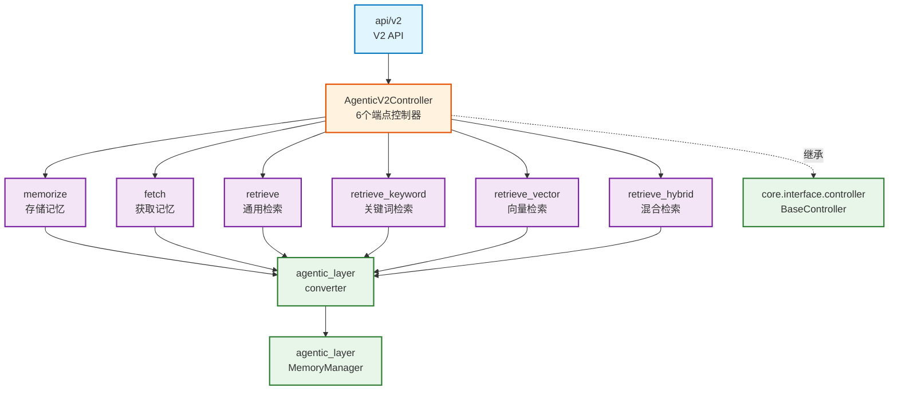

# infra_layer.adapters.input.api.v2

V2 API 控制器，提供多端点的记忆管理 RESTful API

## 模块位置

**源码路径**: `src/infra_layer/adapters/input/api/v2/`
**文档路径**: `specs/ac_mod/infra_layer.adapters.input.api.v2.ac.mod.md`
**模块类型**: 包模块

## 目录结构

```
src/infra_layer/adapters/input/api/v2/
├── __init__.py
└── agentic_v2_controller.py   # V2 API 控制器（6个端点）
```

## 快速开始

### 控制器注册

```python
from infra_layer.adapters.input.api.v2.agentic_v2_controller import AgenticV2Controller
from fastapi import FastAPI

app = FastAPI()
controller = AgenticV2Controller()
controller.register_to_app(app)
```

### 存储记忆

```bash
curl -X POST http://localhost:8000/api/v2/agentic/memorize \
  -H "Content-Type: application/json" \
  -d '{
    "messages": [
      {
        "_id": "msg_001",
        "fullName": "张三",
        "content": "讨论项目进展",
        "createTime": "2024-01-15T10:00:00Z",
        "roomId": "group_123"
      }
    ],
    "raw_data_type": "Conversation"
  }'
```

### 获取记忆（KV方式）

```bash
curl -X POST http://localhost:8000/api/v2/agentic/fetch \
  -H "Content-Type: application/json" \
  -d '{
    "user_id": "user_123",
    "memory_type": "base_memory",
    "top_k": 20
  }'
```

### 检索记忆（关键词）

```bash
curl -X POST http://localhost:8000/api/v2/agentic/retrieve_keyword \
  -H "Content-Type: application/json" \
  -d '{
    "query": "北京美食",
    "user_id": "user_123",
    "top_k": 20
  }'
```

## 核心组件详解

### 1. AgenticV2Controller 端点

**路由前缀**: `/api/v2/agentic`

**6个端点**:

| 端点 | 方法 | 功能 | 检索方法 |
|------|------|------|----------|
| `/memorize` | POST | 存储记忆 | - |
| `/fetch` | POST | 获取记忆（KV） | - |
| `/retrieve` | POST | 检索记忆（通用） | 可配置（默认keyword）|
| `/retrieve_keyword` | POST | 关键词检索 | BM25 |
| `/retrieve_vector` | POST | 向量检索 | COSINE |
| `/retrieve_hybrid` | POST | 混合检索 | Keyword + Vector |

### 2. memorize 端点

**功能**: 存储原始数据为结构化记忆

**输入格式**:
```json
{
  "messages": [
    {
      "_id": "msg_001",
      "fullName": "张三",
      "content": "讨论项目",
      "createTime": "2024-01-15T10:00:00Z",
      "roomId": "group_123",
      "createBy": "user_001"
    }
  ],
  "raw_data_type": "Conversation"
}
```

**支持的数据类型**:
- `Conversation`: 对话消息
- `Email`: 邮件
- `LinkDoc`: 链接文档（Notion/Google Drive/Dropbox/Memo）

**响应**:
```json
{
  "status": "ok",
  "message": "记忆存储成功，共保存 1 条记忆",
  "result": {
    "saved_memories": [...],
    "count": 1
  }
}
```

### 3. fetch 端点

**功能**: KV 方式获取用户核心记忆

**输入参数**:
```json
{
  "user_id": "user_123",
  "memory_type": "multiple",  // base_memory | profile | preference | episode_summary | multiple
  "top_k": 20
}
```

**记忆类型**:
- `base_memory`: 基础记忆
- `profile`: 用户画像
- `preference`: 用户偏好
- `episode_summary`: 情景摘要
- `multiple`: 多类型（默认，包含 base_memory + profile + preference）

### 4. 检索端点对比

**retrieve (通用)**:
```json
{
  "query": "北京美食",
  "user_id": "user_123",
  "retrieve_method": "keyword"  // keyword | vector | hybrid
}
```

**retrieve_keyword (关键词)**:
- 使用 BM25 算法
- 速度快，精确匹配
- 适合已知术语查询

**retrieve_vector (向量)**:
```json
{
  "query": "北京美食",
  "user_id": "user_123",
  "radius": 0.6  // COSINE 相似度阈值 [-1, 1]
}
```
- 使用语义向量相似度
- 语义理解，模糊匹配
- 适合上下文查询

**retrieve_hybrid (混合)**:
- 结合关键词和向量检索
- 精确性和语义理解兼顾
- 最全面的检索结果

### 5. 响应格式

**检索响应**:
```json
{
  "status": "ok",
  "message": "检索成功，共检索到 3 个群组",
  "result": {
    "groups": [
      {
        "group_id": "group_456",
        "memories": [...],
        "scores": [0.95, 0.92],
        "original_data": []
      }
    ],
    "importance_scores": [0.85, 0.80],
    "total_count": 45,
    "has_more": false,
    "metadata": {
      "source": "episodic_memory_es_repository",
      "user_id": "user_123"
    }
  }
}
```

## Mermaid 依赖图



## 依赖关系说明

### 对其他模块的依赖

- `specs/ac_mod/core.interface.controller.ac.mod.md` - BaseController, @post
- `specs/ac_mod/core.di.ac.mod.md` - @controller
- `agentic_layer.memory_manager` - MemoryManager
- `agentic_layer.converter` - convert_dict_to_fetch_mem_request, convert_dict_to_retrieve_mem_request
- `agentic_layer.schemas` - RetrieveMethod 枚举

### 被依赖关系

- FastAPI 应用（`src/main.py`）
- `specs/ac_mod/infra_layer.adapters.input.api.ac.mod.md` - 父模块

## 可以验证模块可运行的测试命令

```bash
# 检查控制器导入
python -c "from infra_layer.adapters.input.api.v2.agentic_v2_controller import AgenticV2Controller; print('OK')"

# 检查端点定义
grep -E "async def (memorize|fetch|retrieve)" src/infra_layer/adapters/input/api/v2/agentic_v2_controller.py

# 验证路由注册
python -c "from infra_layer.adapters.input.api.v2.agentic_v2_controller import AgenticV2Controller; c = AgenticV2Controller(); print(c.prefix)"

# 查找 V2 使用
grep -r "AgenticV2Controller" src/
```
