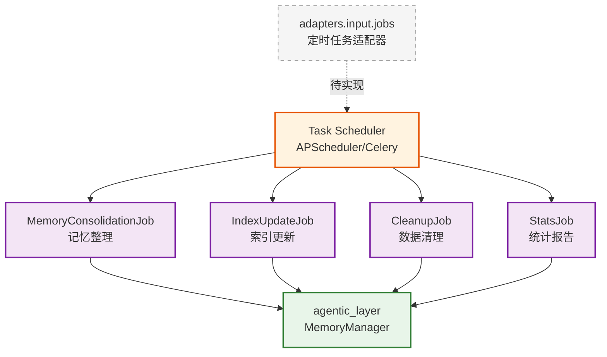

# infra_layer.adapters.input.jobs

定时任务输入适配器，处理周期性任务触发

## 模块位置

**源码路径**: `src/infra_layer/adapters/input/jobs/`
**文档路径**: `specs/ac_mod/infra_layer.adapters.input.jobs.ac.mod.md`
**模块类型**: 包模块

## 目录结构

```
src/infra_layer/adapters/input/jobs/
└── __init__.py                # 空包（待实现）
```

## 快速开始

### 定时任务框架集成

```python
# 使用 APScheduler 或类似框架
from apscheduler.schedulers.asyncio import AsyncIOScheduler
from agentic_layer.memory_manager import MemoryManager

scheduler = AsyncIOScheduler()
memory_manager = MemoryManager()

# 定时记忆整理任务
@scheduler.scheduled_job('cron', hour=2)  # 每天凌晨2点
async def daily_memory_consolidation():
    await memory_manager.consolidate_memories()

# 定时记忆过期清理
@scheduler.scheduled_job('interval', hours=1)  # 每小时
async def cleanup_expired_memories():
    await memory_manager.cleanup_expired_data()
```

### 预期任务类型

```python
# 1. 记忆整理任务
class MemoryConsolidationJob:
    """定期整理和归档记忆"""
    schedule = "0 2 * * *"  # 每天凌晨2点

# 2. 记忆索引更新
class MemoryIndexUpdateJob:
    """更新检索索引"""
    schedule = "*/30 * * * *"  # 每30分钟

# 3. 统计报告生成
class MemoryStatsJob:
    """生成记忆统计报告"""
    schedule = "0 0 * * 0"  # 每周日午夜
```

## 核心组件详解

### 1. Jobs 适配器模式

**作用**: 将定时触发的任务转换为核心业务调用

**特点**:
- 周期性执行
- 异步处理
- 错误重试
- 日志记录

### 2. 预期功能

**记忆管理任务**:
| 任务 | 周期 | 功能 |
|------|------|------|
| 记忆整理 | 每日 | 归档旧记忆，优化存储 |
| 索引更新 | 每小时 | 更新 ES/Milvus 索引 |
| 数据清理 | 每周 | 清理过期和无效数据 |
| 统计报告 | 每周 | 生成使用统计 |

### 3. 任务调度器选择

**推荐方案**:
- `APScheduler`: Python 异步任务调度
- `Celery`: 分布式任务队列
- `cron`: 系统级定时任务

## Mermaid 依赖图



## 依赖关系说明

### 对其他模块的依赖

预期依赖（待实现）:
- 任务调度框架（APScheduler/Celery）
- `agentic_layer.memory_manager` - 业务逻辑
- `specs/ac_mod/core.observation.ac.mod.md` - 日志和监控

### 被依赖关系

- `specs/ac_mod/infra_layer.adapters.input.ac.mod.md` - 父模块
- 应用启动脚本 - 初始化定时任务

## 可以验证模块可运行的测试命令

```bash
# 检查 jobs 包
python -c "import infra_layer.adapters.input.jobs; print('Empty package')"

# 示例：手动运行记忆整理任务
python -c "
from agentic_layer.memory_manager import MemoryManager
import asyncio

async def run_consolidation():
    mm = MemoryManager()
    # await mm.consolidate_memories()  # 待实现
    print('Task would run here')

asyncio.run(run_consolidation())
"

# 查看是否有 Job 定义
find src/infra_layer/adapters/input/jobs -name "*.py" -type f | grep -v __pycache__
```
