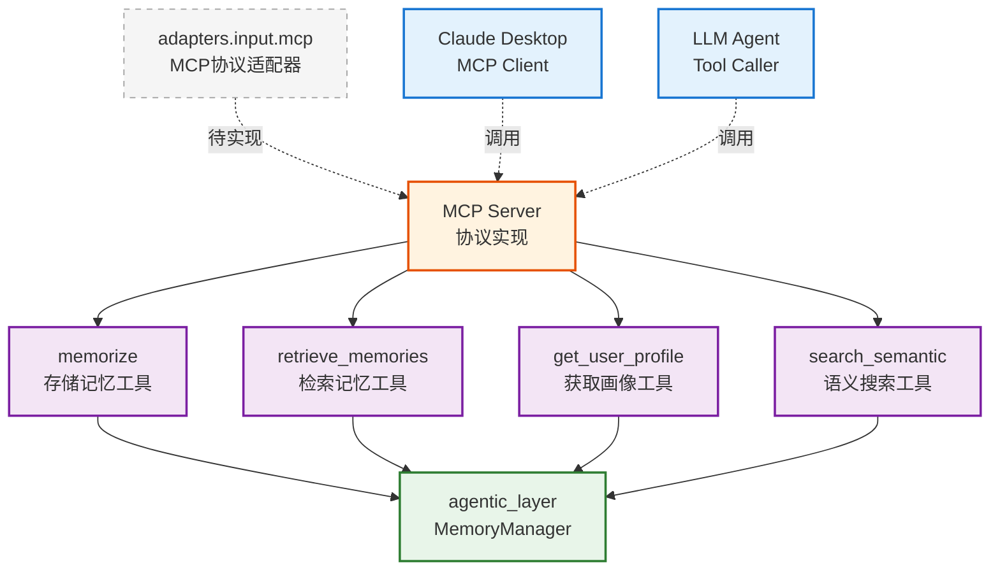

# infra_layer.adapters.input.mcp

MCP (Model Context Protocol) 协议输入适配器

## 模块位置

**源码路径**: `src/infra_layer/adapters/input/mcp/`
**文档路径**: `specs/ac_mod/infra_layer.adapters.input.mcp.ac.mod.md`
**模块类型**: 包模块

## 目录结构

```
src/infra_layer/adapters/input/mcp/
└── __init__.py                # 空包（待实现）
```

## 快速开始

### MCP 协议概览

MCP (Model Context Protocol) 是用于 AI 模型与外部工具/服务交互的标准协议。

**预期功能**:
```python
# MCP Server 提供记忆管理工具
from mcp import Server
from agentic_layer.memory_manager import MemoryManager

server = Server("evermem-mcp")
memory_manager = MemoryManager()

# 注册记忆工具
@server.tool("memorize")
async def memorize_tool(content: str, user_id: str):
    """存储新记忆"""
    return await memory_manager.memorize(...)

@server.tool("retrieve")
async def retrieve_tool(query: str, user_id: str):
    """检索相关记忆"""
    return await memory_manager.retrieve_lightweight(query=query, user_id=user_id)

@server.tool("fetch_profile")
async def fetch_profile_tool(user_id: str):
    """获取用户画像"""
    return await memory_manager.fetch_mem(user_id=user_id, memory_type="profile")
```

### MCP 工具定义

```python
# 预期 MCP 工具列表
EVERMEM_MCP_TOOLS = [
    {
        "name": "memorize",
        "description": "存储新的记忆数据",
        "parameters": {
            "content": "string",
            "user_id": "string",
            "metadata": "object"
        }
    },
    {
        "name": "retrieve_memories",
        "description": "根据查询检索相关记忆",
        "parameters": {
            "query": "string",
            "user_id": "string",
            "top_k": "integer"
        }
    },
    {
        "name": "get_user_profile",
        "description": "获取用户画像和偏好",
        "parameters": {
            "user_id": "string"
        }
    }
]
```

## 核心组件详解

### 1. MCP 协议特点

**优势**:
- 标准化的工具定义
- AI 模型易于调用
- 支持流式响应
- 内置权限管理

**使用场景**:
- Claude Desktop 集成
- LLM Agent 工具调用
- 多模型统一接口

### 2. 预期架构

```
MCP Client (Claude/GPT)
        ↓
    MCP Protocol
        ↓
MCP Server Adapter
        ↓
MemoryManager
        ↓
Memory/Agentic Layer
```

### 3. 工具映射

**MCP 工具 → 内部方法**:
| MCP Tool | 内部方法 | 功能 |
|----------|---------|------|
| `memorize` | `MemoryManager.memorize()` | 存储记忆 |
| `retrieve_memories` | `MemoryManager.retrieve_lightweight()` | 检索记忆 |
| `get_user_profile` | `MemoryManager.fetch_mem()` | 获取画像 |
| `search_semantic` | `MemoryManager.retrieve_mem_vector()` | 语义搜索 |

## Mermaid 依赖图



## 依赖关系说明

### 对其他模块的依赖

预期依赖（待实现）:
- MCP SDK (`mcp` Python package)
- `agentic_layer.memory_manager` - 业务逻辑
- `specs/ac_mod/core.di.ac.mod.md` - 依赖注入

### 被依赖关系

- Claude Desktop - MCP 客户端
- LLM Agent 框架 - 工具调用
- `specs/ac_mod/infra_layer.adapters.input.ac.mod.md` - 父模块

## 可以验证模块可运行的测试命令

```bash
# 检查 mcp 包
python -c "import infra_layer.adapters.input.mcp; print('Empty package')"

# 检查 MCP SDK（如果已安装）
python -c "try:
    import mcp
    print('MCP SDK installed')
except ImportError:
    print('MCP SDK not installed')
"

# 示例：MCP Server 启动（待实现）
# python -m infra_layer.adapters.input.mcp.server

# 查看 MCP 文件
find src/infra_layer/adapters/input/mcp -name "*.py" -type f | grep -v __pycache__
```
