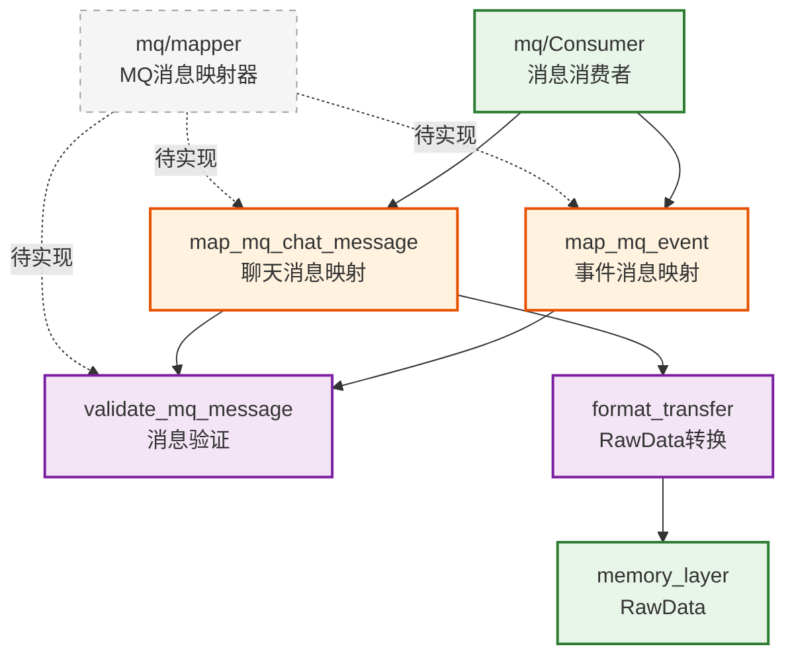

# infra_layer.adapters.input.mq.mapper

MQ 消息格式映射器，将消息队列消息转换为内部格式

## 模块位置

**源码路径**: `src/infra_layer/adapters/input/mq/mapper/`
**文档路径**: `specs/ac_mod/infra_layer.adapters.input.mq.mapper.ac.mod.md`
**模块类型**: 包模块

## 目录结构

```
src/infra_layer/adapters/input/mq/mapper/
└── __init__.py                # 空包（待实现）
```

## 快速开始

### 预期 Mapper 实现

```python
# mq/mapper/message_mapper.py (待实现)
from typing import Dict, Any
from memory_layer.memcell_extractor.base_memcell_extractor import RawData
from infra_layer.adapters.input.format_transfer import convert_single_message_to_raw_data

async def map_mq_chat_message(mq_message: Dict[str, Any]) -> RawData:
    """
    将 MQ 聊天消息转换为 RawData

    Args:
        mq_message: {
            "message_id": "msg_123",
            "group_id": "group_456",
            "sender_id": "user_001",
            "sender_name": "张三",
            "content": "讨论新功能",
            "timestamp": "2024-01-15T10:00:00Z"
        }

    Returns:
        RawData 对象
    """
    # 转换 MQ 格式 → 内部格式
    internal_format = {
        "_id": mq_message["message_id"],
        "fullName": mq_message.get("sender_name", mq_message["sender_id"]),
        "roomId": mq_message.get("group_id"),
        "content": mq_message["content"],
        "createTime": mq_message["timestamp"],
        "createBy": mq_message["sender_id"],
        "updateTime": mq_message["timestamp"]
    }

    return await convert_single_message_to_raw_data(
        internal_format,
        group_name=mq_message.get("group_name")
    )
```

### 使用示例

```python
from infra_layer.adapters.input.mq.mapper import map_mq_chat_message

# 从 RabbitMQ 接收的消息
mq_message = {
    "message_id": "msg_123",
    "group_id": "group_456",
    "group_name": "项目组",
    "sender_id": "user_001",
    "sender_name": "张三",
    "content": "讨论项目进展",
    "timestamp": "2024-01-15T10:00:00Z",
    "message_type": "text"
}

# 转换为 RawData
raw_data = await map_mq_chat_message(mq_message)

# 存储记忆
await memory_manager.memorize([raw_data])
```

## 核心组件详解

### 1. Mapper 设计模式

**作用**: 解耦 MQ 消息格式与内部数据结构

**原则**:
- 单一职责：只负责格式转换
- 验证输入：检查必需字段
- 错误处理：提供清晰的错误信息
- 可扩展：支持多种消息类型

### 2. 预期消息类型映射

**聊天消息映射**:
```python
# MQ 格式 → 内部格式
{
  "message_id": "msg_123"        → "_id": "msg_123"
  "sender_id": "user_001"        → "createBy": "user_001"
  "sender_name": "张三"          → "fullName": "张三"
  "group_id": "group_456"        → "roomId": "group_456"
  "content": "hello"             → "content": "hello"
  "timestamp": "2024-01-15..."   → "createTime": "2024-01-15..."
}
```

**事件消息映射**:
```python
# 系统事件 → Event Log
{
  "event_type": "user_joined"    → event_type
  "group_id": "group_456"        → group_id
  "user_id": "user_002"          → user_id
  "timestamp": "2024-01-15..."   → timestamp
}
```

### 3. 映射流程

```
MQ Message (JSON)
        ↓
   Mapper 验证
        ↓
  字段转换映射
        ↓
format_transfer
        ↓
   RawData 对象
        ↓
MemoryManager.memorize()
```

### 4. 错误处理

```python
class MQMessageValidationError(Exception):
    """MQ 消息验证错误"""
    pass

def validate_mq_chat_message(msg: Dict[str, Any]):
    """验证 MQ 聊天消息格式"""
    required_fields = ["message_id", "sender_id", "content", "timestamp"]

    for field in required_fields:
        if field not in msg:
            raise MQMessageValidationError(f"缺少必需字段: {field}")

    if not msg["content"].strip():
        raise MQMessageValidationError("消息内容不能为空")
```

## Mermaid 依赖图



## 依赖关系说明

### 对其他模块的依赖

预期依赖（待实现）:
- `specs/ac_mod/infra_layer.adapters.input.ac.mod.md` - format_transfer
- `memory_layer.memcell_extractor.base_memcell_extractor` - RawData
- `common_utils.datetime_utils` - 时间转换

### 被依赖关系

- `specs/ac_mod/infra_layer.adapters.input.mq.ac.mod.md` - MQ 消费者
- `specs/ac_mod/infra_layer.adapters.input.ac.mod.md` - 父模块

## 可以验证模块可运行的测试命令

```bash
# 检查 mapper 包
python -c "import infra_layer.adapters.input.mq.mapper; print('Empty package')"

# 示例：测试消息转换（使用现有 format_transfer）
python -c "
from infra_layer.adapters.input.format_transfer import convert_single_message_to_raw_data
import asyncio

async def test_mq_message_conversion():
    # 模拟 MQ 消息格式
    mq_msg = {
        '_id': 'msg_mq_001',
        'fullName': '张三',
        'content': 'MQ 测试消息',
        'createTime': '2024-01-15T10:00:00Z',
        'createBy': 'user_001',
        'roomId': 'group_456'
    }

    raw_data = await convert_single_message_to_raw_data(
        mq_msg,
        group_name='MQ测试组'
    )

    print(f'转换成功: data_id={raw_data.data_id}')
    print(f'内容: {raw_data.content[\"content\"]}')

asyncio.run(test_mq_message_conversion())
"

# 查看 mapper 文件
find src/infra_layer/adapters/input/mq/mapper -name "*.py" -type f | grep -v __pycache__
```
