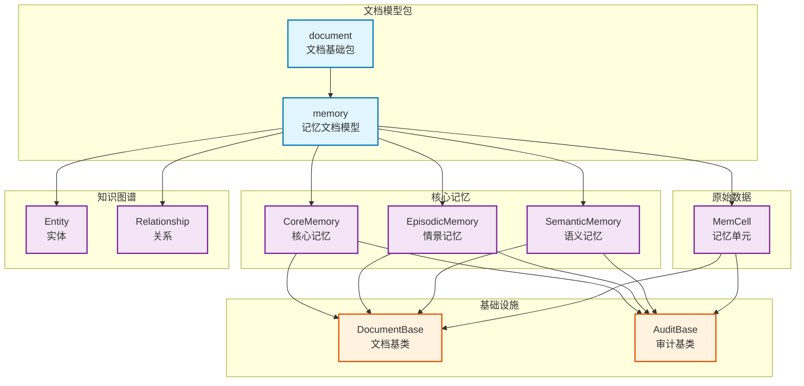

# infra_layer.adapters.out.persistence.document

MongoDB 文档模型基础包，包含记忆系统所有文档模型定义。

## 模块位置

**源码路径**: `src/infra_layer/adapters/out/persistence/document/`
**文档路径**: `specs/ac_mod/infra_layer.adapters.out.persistence.document.ac.mod.md`
**模块类型**: 包模块

## 目录结构

```
src/infra_layer/adapters/out/persistence/document/
├── __init__.py                 # 空包初始化
└── memory/                     # 记忆文档模型子包
    ├── __init__.py             # 子包初始化
    ├── core_memory.py          # 核心记忆（BaseMemory + Profile）
    ├── episodic_memory.py      # 情景记忆
    ├── semantic_memory.py      # 语义记忆
    ├── personal_semantic_memory.py  # 个人语义记忆
    ├── personal_event_log.py   # 个人事件日志
    ├── memcell.py              # 记忆单元（情景切分结果）
    ├── entity.py               # 实体库
    ├── relationship.py         # 关系库
    ├── user_profile.py         # 用户画像（从聚类提取）
    ├── group_profile.py        # 群组档案
    ├── group_user_profile_memory.py  # 群组用户画像记忆
    ├── conversation_meta.py    # 对话元数据
    ├── conversation_status.py  # 对话状态
    ├── behavior_history.py     # 行为历史
    └── cluster_state.py        # 聚类状态
```

**注意**: 本文档保存在 `specs/ac_mod/` 目录下，不在包源码目录中。

## 快速开始

### 基本使用方式

```python
# 导入文档模型
from infra_layer.adapters.out.persistence.document.memory.core_memory import CoreMemory
from infra_layer.adapters.out.persistence.document.memory.episodic_memory import EpisodicMemory
from infra_layer.adapters.out.persistence.document.memory.memcell import MemCell

# 1. 创建核心记忆文档
core_memory = CoreMemory(
    user_id="user_123",
    version="v1.0",
    user_name="张三",
    position="高级工程师",
    hard_skills=[{"value": "Python", "level": "高级", "evidences": []}]
)
await core_memory.create()

# 2. 创建情景记忆文档
from datetime import datetime
episodic = EpisodicMemory(
    user_id="user_123",
    timestamp=datetime.now(),
    summary="讨论项目进度",
    episode="团队会议讨论了本周开发任务"
)
await episodic.insert()

# 3. 创建记忆单元文档
memcell = MemCell(
    user_id="user_123",
    timestamp=datetime.now(),
    summary="会议记录摘要",
    episode="详细的会议内容"
)
await memcell.create()
```

### 子模块说明

- **memory**: 所有记忆文档模型，基于 Beanie ODM，继承自 `DocumentBase` 和 `AuditBase`，提供完整的 MongoDB 文档映射、索引管理、审计字段（created_at/updated_at）

## 核心组件详解

### 1. 文档模型基类

所有文档模型继承自：
- **DocumentBase**: 提供 MongoDB _id 映射和基础 CRUD 方法
- **AuditBase**: 提供审计字段（created_at, updated_at）

**主要特性**：
- 自动 ID 生成（PydanticObjectId）
- 字段验证（Pydantic）
- 索引管理（Beanie Settings）
- JSON 序列化（datetime 自动转 ISO 格式）

### 2. memory 子包架构

包含15个文档模型，分为4类：

**核心记忆类**（3个）：
- `CoreMemory`: 统一存储 BaseMemory + Profile，支持版本管理
- `EpisodicMemory`: 情景记忆，从 MemCell 摘要转存
- `SemanticMemory`: 语义记忆，用户对特定主题的理解

**个人记忆类**（2个）：
- `PersonalSemanticMemory`: 个人语义记忆
- `PersonalEventLog`: 个人事件日志

**原始数据类**（1个）：
- `MemCell`: 情景切分后的记忆单元，包含原始数据

**知识图谱类**（2个）：
- `Entity`: 实体库（人物、项目、组织）
- `Relationship`: 关系库（实体间关系）

**群组相关类**（3个）：
- `UserProfile`: 从聚类对话提取的用户画像
- `GroupProfile`: 群组档案
- `GroupUserProfileMemory`: 群组用户画像记忆

**对话管理类**（3个）：
- `ConversationMeta`: 对话元数据
- `ConversationStatus`: 对话状态
- `BehaviorHistory`: 行为历史

**聚类管理类**（1个）：
- `ClusterState`: 聚类状态

## Mermaid 依赖图



## 依赖关系说明

### 对其他模块的依赖

- `specs/ac_mod/core.oxm.mongo.ac.mod.md` - DocumentBase、AuditBase 基类
- `beanie` - MongoDB ODM 框架
- `pydantic` - 数据验证和序列化

### 被依赖关系

- `specs/ac_mod/infra_layer.adapters.out.persistence.repository.ac.mod.md` - 仓储层使用文档模型
- `specs/ac_mod/agentic_layer.memory_manager.ac.mod.md` - 记忆管理器使用文档模型
- `specs/ac_mod/agentic_layer.fetch_mem_service.ac.mod.md` - 记忆获取服务使用文档模型
- `specs/ac_mod/biz_layer.mem_db_operations.ac.mod.md` - 业务层使用文档模型

## 可以验证模块可运行的测试命令

```bash
# 验证文档模型导入
python -c "from infra_layer.adapters.out.persistence.document.memory.core_memory import CoreMemory; print(CoreMemory.__name__)"

# 验证所有文档模型
python -c "
from infra_layer.adapters.out.persistence.document.memory import (
    core_memory, episodic_memory, semantic_memory, memcell, entity, relationship
)
print('✅ 所有文档模型导入成功')
"

# Grep 验证：检查所有文档模型类定义
cd /home/user/EverMemOS && grep -r "class.*DocumentBase" src/infra_layer/adapters/out/persistence/document/memory/

# Grep 验证：检查文档模型被使用情况
cd /home/user/EverMemOS && grep -r "from infra_layer.adapters.out.persistence.document.memory" src/ demo/
```
