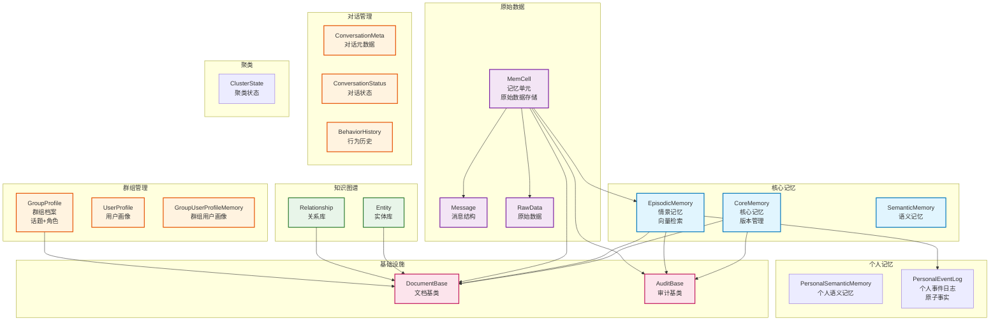

# infra_layer.adapters.out.persistence.document.memory

MongoDB 记忆文档模型集合，包含15个文档模型，覆盖核心记忆、情景记忆、知识图谱、群组管理等。

## 模块位置

**源码路径**: `src/infra_layer/adapters/out/persistence/document/memory/`
**文档路径**: `specs/ac_mod/infra_layer.adapters.out.persistence.document.memory.ac.mod.md`
**模块类型**: 包模块

## 目录结构

```
src/infra_layer/adapters/out/persistence/document/memory/
├── __init__.py                          # 空包初始化
├── core_memory.py                       # 核心记忆（BaseMemory + Profile + Preference）
├── episodic_memory.py                   # 情景记忆（从 MemCell 转存）
├── semantic_memory.py                   # 语义记忆（用户对主题的理解）
├── personal_semantic_memory.py          # 个人语义记忆
├── personal_event_log.py                # 个人事件日志（原子事实）
├── memcell.py                           # 记忆单元（情景切分结果，1527行）
├── entity.py                            # 实体库（人物、项目、组织）
├── relationship.py                      # 关系库（实体间关系）
├── user_profile.py                      # 用户画像（从聚类提取）
├── group_profile.py                     # 群组档案（话题、角色）
├── group_user_profile_memory.py         # 群组用户画像记忆
├── conversation_meta.py                 # 对话元数据（场景、参与者）
├── conversation_status.py               # 对话状态
├── behavior_history.py                  # 行为历史
└── cluster_state.py                     # 聚类状态
```

**代码量**: 15个文件，共 1527+ 行

## 快速开始

### 基本使用方式

```python
from datetime import datetime
from infra_layer.adapters.out.persistence.document.memory.core_memory import CoreMemory
from infra_layer.adapters.out.persistence.document.memory.episodic_memory import EpisodicMemory
from infra_layer.adapters.out.persistence.document.memory.memcell import MemCell

# 1. 创建核心记忆（支持版本管理）
core = CoreMemory(
    user_id="user_123",
    version="v1.0",
    is_latest=True,
    user_name="张三",
    position="高级工程师",
    hard_skills=[{
        "value": "Python",
        "level": "高级",
        "evidences": ["2024-01-01|conv_001"]
    }]
)
await core.create()

# 2. 创建情景记忆
episode = EpisodicMemory(
    user_id="user_123",
    timestamp=datetime.now(),
    summary="讨论项目进度",
    episode="团队会议中讨论了本周开发任务分配"
)
await episode.insert()

# 3. 创建记忆单元（原始数据）
memcell = MemCell(
    user_id="user_123",
    timestamp=datetime.now(),
    summary="会议记录",
    original_data=[{
        "data_type": "Conversation",
        "messages": [{"content": "今天讨论新功能"}]
    }]
)
await memcell.create()
```

### 15个文档模型分类

**核心记忆类**（3个）：
- `CoreMemory`: 核心记忆，统一存储 BaseMemory（基础信息）+ Profile（个人档案）+ Preference（偏好设置）
- `EpisodicMemory`: 情景记忆，从 MemCell 摘要转存
- `SemanticMemory`: 语义记忆，用户对特定主题的理解

**个人记忆类**（2个）：
- `PersonalSemanticMemory`: 个人语义记忆
- `PersonalEventLog`: 个人事件日志，存储原子事实

**原始数据类**（1个）：
- `MemCell`: 记忆单元，情景切分后的结果，包含原始数据

**知识图谱类**（2个）：
- `Entity`: 实体库（人物、项目、组织等）
- `Relationship`: 关系库（实体间关系）

**群组相关类**（3个）：
- `UserProfile`: 用户画像（从聚类对话提取）
- `GroupProfile`: 群组档案（话题、角色定义）
- `GroupUserProfileMemory`: 群组用户画像记忆

**对话管理类**（3个）：
- `ConversationMeta`: 对话元数据（场景、参与者、标签）
- `ConversationStatus`: 对话状态
- `BehaviorHistory`: 行为历史

**聚类管理类**（1个）：
- `ClusterState`: 聚类状态

## 核心组件详解

### 1. CoreMemory - 核心记忆

**功能**: 统一存储用户基础信息、个人档案和偏好设置

**主要字段**：
- `user_id`: 用户ID（索引）
- `version`: 版本号（支持版本管理）
- `is_latest`: 是否最新版本
- **BaseMemory 字段**: user_name, gender, position, department, age 等
- **Profile 字段**: hard_skills, soft_skills, personality, user_goal 等
- **Preference 字段**: 已合并到 Profile 中

**索引**：
- `idx_user_id_version_unique`: (user_id, version) 联合唯一索引
- `idx_user_id_is_latest`: (user_id, is_latest) 查询最新版本

**特性**：
- 证据格式：`[{"value": "Python", "level": "高级", "evidences": ["2024-01-01|conv_123"]}]`
- 版本管理：支持多版本存储，通过 is_latest 标记最新版本

### 2. EpisodicMemory - 情景记忆

**功能**: 存储从 MemCell 摘要转存的情景记忆

**主要字段**：
- `user_id`, `group_id`: 用户和群组标识
- `timestamp`: 发生时间（索引）
- `summary`: 记忆单元摘要
- `episode`: 情景记忆详细内容
- `participants`: 参与者列表
- `keywords`: 关键词
- `linked_entities`: 关联实体ID
- `vector`: 向量化表示（用于语义检索）

**索引**：
- `idx_user_timestamp`: (user_id, timestamp DESC)
- `idx_group_timestamp`: (group_id, timestamp DESC)
- `idx_keywords`: keywords 数组索引

### 3. MemCell - 记忆单元

**功能**: 情景切分后的记忆单元，包含原始数据

**主要字段**：
- `user_id`: 用户ID（群组记忆时为 None）
- `timestamp`: 发生时间（分片键）
- `summary`: 记忆摘要
- `original_data`: 原始信息（RawData 列表）
- `episode`: 情景记忆
- `semantic_memories`: 语义记忆列表
- `event_log`: Event Log 原子事实

**嵌套模型**：
- `DataTypeEnum`: 数据类型枚举（Conversation）
- `Message`: 消息结构（content, files, extend）
- `RawData`: 原始数据（data_type, messages, meta）

**索引**：
- `idx_user_timestamp`: (user_id, timestamp DESC)
- `idx_group_timestamp`: (group_id, timestamp DESC)
- `idx_user_type_timestamp`: (user_id, type, timestamp DESC)

### 4. Entity & Relationship - 知识图谱

**Entity 实体库**：
- `name`: 实体名称
- `type`: 实体类型（Person, Project, 组织等）
- `aliases`: 别名列表
- 索引：`idx_aliases` 支持别名查询

**Relationship 关系库**：
- `source_entity_id`, `target_entity_id`: 联合主键
- `relationship`: 关系列表（type, content, detail）
- 索引：双向唯一索引（source-target 和 target-source）

### 5. GroupProfile - 群组档案

**功能**: 存储群组的话题、角色定义等信息

**主要字段**：
- `group_id`: 群组ID（索引）
- `version`, `is_latest`: 版本管理
- `topics`: 话题列表（TopicInfo）
  - name, summary, status, last_active_at, evidences, confidence
- `roles`: 角色定义（Dict[str, List[RoleAssignment]]）
  - user_id, user_name, confidence, evidences
- `subject`: 群组长期主题
- `summary`: 群组话题总结

**嵌套模型**：
- `TopicInfo`: 话题信息
- `RoleAssignment`: 角色分配（包含证据和置信度）

### 6. ConversationMeta - 对话元数据

**功能**: 存储对话的完整元信息

**主要字段**：
- `version`: 数据版本号
- `scene`, `scene_desc`: 场景标识和描述
- `group_id`: 群组ID（索引）
- `user_details`: 参与者详情（Dict[str, UserDetailModel]）
- `tags`: 标签列表

**嵌套模型**：
- `UserDetailModel`: 用户详情（full_name, role, extra）

### 7. PersonalEventLog - 个人事件日志

**功能**: 存储从情景记忆中提取的原子事实

**主要字段**：
- `user_id`: 用户ID
- `atomic_fact`: 原子事实内容
- `parent_episode_id`: 父情景记忆的 event_id
- `timestamp`: 事件发生时间
- `vector`: 原子事实的向量化表示

**索引**：
- `idx_user_parent`: (user_id, parent_episode_id)
- `idx_user_timestamp`: (user_id, timestamp DESC)

## Mermaid 依赖图



## 依赖关系说明

### 对其他模块的依赖

- `specs/ac_mod/core.oxm.mongo.ac.mod.md` - DocumentBase、AuditBase、BaseRepository
- `beanie` - MongoDB ODM 框架，PydanticObjectId
- `pydantic` - 数据验证（Field, ConfigDict, BaseModel）
- `pymongo` - 索引定义（IndexModel, ASCENDING, DESCENDING, TEXT）
- `common_utils.datetime_utils` - 时间格式化工具

### 被依赖关系

- `specs/ac_mod/infra_layer.adapters.out.persistence.repository.ac.mod.md` - 仓储层使用这些文档模型
- `specs/ac_mod/agentic_layer.memory_manager.ac.mod.md` - 记忆管理器
- `specs/ac_mod/agentic_layer.fetch_mem_service.ac.mod.md` - 记忆获取服务
- `specs/ac_mod/biz_layer.mem_db_operations.ac.mod.md` - 业务层内存数据库操作

## 可以验证模块可运行的测试命令

```bash
# 验证所有文档模型导入
python -c "
from infra_layer.adapters.out.persistence.document.memory.core_memory import CoreMemory
from infra_layer.adapters.out.persistence.document.memory.episodic_memory import EpisodicMemory
from infra_layer.adapters.out.persistence.document.memory.memcell import MemCell
from infra_layer.adapters.out.persistence.document.memory.entity import Entity
from infra_layer.adapters.out.persistence.document.memory.relationship import Relationship
print('✅ 核心模型导入成功')
"

# Grep 验证：检查所有文档模型定义
cd /home/user/EverMemOS && grep -n "^class.*DocumentBase" src/infra_layer/adapters/out/persistence/document/memory/*.py

# Grep 验证：检查索引定义
cd /home/user/EverMemOS && grep -n "IndexModel" src/infra_layer/adapters/out/persistence/document/memory/*.py | head -20

# Grep 验证：检查版本管理字段
cd /home/user/EverMemOS && grep -n "is_latest.*Field" src/infra_layer/adapters/out/persistence/document/memory/*.py

# Grep 验证：检查文档模型被使用情况
cd /home/user/EverMemOS && grep -r "from infra_layer.adapters.out.persistence.document.memory" src/agentic_layer/ src/biz_layer/ demo/

# 统计文档模型数量
ls -1 /home/user/EverMemOS/src/infra_layer/adapters/out/persistence/document/memory/*.py | grep -v __init__ | wc -l
# 预期输出：15
```
