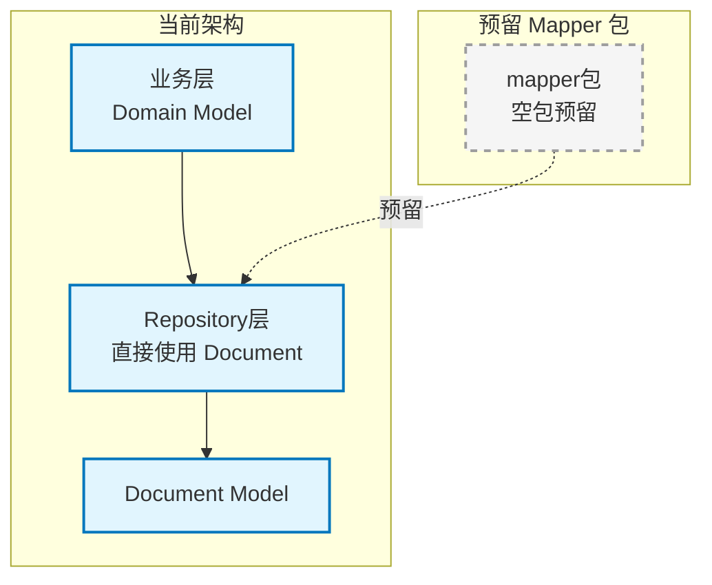

# infra_layer.adapters.out.persistence.mapper

持久化数据映射器包（预留），用于领域模型与文档模型之间的转换。

## 模块位置

**源码路径**: `src/infra_layer/adapters/out/persistence/mapper/`
**文档路径**: `specs/ac_mod/infra_layer.adapters.out.persistence.mapper.ac.mod.md`
**模块类型**: 包模块（空包）

## 目录结构

```
src/infra_layer/adapters/out/persistence/mapper/
└── __init__.py                 # 空包初始化
```

**注意**: 本包当前为空包，预留用于未来的数据映射功能。实际的映射逻辑目前分散在各 Repository 中实现。

## 快速开始

### 当前状态

本包目前为空包，无实际代码。数据映射功能当前的实现方式：

1. **Repository 层直接映射**: 各 Repository 直接使用文档模型进行 CRUD 操作
2. **业务层转换**: 在 `biz_layer` 中进行领域对象与文档模型的转换
3. **其他 Mapper**: 项目中存在其他 Mapper（如 `src/infra_layer/adapters/input/api/mapper/group_chat_converter.py`），用于 API 数据转换

### 预期用途

本包预留用于实现以下功能：

```python
# 未来可能的 Mapper 实现示例
class CoreMemoryMapper:
    """核心记忆映射器（预期）"""

    @staticmethod
    def to_document(domain_model: CoreMemoryDomain) -> CoreMemory:
        """领域模型 -> 文档模型"""
        pass

    @staticmethod
    def to_domain(document: CoreMemory) -> CoreMemoryDomain:
        """文档模型 -> 领域模型"""
        pass
```

## 核心组件详解

### 当前架构说明

**数据流向**：
```
业务层 Domain Model
    ↓↑
Repository 层（直接使用 Document Model）
    ↓↑
MongoDB Document Model
```

**未来架构**（引入 Mapper 后）：
```
业务层 Domain Model
    ↓↑
Mapper 层（Domain ↔ Document 转换）
    ↓↑
Repository 层
    ↓↑
MongoDB Document Model
```

## Mermaid 依赖图



## 依赖关系说明

### 对其他模块的依赖

当前无依赖（空包）

### 被依赖关系

当前无被依赖（空包）

## 可以验证模块可运行的测试命令

```bash
# 验证 mapper 包存在
python -c "import infra_layer.adapters.out.persistence.mapper; print('✅ mapper 包导入成功（空包）')"

# 检查 mapper 包内容
ls -la /home/user/EverMemOS/src/infra_layer/adapters/out/persistence/mapper/

# Grep 验证：查找项目中其他 mapper 实现
cd /home/user/EverMemOS && find src -name "*mapper*" -type f

# Grep 验证：检查是否有导入 mapper 包的代码
cd /home/user/EverMemOS && grep -r "from infra_layer.adapters.out.persistence.mapper" src/ demo/ || echo "✅ 确认无导入（空包）"
```

## 设计说明

**为什么是空包**：
1. **直接映射模式**: 当前项目使用 Beanie ODM，文档模型直接作为领域模型使用
2. **简化架构**: 避免过度设计，减少不必要的转换层
3. **性能考虑**: 直接使用文档模型可以减少对象转换开销

**何时需要 Mapper**：
1. 领域模型与持久化模型存在显著差异时
2. 需要支持多种持久化方式（MongoDB + 其他数据库）
3. 复杂的数据转换逻辑需要集中管理时
