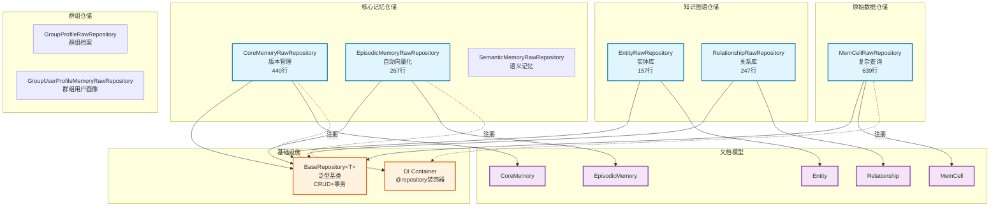

# infra_layer.adapters.out.persistence.repository

MongoDB 仓储实现集合，包含13个 RawRepository，提供记忆系统的完整数据访问层。

## 模块位置

**源码路径**: `src/infra_layer/adapters/out/persistence/repository/`
**文档路径**: `specs/ac_mod/infra_layer.adapters.out.persistence.repository.ac.mod.md`
**模块类型**: 包模块

## 目录结构

```
src/infra_layer/adapters/out/persistence/repository/
├── __init__.py                                     # 空包初始化
├── core_memory_raw_repository.py                   # 核心记忆仓储（440行，版本管理）
├── episodic_memory_raw_repository.py               # 情景记忆仓储（267行，向量化）
├── semantic_memory_raw_repository.py               # 语义记忆仓储
├── personal_semantic_memory_raw_repository.py      # 个人语义记忆仓储
├── personal_event_log_raw_repository.py            # 个人事件日志仓储
├── memcell_raw_repository.py                       # 记忆单元仓储（639行，复杂查询）
├── entity_raw_repository.py                        # 实体库仓储（157行）
├── relationship_raw_repository.py                  # 关系库仓储（247行）
├── group_profile_raw_repository.py                 # 群组档案仓储
├── group_user_profile_memory_raw_repository.py     # 群组用户画像仓储
├── conversation_meta_raw_repository.py             # 对话元数据仓储
├── conversation_status_raw_repository.py           # 对话状态仓储
└── behavior_history_raw_repository.py              # 行为历史仓储
```

**特点**: 13个仓储，所有继承自 `BaseRepository[T]`，使用 `@repository` 装饰器注入 DI 容器

## 快速开始

### 基本使用方式

```python
from infra_layer.adapters.out.persistence.repository.core_memory_raw_repository import CoreMemoryRawRepository
from infra_layer.adapters.out.persistence.repository.episodic_memory_raw_repository import EpisodicMemoryRawRepository
from infra_layer.adapters.out.persistence.repository.memcell_raw_repository import MemCellRawRepository
from infra_layer.adapters.out.persistence.document.memory.core_memory import CoreMemory
from core.di.di_container import get_service

# 1. 通过 DI 容器获取仓储实例
core_repo = get_service(CoreMemoryRawRepository)
episode_repo = get_service(EpisodicMemoryRawRepository)
memcell_repo = get_service(MemCellRawRepository)

# 2. 核心记忆操作（支持版本管理）
# 创建新版本
core = CoreMemory(user_id="user_123", version="v1.0", user_name="张三")
await core_repo.create(core)

# 获取最新版本
latest = await core_repo.get_by_user_id("user_123")

# 获取版本范围
versions = await core_repo.get_by_user_id("user_123", version_range=("v1.0", "v2.0"))

# 3. 情景记忆操作（自动向量化）
from datetime import datetime
episode = EpisodicMemory(
    user_id="user_123",
    timestamp=datetime.now(),
    summary="会议摘要",
    episode="详细的会议内容"
)
# append 时自动生成向量
await episode_repo.append_episodic_memory(episode)

# 4. 记忆单元复杂查询
# 按用户和时间范围查询
memcells = await memcell_repo.find_by_user_and_time_range(
    user_id="user_123",
    start_time=start,
    end_time=end,
    limit=10
)

# 按关键词查询
results = await memcell_repo.search_by_keywords(["Python", "开发"], match_all=False)

# 获取用户活动摘要
summary = await memcell_repo.get_user_activity_summary(
    user_id="user_123",
    start_time=start,
    end_time=end
)
```

### 13个仓储分类

**核心记忆类**（3个）：
- `CoreMemoryRawRepository`: 核心记忆，版本管理（ensure_latest, get_by_user_id, upsert_by_user_id）
- `EpisodicMemoryRawRepository`: 情景记忆，自动向量化（append_episodic_memory）
- `SemanticMemoryRawRepository`: 语义记忆

**个人记忆类**（2个）：
- `PersonalSemanticMemoryRawRepository`: 个人语义记忆
- `PersonalEventLogRawRepository`: 个人事件日志

**原始数据类**（1个）：
- `MemCellRawRepository`: 记忆单元，复杂查询（find_by_user_and_time_range, search_by_keywords, get_user_activity_summary）

**知识图谱类**（2个）：
- `EntityRawRepository`: 实体库（get_by_alias, count_by_type）
- `RelationshipRawRepository`: 关系库（get_by_entity_ids, get_relationships_by_entity）

**群组相关类**（2个）：
- `GroupProfileRawRepository`: 群组档案
- `GroupUserProfileMemoryRawRepository`: 群组用户画像

**对话管理类**（3个）：
- `ConversationMetaRawRepository`: 对话元数据
- `ConversationStatusRawRepository`: 对话状态
- `BehaviorHistoryRawRepository`: 行为历史

## 核心组件详解

### 1. CoreMemoryRawRepository - 核心记忆仓储

**功能**: 核心记忆的版本管理和 CRUD 操作

**主要方法**：
- `ensure_latest(user_id)`: 确保最新版本标记正确（幂等操作）
- `get_by_user_id(user_id, version_range=None)`: 获取单个最新版本或版本范围
- `update_by_user_id(user_id, update_data, version=None)`: 更新核心记忆
- `delete_by_user_id(user_id, version=None)`: 删除核心记忆
- `upsert_by_user_id(user_id, update_data)`: 更新或插入（创建时必须提供 version）
- `get_base(memory)`: 获取基础信息字典
- `get_profile(memory)`: 获取个人档案字典
- `find_by_user_ids(user_ids, only_latest=True)`: 批量获取

**版本管理逻辑**：
```python
# 创建新版本
await repo.upsert_by_user_id("user_123", {"version": "v2.0", "user_name": "新名字"})

# 自动标记最新版本
await repo.ensure_latest("user_123")

# 获取最新版本（按 version 倒序）
latest = await repo.get_by_user_id("user_123")

# 批量查询使用 is_latest 字段
results = await repo.find_by_user_ids(["user_123", "user_456"], only_latest=True)
```

### 2. EpisodicMemoryRawRepository - 情景记忆仓储

**功能**: 情景记忆的 CRUD 和自动向量化

**主要方法**：
- `get_by_event_id(event_id, user_id)`: 根据事件ID获取
- `get_by_user_id(user_id, limit, skip, sort_desc)`: 根据用户ID获取列表
- `append_episodic_memory(episodic_memory)`: 追加（自动向量化）
- `delete_by_event_id(event_id, user_id)`: 删除单条
- `delete_by_user_id(user_id)`: 删除用户所有记忆
- `find_by_time_range(start_time, end_time, limit, skip)`: 时间范围查询

**自动向量化**：
```python
# append 时自动调用 vectorize_service.get_embedding()
episode = EpisodicMemory(user_id="user_123", episode="会议内容", ...)
await repo.append_episodic_memory(episode)
# episode.vector 和 episode.vector_model 自动填充
```

### 3. MemCellRawRepository - 记忆单元仓储

**功能**: 记忆单元的复杂查询和批量操作

**主要方法**：
- `get_by_event_id(event_id)`: 根据事件ID获取
- `append_memcell(memcell)`: 追加记忆单元
- `find_by_user_id(user_id, limit, skip, sort_desc)`: 根据用户ID查询
- `find_by_user_and_time_range(user_id, start_time, end_time)`: 用户+时间范围（检查 user_id 字段和 participants 数组）
- `find_by_group_id(group_id)`: 根据群组ID查询
- `find_by_time_range(start_time, end_time)`: 时间范围查询
- `find_by_participants(participants, match_all=False)`: 参与者查询
- `search_by_keywords(keywords, match_all=False)`: 关键词查询
- `delete_by_user_id(user_id)`: 删除用户所有记忆
- `delete_by_time_range(start_time, end_time, user_id=None)`: 删除时间范围内记忆
- `count_by_user_id(user_id)`: 统计数量
- `count_by_time_range(start_time, end_time, user_id=None)`: 统计时间范围内数量
- `get_latest_by_user(user_id, limit=10)`: 获取最新记录
- `get_user_activity_summary(user_id, start_time, end_time)`: 获取活动摘要

**复杂查询示例**：
```python
# OR 查询：user_id 匹配或在 participants 中
results = await repo.find_by_user_and_time_range(
    user_id="user_123",
    start_time=start,
    end_time=end
)
# 使用 Beanie 操作符：And(Or(Eq(user_id), Eq(participants)), GTE(timestamp), LT(timestamp))

# 关键词匹配任一
results = await repo.search_by_keywords(["Python", "开发"], match_all=False)

# 活动摘要
summary = await repo.get_user_activity_summary("user_123", start, end)
# 返回: {total_count, type_distribution, latest_activity, earliest_activity}
```

### 4. EntityRawRepository & RelationshipRawRepository - 知识图谱仓储

**EntityRawRepository**：
- `get_by_entity_id(entity_id)`: 根据实体ID获取
- `get_by_alias(alias)`: 根据别名获取（支持模糊匹配）
- `get_entities_by_ids(entity_ids)`: 批量获取
- `count_by_type(entity_type)`: 统计指定类型数量

**RelationshipRawRepository**：
- `get_by_entity_ids(source_entity_id, target_entity_id)`: 获取关系
- `get_by_source_entity(source_entity_id)`: 获取源实体所有关系
- `get_by_target_entity(target_entity_id)`: 获取目标实体所有关系
- `get_relationships_by_entity(entity_id)`: 获取实体所有关系（作为源或目标）
- `count_by_entity(entity_id)`: 统计实体关系数量

**知识图谱查询示例**：
```python
# 查找实体
entity = await entity_repo.get_by_entity_id("entity_001")

# 查找所有关系
relationships = await rel_repo.get_relationships_by_entity("entity_001")
# 使用 $or: [{"source_entity_id": id}, {"target_entity_id": id}]
```

### 5. 基础架构

**BaseRepository[T]**：
- 泛型基类，提供基础 CRUD 方法
- `create(document, session)`: 创建文档
- `update(id, update_data, session)`: 更新文档
- `delete(id, session)`: 删除文档
- `find_one(filter, session)`: 查找单个
- `find(filter, session)`: 查找多个
- 事务支持（通过 session 参数）

**@repository 装饰器**：
- 注册到 DI 容器
- 支持 primary=True 标记主要实现
- 自动管理依赖注入

## Mermaid 依赖图



## 依赖关系说明

### 对其他模块的依赖

- `specs/ac_mod/infra_layer.adapters.out.persistence.document.memory.ac.mod.md` - 所有文档模型
- `specs/ac_mod/core.oxm.mongo.ac.mod.md` - BaseRepository 基类
- `specs/ac_mod/core.di.ac.mod.md` - @repository 装饰器，DI 容器
- `specs/ac_mod/agentic_layer.vectorize_service.ac.mod.md` - 向量化服务（EpisodicMemoryRawRepository）
- `beanie` - MongoDB ODM 框架，操作符（And, Or, Eq, GTE, LT, RegEx）
- `motor` - 异步 MongoDB 驱动（AsyncIOMotorClientSession）
- `bson` - ObjectId

### 被依赖关系

- `specs/ac_mod/agentic_layer.memory_manager.ac.mod.md` - 记忆管理器使用仓储
- `specs/ac_mod/agentic_layer.fetch_mem_service.ac.mod.md` - 记忆获取服务
- `specs/ac_mod/biz_layer.mem_db_operations.ac.mod.md` - 业务层内存数据库操作

## 可以验证模块可运行的测试命令

```bash
# 验证所有仓储导入
python -c "
from infra_layer.adapters.out.persistence.repository.core_memory_raw_repository import CoreMemoryRawRepository
from infra_layer.adapters.out.persistence.repository.episodic_memory_raw_repository import EpisodicMemoryRawRepository
from infra_layer.adapters.out.persistence.repository.memcell_raw_repository import MemCellRawRepository
from infra_layer.adapters.out.persistence.repository.entity_raw_repository import EntityRawRepository
from infra_layer.adapters.out.persistence.repository.relationship_raw_repository import RelationshipRawRepository
print('✅ 所有仓储导入成功')
"

# Grep 验证：检查所有仓储定义
cd /home/user/EverMemOS && grep -n "^class.*RawRepository.*BaseRepository" src/infra_layer/adapters/out/persistence/repository/*.py

# Grep 验证：检查 @repository 装饰器
cd /home/user/EverMemOS && grep -n "@repository" src/infra_layer/adapters/out/persistence/repository/*.py

# Grep 验证：检查版本管理方法
cd /home/user/EverMemOS && grep -n "ensure_latest\|is_latest" src/infra_layer/adapters/out/persistence/repository/core_memory_raw_repository.py

# Grep 验证：检查向量化
cd /home/user/EverMemOS && grep -n "vectorize_service\|get_embedding" src/infra_layer/adapters/out/persistence/repository/episodic_memory_raw_repository.py

# Grep 验证：检查仓储被使用情况
cd /home/user/EverMemOS && grep -r "from infra_layer.adapters.out.persistence.repository" src/agentic_layer/ src/biz_layer/ | head -20

# 统计仓储数量
ls -1 /home/user/EverMemOS/src/infra_layer/adapters/out/persistence/repository/*.py | grep -v __init__ | wc -l
# 预期输出：13

# 验证 DI 注入
python -c "
from core.di.di_container import get_service
from infra_layer.adapters.out.persistence.repository.core_memory_raw_repository import CoreMemoryRawRepository
# 需要先初始化应用
# repo = get_service(CoreMemoryRawRepository)
# print(f'✅ DI 注入成功: {type(repo).__name__}')
print('✅ 仓储类定义正确')
"
```
