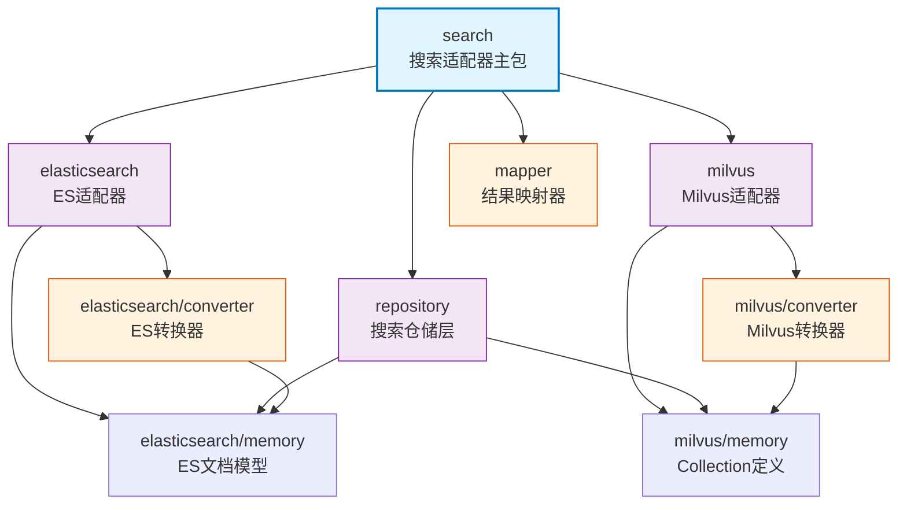

# infra_layer.adapters.out.search

EverMemOS 搜索适配器层，提供 Elasticsearch（BM25文本检索）和 Milvus（向量检索）双引擎搜索支持，实现记忆数据的多模态检索。

## 模块位置

**源码路径**: `src/infra_layer/adapters/out/search/`
**文档路径**: `specs/ac_mod/infra_layer.adapters.out.search.ac.mod.md`
**模块类型**: 包模块

## 目录结构

```
src/infra_layer/adapters/out/search/
├── __init__.py                    # 包初始化
├── elasticsearch/                 # Elasticsearch 适配器
│   ├── __init__.py
│   ├── converter/                 # MongoDB → ES 转换器
│   │   ├── __init__.py
│   │   ├── episodic_memory_converter.py      # 情景记忆转换器
│   │   ├── semantic_memory_converter.py      # 语义记忆转换器
│   │   └── event_log_converter.py            # 事件日志转换器
│   └── memory/                    # ES 文档模型定义
│       ├── __init__.py
│       └── episodic_memory.py                # EpisodicMemoryDoc（通用文档）
├── milvus/                        # Milvus 适配器
│   ├── __init__.py
│   ├── converter/                 # MongoDB → Milvus 转换器
│   │   ├── __init__.py
│   │   ├── episodic_memory_milvus_converter.py   # 情景记忆转换器
│   │   ├── semantic_memory_milvus_converter.py   # 语义记忆转换器
│   │   └── event_log_milvus_converter.py         # 事件日志转换器
│   └── memory/                    # Milvus Collection 定义
│       ├── __init__.py
│       ├── episodic_memory_collection.py         # 情景记忆 Collection
│       ├── semantic_memory_collection.py         # 语义记忆 Collection
│       └── event_log_collection.py               # 事件日志 Collection
├── mapper/                        # 搜索结果映射器
│   └── __init__.py
└── repository/                    # 搜索仓储实现
    ├── __init__.py
    ├── episodic_memory_es_repository.py         # 情景记忆 ES 仓储
    ├── episodic_memory_milvus_repository.py     # 情景记忆 Milvus 仓储
    ├── semantic_memory_es_repository.py         # 语义记忆 ES 仓储
    ├── semantic_memory_milvus_repository.py     # 语义记忆 Milvus 仓储
    ├── event_log_es_repository.py               # 事件日志 ES 仓储
    └── event_log_milvus_repository.py           # 事件日志 Milvus 仓储
```

## 快速开始

### ES 文本检索

```python
from infra_layer.adapters.out.search.repository import EpisodicMemoryEsRepository

# 初始化仓储
repo = EpisodicMemoryEsRepository()

# BM25 多词搜索
results = await repo.multi_search(
    query=["北京", "科技公司", "会议"],
    user_id="user123",
    size=10
)
```

### Milvus 向量检索

```python
from infra_layer.adapters.out.search.repository import EpisodicMemoryMilvusRepository

# 初始化仓储
repo = EpisodicMemoryMilvusRepository()

# 向量相似度搜索
results = await repo.vector_search(
    vector=[0.1, 0.2, ...],  # 1024维向量
    user_id="user123",
    top_k=10
)
```

### 转换器使用

```python
from infra_layer.adapters.out.search.elasticsearch.converter import EpisodicMemoryConverter
from infra_layer.adapters.out.persistence.document.memory.episodic_memory import EpisodicMemory

# MongoDB → ES
mongo_doc = EpisodicMemory.objects.get(id="xxx")
es_doc = EpisodicMemoryConverter.from_mongo(mongo_doc)
await es_doc.save()
```

## 核心组件详解

### 1. 双引擎架构

**Elasticsearch（BM25文本检索）**
- **用途**: 关键词搜索、多词匹配、过滤查询
- **优势**: 精确文本匹配、支持复杂过滤条件、智能分词
- **适用场景**: 用户输入关键词搜索历史对话、按时间/类型过滤记忆

**Milvus（向量相似度检索）**
- **用途**: 语义相似度搜索、embedding检索
- **优势**: 支持高维向量、HNSW快速检索、语义理解
- **适用场景**: "找相似的对话"、智能推荐、语义关联

### 2. 三类记忆类型

| 类型 | ES文档 | Milvus Collection | 用途 |
|------|--------|-------------------|------|
| **Episodic** | EpisodicMemoryDoc | EpisodicMemoryCollection | 个人/群组情景记忆 |
| **Semantic** | EpisodicMemoryDoc (type=semantic_memory) | SemanticMemoryCollection | 长期知识/规律 |
| **EventLog** | EpisodicMemoryDoc (type=event_log) | EventLogCollection | 原子事实日志 |

**共享文档模型**: ES 使用单一 `EpisodicMemoryDoc`，通过 `type` 字段区分记忆类型。

### 3. 数据转换流程

```
MongoDB (SSOT)
  ↓
Converter (from_mongo)
  ↓
ES Doc / Milvus Entity
  ↓
Repository (save/search)
  ↓
Search Results
```

### 4. Repository 层（6个仓储）

**ES Repository (3个)**
- `EpisodicMemoryEsRepository`: BM25搜索 + type过滤
- `SemanticMemoryEsRepository`: type=semantic_memory 自动过滤
- `EventLogEsRepository`: type=event_log 自动过滤

**Milvus Repository (3个)**
- `EpisodicMemoryMilvusRepository`: 向量检索 + 标量过滤
- `SemanticMemoryMilvusRepository`: 语义记忆向量检索
- `EventLogMilvusRepository`: 事件日志向量检索

## Mermaid 依赖图



## 依赖关系说明

### 对其他模块的依赖
- `specs/ac_mod/core.oxm.es.ac.mod.md` - ES OXM基础（BaseRepository、AliasDoc）
- `specs/ac_mod/core.oxm.milvus.ac.mod.md` - Milvus OXM基础（MilvusCollectionWithSuffix）
- `specs/ac_mod/infra_layer.adapters.out.persistence.ac.mod.md` - MongoDB文档定义
- `specs/ac_mod/core.di.ac.mod.md` - DI装饰器（@repository）

### 被依赖关系
- `specs/ac_mod/biz_layer.ac.mod.md` - 业务层使用搜索仓储
- `specs/ac_mod/agentic_layer.ac.mod.md` - 智能层记忆管理器

## Grep 验证

```bash
# 验证 Repository 导出
grep -r "class.*Repository" src/infra_layer/adapters/out/search/repository/*.py

# 验证 Converter 导出
grep -r "class.*Converter" src/infra_layer/adapters/out/search/*/converter/*.py

# 验证 Collection 定义
grep -r "class.*Collection" src/infra_layer/adapters/out/search/milvus/memory/*.py

# 验证使用情况
grep -r "from infra_layer.adapters.out.search" src/biz_layer/*.py
```

## 可运行示例

### ES 检索测试

```python
import asyncio
from infra_layer.adapters.out.search.repository import EpisodicMemoryEsRepository

async def test_es_search():
    repo = EpisodicMemoryEsRepository()

    # 多词搜索
    results = await repo.multi_search(
        query=["Python", "async"],
        user_id="test_user",
        size=5
    )

    for hit in results:
        print(f"ID: {hit['_id']}, Score: {hit['_score']}")
        print(f"Episode: {hit['_source']['episode'][:100]}...")
        print("---")

asyncio.run(test_es_search())
```

### Milvus 向量检索测试

```python
import asyncio
from infra_layer.adapters.out.search.repository import EpisodicMemoryMilvusRepository

async def test_milvus_search():
    repo = EpisodicMemoryMilvusRepository()

    # 模拟向量（实际应从embedding模型获取）
    query_vector = [0.1] * 1024

    results = await repo.vector_search(
        vector=query_vector,
        user_id="test_user",
        top_k=5
    )

    for entity in results:
        print(f"ID: {entity['id']}, Distance: {entity['distance']}")
        print(f"Episode: {entity['episode'][:100]}...")
        print("---")

asyncio.run(test_milvus_search())
```

### 转换器测试

```python
from infra_layer.adapters.out.search.elasticsearch.converter import EpisodicMemoryConverter
from infra_layer.adapters.out.persistence.document.memory.episodic_memory import EpisodicMemory

# 假设有 MongoDB 文档
mongo_doc = EpisodicMemory(
    event_id="test123",
    user_id="user456",
    episode="这是一段测试记忆",
    timestamp=datetime.now()
)

# 转换为 ES 文档
es_doc = EpisodicMemoryConverter.from_mongo(mongo_doc)

print(f"ES Doc ID: {es_doc.event_id}")
print(f"Search Content: {es_doc.search_content}")
```

## 测试命令

```bash
# 运行搜索适配器测试
pytest src/infra_layer/adapters/out/search/ -v

# 测试 ES Repository
pytest src/infra_layer/adapters/out/search/repository/test_*_es_*.py -v

# 测试 Milvus Repository
pytest src/infra_layer/adapters/out/search/repository/test_*_milvus_*.py -v

# 测试转换器
pytest src/infra_layer/adapters/out/search/*/converter/test_*.py -v
```
